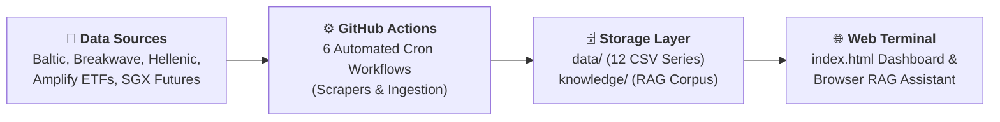
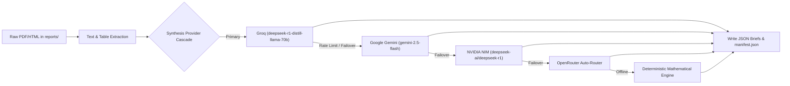
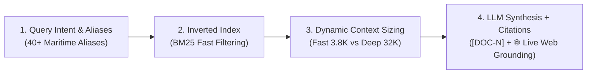

# Shipping: Zero-Infrastructure Intelligence Platform & Quantitative Terminal

[](https://yieldchaser.github.io/Shipping/)
[](file:///c:/Users/Dell/Github/Shipping/scripts)
[](file:///c:/Users/Dell/Github/Shipping/.github/workflows)
[](file:///c:/Users/Dell/Github/Shipping/knowledge)

> *"I am a Man of Fortune, and I must seek my Fortune."*  
> — **Henry Avery, 1694**

---

## 🌐 Live Web Terminal & Production Dashboard

The production analytical dashboard is served directly from this repository via GitHub Pages:  
👉 **[https://yieldchaser.github.io/Shipping/](https://yieldchaser.github.io/Shipping/)**  
*(Can also be launched locally by opening [`index.html`](file:///c:/Users/Dell/Github/Shipping/index.html) in any modern web browser).*

**No server. No build step. No database cost.** The entire platform operates as a self-sustaining quantitative shipping intelligence terminal with client-side execution, browser-native RAG AI research search, and automated multi-daily scraping pipelines.

---

## 1. System Architecture & Flow



### Supported Maritime Segments & Vessel Classes

| Segment | Vessel Class | Capacity / Spec | Key Freight Cargoes | Primary Routes / Indicators |
| :--- | :--- | :--- | :--- | :--- |
| **Dry Bulk** | **Capesize** | 180,000 DWT | Iron Ore, Coal | BCI, C5 (WAus → China), C3 (Tubarao → Qingdao) |
| **Dry Bulk** | **Panamax** | 82,000 DWT | Grain, Coal, Bauxite | BPI, P1A, P2A, P3A Atlantic/Pacific |
| **Dry Bulk** | **Supramax** | 58,000 DWT | Minor Bulks, Steel, Fertilizer | BSI, S1C, S2, S4A, S10 |
| **Dry Bulk** | **Handysize** | 38,000 DWT | Agricultural, Logs, Minor Bulks | BHSI, HS1, HS2, HS3 |
| **Crude Tankers** | **VLCC** | 270,000–300,000 DWT | Crude Oil | BDTI, TD3C (MEG → China 270kt) |
| **Crude Tankers** | **Suezmax** | 130,000–150,000 DWT | Crude Oil | BDTI, TD20 (WAF → UKC 130kt) |
| **Crude Tankers** | **Aframax** | 80,000–115,000 DWT | Crude Oil | BDTI, Regional Aframax routes |
| **Clean Tankers** | **LR2 / LR1 / MR**| 45,000–75,000 DWT | Refined Products (Naphtha, Diesel) | BCTI, TC2, TC14 |
| **Specialized** | **LNG & LPG** | 160k m³ / 84k m³ | Liquefied Gas | BLNG, BLPG Indices |
| **Container** | **Boxships** | Multi-TEU | Manufactured Goods | FBX (Freightos Baltic), NCFI (Ningbo) |
| **Freight ETFs** | **BDRY & BWET** | Freight Futures | FFA Derivatives Baskets | Solactive BDRYFF & BWETFF Indices |

---

## 2. Exhaustive Data Catalog & Time Series Inventory

This section provides a complete reference for every data file tracked within the repository. For the full tabular health inventory and update cadence schedule, see [`docs/DATASETS.md`](file:///c:/Users/Dell/Github/Shipping/docs/DATASETS.md). **External LLMs or automated parsers can use this inventory to locate datasets, verify schemas, and extend historical data.**

### 2.1 Primary Freight Spot Indices (`data/indices/`)

All files use standard CSV formatting with date headers in `DD-MM-YYYY` format.

| File Path | Target Index | Code | Start Date | Rows | Schema / Columns | Primary / Derived |
| :--- | :--- | :--- | :--- | :--- | :--- | :--- |
| [`data/indices/bdiy_historical.csv`](file:///c:/Users/Dell/Github/Shipping/data/indices/bdiy_historical.csv) | Baltic Dry Index | BDI | 04-01-1985 | ~10,492 | `Date, Index, % Change` | Primary (Validated Backfill + Scraped) |
| [`data/indices/cape_historical.csv`](file:///c:/Users/Dell/Github/Shipping/data/indices/cape_historical.csv) | Baltic Capesize Index | BCI | 06-10-2008 | ~4,312 | `Date, Index, % Change` | Primary (Scraped) |
| [`data/indices/panama_historical.csv`](file:///c:/Users/Dell/Github/Shipping/data/indices/panama_historical.csv) | Baltic Panamax Index | BPI | 06-10-2008 | ~4,312 | `Date, Index, % Change` | Primary (Scraped) |
| [`data/indices/suprama_historical.csv`](file:///c:/Users/Dell/Github/Shipping/data/indices/suprama_historical.csv) | Baltic Supramax Index | BSI | 06-10-2008 | ~4,311 | `Date, Index, % Change` | Primary (Scraped) |
| [`data/indices/handysize_historical.csv`](file:///c:/Users/Dell/Github/Shipping/data/indices/handysize_historical.csv) | Baltic Handysize Index | BHSI | 06-10-2008 | ~4,290 | `Date, Index, % Change` | Primary (Scraped) |
| [`data/indices/cleantanker_historical.csv`](file:///c:/Users/Dell/Github/Shipping/data/indices/cleantanker_historical.csv) | Baltic Clean Tanker | BCTI | 02-01-2008 | ~4,484 | `Date, Index, % Change` | Primary (Scraped) |
| [`data/indices/dirtytanker_historical.csv`](file:///c:/Users/Dell/Github/Shipping/data/indices/dirtytanker_historical.csv) | Baltic Dirty Tanker | BDTI | 05-12-2007 | ~4,499 | `Date, Index, % Change` | Primary (Scraped) |

### 2.2 Baltic Ticker API Series (`data/indices/`)

Updated via Baltic Ticker public API (`scripts/baltic_new_indices.py`) and TAC Index API.

| File Path | Index Description | Code | Start Date | Rows | Schema |
| :--- | :--- | :--- | :--- | :--- | :--- |
| `data/indices/blng_historical.csv` | Baltic LNG Freight Index | BLNG | 13-03-2026 | ~100 | `Date, Index, % Change` |
| `data/indices/blpg_historical.csv` | Baltic LPG Freight Index | BLPG | 13-03-2026 | ~100 | `Date, Index, % Change` |
| `data/indices/fbx_historical.csv` | Freightos Baltic Container Index | FBX | 13-03-2026 | ~100 | `Date, Index, % Change` |
| [`data/indices/bai_historical.csv`](file:///c:/Users/Dell/Github/Shipping/data/indices/bai_historical.csv) | Baltic Air Freight Index | BAI | 01-01-2018 | ~469 | `Date, Index, % Change` |

### 2.3 Time Charter (TC) Rates, Forward Curves & Valuations (`data/derived/`)

Calculated weekly via Fearnleys Hasura GraphQL API (`scripts/backfill_historical_data.py`), Alibra Deep Archive (2008–2026), and direct Google Sheet / OCR ingestion (`scripts/integrate_alibra_feed.py` & `scripts/process_knowledge.py`).

| File Path | Description | Start Date | Rows | Columns / Schema Overview |
| :--- | :--- | :--- | :--- | :--- |
| [`time_charter_rates.csv`](file:///c:/Users/Dell/Github/Shipping/data/derived/time_charter_rates.csv) | **Merged** Weekly TC Rates ($/day) — Fearnleys pre-2021 + Alibra Deep Archive (2008–2026) + Alibra weekly feed | 2000-01-05 | ~2,082 | `date, source` + 64 rate columns (66 cols total) spanning 4/6M, 1Y, 2Y, 3Y, 5Y across Dry Bulk (Atl/Pac), Crude, Product, and Handy Tankers. `source` = `fearnleys`, `alibra_archive`, `alibra_ocr` |
| [`tanker_forward_curves.csv`](file:///c:/Users/Dell/Github/Shipping/data/derived/tanker_forward_curves.csv) | **Tanker FFA Forward Curves** — 22-month forward term structure across 12 tanker routes | 2026-08-12 | ~22 | `snapshot_date, forward_month, contract_label, vlcc_td3c, vlcc_eco_td3c, suezmax_td20, aframax_td25, lr1_tc5, lr1_eco_tc5, mr_tc2, mr_eco_tc2, mr_tc14, mr_eco_tc14, mr_tc6, mr_triangulation` |
| [`tanker_forward_curves_history.csv`](file:///c:/Users/Dell/Github/Shipping/data/derived/tanker_forward_curves_history.csv) | **Tanker Forward History Accumulator** — persistent multi-snapshot forward curve time series | 2026-08-12 | Accumulating | `snapshot_date, forward_month, contract_label` + 12 forward TCE route columns |
| [`time_charter_rates_fearnleys.csv`](file:///c:/Users/Dell/Github/Shipping/data/derived/time_charter_rates_fearnleys.csv) | **Fearnleys-only** TC Rates — single-source reference for cross-validation | 2000-01-05 | ~1,595 | `date, capesize_1y_avg, panamax_1y_avg, supramax_1y_avg, handysize_1y_avg, vlcc_1y, suezmax_1y, aframax_1y` |
| [`intermodal_tc_rates.csv`](file:///c:/Users/Dell/Github/Shipping/data/derived/intermodal_tc_rates.csv) | **Intermodal** Weekly TC Rates ($/day) — fills MR, LR1, Handysize & 3Y period gaps | 2025-03-07 | ~43 | `date, source` + 20 rate columns (`mr_1y_tc`, `mr_3y_tc`, `lr1_1y_tc`, `lr1_3y_tc`, 3Y dry/wet period rates) |
| [`lpg_charter_rates.csv`](file:///c:/Users/Dell/Github/Shipping/data/derived/lpg_charter_rates.csv) | LPG 1Y TC Rates ($/month) from Fearnleys API | 2019-07-01 | ~359 | `date, vlgc_84k_tc, mgc_38k_tc, hdy_22k_tc` |
| [`lng_charter_rates.csv`](file:///c:/Users/Dell/Github/Shipping/data/derived/lng_charter_rates.csv) | LNG 7Y/10Y TC Rates ($/day) & Newbuilding Prices ($M) from Fearnleys API | 2017-01-05 | ~513 | `date, lngc_174k_7y_tc, lngc_174k_10y_tc, lngc_80k_nb_price, lngc_30k_nb_price, lngc_7k_nb_price` |
| [`lpg_spot_rates.csv`](file:///c:/Users/Dell/Github/Shipping/data/derived/lpg_spot_rates.csv) | LPG Spot Rates ($/day) from Fearnleys API | 2004-01-07 | ~1,152 | `date, vlgc_spot, mgc_spot` |
| [`vessel_valuations.csv`](file:///c:/Users/Dell/Github/Shipping/data/derived/vessel_valuations.csv) | S&P Secondhand 5Y/10Y Prices & Newbuilding Prices ($M) from Fearnleys | 1970-12-01 | ~20,499 | `date, category, tenor_type, vessel_class, valuation_usd_m` |
| [`scrappage_prices.csv`](file:///c:/Users/Dell/Github/Shipping/data/derived/scrappage_prices.csv) | Demolition/scrap prices by country ($/LDT) from Hellenic OCR | 2022-09-03 | ~137 | `date, dry_india, dry_bangla, dry_pak, dry_turkey, tanker_india, tanker_bangla, tanker_pak, container_india` |
| [`alibra_tce_matrix.json`](file:///c:/Users/Dell/Github/Shipping/data/derived/alibra_tce_matrix.json) | **Live Period TCE Rate Matrix** — weekly benchmark rates across Dry Bulk (Atl/Pac) and Tanker classes with WoW changes | Live | 11 Classes | `report_date, dry_bulk: [size, 6M/1Y/2Y (Atl/Pac) + WoW %], tankers: [size, 1Y/2Y/3Y/5Y + WoW %]` |
| [`fearnleys_catalog.csv`](file:///c:/Users/Dell/Github/Shipping/data/derived/fearnleys_catalog.csv) | Catalog of all route metrics, subtypes, & counts available in Fearnleys Hasura API | — | ~356 | `id, unit, rate_type, rate_subtype, route, count, min_date, max_date` |
| [`iron_ore_restocking.csv`](file:///c:/Users/Dell/Github/Shipping/data/derived/iron_ore_restocking.csv) | Iron Ore Price vs Port Stocks & Freight | 2018-07-03 | ~1,244 | `Date, iron_ore_cfr_62, qingdao_port_inventory, cape_spot_tce, ratio_score` |

> [!NOTE]
> **Dual-Source TC Rates**: The merged file contains data from two brokers with a ~8% median divergence in the overlap period. The `source` column identifies the broker. The Fearnleys-only file provides a clean single-source reference for comparison. The dashboard offers a **Merged / Fearnleys / Both** toggle to visualize the divergence.

### 2.4 Futures, Holdings & Fund Flows (`data/futures/`, `data/etf/`, `data/flows/`)

| File Path | Type | Start Date | Rows | Content Summary |
| :--- | :--- | :--- | :--- | :--- |
| [`data/futures/bdryff_history.csv`](file:///c:/Users/Dell/Github/Shipping/data/futures/bdryff_history.csv) | Futures Index | 28-02-2010 | ~4,118 | Solactive BDRY Freight Futures Index history (`Date, Close`) |
| [`data/futures/bwetff_history.csv`](file:///c:/Users/Dell/Github/Shipping/data/futures/bwetff_history.csv) | Futures Index | 22-12-2016 | ~2,419 | Solactive BWET Freight Futures Index history (`Date, Close`) |
| [`data/futures/sgx_cape_futures.csv`](file:///c:/Users/Dell/Github/Shipping/data/futures/sgx_cape_futures.csv) | Curve Data | 05-03-2026 | ~3,000 | SGX Capesize FFA forward curves & settlement history |
| [`data/futures/sgx_panamax_futures.csv`](file:///c:/Users/Dell/Github/Shipping/data/futures/sgx_panamax_futures.csv) | Curve Data | 05-03-2026 | ~3,000 | SGX Panamax FFA forward curves & settlement history |
| [`data/futures/sgx_supramax_futures.csv`](file:///c:/Users/Dell/Github/Shipping/data/futures/sgx_supramax_futures.csv) | Curve Data | 05-03-2026 | ~3,000 | SGX Supramax FFA forward curves & settlement history |
| [`data/futures/sgx_handysize_futures.csv`](file:///c:/Users/Dell/Github/Shipping/data/futures/sgx_handysize_futures.csv) | Curve Data | 05-03-2026 | ~3,000 | SGX Handysize FFA forward curves & settlement history |
| [`data/etf/bdry_holdings.csv`](file:///c:/Users/Dell/Github/Shipping/data/etf/bdry_holdings.csv) | Daily Holdings | Live | ~21 | BDRY FFA contract holdings (Capesize, Panamax, Supramax 5TC) |
| [`data/etf/bwet_holdings.csv`](file:///c:/Users/Dell/Github/Shipping/data/etf/bwet_holdings.csv) | Daily Holdings | Live | ~15 | BWET FFA contract holdings (TD3C VLCC & TD20 Suezmax) |
| [`data/etf/bdry_holdings_history.csv`](file:///c:/Users/Dell/Github/Shipping/data/etf/bdry_holdings_history.csv) | Historical Holdings | Live | ~350 | Daily historical disclosures of BDRY ETF FFA contract positions |
| [`data/etf/bwet_holdings_history.csv`](file:///c:/Users/Dell/Github/Shipping/data/etf/bwet_holdings_history.csv) | Historical Holdings | Live | ~350 | Daily historical disclosures of BWET ETF FFA contract positions |
| [`data/etf/snapshots/scenario_snapshots.js`](file:///c:/Users/Dell/Github/Shipping/data/etf/snapshots/scenario_snapshots.js) | Snapshot Bundle | Live | — | Cryptographically verified canonical scenario snapshot bundle for BDRY & BWET |
| [`data/etf/snapshots/provenance_manifest.json`](file:///c:/Users/Dell/Github/Shipping/data/etf/snapshots/provenance_manifest.json) | Audit Manifest | Live | — | Immutable SHA-256 cryptographic provenance registry and hash audit trail |
| [`data/etf/BDRY_flows.csv`](file:///c:/Users/Dell/Github/Shipping/data/etf/BDRY_flows.csv) | Fund Flows | 23-03-2018 | ~2,088 | Daily flow $, Net Shares, NAV, AUM history for BDRY ETF |
| [`data/etf/BWET_flows.csv`](file:///c:/Users/Dell/Github/Shipping/data/etf/BWET_flows.csv) | Fund Flows | 04-05-2023 | ~808 | Daily flow $, Net Shares, NAV, AUM history for BWET ETF |
| [`data/flows/all_flows_summary.json`](file:///c:/Users/Dell/Github/Shipping/data/flows/all_flows_summary.json) | JSON Summary | Live | — | Unified JSON payload containing synced ETF flow metrics |
| [`data/etf/bdry_liquidity.csv`](file:///c:/Users/Dell/Github/Shipping/data/etf/bdry_liquidity.csv) | Liquidity | 22-03-2018 | ~2,096 | Daily Close, Volume, Dollar Value Traded, Tier, Safe Liquidity $ |

### 2.5 Official ETF Documentation & Dataset Catalog (`docs/`)

| File Path | Document Type | Description |
| :--- | :--- | :--- |
| [`docs/DATASETS.md`](file:///c:/Users/Dell/Github/Shipping/docs/DATASETS.md) | Data Inventory | Master inventory and health monitoring reference for all 42 CSV/JSON datasets |
| [`docs/Amplify_BDRY_Prospectus.pdf`](file:///c:/Users/Dell/Github/Shipping/docs/Amplify_BDRY_Prospectus.pdf) | Prospectus | Official statutory prospectus for Amplify BDRY ETF detailing Solactive index rules and roll schedules |
| [`docs/Amplify_BDRY_FactSheet.pdf`](file:///c:/Users/Dell/Github/Shipping/docs/Amplify_BDRY_FactSheet.pdf) | Factsheet | Official fund factsheet detailing BDRY benchmark weightings (50% Cape / 40% Pana / 10% Supra) |
| [`docs/Amplify_BWET_Prospectus.pdf`](file:///c:/Users/Dell/Github/Shipping/docs/Amplify_BWET_Prospectus.pdf) | Prospectus | Official statutory prospectus for Amplify BWET ETF detailing Breakwave Wet Freight Futures Index rules |
| [`docs/Amplify_BWET_FactSheet.pdf`](file:///c:/Users/Dell/Github/Shipping/docs/Amplify_BWET_FactSheet.pdf) | Factsheet | Official fund factsheet detailing BWET benchmark weightings (90% TD3C VLCC / 10% TD20 Suezmax) |
| [`docs/BDRY-BWET_Form10-Q_March-31-2026.pdf`](file:///c:/Users/Dell/Github/Shipping/docs/BDRY-BWET_Form10-Q_March-31-2026.pdf) | SEC Filing | Form 10-Q Quarterly Report for Breakwave Trust filed with the SEC containing audited holdings & financial disclosures |

---

## 3. Web Dashboard Features & Tab-by-Tab Breakdown

Built using **Chart.js 4.4.0** and **PapaParse 5.4.1**. All data is fetched client-side — no backend required. The global **Index:** dropdown in the header switches the active product across all tabs instantly.

**12 products available:** BDI · Capesize · Panamax · Supramax · Handysize · Clean Tanker · Dirty Tanker · BDRY Spot Composite · BDRYFF · BWETFF · BDRY Stock Price · BWET Stock Price

---

### 📊 Dashboard Tab

Main quantitative overview for the selected index.

- **Hero KPI + Signal Badge**: Algorithmic signal based on percentile and Z-score:
  - ⛔ **SELL**: 5Y percentile > 80%
  - 💎 **GOLDEN DIP**: 5Y percentile < 20%, $Z_{252} < -0.5$, all-time percentile > 40%
  - 🔥 **CATCHING KNIFE**: 5Y percentile < 10%, $Z_{252} < -0.6$
  - ⚠️ **VALUE TRAP**: 5Y percentile < 30%, all-time percentile < 30%
  - 🔹 **ACCUMULATE**: 5Y percentile < 40%
  - ⏳ **WAIT**: All other conditions
- **Momentum Regime Classification**:
  - 🟢 **EXPANSION**: Price > $\text{MA}_{200}$, $\text{RoC}_{60} > 0$
  - 🟡 **DISTRIBUTION**: Price > $\text{MA}_{200}$, $\text{RoC}_{60} \le 0$
  - 🔵 **ACCUMULATION**: Price $\le \text{MA}_{200}$, $\text{RoC}_{60} > 0$
  - 🔴 **CONTRACTION**: Price $\le \text{MA}_{200}$, $\text{RoC}_{60} \le 0$
- **6 Stat Cards**: All-Time Pctl · 10Y Pctl · 5Y Pctl · Z-Score · 52-Week Drawdown · 20D RoC.
- **Historical Context Strip**: 5Y avg, current vs 5Y avg %, current vs 10Y avg %.
- **Current Year vs Historical Overlay Chart**: Overlays current year against prior trading years with 3Y/5Y/10Y/All presets.
- **Drawdown from 52-Week High Chart**: Last 5 years with 1Y/3Y/5Y/10Y/All toggle buttons.
- **Recent Daily Changes Table**: Last 10 sessions (day $\Delta$, day $\Delta\%$, 5D change %).
- **Yearly Performance Table** *(collapsible, sortable)*: Annual avg, YoY %, min, max, Volatility % (dispersion: $(\text{max}-\text{min})/\text{avg}$), Trough → Peak % (theoretical max gain).
- **Macro Cycle History (Multi-Year)** *(collapsible, sortable)*: Identifies historical peak and trough cycles using a 30% threshold with duration and move magnitude tooltips.
- **Index Correlation Matrix**: Pearson correlation for all shipping benchmarks, switchable across All Time / 5Y / 1Y windows.

---

### 📅 Yearly Tab

Multi-year macro cycles and decade-scale benchmark tracking.

- **Historical Price Chart**: Full history with rolling average toggle (5Y / 10Y / All-Time) and dual-handle range slider.
- **Z-Score (Rolling 252-Day)**: All 7 products, selected product highlighted with 3M/6M/1Y/2Y/3Y lookback toggles.
- **Historical Z-Score (All Time from 2008)**: Full-history structural cycle view.
- **Multi-Year Rates**: Annual averages by product across all years.
- **Current Year Monthly Bar**: MoM trend acceleration or decay color coding.
- **Rates — All Products Multi-Year Overlay**: Last 4 years by trading day with product selector dropdown.
- **Drawdown % (52-Week Rolling, Last 5 Years)**: Peak retracement depth across the last 5 years.

---

### 📊 Quarterly Tab

Seasonal quarterly regimes and path dependency.

- **Win Rate KPI Cards**: Historical probability each quarter beats the prior quarter (Q1–Q4).
- **Quarterly Spaghetti Chart**: Q1/Q2/Q3/Q4 across all years rebased to 100 at the start of Q1 to expose path dependency.
- **Quarterly Area Comparison**: Current year (solid) vs prior year (dashed) vs 5-year rolling average (shaded).
- **Quarterly Bar Chart**: Trailing 4 quarters with Quarter-over-Quarter (QoQ) direction coloring.
- **Quarterly Data Grid**: 8-year tabular record showing Open, High, Low, Close, QoQ %, and full-year % change.

---

### 🗓️ Monthly Tab

Intra-year monthly progression and momentum shifts.

- **Monthly Win Rate KPI Cards**: Historical probability of each calendar month being positive across multi-decade history.
- **Monthly Spaghetti Chart**: Index trajectory across all 12 calendar months for each historical year.
- **Monthly Area Comparison**: Current year vs prior year vs 5Y seasonal average.
- **Monthly Bar Chart**: 12-month rolling momentum summary.
- **Monthly Data Grid**: 8-year $\times$ 12-month tabular matrix with relative scaling.

---

### 🌡️ Heatmaps Tab

High-density seasonal momentum matrices.

- **Monthly Performance Heatmap**: Year $\times$ Month, absolute value or MoM % return toggle with CSV download.
- **Quarterly Heatmap**: Year $\times$ Quarter, absolute value or QoQ % return toggle with CSV download.
- **8-Year Relative Scaling**: Color scaling tailored to recent 8-year windows to ensure modern volatility extremes remain visually distinct.

---

### 📈 Indices Tab

Dedicated benchmark monitoring suite.

- All 6 base indices as individual interactive chart cards (BDI, BCI, BPI, BSI, BHSI, BDTI, BCTI).
- Current value, day change %, and status badge.
- Dual-handle date range slider (defaults to last 5 years).
- Stats strip: 52W High—Low · 52W Position · YTD % · From Last Trough.

---

### 🏦 ETFs Tab (BDRY & BWET)

Structured in the **"Executive Intelligence First"** workflow:

1. **Live Price & Overview Cards**:
   - 5-minute dynamic auto-refresh engine powered by Yahoo Finance v8 API via a 4-stage CORS proxy failover cascade. Updates price cards, day change %, 52W metrics, and ETF Deconstruction Engine live (`🟢 LIVE`).
   - Metrics rows: Total Futures · Collateral Cash · Futures/AUM % · NAV · Statutory Expense Ratio (1.45% OER) · Exposure Ratio · 52W High—Low · 52W Position.
   - Holdings table sorted by vessel class → expiry month (nearest prompt first) with interactive trade route maps and allocation donuts.
2. **Daily Freight & ETF Market Intelligence Brief (`#etfDailyBriefCard`)**:
   - Multi-factor quantitative confluence, desk positioning bias (Bullish / Bearish / Neutral), momentum grades, and forward curve roll dynamics synthesized server-side.
   - **Active Portfolio & Roll Mechanics Strip**: Live prompt vs next month settlement marks, roll yield badges (`⚠️ -0.52%/mo Contango Friction` or `🚀 +0.07%/mo Backwardation Carry`), and 60-day position takeaways.
   - 1-Click Action Hooks: `⚡ Apply Setup` (dials scenario sliders to match the brief) and `💬 What is a 3-Month Hold a Bet On?` (pre-populates multi-horizon prompt).
3. **Institutional ETF & Scenario Intelligence Copilot ("Ask Anything") (`#etfQaCard`)**:
   - **Multi-Horizon Bet Deconstruction Core**: Rigorously decomposes any holding thesis across **1 Month ($T_{30}$)**, **3 Months ($T_{90}$)**, **6 Months ($T_{180}$)**, **1 Year ($T_{365}$)**, or **Multi-Year Macro Cycles ($1\text{Y} \to 3\text{Y}$)** into prompt cash settlements against physical Baltic spot averages, rollover lot decay across business days 1–15, contango drag hurdle rates, and physical commodity catalysts.
   - **Per-Contract Dollar Sensitivity**: Computes line-by-line NAV impact per share for every constituent position (e.g. Capesize Aug 26 moves BDRY by exact **\$0.0705/share** per $+\$1,000/\text{day}$ change).
   - **Full Tenor Forward Curves**: Injects complete SGX settlement curves across all tenors (Prompt, $M+1, M+2, Q_1, Q_2, Q_3, Q_4, \text{Cal}+1, \text{Cal}+2$).
   - Direct client-side execution via **Groq** (`llama-3.3-70b-versatile`, `deepseek-r1-distill-llama-70b`, `openai/gpt-oss-120b`, `qwen/qwen3.6-27b`), **Google Gemini** (`gemini-2.5-flash` with Google Search Grounding), and **OpenRouter** (`openrouter/free`, `deepseek/deepseek-r1:free`, `meta-llama/llama-3.3-70b-instruct:free`).
   - 5 curated suggestion categories (30 prompts): *Contract Exposures*, *Roll Yield & Carry*, *Scenario Shocks & PnL*, *Fund Flows & AUM*, *Strategy & Holding*.
   - Interactive action execution buttons: `⚡ Apply to Scenario Simulator`, `📅 Jump Simulator to Date`, `📋 Open Institutional Decision Ticket`, `📈 Inspect Contract`.
4. **Thesis-to-ETF Scenario Translator (`#etfDeconstructCard`)**:
   - **5-Axiom Futures Allocation Engine**: Deconstructs ETF disclosures for Amplify BDRY (Dry Bulk) and Amplify BWET (Tankers) into active futures contract holdings, lot counts, and % weights for any horizon.
   - **Macro / Micro Shock Sliders**: 0%-origin baseline fills (positive shocks fill in asset colors; negative shocks in red).
   - **2D Freight Sensitivity Heatmap Matrix**: 5x5 grid evaluating 25 simultaneous freight rate shock combinations (Capesize vs Panamax / VLCC vs Suezmax) with active scenario borders.
   - **Target Price Reverse NAV Solver**: Inverts NAV formula to solve the exact uniform freight rate move % required to achieve any target share price ($).
   - **Institutional Decision Ticket Modal (`#decisionTicketModal`)**: Structured compliance decision tickets with Route P&L Attribution, Book Separation tables, and 1-click JSON/Text export.
   - **Universal Contract Settlement Inspector Modal (`#etfContractDetailModal`)**: High-DPI Chart.js modal rendering historical settlement curve trajectories, 52-week ranges, and exchange rulebook references.
5. **Day-by-Day ETF Portfolio & Price Simulator (`#etfDaySimulatorCard`)**:
   - **Point-in-Time Accounting Replay**: Replays exact historical daily holdings, MTM settlements, and cash collateral across verified SEC Form 10-Q filing snapshots ($R^2 = 0.999$).
   - **Generative Forward Projection**: Projects 30, 60, or 90-day forward horizons using Samuelson volatility damping, collateral margin hierarchies, and AP arbitrage bounds.
   - **Cinematic 4-Panel Grid**: Panel A (Dynamic Holdings with decaying lot progress bars), Panel B (Dual-Pane Price & Tracking Basis bps), Panel C (3-Way Daily Attribution Waterfall: Freight + Roll Yield + Cash Yield/Fee Drag), Panel D (Risk HUD: Real-time PnL, Sharpe Ratio, Carry Yield, MDD, Realized Volatility).
   - **Playback Controls & Hotkeys**: Spacebar (`Play/Pause`), `→` (`Step Next`), `←` (`Step Prev`), `R` (`Reset`), Speed toggles (`0.5x` to `⚡ Max`), and 1-click macro stress presets.
6. **Premium / Discount History (`#pdHistChart`)**:
   - Secondary Market Close vs NAV spread oscillator with 1M/3M/6M/1Y/3Y/All windows and dual-range slider.
7. **Fund Flow History & Institutional Accumulation (`#flowPriceChart`)**:
   - ETF NAV Price overlaid with Daily Net Flow (Creations/Redemptions in USD) and Cumulative Net Flow ($).
8. **Execution Liquidity & Safe Capacity Tracker (`#liqTrackerSection`)**:
   - Position-sizing model assessing rolling volume against safe liquidity thresholds (2.0% to 6.5% tier limits) to determine maximum safe single-session trade size without market impact.
9. **Historical Volatility & Regimes (`#etfHvChart`)**:
   - Annualized 20D, 60D, and 1Y HV with Regime Detection: Blue (Low <25th), Green (Normal 25-75th), Amber (Elevated 75-90th), Red (Spike >90th).
10. **Cross-Asset Correlation Matrix (`#etfCorrMatrix`)**:
    - Multi-timeframe Pearson correlation matrix comparing ETF prices against BDI, BCI, BPI, BSI, BHSI, BDTI, and BCTI.

---

### 🎯 Signals Tab

Comprehensive analytical suite arranged into **3 thematic quantitative sections**:

#### Section 1: Derivatives & Technicals
- **A. Forward Curves & Derivatives Basis**:
  - **SGX FFA Forward Curve**: Singapore Exchange settlements across live contract months for Capesize, Panamax, Supramax, and Handysize with vs 1W/2W/1M/3M historical comparisons and contract drilldown inspector.
  - **FFA Term Structure (BDRY & BWET Curve Shape)**: Multi-contract prompt vs deferred slope analysis.
  - **Futures vs Spot Premium (Basis)**: Front-month FFA vs combined spot basket tracking (Contango vs Backwardation).
  - **Cape / Panamax Spread Ratio**: BCI / BPI ratio (Iron Ore vs Bulk Grain proxy) with rolling percentiles.
- **B. Momentum & Volatility Regimes**:
  - **Bollinger Bands (20D, 2σ)**: Price envelope with bandwidth squeeze indicators.
  - **Historical Volatility**: Annualized volatility with all-time regime percentiles.
  - **Rate-of-Change (ROC) Heatmap**: 7 products $\times$ 6 timeframes (5D / 10D / 20D / 60D / 90D / 1Y).
  - **Seasonal Pattern Decomposition**: Historical average intra-year pattern $\pm 1\sigma$ band overlaid with current year.
- **C. Cross-Asset Attribution & Lead-Lag**:
  - **BDI Vessel Class Daily Contribution**: Daily point move attribution (50% Cape, 40% Pana, 10% Supra).
  - **Lead-Lag Cross-Correlation Analysis**: Cross-correlation of log returns (-30 to +30 days) identifying predictive lead times.
- **D. ETF Market Timing & Sentiment Signals**:
  - **ETF Premium/Discount Z-Score**: Standardized sentiment oscillator identifying extreme overextension ($Z > +2$) vs forced liquidation ($Z < -2$).
  - **ETF Fund Flow Signals**: 5-day rolling flow vs NAV price to detect accumulation vs distribution divergences.

#### Section 2: Physical Freight & Cargo
- **Time Charter Curve (Spot vs 1Y TC)**: Spot $/day TCE earnings vs 1-Year Time Charter rates with broker source toggle (Merged, Fearnleys, Both).
- **Tonnage Basin Arbitrage**: Atlantic vs Pacific 1Y TC rate spread per vessel class.
- **Leading Restocking Pressures**: Spot freight vs CFR 62% Iron Ore price and Qingdao Port Inventory.
- **LPG Freight & Charter Rates**: VLGC 84k, MGC 38k, Handy 22k spot + charter rates with unit toggle ($/Day TCE vs $/Month PCM).

#### Section 3: Vessel Capital Cycle
- **Vessel Valuations & Scrap Floor**: S&P secondhand prices (1970–2026) with 3 sub-modes (10Y Asset Value, Scrap Floor $/LDT, Implied Charter Yield %).
- **Shipping Market Cycle Quadrant**: 4-phase trajectory (Recovery, Boom, Over-ordering, Restructuring) based on 60D spot momentum vs Spot/TC Z-scores.

---

### 🧠 Intelligence Tab

Executive macro desk and deep research workspace.

- **Section 1: Signal & Confluence Engine (`#intelAlertGrid`)**:
  - Multi-factor quantitative scoring combining 50% fundamentals, 30% sentiment, and 20% momentum.
  - Active market alerts, conviction grades, and sector positioning biases.
- **Section 2: Daily Market Brief (`#intelBriefContent`)**:
  - Daily synthesized desk intelligence briefing with executive TL;DR, dry bulk & tanker breakdowns, and previous/next calendar date history navigation.
- **Section 3: Research Q&A Assistant**:
  - **Direct-CORS Multi-Provider Execution**: Browser-native API key storage for Groq, Google Gemini, and OpenRouter.
  - **30 Curated Institutional Research Questions**: 5 categories (Daily Briefing, Market Signals, Fleet Supply, Macro & Cargo, Trade Strategy).
  - **🌐 Google Search Grounding**: Live web queries for breaking maritime news, freight prints, and geopolitical updates.
  - **🔬 Deep Research Mode**: Context scaling up to 60 ranked passages (~32,000+ tokens) across 10-year historical report archives.
  - **Scope Filtering**: Breakwave, Baltic, Hellenic, Iron Ore, Shipbuilding, and Domain Textbooks.

---

## 4. Quantitative & Statistical Engine Methodologies

### 4.1 Z-Score & Percentile Equations

- **Calendar Day Z-Score**: $Z_{\text{cal}}(t) = \frac{x(t) - \mu_{\text{cal}}}{\sigma_{\text{cal}}}$
- **Rolling 252-Day Z-Score**: $Z_{252}(t) = \frac{x(t) - \mu_{252}(t)}{\sigma_{252}(t)}$
- **Percentile Rank**: $P(x) = \frac{|\{y \in W : y \le x\}|}{|W|} \times 100\%$
- **52-Week Drawdown**: $D_{52}(t) = \frac{x(t) - \max_{\tau \in [t-365, t]} x(\tau)}{\max_{\tau \in [t-365, t]} x(\tau)}$
- **20-Day Rate of Change**: $\text{RoC}_{20}(t) = \frac{x(t) - x(t-20)}{x(t-20)} \times 100\%$

### 4.2 Mathematical Statistics Reference Table

| Metric | Calculation / Formula |
| :--- | :--- |
| **Percentile Rank** | Fraction of historical values $\le$ current within lookback window ($W$) |
| **Z-Score (Calendar)** | $(x(t) - \mu_{\text{calendar\_session}}) / \sigma_{\text{calendar\_session}}$ |
| **Z-Score (252D)** | $(x(t) - \text{SMA}_{252}(t)) / \sigma_{252}(t)$ |
| **52-Week Drawdown** | $(x(t) - \max_{365\text{D}}(x)) / \max_{365\text{D}}(x)$ |
| **Rate of Change (20D)** | $(x(t) - x(t-20)) / x(t-20) \times 100\%$ |
| **Bollinger Bands** | $\text{SMA}(20) \pm 2 \times \sigma_{20}$ |
| **BDRY Spot** | $0.50 \cdot \text{BCI} + 0.40 \cdot \text{BPI} + 0.10 \cdot \text{BSI}$ |
| **Volatility %** | $(\max(y) - \min(y)) / |\text{mean}(y)| \times 100\%$ |
| **Trough → Peak %** | $(\max(y) - \min(y)) / \min(y) \times 100\%$ |
| **Safe Liquidity Capacity** | $\lfloor \text{Volume} \times \text{Tier\%} \rfloor \times \text{Close}$ |
| **Per-Contract NAV Sensitivity** | $(\text{Lots}_i \times 1,000) / \text{Shares Outstanding}$ |
| **Implied Monthly Roll Yield** | $\sum_{v} \left( w_v \times \frac{\text{Prompt}_v - \text{Next}_v}{\text{Prompt}_v} \times 100\% \right)$ |
| **Multi-Month Contango Hurdle** | $1 - \prod_{m=1}^{H} (1 - \text{RollYield}_m) + \text{OER} \times \frac{H}{12}$ |

---

## 5. Intelligence Knowledge Base Engine & RAG Architecture

The repo embeds an incremental document processing compiler ([`scripts/process_knowledge.py`](file:///c:/Users/Dell/Github/Shipping/scripts/process_knowledge.py)) and browser-native retrieval augmented generation (RAG) assistant.

```
knowledge/
├── config/             # Topic taxonomy definitions for wiki generation
├── docs/               # Normalized markdown source files with YAML frontmatter
├── chunks/             # JSONL retrieval chunks with token counts & tags
├── trees/              # Per-document hierarchical section trees
├── wiki/               # Auto-compiled topic pages with citations
├── reports/            # Operational health summaries (health_summary.md)
├── manifests/          # Document inventory, coverage reports, and error logs
└── derived/            # Extracted signals.jsonl, themes.jsonl, timelines.json
```

### 5.1 Multi-LLM Ingestion & Synthesis Cascade

Raw PDFs and HTML roundups in `reports/` are compiled into structured markdown and synthesized into daily confluence briefs via an automated multi-provider failover chain:



### 5.2 Browser-Native Advanced RAG & Deep Research Engine

The dashboard features a high-performance **client-side RAG search engine** tuned specifically for shipping market research:



#### Key RAG & Q&A Features:
- **Curated Institutional Questions**: 30 high-utility suggested questions across 5 core disciplines (Daily Briefing, Market Signals, Fleet Supply, Macro & Cargo, Trade Strategy).
- **Multi-Tier Candidate Retrieval**: Dynamic loading across Recent (2026), Historical (2023–2025), and Deep Historical (2014–2022) archives + full domain wiki textbooks.
- **Deep Research Mode (128K Context Scaling)**: Expands context from 12 passages up to **60 ranked passages (~32,000+ tokens)** for multi-year cycle analysis and structural macro cross-referencing.
- **🌐 Google Search Grounding (Live Web)**: Native integration with Google Gemini search grounding tool, dynamically querying the live web for breaking news, geopolitical updates, and prompt freight prints with clickable inline web citations.
- **Live Market Snapshot Injection**: Injects real-time quantitative Z-scores, momentum regimes, Breakwave analyst confluence, and ETF spreads into every query prompt.
- **Zero-Hallucination Citation Binding**: Strict inline `[DOC-N]` source tracing linking claims directly to source asset, publication date, and section title.
- **Client-Side Direct-CORS Multi-Provider Support**: Browser-native API key storage and direct CORS routing for:
  - **Groq**: `deepseek-r1-distill-llama-70b`, `openai/gpt-oss-120b`, `qwen/qwen3.6-27b`, `meta-llama/llama-3.1-8b-instant`.
  - **Google Gemini**: `gemini-2.5-flash`, `gemini-1.5-flash`, `gemini-1.5-pro`, `gemini-2.5-pro`.
  - **OpenRouter**: `openrouter/free`, `google/gemini-2.0-flash-exp:free`, `meta-llama/llama-3.3-70b-instruct:free`, `deepseek/deepseek-r1:free`.
- **Server-Side AI Synthesis Engine**: Backend Python pipelines (`scripts/generate_brief.py` & `scripts/process_knowledge.py`) execute on GitHub Actions with zero CORS limitations, utilizing **NVIDIA NIM** (`deepseek-ai/deepseek-r1`, `nvidia/nemotron-3-ultra-550b`, `meta/llama-3.3-70b-instruct`) alongside Groq, Gemini, and OpenRouter to synthesize daily market briefs and compile topic wikis.

---

## 6. Automated GitHub Actions Workflows

The repository maintains itself via 9 idempotent GitHub Actions workflows:

| Workflow File | Cron Schedule | Triggers | Execution Script Sequence | Function & Output |
| :--- | :--- | :--- | :--- | :--- |
| [`daily_brief.yml`](file:///.github/workflows/daily_brief.yml) | `0 14,17,20 * * 1-5` | Mon–Fri Scheduled / Dispatch | `python scripts/generate_brief.py` | Synthesizes daily market brief via Groq / Gemini / NVIDIA NIM cascade & updates `knowledge/briefs/manifest.json`. |
| [`alibra_poller.yml`](file:///.github/workflows/alibra_poller.yml) | `0 7,16 * * *` | Twice Daily (7 AM & 4 PM UTC) / Dispatch | `python scripts/alibra_poller.py --integrate` | Polls 10 Alibra Google Sheet endpoints, archives new reports, and auto-integrates forward curves & TC data. |
| [`daily_update.yml`](file:///.github/workflows/daily_update.yml) | `30 10 * * *`<br>`0 14,19,22 * * *` | Scheduled / Dispatch | `python scripts/update_indices.py`<br>`python scripts/fetch_flows_shipping.py`<br>`python scripts/alibra_poller.py --integrate` | Scrapes Baltic indices, SGX futures, BDRY/BWET Playwright ETF fund flows, and polls Alibra feeds. |
| [`baltic_new_indices_update.yml`](file:///.github/workflows/baltic_new_indices_update.yml) | `30 10 * * 1-5`<br>`0 14,19,22 * * 1-5` | Mon–Fri Scheduled | `python scripts/baltic_new_indices.py` | Updates BLNG, BLPG, FBX, BAI from Baltic ticker API & validates CSV tails. |
| [`etf_holdings_update.yml`](file:///.github/workflows/etf_holdings_update.yml) | `0 14 * * 1-5` | Mon–Fri 2 PM UTC | `python scripts/update_etf_holdings.py` | Downloads Amplify master CSV, parses BDRY/BWET holdings, updates provenance manifest & scenario snapshots. |
| [`report_ingest.yml`](file:///.github/workflows/report_ingest.yml) | `0 8,12,16 * * 1-5`<br>`30 9 * * 1-5` | Mon–Fri Scheduled | `scripts/breakwave_scraper.py`<br>`scripts/baltic_scraper.py`<br>`scripts/hellenic_scraper.py` | Ingests new Breakwave PDFs, Baltic roundups, and Hellenic HTML report categories. |
| [`process_knowledge.yml`](file:///.github/workflows/process_knowledge.yml) | On push to `reports/**` | Push / Dispatch | `scripts/process_knowledge.py`<br>`scripts/build_wiki.py`<br>`scripts/validate_knowledge.py` | Compiles raw reports into markdown, chunks, trees, derived signals, and wiki pages. |
| [`daily_knowledge_update.yml`](file:///.github/workflows/daily_knowledge_update.yml) | `30 15 * * *` | Daily 3:30 PM UTC | `python scripts/check_breakwave_freshness.py` | Incremental health check; triggers rebuild if source files outpace knowledge base. |
| [`pages.yml`](file:///.github/workflows/pages.yml) | On push to `main` | Push to `main` | Static Artifact Upload & Deploy | Deploys static site to GitHub Pages with `cancel-in-progress: true` (~15–20s build). |

---

## 7. Codebase Inventory & Python Scripts Reference (`scripts/`)

The repository contains 52 specialized Python modules across quantitative pricing, data ingestion, governance, and verification:

| Script Name | Size | Primary Role & Description |
| :--- | :--- | :--- |
| [`integrate_alibra_feed.py`](file:///c:/Users/Dell/Github/Shipping/scripts/integrate_alibra_feed.py) | 11.4 KB | Ingestion & harmonization engine for 2008–2026 deep historical archives, 22-month tanker forward curves, and weekly TCE tables. |
| [`alibra_poller.py`](file:///c:/Users/Dell/Github/Shipping/scripts/alibra_poller.py) | 7.2 KB | Automated multi-daily Alibra Google Sheet poller with canonical date stamping, retries, and `--integrate` flag. |
| [`process_knowledge.py`](file:///c:/Users/Dell/Github/Shipping/scripts/process_knowledge.py) | 151.4 KB | Knowledge ingestion compiler, tree builder, chunking engine, OCR parser, LLM failover. |
| [`generate_brief.py`](file:///c:/Users/Dell/Github/Shipping/scripts/generate_brief.py) | 94.4 KB | Analytics computation (Z-scores, percentiles, spreads) & daily AI brief synthesizer (NVIDIA NIM). |
| [`validate_knowledge.py`](file:///c:/Users/Dell/Github/Shipping/scripts/validate_knowledge.py) | 49.3 KB | Comprehensive corpus validator checking manifests, trees, signals, and wiki links. |
| [`thesis_scenario_builder.py`](file:///c:/Users/Dell/Github/Shipping/scripts/thesis_scenario_builder.py) | 42.6 KB | Authoritative Python ETF scenario builder executing 4-regime pricing & decision ticket translation. |
| [`baltic_scraper.py`](file:///c:/Users/Dell/Github/Shipping/scripts/baltic_scraper.py) | 32.7 KB | Selenium/HTTP scraper for Baltic Exchange reports and asset mirroring. |
| [`update_etf_holdings.py`](file:///c:/Users/Dell/Github/Shipping/scripts/update_etf_holdings.py) | 28.6 KB | Amplify ETF holdings downloader, provenance registrar, and snapshot generator. |
| [`decision_ticket_workflow.py`](file:///c:/Users/Dell/Github/Shipping/scripts/decision_ticket_workflow.py) | 26.5 KB | Core institutional decision ticket generation, route attribution, and risk disclosure engine. |
| [`update_indices.py`](file:///c:/Users/Dell/Github/Shipping/scripts/update_indices.py) | 24.6 KB | StockQ freight indices & SGX FFA futures curve scraper. |
| [`hellenic_scraper.py`](file:///c:/Users/Dell/Github/Shipping/scripts/hellenic_scraper.py) | 24.3 KB | Hellenic Shipping News report & weekly TC rate table scraper. |
| [`build_health_report.py`](file:///c:/Users/Dell/Github/Shipping/scripts/build_health_report.py) | 23.3 KB | Knowledge health, source cadence, and diagnostic report generator. |
| [`scenario_snapshot_schema.py`](file:///c:/Users/Dell/Github/Shipping/scripts/scenario_snapshot_schema.py) | 21.8 KB | Authoritative snapshot schema compiler & dynamic reverse-engineered shares generator. |
| [`verify_acquisition_manifests.py`](file:///c:/Users/Dell/Github/Shipping/scripts/verify_acquisition_manifests.py) | 21.8 KB | Validates full provenance trail for all external source data files. |
| [`build_wiki.py`](file:///c:/Users/Dell/Github/Shipping/scripts/build_wiki.py) | 20.3 KB | Topic evidence scoring and automated markdown wiki page builder. |
| [`provenance_manifest_manager.py`](file:///c:/Users/Dell/Github/Shipping/scripts/provenance_manifest_manager.py) | 19.8 KB | Immutable SHA-256 provenance manifest registry and content hash auditor. |
| [`breakwave_insights_scraper.py`](file:///c:/Users/Dell/Github/Shipping/scripts/breakwave_insights_scraper.py) | 18.4 KB | Breakwave Insights HTML commentary archive scraper. |
| [`fetch_flows_shipping.py`](file:///c:/Users/Dell/Github/Shipping/scripts/fetch_flows_shipping.py) | 16.8 KB | Playwright headless scraper for BDRY & BWET fund flows & NAV history. |
| [`breakwave_scraper.py`](file:///c:/Users/Dell/Github/Shipping/scripts/breakwave_scraper.py) | 16.0 KB | Breakwave Advisors PDF biweekly report scraper. |
| [`current_book_manual_shock.py`](file:///c:/Users/Dell/Github/Shipping/scripts/current_book_manual_shock.py) | 15.0 KB | Disclosed book manual contract shock calculation & provenance validation core. |
| [`etf_true_waterfall_engine.py`](file:///c:/Users/Dell/Github/Shipping/scripts/etf_true_waterfall_engine.py) | 15.0 KB | Decomposes ETF daily price return into Freight, Roll Drag, and Net Cash Yield. |
| [`normalize_source_archives.py`](file:///c:/Users/Dell/Github/Shipping/scripts/normalize_source_archives.py) | 14.8 KB | HTML archive standardizer and cleaner. |
| [`test_decision_ticket_workflow.py`](file:///c:/Users/Dell/Github/Shipping/scripts/test_decision_ticket_workflow.py) | 14.8 KB | Python unit test suite for Decision Ticket workflow and book separation. |
| [`etf_official_nav_engine.py`](file:///c:/Users/Dell/Github/Shipping/scripts/etf_official_nav_engine.py) | 13.4 KB | Official fund NAV reconstruction engine with statutory OER alignment. |
| [`production_scenario_workflow.py`](file:///c:/Users/Dell/Github/Shipping/scripts/production_scenario_workflow.py) | 13.1 KB | End-to-end scenario pipeline linking live snapshots to decision tickets. |
| [`contract_spec_registry.py`](file:///c:/Users/Dell/Github/Shipping/scripts/contract_spec_registry.py) | 12.0 KB | Official exchange specifications (SGX, CME ClearPort, Baltic) for freight contracts. |
| [`parse_cftc_monthly_statements.py`](file:///c:/Users/Dell/Github/Shipping/scripts/parse_cftc_monthly_statements.py) | 12.0 KB | Monthly statement parser extracting Net Assets, Shares, and NAV from CFTC Rule 4.22(h) filings. |
| [`etf_provenance_registry.py`](file:///c:/Users/Dell/Github/Shipping/scripts/etf_provenance_registry.py) | 11.5 KB | Cryptographic provenance registry managing immutable raw source archives. |
| [`source_archive_utils_v2.py`](file:///c:/Users/Dell/Github/Shipping/scripts/source_archive_utils_v2.py) | 11.3 KB | Shared text repair (`repair_text`), filename slugification, and asset utilities. |
| [`verify_production_artifact_integrity.py`](file:///c:/Users/Dell/Github/Shipping/scripts/verify_production_artifact_integrity.py) | 10.6 KB | Cryptographic production artifact integrity and snapshot parity auditor. |
| [`run_daily_return_backtests.py`](file:///c:/Users/Dell/Github/Shipping/scripts/run_daily_return_backtests.py) | 10.3 KB | Daily return backtesting engine comparing modeled vs actual ETF returns. |
| [`test_10q_dynamic_engine.py`](file:///c:/Users/Dell/Github/Shipping/scripts/test_10q_dynamic_engine.py) | 9.3 KB | SEC Form 10-Q dynamic share resolution test suite. |
| [`baltic_new_indices.py`](file:///c:/Users/Dell/Github/Shipping/scripts/baltic_new_indices.py) | 8.8 KB | Baltic Ticker API scraper for BLNG, BLPG, FBX, and BAI. |
| [`test_10q_golden_fixtures.py`](file:///c:/Users/Dell/Github/Shipping/scripts/test_10q_golden_fixtures.py) | 8.7 KB | Golden fixture validation tests for quarterly financial statements. |
| [`archive_exchange_rulebooks_and_manifest.py`](file:///c:/Users/Dell/Github/Shipping/scripts/archive_exchange_rulebooks_and_manifest.py) | 8.7 KB | Archival utility for exchange rulebooks and contract specifications. |
| [`backfill_historical_data.py`](file:///c:/Users/Dell/Github/Shipping/scripts/backfill_historical_data.py) | 8.5 KB | Fearnleys Hasura GraphQL API historical rates backfill script. |
| [`cross_check_cftc_10q.py`](file:///c:/Users/Dell/Github/Shipping/scripts/cross_check_cftc_10q.py) | 7.5 KB | Independent cross-checking utility reconciling CFTC ledgers against SEC Form 10-Q disclosures. |
| [`test_roll_schedule_mechanics.py`](file:///c:/Users/Dell/Github/Shipping/scripts/test_roll_schedule_mechanics.py) | 6.4 KB | Unit tests for 5-axiom roll schedule decay and business day progression. |
| [`test_evidence_and_governance.py`](file:///c:/Users/Dell/Github/Shipping/scripts/test_evidence_and_governance.py) | 6.4 KB | Governance and audit trail verification tests. |
| [`test_cftc_monthly_ledger.py`](file:///c:/Users/Dell/Github/Shipping/scripts/test_cftc_monthly_ledger.py) | 5.8 KB | Tests for CFTC monthly statement parsing and ledger math. |
| [`current_book_scenario_ui.py`](file:///c:/Users/Dell/Github/Shipping/scripts/current_book_scenario_ui.py) | 5.0 KB | Terminal UI tool for running manual sensitivity scenarios on active book. |
| [`check_data_health.py`](file:///c:/Users/Dell/Github/Shipping/scripts/check_data_health.py) | 4.9 KB | CSV time series health & date continuity checker. |
| [`check_breakwave_freshness.py`](file:///c:/Users/Dell/Github/Shipping/scripts/check_breakwave_freshness.py) | 4.9 KB | Freshness monitoring utility for Breakwave biweekly reports. |
| [`test_production_scenario_workflow.py`](file:///c:/Users/Dell/Github/Shipping/scripts/test_production_scenario_workflow.py) | 4.9 KB | Integration tests for production scenario generation. |
| [`validate_source_archives.py`](file:///c:/Users/Dell/Github/Shipping/scripts/validate_source_archives.py) | 4.3 KB | Source archive format validator. |
| [`test_daily_return_backtests.py`](file:///c:/Users/Dell/Github/Shipping/scripts/test_daily_return_backtests.py) | 4.3 KB | Unit tests for daily return accounting backtests. |
| [`migrate_historical_archives_and_manifest.py`](file:///c:/Users/Dell/Github/Shipping/scripts/migrate_historical_archives_and_manifest.py) | 3.8 KB | Historical archive migration helper. |
| [`fetch_fearnleys_tc.py`](file:///c:/Users/Dell/Github/Shipping/scripts/fetch_fearnleys_tc.py) | 3.7 KB | Fearnleys Hasura API time charter rate fetcher. |
| [`test_accounting_integrity_guards.py`](file:///c:/Users/Dell/Github/Shipping/scripts/test_accounting_integrity_guards.py) | 3.3 KB | Accounting invariant and cash balance guard tests. |
| [`append_daily_holdings.py`](file:///c:/Users/Dell/Github/Shipping/scripts/append_daily_holdings.py) | 2.3 KB | Daily ETF holdings appending utility. |
| [`knowledge_hash.py`](file:///c:/Users/Dell/Github/Shipping/scripts/knowledge_hash.py) | 1.2 KB | Incremental hashing helper for knowledge builds. |

---

## 8. Developer Guide & Database Expansion Instructions

### 8.1 Local Environment Setup

```bash
# Clone the repository
git clone https://github.com/yieldchaser/Shipping.git
cd Shipping

# Install Python requirements
pip install requests beautifulsoup4 pandas lxml selenium playwright pytest
pip install -r requirements_knowledge.txt

# Install Playwright browser engine
playwright install chromium
```

### 8.2 Executing Core Pipelines & Test Suites

```bash
# 1. Update freight indices & SGX futures
python scripts/update_indices.py

# 2. Update Baltic Ticker API series (BLNG, BLPG, FBX, BAI)
python scripts/baltic_new_indices.py

# 3. Update BDRY / BWET ETF holdings, archives & scenario snapshots
python scripts/update_etf_holdings.py

# 4. Verify Cryptographic SHA-256 Provenance & Production Artifact Integrity
python scripts/verify_production_artifact_integrity.py

# 5. Run Full Automated Test Suites (57/57 Passed)
python scratch/run_all_test_suites.py
python scripts/test_decision_ticket_workflow.py

# 6. Run LLM Providers, Dropdown & Headless DOM Simulation Runtime Tests
node scratch/test_etf_daily_brief_and_nim_removal.js
node scratch/test_rich_tooltips_full.js
node scratch/simulate_dom_runtime.js

# 7. Fetch BDRY / BWET Playwright fund flows
python scripts/fetch_flows_shipping.py

# 8. Run incremental knowledge compiler & build wiki pages
python scripts/process_knowledge.py --source all
python scripts/build_wiki.py
python scripts/build_health_report.py
python scripts/validate_knowledge.py
```

### 8.3 Instructions for LLMs / Data Engineers Expanding Historical Series

> [!IMPORTANT]
> If you are an AI assistant or data engineer tasked with **extending historical data series** (e.g. extending Time Charter rates back prior to July 2021, or adding historical spot data prior to 2007), follow these strict requirements:

1. **Date Format Standard**:
   - Primary spot CSVs (`bdiy_historical.csv`, etc.) use `DD-MM-YYYY` (e.g. `05-12-2007`).
   - Derived time series (`time_charter_rates.csv`, `iron_ore_restocking.csv`) use ISO format `YYYY-MM-DD` (e.g. `2021-07-07`).
   - Ensure new rows match the existing date format of the target file.
2. **Preserve Exact Header Order**:
   - When appending to [`time_charter_rates.csv`](file:///c:/Users/Dell/Github/Shipping/data/derived/time_charter_rates.csv), preserve the column order: `date, source` + 48 rate columns.
3. **Source Provenance (CRITICAL)**:
   - Every row in `time_charter_rates.csv` MUST have a `source` column value (`fearnleys` or `alibra_ocr`).
   - `scrappage_prices.csv` is the pipeline output for demolition data — do NOT write scrappage data to `vessel_valuations.csv` (which contains Fearnleys S&P data).
   - Never mix broker data without provenance tags — this creates phantom level shifts.
4. **Missing Value Convention**:
   - Use empty strings `""` or `NaN` representation for missing historical rates. Do not inject `0.0` or fake negative values, as this skews Z-score and percentile calculations.
5. **Idempotent Sorting**:
   - Always sort rows chronologically by date before committing updates.
6. **Run Validation Post-Update**:
   - Execute `python scripts/validate_knowledge.py` to confirm schema integrity.

---

## 🏴‍☠️ Henry Avery Ticker

The dashboard features an animated global ticker at the top, named after the legendary "King of Pirates":
- **22 Curated Quotes**: A blended mix of Henry Avery lore, maritime strategy (Sir Francis Drake, Themistocles), and ancient Nordic wisdom from the *Hávamál*.
- **Interactive Controls**: Pauses on hover, fully copy-paste enabled.

---

## 📄 License & Attribution

Developed for open maritime shipping market research.  
Data compiled from public exchange feeds, regulatory disclosures, and market reports.
