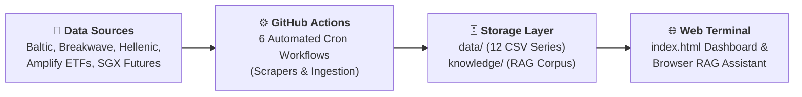
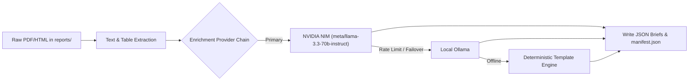

# Shipping: Zero-Infrastructure Intelligence Platform & Quantitative Terminal

[](https://yieldchaser.github.io/Shipping/)
[](file:///c:/Users/Dell/Github/Shipping/scripts)
[](file:///c:/Users/Dell/Github/Shipping/.github/workflows)
[](file:///c:/Users/Dell/Github/Shipping/knowledge)

> *"I am a Man of Fortune, and I must seek my Fortune."*  
> — **Henry Avery, 1694**

---

## 🌐 Live Web Terminal & Production Dashboard

The production analytical dashboard is served directly from this repository via GitHub Pages:  
👉 **[https://yieldchaser.github.io/Shipping/](https://yieldchaser.github.io/Shipping/)**  
*(Can also be launched locally by opening [`index.html`](file:///c:/Users/Dell/Github/Shipping/index.html) in any modern web browser).*

**No server. No build step. No database cost.** The entire platform operates as a self-sustaining quantitative shipping intelligence terminal with client-side execution, browser-native RAG AI research search, and automated multi-daily scraping pipelines.

---

## 1. System Architecture & Flow



### Supported Maritime Segments & Vessel Classes

| Segment | Vessel Class | Capacity / Spec | Key Freight Cargoes | Primary Routes / Indicators |
| :--- | :--- | :--- | :--- | :--- |
| **Dry Bulk** | **Capesize** | 180,000 DWT | Iron Ore, Coal | BCI, C5 (WAus → China), C3 (Tubarao → Qingdao) |
| **Dry Bulk** | **Panamax** | 82,000 DWT | Grain, Coal, Bauxite | BPI, P1A, P2A, P3A Atlantic/Pacific |
| **Dry Bulk** | **Supramax** | 58,000 DWT | Minor Bulks, Steel, Fertilizer | BSI, S1C, S2, S4A, S10 |
| **Dry Bulk** | **Handysize** | 38,000 DWT | Agricultural, Logs, Minor Bulks | BHSI, HS1, HS2, HS3 |
| **Crude Tankers** | **VLCC** | 270,000–300,000 DWT | Crude Oil | BDTI, TD3C (MEG → China 270kt) |
| **Crude Tankers** | **Suezmax** | 130,000–150,000 DWT | Crude Oil | BDTI, TD20 (WAF → UKC 130kt) |
| **Crude Tankers** | **Aframax** | 80,000–115,000 DWT | Crude Oil | BDTI, Regional Aframax routes |
| **Clean Tankers** | **LR2 / LR1 / MR**| 45,000–75,000 DWT | Refined Products (Naphtha, Diesel) | BCTI, TC2, TC14 |
| **Specialized** | **LNG & LPG** | 160k m³ / 84k m³ | Liquefied Gas | BLNG, BLPG Indices |
| **Container** | **Boxships** | Multi-TEU | Manufactured Goods | FBX (Freightos Baltic), NCFI (Ningbo) |
| **Freight ETFs** | **BDRY & BWET** | Freight Futures | FFA Derivatives Baskets | Solactive BDRYFF & BWETFF Indices |

---

## 2. Exhaustive Data Catalog & Time Series Inventory

This section provides a complete reference for every data file tracked within the repository. **External LLMs or automated parsers can use this inventory to locate datasets, verify schemas, and extend historical data.**

### 2.1 Primary Freight Spot Indices (`data/indices/`)

All files use standard CSV formatting with date headers in `DD-MM-YYYY` format.

| File Path | Target Index | Code | Start Date | Rows | Schema / Columns | Primary / Derived |
| :--- | :--- | :--- | :--- | :--- | :--- | :--- |
| [`data/indices/bdiy_historical.csv`](file:///c:/Users/Dell/Github/Shipping/data/indices/bdiy_historical.csv) | Baltic Dry Index | BDI | 04-01-1985 | ~10,492 | `Date, Index, % Change` | Primary (Validated Backfill + Scraped) |
| [`data/indices/cape_historical.csv`](file:///c:/Users/Dell/Github/Shipping/data/indices/cape_historical.csv) | Baltic Capesize Index | BCI | 06-10-2008 | ~4,312 | `Date, Index, % Change` | Primary (Scraped) |
| [`data/indices/panama_historical.csv`](file:///c:/Users/Dell/Github/Shipping/data/indices/panama_historical.csv) | Baltic Panamax Index | BPI | 06-10-2008 | ~4,312 | `Date, Index, % Change` | Primary (Scraped) |
| [`data/indices/suprama_historical.csv`](file:///c:/Users/Dell/Github/Shipping/data/indices/suprama_historical.csv) | Baltic Supramax Index | BSI | 06-10-2008 | ~4,311 | `Date, Index, % Change` | Primary (Scraped) |
| [`data/indices/handysize_historical.csv`](file:///c:/Users/Dell/Github/Shipping/data/indices/handysize_historical.csv) | Baltic Handysize Index | BHSI | 06-10-2008 | ~4,290 | `Date, Index, % Change` | Primary (Scraped) |
| [`data/indices/cleantanker_historical.csv`](file:///c:/Users/Dell/Github/Shipping/data/indices/cleantanker_historical.csv) | Baltic Clean Tanker | BCTI | 02-01-2008 | ~4,484 | `Date, Index, % Change` | Primary (Scraped) |
| [`data/indices/dirtytanker_historical.csv`](file:///c:/Users/Dell/Github/Shipping/data/indices/dirtytanker_historical.csv) | Baltic Dirty Tanker | BDTI | 05-12-2007 | ~4,499 | `Date, Index, % Change` | Primary (Scraped) |

### 2.2 Baltic Ticker API Series (`data/indices/`)

Updated via Baltic Ticker public API (`scripts/baltic_new_indices.py`) and TAC Index API.

| File Path | Index Description | Code | Start Date | Rows | Schema |
| :--- | :--- | :--- | :--- | :--- | :--- |
| `data/indices/blng_historical.csv` | Baltic LNG Freight Index | BLNG | 13-03-2026 | ~100 | `Date, Index, % Change` |
| `data/indices/blpg_historical.csv` | Baltic LPG Freight Index | BLPG | 13-03-2026 | ~100 | `Date, Index, % Change` |
| `data/indices/fbx_historical.csv` | Freightos Baltic Container Index | FBX | 13-03-2026 | ~100 | `Date, Index, % Change` |
| [`data/indices/bai_historical.csv`](file:///c:/Users/Dell/Github/Shipping/data/indices/bai_historical.csv) | Baltic Air Freight Index | BAI | 01-01-2018 | ~469 | `Date, Index, % Change` |

### 2.3 Time Charter (TC) Rates & Valuations (`data/derived/`)

Calculated weekly via Fearnleys Hasura GraphQL API (`scripts/backfill_historical_data.py`) and OCR extraction out of Alibra Shipping & Howe Robinson market tables published in Hellenic Shipping News (`scripts/process_knowledge.py`).

| File Path | Description | Start Date | Rows | Columns / Schema Overview |
| :--- | :--- | :--- | :--- | :--- |
| [`time_charter_rates.csv`](file:///c:/Users/Dell/Github/Shipping/data/derived/time_charter_rates.csv) | **Merged** Weekly TC Rates ($/day) — Fearnleys pre-2021 + Alibra post-2021 | 2000-01-05 | ~1,504 | `date, source` + 48 rate columns. `source` column = `fearnleys` (1,246 rows) or `alibra_ocr` (258 rows) |
| [`time_charter_rates_fearnleys.csv`](file:///c:/Users/Dell/Github/Shipping/data/derived/time_charter_rates_fearnleys.csv) | **Fearnleys-only** TC Rates — single-source reference for cross-validation | 2000-01-05 | ~1,595 | `date, capesize_1y_avg, panamax_1y_avg, supramax_1y_avg, handysize_1y_avg, vlcc_1y, suezmax_1y, aframax_1y` |
| [`intermodal_tc_rates.csv`](file:///c:/Users/Dell/Github/Shipping/data/derived/intermodal_tc_rates.csv) | **Intermodal** Weekly TC Rates ($/day) — fills MR, LR1, Handysize & 3Y period gaps | 2025-03-07 | ~43 | `date, source` + 20 rate columns (`mr_1y_tc`, `mr_3y_tc`, `lr1_1y_tc`, `lr1_3y_tc`, 3Y dry/wet period rates) |
| [`lpg_charter_rates.csv`](file:///c:/Users/Dell/Github/Shipping/data/derived/lpg_charter_rates.csv) | LPG 1Y TC Rates ($/month) from Fearnleys API | 2019-07-01 | ~359 | `date, vlgc_84k_tc, mgc_38k_tc, hdy_22k_tc` |
| [`lng_charter_rates.csv`](file:///c:/Users/Dell/Github/Shipping/data/derived/lng_charter_rates.csv) | LNG 7Y/10Y TC Rates ($/day) & Newbuilding Prices ($M) from Fearnleys API | 2017-01-05 | ~513 | `date, lngc_174k_7y_tc, lngc_174k_10y_tc, lngc_80k_nb_price, lngc_30k_nb_price, lngc_7k_nb_price` |
| [`lpg_spot_rates.csv`](file:///c:/Users/Dell/Github/Shipping/data/derived/lpg_spot_rates.csv) | LPG Spot Rates ($/day) from Fearnleys API | 2004-01-07 | ~1,152 | `date, vlgc_spot, mgc_spot` |
| [`vessel_valuations.csv`](file:///c:/Users/Dell/Github/Shipping/data/derived/vessel_valuations.csv) | S&P Secondhand 5Y/10Y Prices & Newbuilding Prices ($M) from Fearnleys | 1970-12-01 | ~20,499 | `date, category, tenor_type, vessel_class, valuation_usd_m` |
| [`scrappage_prices.csv`](file:///c:/Users/Dell/Github/Shipping/data/derived/scrappage_prices.csv) | Demolition/scrap prices by country ($/LDT) from Hellenic OCR | 2022-09-03 | ~137 | `date, dry_india, dry_bangla, dry_pak, dry_turkey, tanker_india, tanker_bangla, tanker_pak, container_india` |
| [`fearnleys_catalog.csv`](file:///c:/Users/Dell/Github/Shipping/data/derived/fearnleys_catalog.csv) | Catalog of all route metrics, subtypes, & counts available in Fearnleys Hasura API | — | ~356 | `id, unit, rate_type, rate_subtype, route, count, min_date, max_date` |
| [`iron_ore_restocking.csv`](file:///c:/Users/Dell/Github/Shipping/data/derived/iron_ore_restocking.csv) | Iron Ore Price vs Port Stocks & Freight | 2018-07-03 | ~1,244 | `Date, iron_ore_cfr_62, qingdao_port_inventory, cape_spot_tce, ratio_score` |

> [!NOTE]
> **Dual-Source TC Rates**: The merged file contains data from two brokers with a ~8% median divergence in the overlap period. The `source` column identifies the broker. The Fearnleys-only file provides a clean single-source reference for comparison. The dashboard offers a **Merged / Fearnleys / Both** toggle to visualize the divergence.

### 2.4 Futures, Holdings & Fund Flows (`data/futures/`, `data/etf/`, `data/flows/`)

| File Path | Type | Start Date | Rows | Content Summary |
| :--- | :--- | :--- | :--- | :--- |
| [`data/futures/bdryff_history.csv`](file:///c:/Users/Dell/Github/Shipping/data/futures/bdryff_history.csv) | Futures Index | 28-02-2010 | ~4,118 | Solactive BDRY Freight Futures Index history (`Date, Close`) |
| [`data/futures/bwetff_history.csv`](file:///c:/Users/Dell/Github/Shipping/data/futures/bwetff_history.csv) | Futures Index | 22-12-2016 | ~2,419 | Solactive BWET Freight Futures Index history (`Date, Close`) |
| [`data/futures/sgx_cape_futures.csv`](file:///c:/Users/Dell/Github/Shipping/data/futures/sgx_cape_futures.csv) | Curve Data | 05-03-2026 | ~3,000 | SGX Capesize FFA forward curves & settlement history |
| [`data/futures/sgx_panamax_futures.csv`](file:///c:/Users/Dell/Github/Shipping/data/futures/sgx_panamax_futures.csv) | Curve Data | 05-03-2026 | ~3,000 | SGX Panamax FFA forward curves & settlement history |
| [`data/futures/sgx_supramax_futures.csv`](file:///c:/Users/Dell/Github/Shipping/data/futures/sgx_supramax_futures.csv) | Curve Data | 05-03-2026 | ~3,000 | SGX Supramax FFA forward curves & settlement history |
| [`data/futures/sgx_handysize_futures.csv`](file:///c:/Users/Dell/Github/Shipping/data/futures/sgx_handysize_futures.csv) | Curve Data | 05-03-2026 | ~3,000 | SGX Handysize FFA forward curves & settlement history |
| [`data/etf/bdry_holdings.csv`](file:///c:/Users/Dell/Github/Shipping/data/etf/bdry_holdings.csv) | Daily Holdings | Live | ~21 | BDRY FFA contract holdings (Capesize, Panamax, Supramax 5TC) |
| [`data/etf/bwet_holdings.csv`](file:///c:/Users/Dell/Github/Shipping/data/etf/bwet_holdings.csv) | Daily Holdings | Live | ~15 | BWET FFA contract holdings (TD3C VLCC & TD20 Suezmax) |
| [`data/etf/bdry_holdings_history.csv`](file:///c:/Users/Dell/Github/Shipping/data/etf/bdry_holdings_history.csv) | Historical Holdings | Live | ~350 | Daily historical disclosures of BDRY ETF FFA contract positions |
| [`data/etf/bwet_holdings_history.csv`](file:///c:/Users/Dell/Github/Shipping/data/etf/bwet_holdings_history.csv) | Historical Holdings | Live | ~350 | Daily historical disclosures of BWET ETF FFA contract positions |
| [`data/etf/BDRY_flows.csv`](file:///c:/Users/Dell/Github/Shipping/data/etf/BDRY_flows.csv) | Fund Flows | 23-03-2018 | ~2,088 | Daily flow $, Net Shares, NAV, AUM history for BDRY ETF |
| [`data/etf/BWET_flows.csv`](file:///c:/Users/Dell/Github/Shipping/data/etf/BWET_flows.csv) | Fund Flows | 04-05-2023 | ~808 | Daily flow $, Net Shares, NAV, AUM history for BWET ETF |
| [`data/flows/all_flows_summary.json`](file:///c:/Users/Dell/Github/Shipping/data/flows/all_flows_summary.json) | JSON Summary | Live | — | Unified JSON payload containing synced ETF flow metrics |
| [`data/etf/bdry_liquidity.csv`](file:///c:/Users/Dell/Github/Shipping/data/etf/bdry_liquidity.csv) | Liquidity | 22-03-2018 | ~2,096 | Daily Close, Volume, Dollar Value Traded, Tier, Safe Liquidity $ |

### 2.5 Official ETF Documentation & SEC Filings (`docs/`)

| File Path | Document Type | Description |
| :--- | :--- | :--- |
| [`docs/Amplify_BDRY_Prospectus.pdf`](file:///c:/Users/Dell/Github/Shipping/docs/Amplify_BDRY_Prospectus.pdf) | Prospectus | Official statutory prospectus for Amplify BDRY ETF detailing Solactive index rules and roll schedules |
| [`docs/Amplify_BDRY_FactSheet.pdf`](file:///c:/Users/Dell/Github/Shipping/docs/Amplify_BDRY_FactSheet.pdf) | Factsheet | Official fund factsheet detailing BDRY benchmark weightings (50% Cape / 40% Pana / 10% Supra) |
| [`docs/Amplify_BWET_Prospectus.pdf`](file:///c:/Users/Dell/Github/Shipping/docs/Amplify_BWET_Prospectus.pdf) | Prospectus | Official statutory prospectus for Amplify BWET ETF detailing Breakwave Wet Freight Futures Index rules |
| [`docs/Amplify_BWET_FactSheet.pdf`](file:///c:/Users/Dell/Github/Shipping/docs/Amplify_BWET_FactSheet.pdf) | Factsheet | Official fund factsheet detailing BWET benchmark weightings (90% TD3C VLCC / 10% TD20 Suezmax) |
| [`docs/BDRY-BWET_Form10-Q_March-31-2026.pdf`](file:///c:/Users/Dell/Github/Shipping/docs/BDRY-BWET_Form10-Q_March-31-2026.pdf) | SEC Filing | Form 10-Q Quarterly Report for Breakwave Trust filed with the SEC containing audited holdings & financial disclosures |

---

## 3. Web Dashboard Features & Tab-by-Tab Breakdown

Built using **Chart.js 4.4.0** and **PapaParse 5.4.1**. All data is fetched client-side — no backend required. The global **Index:** dropdown in the header switches the active product across all tabs instantly.

**12 products available:** BDI · Capesize · Panamax · Supramax · Handysize · Clean Tanker · Dirty Tanker · BDRY Spot Composite · BDRYFF · BWETFF · BDRY Stock Price · BWET Stock Price

---

### 📊 Dashboard Tab

Main quantitative overview for the selected index.

- **Hero KPI + Signal Badge**: Algorithmic signal based on percentile and Z-score:
  - ⛔ **SELL**: 5Y percentile > 80%
  - 💎 **GOLDEN DIP**: 5Y percentile < 20%, $Z_{252} < -0.5$, all-time percentile > 40%
  - 🔥 **CATCHING KNIFE**: 5Y percentile < 10%, $Z_{252} < -0.6$
  - ⚠️ **VALUE TRAP**: 5Y percentile < 30%, all-time percentile < 30%
  - 🔹 **ACCUMULATE**: 5Y percentile < 40%
  - ⏳ **WAIT**: All other conditions
- **Momentum Regime Classification**:
  - 🟢 **EXPANSION**: Price > $\text{MA}_{200}$, $\text{RoC}_{60} > 0$
  - 🟡 **DISTRIBUTION**: Price > $\text{MA}_{200}$, $\text{RoC}_{60} \le 0$
  - 🔵 **ACCUMULATION**: Price $\le \text{MA}_{200}$, $\text{RoC}_{60} > 0$
  - 🔴 **CONTRACTION**: Price $\le \text{MA}_{200}$, $\text{RoC}_{60} \le 0$
- **6 Stat Cards**: All-Time Pctl · 10Y Pctl · 5Y Pctl · Z-Score · 52-Week Drawdown · 20D RoC.
- **Historical Context Strip**: 5Y avg, current vs 5Y avg %, current vs 10Y avg %.
- **Current Year vs Historical Overlay Chart**: Overlays current year against prior trading years.
- **Drawdown from 52-Week High Chart**: Last 5 years.
- **Recent Daily Changes Table**: Last 10 sessions (day $\Delta$, day $\Delta\%$, 5D change %).
- **Yearly Performance Table** *(collapsible, sortable)*: Annual avg, YoY %, min, max, Volatility % (dispersion: $(\text{max}-\text{min})/\text{avg}$), Trough → Peak % (theoretical max gain).
- **Macro Cycle History (Multi-Year)** *(collapsible, sortable)*: Identifies historical peak and trough cycles using a 30% threshold with duration and move magnitude tooltips.
- **Index Correlation Matrix**: Pearson correlation for all 7 products, switchable (All Time / 5Y / 1Y).

---

### 📅 Yearly Tab

- **Historical Price Chart**: Full history with rolling average toggle (5Y / 10Y / All-Time) and dual-handle range slider.
- **Z-Score (Rolling 252-Day)**: All 7 products, selected product highlighted. Range slider defaults to last 3 years.
- **Historical Z-Score (All Time from 2008)**: Full-history view.
- **Multi-Year Rates**: Annual averages by product across all years.
- **Current Year Monthly Bar**: MoM color coding.
- **Rates — All Products Multi-Year Overlay**: Last 4 years by trading day.
- **Drawdown % (52-Week Rolling, Last 5 Years)**.
- **Monthly Win Rate KPI Cards**: Historical probability of each month being positive.
- **Monthly Performance by Year (Spaghetti)**: Index trajectory by trading day across all years.
- **Monthly Data Grid**: Last 8 years $\times$ 12 months heatmap with relative color scaling.

---

### 📊 Quarterly Tab

- **Win Rate KPI Cards**: Historical probability each quarter beats the prior quarter.
- **Quarterly Heatmap**: All years $\times$ Q1–Q4, absolute or QoQ % switchable.
- **Spaghetti Chart**: Q1/Q2/Q3/Q4 across all years as 4 colored lines.
- **Quarterly Data Grid**: Last 8 years with full-year avg and YoY %.

---

### 🌡️ Heatmaps Tab

- **Monthly Heatmap**: Year $\times$ Month, absolute value or MoM % toggle.
- **Quarterly Heatmap**: Year $\times$ Quarter, absolute value or QoQ % toggle.
- **8-Year Relative Scaling**: Color scaling tailored to recent 8-year windows for visual contrast.

---

### 📈 Indices Tab

All 6 base indices as individual chart cards:
- Current value, day change %.
- Dual-handle date range slider (defaults to last 5 years).
- Stats strip: 52W High—Low · 52W Position · YTD % · From Last Trough.

---

### 🏦 ETFs Tab (BDRY & BWET)

#### BDRY & BWET Card Structure
1. **Live price + day change**: 5-minute dynamic auto-refresh engine powered by Yahoo Finance v8 API via a 4-stage CORS proxy failover cascade. Updates big price cards, day change %, 52W metrics, and ETF Deconstruction Engine live without page reloads! Includes a live badge with update timestamp (`🟢 LIVE 17:51:12`).
2. **Metrics row 1**: Total Futures · Collateral Cash · Futures/AUM %.
3. **Metrics row 2**: NAV · Expense Ratio (3.50%) · Exposure Ratio.
4. **Metrics row 3**: 52W High—Low · 52W Position (%) · From Last Trough (%).
5. **Holdings table**: FFA contracts sorted by vessel class → expiry month (nearest first).
6. **Futures Allocation donut**: Normalized to 100% of futures notional.
7. **Trade route map**: Interactive trade route graphics with legends.
8. **Yearly Performance & Macro Cycle Tables**.
9. **Liquidity Tracker**: Position-sizing model assessing daily volume against safe liquidity thresholds.
10. **ETF Futures Portfolio Deconstruction, Valuation & Scenario Engine**:
    - **5-Axiom Futures Allocation Engine**: Deconstructs ETF disclosures for Amplify BDRY (Dry Bulk) and Amplify BWET (Tankers) into active futures contract holdings, lot counts, and % weights for any target date horizon (`Today`, `Month End`, `Next Quarter Strip`, `1 Year Out`).
      $$\text{Lot Allocation} = \text{Target Lots} \times \left(1 - \frac{b_{\text{cur}}}{b_{\text{total}}}\right)$$
    - **Per-Vessel Class Weighted Roll Yield Engine**: Computes exact lot-weighted term structure roll spreads within each vessel class to eliminate cross-asset price distortions:
      $$\text{Implied Roll Yield (\%/mo)} = \sum_{v} \left( w_v \times \frac{\text{Prompt}_v - \text{Next}_v}{\text{Prompt}_v} \times 100 \right)$$
    - **Absolute Data Truth & Feed Provenance**:
      - `✓ Official SGX Settlement Feed`: Real-time daily settlement history from Singapore Exchange datasets (`DATA.sgx`).
      - `✓ Official ETF Daily Holdings History Feed`: Stored daily fund disclosures (`data/etf/bwet_holdings_history.csv` & `bdry_holdings_history.csv`).
      - `[Warning] Historical Feed Not Available`: Clean transparent banner for far-dated forward contracts where exchange feeds are unavailable (zero fake price generation).
    - **Dual Worldscale (WS) & Time Charter Equivalent (TCE $/day) Unit Architecture**: Dynamically formats crude tanker futures history (BWET ETF: VLCC TD3C & Suezmax TD20) in both exchange-traded Worldscale Points (`WS 68.0`) and implied daily charter revenue (`~$48,484/day`), while preserving absolute dollar rates (`$39,232/day`) for dry bulk futures (BDRY ETF).
    - **Contract-Level Micro-Simulator & SGX Range Matrix**: Line-item table displaying SGX Settle Rates ($/day or WS), 52-Week Price Range Bars ($ Min — $ Max), single-line input boxes (`white-space: nowrap`), `$ / Share Impact`, and `% NAV Contrib` metrics.
    - **Macro / Micro Slider Mode & Institutional 0%-Origin Range Sliders**: Seamlessly switch between bulk **Macro (Class)** sliders and granular **Micro (Contract)** sliders. Range slider tracks feature 0%-origin baseline fills (positive shocks fill right in class colors; negative shocks fill left in financial red).
    - **2D Freight Sensitivity Heatmap Matrix**: Interactive 5x5 grid evaluating 25 simultaneous freight rate shock combinations (Capesize vs Panamax / VLCC vs Suezmax) with glowing active scenario borders and neutral baseline cell outlines.
    - **Target Price Reverse NAV Solver**: Inverts the NAV return formula to solve the exact uniform freight rate rally/decline % required to reach any user-entered target ETF share price ($).
    - **Editable Position Share Count & Base PnL**: Interactive input box (`PnL FOR [ 1000 ] SHARES`) dynamically recalculating dollar PnL and invested Base Capital ($).
    - **Institutional System 2 Rich Tooltips**: Rich HTML tooltips across all 8 sub-components formatted with `.rt-title`, `.rt-row`, `.rt-label`, `.rt-val`, and `.rt-note` CSS design tokens.
    - **Dual-View Doughnut Chart Mode**: Toggle between high-level **By Vessel Class** view and detailed **By Contract Month** view with contiguous color arcs sorted in chronological month sequence.
- **Ultra-Fast GitHub Pages Build Engine**: Bypasses slow Jekyll processing (`.nojekyll`) and uses direct static artifact deployment (`pages.yml` with `cancel-in-progress: true`), cutting page deployment times from 5 minutes down to ~15-20 seconds.

| Liquidity Metric | Formula |
| :--- | :--- |
| **Dollar Value Traded** | $\text{Close} \times \text{Volume}$ |
| **Tier Allocation %** | $\text{Vol} < 50\text{k} \rightarrow 2.0\% \cdot < 100\text{k} \rightarrow 3.5\% \cdot < 500\text{k} \rightarrow 5.0\% \cdot \ge 500\text{k} \rightarrow 6.5\%$ |
| **Possible Shares** | $\lfloor \text{Volume} \times \text{Tier\%} \rfloor$ |
| **Safe Liquidity Capacity ($)** | $\text{Possible Shares} \times \text{Close}$ |

---

### 🎯 Signals Tab

Comprehensive analytical suite for technical and fundamental signals:

- **Interactive Dual-Handle Range Sliders**: Full UI parity with the Indices tab — every time-series chart features an independent, real-time dual-range date slider with interactive date boundaries (`YYYY-MM-DD ➔ YYYY-MM-DD`).
- **Spot Rate Scaling ($/day TCE)**: Spot indices are converted to $/day TCE equivalent earnings (Dry Bulk index points $\times 10$, BDTI $\times 35$, BCTI $\times 30$) to allow direct comparison with 1-Year and 2-Year Time Charter rates.
- **Detailed & Dynamic Concept Tooltips**: Interactive HTML tooltips explaining "what they are", "why they matter", and "how to read them" with live dataset metrics injected.
- **View All Sectors Toggle**: Option to view all 6 sectors overlaid on a single wide chart.
- **Signals Breakdown**:
  - **Bollinger Bands (20D, 2σ)**: Price + upper/SMA/lower bands with dual-range slider.
  - **Historical Volatility**: Annualized volatility + regime classification based on all-time percentiles with dual-range slider.
  - **Cape / Panamax Ratio**: Ratio time series (Iron Ore vs Grain proxy) + rolling 252D percentile with dual-range slider.
  - **Rate-of-Change Heatmap**: 7 products $\times$ 6 timeframes (5D / 10D / 20D / 60D / 90D / 1Y).
  - **Seasonal Decomposition**: Historical avg intra-year pattern $\pm 1\sigma$ with current year.
  - **ETF P/D Z-Score**: Premium/Discount to NAV Z-score (+2 = Top, -2 = Bottom) with dual-range slider.
  - **FFA Term Structure**: Forward curves from live BDRY/BWET holdings.
  - **SGX FFA Forward Curve**: Official SGX settlement curve for Cape/Pana/Supra/Handy.
  - **Futures vs Spot Premium**: Basis tracking between BDRYFF index and spot baskets with dual-range slider.
  - **BDI Contribution**: Decomposition of BDI daily change by vessel class with dual-range slider.
  - **ETF Fund Flow Signals**: Flow Stretch (Z-score), Regime (5D/20D trend), Divergence (Price vs Flow), Pressure with dual-range slider.
  - **Lead–Lag Correlation**: Cross-correlation of log returns (-30 to +30 days) to detect lead times.
  - **Time Charter Rates**: Spot earnings vs 1-Year Time Charter rate overlay with Spot/TC ratio, Fearnleys/Alibra source toggle (Merged, Fearnleys, Both), and dual-range slider.
  - **Basin/Sector Spreads**: Atlantic vs Pacific 1Y TC rate spread/ratio per vessel class with dual-range slider.
  - **Restocking Pressure**: Freight spot rates vs CFR 62% Iron Ore price and Qingdao Port Inventory with dual-range slider.
  - **LPG Freight & Charter Rates**: Multi-series VLGC/MGC spot + charter rates (VLGC 84k, MGC 38k, Handy 22k) + Baltic LPG Index overlay with dual-range slider and unit toggle ($/Day TCE equivalent vs raw $/Month PCM hire).
  - **Vessel Capital Cycle**: S&P secondhand valuations (1970–2026) with 3 sub-modes (10Y Asset Value, Scrap Floor $M, Implied Charter Yield %) and dual-range slider.
  - **Market Cycle Quadrant**: 20-week trajectory plotting spot momentum (60D % change) against Spot/TC ratio Z-score (Recovery, Boom, Over-ordering, Restructuring).

---

## 4. Quantitative & Statistical Engine Methodologies

### 4.1 Z-Score & Percentile Equations

- **Calendar Day Z-Score**: $Z_{\text{cal}}(t) = \frac{x(t) - \mu_{\text{cal}}}{\sigma_{\text{cal}}}$
- **Rolling 252-Day Z-Score**: $Z_{252}(t) = \frac{x(t) - \mu_{252}(t)}{\sigma_{252}(t)}$
- **Percentile Rank**: $P(x) = \frac{|\{y \in W : y \le x\}|}{|W|} \times 100\%$
- **52-Week Drawdown**: $D_{52}(t) = \frac{x(t) - \max_{\tau \in [t-365, t]} x(\tau)}{\max_{\tau \in [t-365, t]} x(\tau)}$
- **20-Day Rate of Change**: $\text{RoC}_{20}(t) = \frac{x(t) - x(t-20)}{x(t-20)} \times 100\%$

### 4.2 Mathematical Statistics Reference Table

| Metric | Calculation / Formula |
| :--- | :--- |
| **Percentile Rank** | Fraction of historical values $\le$ current within lookback window ($W$) |
| **Z-Score (Calendar)** | $(x(t) - \mu_{\text{calendar\_session}}) / \sigma_{\text{calendar\_session}}$ |
| **Z-Score (252D)** | $(x(t) - \text{SMA}_{252}(t)) / \sigma_{252}(t)$ |
| **52-Week Drawdown** | $(x(t) - \max_{365\text{D}}(x)) / \max_{365\text{D}}(x)$ |
| **Rate of Change (20D)** | $(x(t) - x(t-20)) / x(t-20) \times 100\%$ |
| **Bollinger Bands** | $\text{SMA}(20) \pm 2 \times \sigma_{20}$ |
| **BDRY Spot** | $0.50 \cdot \text{BCI} + 0.40 \cdot \text{BPI} + 0.10 \cdot \text{BSI}$ |
| **Volatility %** | $(\max(y) - \min(y)) / |\text{mean}(y)| \times 100\%$ |
| **Trough → Peak %** | $(\max(y) - \min(y)) / \min(y) \times 100\%$ |
| **Safe Liquidity Capacity** | $\lfloor \text{Volume} \times \text{Tier\%} \rfloor \times \text{Close}$ |

---

## 5. Intelligence Knowledge Base Engine & RAG Architecture

The repo embeds an incremental document processing compiler ([`scripts/process_knowledge.py`](file:///c:/Users/Dell/Github/Shipping/scripts/process_knowledge.py)) and browser-native retrieval augmented generation (RAG) assistant.

```
knowledge/
├── config/             # Topic taxonomy definitions for wiki generation
├── docs/               # Normalized markdown source files with YAML frontmatter
├── chunks/             # JSONL retrieval chunks with token counts & tags
├── trees/              # Per-document hierarchical section trees
├── wiki/               # Auto-compiled topic pages with citations
├── reports/            # Operational health summaries (health_summary.md)
├── manifests/          # Document inventory, coverage reports, and error logs
└── derived/            # Extracted signals.jsonl, themes.jsonl, timelines.json
```

### 5.1 Multi-LLM Ingestion Chain

Raw PDFs and HTML roundups in `reports/` are compiled into structured markdown with automated provider failover:



### 5.2 Browser-Native 4-Stage Ranked RAG Engine

The dashboard features a **client-side RAG search engine** tuned specifically for shipping market analysis:


#### Key RAG Features:
- **Suggested Questions UI**: Tabbed interface (Daily Briefing, Market Signals, Supply & Orderbooks, Macro & Cargo, Trade Ideas).
- **Four-Stage Ranked Retrieval**: Query expansion (40+ shipping aliases) → inverted index candidate discovery → date-range pre-filtering → multi-factor BM25 (keywords $2\times$, section-title boost, recency $1.5\times$, source dedup) → optional LLM reranker.
- **Live Market Injection**: Every query auto-injects today's Z-scores, regimes, analyst consensus, trade ideas, and macro catalysts as readable narrative text.
- **Traceable Citations**: Every fact backed by `[DOC-N]` superscript linking to source report + date + section.
- **Low-Confidence Warnings**: Surfaces "⚠ Limited context found" when BM25 score $< 0.5$ or $<3$ chunks match.
- **Browser Q&A Fallback**: Groq (defaults to `openai/gpt-oss-120b`) and OpenRouter both supported natively.

---

## 6. Automated GitHub Actions Workflows

The repository maintains itself via 8 idempotent GitHub Actions workflows:

| Workflow File | Cron Schedule | Triggers | Execution Script Sequence | Function & Output |
| :--- | :--- | :--- | :--- | :--- |
| [`daily_brief.yml`](file:///.github/workflows/daily_brief.yml) | `0 14,17,20 * * 1-5` | Mon–Fri Scheduled / Dispatch | `python scripts/generate_brief.py` | Synthesizes daily market brief via NVIDIA NIM (`meta/llama-3.3-70b-instruct`) & updates `knowledge/briefs/manifest.json`. |
| [`daily_update.yml`](file:///.github/workflows/daily_update.yml) | `30 10 * * *`<br>`0 14,19,22 * * *` | Scheduled / Dispatch | `python scripts/update_indices.py`<br>`python scripts/fetch_flows_shipping.py` | Scrapes Baltic indices, SGX futures, BDRY/BWET Playwright ETF fund flows. |
| [`baltic_new_indices_update.yml`](file:///.github/workflows/baltic_new_indices_update.yml) | `30 10 * * 1-5`<br>`0 14,19,22 * * 1-5` | Mon–Fri Scheduled | `python scripts/baltic_new_indices.py` | Updates BLNG, BLPG, FBX, BAI from Baltic ticker API & validates CSV tails. |
| [`etf_holdings_update.yml`](file:///.github/workflows/etf_holdings_update.yml) | `0 14 * * 1-5` | Mon–Fri 2 PM UTC | `python scripts/update_etf_holdings.py` | Downloads Amplify master CSV, sorts BDRY/BWET holdings by contract month. |
| [`report_ingest.yml`](file:///.github/workflows/report_ingest.yml) | `0 8,12,16 * * 1-5`<br>`30 9 * * 1-5` | Mon–Fri Scheduled | `scripts/breakwave_scraper.py`<br>`scripts/baltic_scraper.py`<br>`scripts/hellenic_scraper.py` | Ingests new Breakwave PDFs, Baltic roundups, and Hellenic HTML report categories. |
| [`process_knowledge.yml`](file:///.github/workflows/process_knowledge.yml) | On push to `reports/**` | Push / Dispatch | `scripts/process_knowledge.py`<br>`scripts/build_wiki.py`<br>`scripts/validate_knowledge.py` | Compiles raw reports into markdown, chunks, trees, derived signals, and wiki pages. |
| [`daily_knowledge_update.yml`](file:///.github/workflows/daily_knowledge_update.yml) | `30 15 * * *` | Daily 3:30 PM UTC | `python scripts/check_breakwave_freshness.py` | Incremental health check; triggers rebuild if source files outpace knowledge base. |
| [`pages.yml`](file:///.github/workflows/pages.yml) | On push to `main` | Push to `main` | Static Artifact Upload & Deploy | Deploys static site to GitHub Pages with `cancel-in-progress: true` (~15–20s build). |

---

## 7. Codebase Inventory & Knowledge Graph Telemetry

Graph statistics extracted via `code-review-graph` MCP tools:

```
Total Files Tracked: 22 Python Scripts
Total Graph Nodes:   422 (22 Files, 404 Functions)
Total Graph Edges:   5,774 (5,194 Calls, 404 Contains, 173 Imports, 3 References)
```

### Python Scripts Inventory (`scripts/`)

| Script Name | Size | Functions | Primary Community / Role |
| :--- | :--- | :--- | :--- |
| [`process_knowledge.py`](file:///c:/Users/Dell/Github/Shipping/scripts/process_knowledge.py) | 147.8 KB | 127 | Knowledge ingestion compiler, tree builder, chunking engine, OCR parser, LLM failover. |
| [`generate_brief.py`](file:///c:/Users/Dell/Github/Shipping/scripts/generate_brief.py) | 68.3 KB | 50 | Analytics computation (Z-scores, percentiles, spreads) & daily AI brief synthesizer (NVIDIA NIM). |
| [`validate_knowledge.py`](file:///c:/Users/Dell/Github/Shipping/scripts/validate_knowledge.py) | 48.1 KB | 28 | Comprehensive corpus validator checking manifests, trees, signals, and wiki links. |
| [`baltic_scraper.py`](file:///c:/Users/Dell/Github/Shipping/scripts/baltic_scraper.py) | 31.9 KB | 23 | Selenium/HTTP scraper for Baltic Exchange reports and asset mirroring. |
| [`update_indices.py`](file:///c:/Users/Dell/Github/Shipping/scripts/update_indices.py) | 24.0 KB | 14 | StockQ freight indices & SGX FFA futures curve scraper. |
| [`hellenic_scraper.py`](file:///c:/Users/Dell/Github/Shipping/scripts/hellenic_scraper.py) | 23.8 KB | 19 | Hellenic Shipping News report & weekly TC rate table scraper. |
| [`build_health_report.py`](file:///c:/Users/Dell/Github/Shipping/scripts/build_health_report.py) | 22.8 KB | 16 | Knowledge health, source cadence, and diagnostic report generator. |
| [`build_wiki.py`](file:///c:/Users/Dell/Github/Shipping/scripts/build_wiki.py) | 19.8 KB | 18 | Topic evidence scoring and automated markdown wiki page builder. |
| [`breakwave_insights_scraper.py`](file:///c:/Users/Dell/Github/Shipping/scripts/breakwave_insights_scraper.py) | 18.0 KB | 17 | Breakwave Insights HTML commentary archive scraper. |
| [`fetch_flows_shipping.py`](file:///c:/Users/Dell/Github/Shipping/scripts/fetch_flows_shipping.py) | 16.4 KB | 8 | Playwright headless scraper for BDRY & BWET fund flows & NAV history. |
| [`breakwave_scraper.py`](file:///c:/Users/Dell/Github/Shipping/scripts/breakwave_scraper.py) | 15.7 KB | 12 | Breakwave Advisors PDF biweekly report scraper. |
| [`normalize_source_archives.py`](file:///c:/Users/Dell/Github/Shipping/scripts/normalize_source_archives.py) | 14.5 KB | 15 | HTML archive standardizer and cleaner. |
| [`update_etf_holdings.py`](file:///c:/Users/Dell/Github/Shipping/scripts/update_etf_holdings.py) | 12.4 KB | 9 | Amplify ETF holdings downloader and sorter. |
| [`source_archive_utils_v2.py`](file:///c:/Users/Dell/Github/Shipping/scripts/source_archive_utils_v2.py) | 11.0 KB | 20 | Shared text repair (`repair_text`), filename slugification, and asset utilities. |
| [`baltic_new_indices.py`](file:///c:/Users/Dell/Github/Shipping/scripts/baltic_new_indices.py) | 8.6 KB | 11 | Baltic Ticker API scraper for BLNG, BLPG, FBX, and BAI. |
| [`backfill_historical_data.py`](file:///c:/Users/Dell/Github/Shipping/scripts/backfill_historical_data.py) | 8.3 KB | 6 | Fearnleys Hasura GraphQL API historical rates backfill script. |
| [`check_breakwave_freshness.py`](file:///c:/Users/Dell/Github/Shipping/scripts/check_breakwave_freshness.py) | 4.8 KB | 7 | Freshness monitoring utility for Breakwave biweekly reports. |
| [`check_data_health.py`](file:///c:/Users/Dell/Github/Shipping/scripts/check_data_health.py) | 4.8 KB | 5 | CSV time series health & date continuity checker. |
| [`validate_source_archives.py`](file:///c:/Users/Dell/Github/Shipping/scripts/validate_source_archives.py) | 4.2 KB | 5 | Source archive format validator. |
| [`fetch_fearnleys_tc.py`](file:///c:/Users/Dell/Github/Shipping/scripts/fetch_fearnleys_tc.py) | 3.6 KB | 4 | FearnleysHasura API time charter rate fetcher. |
| [`append_daily_holdings.py`](file:///c:/Users/Dell/Github/Shipping/scripts/append_daily_holdings.py) | 2.2 KB | 3 | Daily ETF holdings appending utility (`bdry_holdings_history.csv` / `bwet_holdings_history.csv`). |
| [`knowledge_hash.py`](file:///c:/Users/Dell/Github/Shipping/scripts/knowledge_hash.py) | 1.2 KB | 2 | Incremental hashing helper for knowledge builds. |

---

## 8. Developer Guide & Database Expansion Instructions

### 8.1 Local Environment Setup

```bash
# Clone the repository
git clone https://github.com/yieldchaser/Shipping.git
cd Shipping

# Install Python requirements
pip install requests beautifulsoup4 pandas lxml selenium playwright
pip install -r requirements_knowledge.txt

# Install Playwright browser engine
playwright install chromium
```

### 8.2 Executing Core Pipelines

```bash
# Update freight indices & SGX futures
python scripts/update_indices.py

# Update Baltic Ticker API series (BLNG, BLPG, FBX, BAI)
python scripts/baltic_new_indices.py

# Update BDRY / BWET ETF holdings
python scripts/update_etf_holdings.py

# Fetch BDRY / BWET Playwright fund flows
python scripts/fetch_flows_shipping.py

# Run incremental knowledge compiler & build wiki pages
python scripts/process_knowledge.py --source all
python scripts/build_wiki.py
python scripts/build_health_report.py
python scripts/validate_knowledge.py
```

### 8.3 Instructions for LLMs / Data Engineers Expanding Historical Series

> [!IMPORTANT]
> If you are an AI assistant or data engineer tasked with **extending historical data series** (e.g. extending Time Charter rates back prior to July 2021, or adding historical spot data prior to 2007), follow these strict requirements:

1. **Date Format Standard**:
   - Primary spot CSVs (`bdiy_historical.csv`, etc.) use `DD-MM-YYYY` (e.g. `05-12-2007`).
   - Derived time series (`time_charter_rates.csv`, `iron_ore_restocking.csv`) use ISO format `YYYY-MM-DD` (e.g. `2021-07-07`).
   - Ensure new rows match the existing date format of the target file.
2. **Preserve Exact Header Order**:
   - When appending to [`time_charter_rates.csv`](file:///c:/Users/Dell/Github/Shipping/data/derived/time_charter_rates.csv), preserve the column order: `date, source` + 48 rate columns.
3. **Source Provenance (CRITICAL)**:
   - Every row in `time_charter_rates.csv` MUST have a `source` column value (`fearnleys` or `alibra_ocr`).
   - `scrappage_prices.csv` is the pipeline output for demolition data — do NOT write scrappage data to `vessel_valuations.csv` (which contains Fearnleys S&P data).
   - Never mix broker data without provenance tags — this creates phantom level shifts.
4. **Missing Value Convention**:
   - Use empty strings `""` or `NaN` representation for missing historical rates. Do not inject `0.0` or fake negative values, as this skews Z-score and percentile calculations.
5. **Idempotent Sorting**:
   - Always sort rows chronologically by date before committing updates.
6. **Run Validation Post-Update**:
   - Execute `python scripts/validate_knowledge.py` to confirm schema integrity.

---

## 🏴‍☠️ Henry Avery Ticker

The dashboard features an animated global ticker at the top, named after the legendary "King of Pirates":
- **22 Curated Quotes**: A blended mix of Henry Avery lore, maritime strategy (Sir Francis Drake, Themistocles), and ancient Nordic wisdom from the *Hávamál*.
- **Interactive Controls**: Pauses on hover, fully copy-paste enabled.

---

## 📄 License & Attribution

Developed for open maritime shipping market research.  
Data compiled from public exchange feeds, regulatory disclosures, and market reports.
