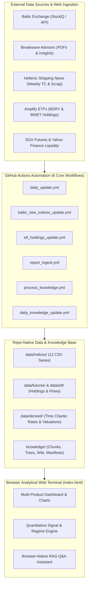
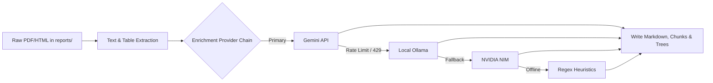
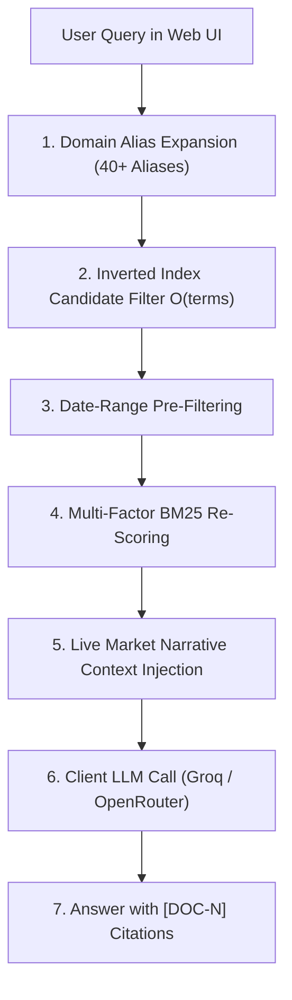

# Shipping: Zero-Infrastructure Intelligence Platform & Quantitative Terminal

[](https://yieldchaser.github.io/Shipping/)
[](file:///c:/Users/Dell/Github/Shipping/scripts)
[](file:///c:/Users/Dell/Github/Shipping/.github/workflows)
[](file:///c:/Users/Dell/Github/Shipping/knowledge)

> *"I am a Man of Fortune, and I must seek my Fortune."*  
> — **Henry Avery, 1694**

---

## 🌐 Live Web Terminal

The production analytical dashboard is hosted live via GitHub Pages:  
👉 **[https://yieldchaser.github.io/Shipping/](https://yieldchaser.github.io/Shipping/)**  
*(Can also be launched locally by opening [`index.html`](file:///c:/Users/Dell/Github/Shipping/index.html) in any modern web browser).*

**No backend server. No database costs. No build steps.** The entire system operates as a self-sustaining quantitative shipping intelligence platform with client-side execution, browser-native RAG AI search, and automated multi-daily scraping pipelines.

---

## 1. System Architecture & Flow



### Supported Maritime Segments & Vessel Classes

| Segment | Vessel Class | Capacity / Spec | Key Freight Cargoes | Primary Routes / Indicators |
| :--- | :--- | :--- | :--- | :--- |
| **Dry Bulk** | **Capesize** | 180,000 DWT | Iron Ore, Coal | BCI, C5 (WAus$\rightarrow$China), C3 (Tubarao$\rightarrow$Qingdao) |
| **Dry Bulk** | **Panamax** | 82,000 DWT | Grain, Coal, Bauxite | BPI, P1A, P2A, P3A Atlantic/Pacific |
| **Dry Bulk** | **Supramax** | 58,000 DWT | Minor Bulks, Steel, Fertilizer | BSI, S1C, S2, S4A, S10 |
| **Dry Bulk** | **Handysize** | 38,000 DWT | Agricultural, Logs, Minor Bulks | BHSI, HS1, HS2, HS3 |
| **Crude Tankers** | **VLCC** | 270,000–300,000 DWT | Crude Oil | BDTI, TD3C (MEG$\rightarrow$China 270kt) |
| **Crude Tankers** | **Suezmax** | 130,000–150,000 DWT | Crude Oil | BDTI, TD20 (WAF$\rightarrow$UKC 130kt) |
| **Crude Tankers** | **Aframax** | 80,000–115,000 DWT | Crude Oil | BDTI, Regional Aframax routes |
| **Clean Tankers** | **LR2 / LR1 / MR**| 45,000–75,000 DWT | Refined Products (Naphtha, Diesel) | BCTI, TC2, TC14 |
| **Specialized** | **LNG & LPG** | 160k m³ / 84k m³ | Liquefied Gas | BLNG, BLPG Indices |
| **Container** | **Boxships** | Multi-TEU | Manufactured Goods | FBX (Freightos Baltic), NCFI (Ningbo) |
| **Freight ETFs** | **BDRY & BWET** | Freight Futures | FFA Derivatives Baskets | Solactive BDRYFF & BWETFF Indices |

---

## 2. Exhaustive Data Catalog & Time Series Inventory

This section provides a complete reference for every data file tracked within the repository. **External LLMs or automated parsers can use this inventory to locate datasets, verify schemas, and extend historical data.**

### 2.1 Primary Freight Spot Indices (`data/indices/`)

All files use standard CSV formatting with date headers in `DD-MM-YYYY` format.

| File Path | Target Index | Code | Start Date | Rows | Schema / Columns | Primary / Derived |
| :--- | :--- | :--- | :--- | :--- | :--- | :--- |
| [`data/indices/bdiy_historical.csv`](file:///c:/Users/Dell/Github/Shipping/data/indices/bdiy_historical.csv) | Baltic Dry Index | BDI | 05-12-2007 | ~4,503 | `Date, Index, % Change` | Primary (Scraped) |
| [`data/indices/cape_historical.csv`](file:///c:/Users/Dell/Github/Shipping/data/indices/cape_historical.csv) | Baltic Capesize Index | BCI | 06-10-2008 | ~4,301 | `Date, Index, % Change` | Primary (Scraped) |
| [`data/indices/panama_historical.csv`](file:///c:/Users/Dell/Github/Shipping/data/indices/panama_historical.csv) | Baltic Panamax Index | BPI | 06-10-2008 | ~4,301 | `Date, Index, % Change` | Primary (Scraped) |
| [`data/indices/suprama_historical.csv`](file:///c:/Users/Dell/Github/Shipping/data/indices/suprama_historical.csv) | Baltic Supramax Index | BSI | 06-10-2008 | ~4,300 | `Date, Index, % Change` | Primary (Scraped) |
| [`data/indices/handysize_historical.csv`](file:///c:/Users/Dell/Github/Shipping/data/indices/handysize_historical.csv) | Baltic Handysize Index | BHSI | 06-10-2008 | ~4,279 | `Date, Index, % Change` | Primary (Scraped) |
| [`data/indices/cleantanker_historical.csv`](file:///c:/Users/Dell/Github/Shipping/data/indices/cleantanker_historical.csv) | Baltic Clean Tanker | BCTI | 02-01-2008 | ~4,473 | `Date, Index, % Change` | Primary (Scraped) |
| [`data/indices/dirtytanker_historical.csv`](file:///c:/Users/Dell/Github/Shipping/data/indices/dirtytanker_historical.csv) | Baltic Dirty Tanker | BDTI | 05-12-2007 | ~4,488 | `Date, Index, % Change` | Primary (Scraped) |

### 2.2 Baltic Ticker API Series (`data/indices/`)

Updated via Baltic Ticker public API (`scripts/baltic_new_indices.py`).

| File Path | Index Description | Code | Start Date | Schema |
| :--- | :--- | :--- | :--- | :--- |
| `data/indices/blng_historical.csv` | Baltic LNG Freight Index | BLNG | 13-03-2026 | `Date, Index, % Change` |
| `data/indices/blpg_historical.csv` | Baltic LPG Freight Index | BLPG | 13-03-2026 | `Date, Index, % Change` |
| `data/indices/fbx_historical.csv` | Freightos Baltic Container Index | FBX | 13-03-2026 | `Date, Index, % Change` |
| `data/indices/bai_historical.csv` | Baltic Air Freight Index | BAI | 13-03-2026 | `Date, Index, % Change` |

### 2.3 Time Charter (TC) Rates & Valuations (`data/derived/`)

Calculated weekly via OCR extraction out of Alibra Shipping & Howe Robinson market tables published in Hellenic Shipping News (`scripts/process_knowledge.py`).

| File Path | Description | Start Date | Rows | Columns / Schema Overview |
| :--- | :--- | :--- | :--- | :--- |
| [`data/derived/time_charter_rates.csv`](file:///c:/Users/Dell/Github/Shipping/data/derived/time_charter_rates.csv) | Weekly 1Y, 2Y, 3Y, 5Y TC Rates ($/day) | 07-07-2021 | ~257 | `Date` + 48 rate columns (`vlcc_1y`, `vlcc_2y`, `suezmax_1y`, `aframax_1y`, `mr_1y`, `lr1_1y`, `lr2_1y`, `capesize_1y_atl`, `capesize_1y_pac`, `capesize_1y_avg`, `panamax_1y_avg`, etc.) |
| [`data/derived/vessel_valuations.csv`](file:///c:/Users/Dell/Github/Shipping/data/derived/vessel_valuations.csv) | Scrappage Prices ($/LDT) & Floor Valuations | 03-09-2022 | ~136 | `Date, india_scrap, bangladesh_scrap, pakistan_scrap, cape_floor_m, pana_floor_m, supra_floor_m, handy_floor_m` |
| [`data/derived/iron_ore_restocking.csv`](file:///c:/Users/Dell/Github/Shipping/data/derived/iron_ore_restocking.csv) | Iron Ore Price vs Port Stocks & Freight | 03-07-2018 | ~1,234 | `Date, iron_ore_cfr_62, qingdao_port_inventory, cape_spot_tce, ratio_score` |

### 2.4 Futures, Holdings & Fund Flows (`data/futures/`, `data/etf/`, `data/flows/`)

| File Path | Type | Start Date | Rows | Content Summary |
| :--- | :--- | :--- | :--- | :--- |
| `data/futures/bdryff_history.csv` | Futures Index | 28-02-2010 | ~4,118 | Solactive BDRY Freight Futures Index history (`Date, Close`) |
| `data/futures/bwetff_history.csv` | Futures Index | 22-12-2016 | ~2,419 | Solactive BWET Freight Futures Index history (`Date, Close`) |
| `data/futures/sgx_*_futures.csv` | Curve Data | 05-03-2026 | 3,000+ | SGX Capesize, Panamax, Supramax, Handysize FFA forward curves |
| `data/etf/bdry_holdings.csv` | Daily Holdings | Live | ~21 | BDRY FFA contract holdings (Capesize, Panamax, Supramax 5TC) |
| `data/etf/bwet_holdings.csv` | Daily Holdings | Live | ~15 | BWET FFA contract holdings (TD3C VLCC & TD20 Suezmax) |
| [`data/etf/BDRY_flows.csv`](file:///c:/Users/Dell/Github/Shipping/data/etf/BDRY_flows.csv) | Fund Flows | 23-03-2018 | ~2,088 | Daily flow $, Net Shares, NAV, AUM history for BDRY ETF |
| [`data/etf/BWET_flows.csv`](file:///c:/Users/Dell/Github/Shipping/data/etf/BWET_flows.csv) | Fund Flows | 04-05-2023 | ~808 | Daily flow $, Net Shares, NAV, AUM history for BWET ETF |
| `data/flows/all_flows_summary.json` | JSON Summary | Live | — | Unified JSON payload containing synced ETF flow metrics |
| `data/etf/bdry_liquidity.csv` | Liquidity | 22-03-2018 | ~2,096 | Daily Close, Volume, Dollar Value Traded, Tier, Safe Liquidity $ |

---

## 3. Quantitative & Statistical Engine Methodologies

The browser web application (`index.html`) processes all raw data series client-side using the following exact mathematical definitions:

### 3.1 Spot Rate $/day TCE Equivalent Conversions

Spot index points are converted into Time Charter Equivalent (TCE) $/day estimates:

$$\text{Dry Bulk TCE}_{\text{approx}} (\$/\text{day}) = \text{Index Points} \times 10$$

$$\text{Dirty Tanker TCE}_{\text{approx}} (\$/\text{day}) = \text{BDTI Points} \times 35$$

$$\text{Clean Tanker TCE}_{\text{approx}} (\$/\text{day}) = \text{BCTI Points} \times 30$$

### 3.2 Z-Score Formulations

1. **Calendar Day Z-Score** (comparing current value against the same trading session across historical years):

$$Z_{\text{calendar}}(t) = \frac{x(t) - \mu_{\text{cal}}}{\sigma_{\text{cal}}}$$

2. **Rolling 252-Day Z-Score** (trailing 1-year statistical normalization):

$$Z_{252}(t) = \frac{x(t) - \mu_{252}(t)}{\sigma_{252}(t)}$$

where $\mu_{252}(t) = \frac{1}{252}\sum_{i=0}^{251} x(t-i)$ and $\sigma_{252}(t) = \sqrt{\frac{1}{252}\sum_{i=0}^{251} (x(t-i) - \mu_{252}(t))^2}$.

### 3.3 Percentile Rank, Drawdown & Volatility

- **Percentile Rank ($P$)**:
  $$P(x) = \frac{|\{y \in W : y \le x\}|}{|W|} \times 100\%$$
  where $W$ is the historical window (5-Year, 10-Year, or All-Time).

- **52-Week Drawdown ($D_{52}$)**:
  $$D_{52}(t) = \frac{x(t) - \max_{\tau \in [t-365, t]} x(\tau)}{\max_{\tau \in [t-365, t]} x(\tau)}$$

- **20-Day Rate of Change ($\text{RoC}_{20}$)**:
  $$\text{RoC}_{20}(t) = \frac{x(t) - x(t-20)}{x(t-20)} \times 100\%$$

- **Yearly Volatility Dispersion ($V$)**:
  $$V = \frac{\max_{y}(x) - \min_{y}(x)}{|\text{mean}_{y}(x)|} \times 100\%$$

- **Trough-to-Peak Opportunity Gain ($T \rightarrow P$)**:
  $$T \rightarrow P = \frac{\max_{y}(x) - \min_{y}(x)}{\min_{y}(x)} \times 100\% \quad (\text{for } \min_{y}(x) > 0)$$

### 3.4 Momentum Regime Matrix

Regimes are evaluated by combining long-term trend ($\text{MA}_{200}$) with mid-term momentum ($\text{RoC}_{60}$):

| Price vs $\text{MA}_{200}$ | $\text{RoC}_{60}$ | Regime Classification | Visual Indicator |
| :--- | :--- | :--- | :--- |
| $\text{Price} > \text{MA}_{200}$ | $> 0$ | **EXPANSION** | 🟢 Green |
| $\text{Price} > \text{MA}_{200}$ | $\le 0$ | **DISTRIBUTION** | 🟡 Yellow |
| $\text{Price} \le \text{MA}_{200}$ | $> 0$ | **ACCUMULATION** | 🔵 Blue |
| $\text{Price} \le \text{MA}_{200}$ | $\le 0$ | **CONTRACTION** | 🔴 Red |

### 3.5 Algorithmic Signal Decision Engine

```mermaid
decisionTree
    P5Y > 80%? --> YES: ⛔ SELL
    P5Y > 80%? --> NO: P5Y < 20% & Z252 < -0.5 & PAll > 40%?
    P5Y < 20% & Z252 < -0.5 & PAll > 40%? --> YES: 💎 GOLDEN DIP
    P5Y < 20% & Z252 < -0.5 & PAll > 40%? --> NO: P5Y < 10% & Z252 < -0.6?
    P5Y < 10% & Z252 < -0.6? --> YES: 🔥 CATCHING KNIFE
    P5Y < 10% & Z252 < -0.6? --> NO: P5Y < 30% & PAll < 30%?
    P5Y < 30% & PAll < 30%? --> YES: ⚠️ VALUE TRAP
    P5Y < 30% & PAll < 30%? --> NO: P5Y < 40%?
    P5Y < 40%? --> YES: 🔹 ACCUMULATE
    P5Y < 40%? --> NO: ⏳ WAIT
```

### 3.6 Synthetic BDRY Spot Composite

Replicates the Solactive Breakwave Dry Freight Futures Index allocation using spot rates:

$$\text{BDRY}_{\text{spot}}(t) = 0.50 \cdot \text{BCI}(t) + 0.40 \cdot \text{BPI}(t) + 0.10 \cdot \text{BSI}(t)$$

### 3.7 ETF Liquidity Tiering & Capacity Model

Calculates maximum non-disruptive trading capacity per session based on daily volume:

| Volume Window | Tier Allocation % | Formula |
| :--- | :--- | :--- |
| $\text{Volume} < 50,000$ | $2.0\%$ | $\text{Safe Shares} = \lfloor \text{Volume} \times 0.020 \rfloor$ |
| $50,000 \le \text{Volume} < 100,000$ | $3.5\%$ | $\text{Safe Shares} = \lfloor \text{Volume} \times 0.035 \rfloor$ |
| $100,000 \le \text{Volume} < 500,000$ | $5.0\%$ | $\text{Safe Shares} = \lfloor \text{Volume} \times 0.050 \rfloor$ |
| $\text{Volume} \ge 500,000$ | $6.5\%$ | $\text{Safe Shares} = \lfloor \text{Volume} \times 0.065 \rfloor$ |

$$\text{Safe Liquidity Capacity } (\$) = \text{Safe Shares} \times \text{Closing Price}$$

---

## 4. Intelligence Knowledge Base Engine & RAG Architecture

The platform embeds a complete document processing compiler ([`scripts/process_knowledge.py`](file:///c:/Users/Dell/Github/Shipping/scripts/process_knowledge.py)) and browser-native retrieval augmented generation (RAG) assistant.

```
knowledge/
├── config/             # Topic taxonomy definitions for wiki generation
├── docs/               # Normalized markdown source files with YAML frontmatter
├── chunks/             # JSONL retrieval chunks with token counts & tags
├── trees/              # Per-document hierarchical section trees
├── wiki/               # Auto-compiled topic pages with citations
├── reports/            # Operational health summaries (health_summary.md)
├── manifests/          # Document inventory, coverage reports, and error logs
└── derived/            # Extracted signals.jsonl, themes.jsonl, timelines.json
```

### 4.1 Knowledge Ingestion & Multi-LLM Provider Failover

The knowledge compiler processes raw PDFs and HTML files in `reports/` with automatic provider fallback:



### 4.2 Retrieval Chunk Schema Specification

Chunks in `knowledge/chunks/*.jsonl` contain enriched structural metadata:

```json
{
  "chunk_id": "baltic_dry_2026_07_24_sec2_c1",
  "doc_id": "baltic_dry_2026_07_24",
  "source_path": "reports/baltic/baltic_dry_2026_07_24.html",
  "section_id": "capesize-market-commentary",
  "token_count": 312,
  "vessel_classes_matched": ["capesize"],
  "regions_matched": ["atlantic", "pacific"],
  "has_rates": true,
  "has_forecast": true,
  "keywords": ["capesize", "tubarao", "qingdao", "c3", "bci"],
  "content": "Capesize rates surged on strong Pacific iron ore demand..."
}
```

### 4.3 Browser-Native 4-Stage Ranked RAG Engine



#### BM25 Scoring Formula Multipliers:
- **Keyword Match Boost**: $2.0\times$ multiplier for hits inside the curated `keywords` array.
- **Title Hit Boost**: Multiplies score by $1 + (\text{hits} \times 0.4)$ if query terms appear in chunk section headers.
- **Recency Multiplier**: $1.5\times$ boost for chunks published within the last 90 days.
- **Source Deduplication Cap**: Limits max 2–3 chunks per underlying document to prevent single-report crowding.

---

## 5. Automated GitHub Actions Workflows

The repository maintains itself via 6 idempotent GitHub Actions workflows:

| Workflow File | Cron Schedule | Triggers | Execution Script Sequence | Function & Output |
| :--- | :--- | :--- | :--- | :--- |
| [`daily_update.yml`](file:///.github/workflows/daily_update.yml) | `30 10 * * *`<br>`0 14,19,22 * * *` | Scheduled / Dispatch | `python scripts/update_indices.py`<br>`python scripts/fetch_flows_shipping.py` | Scrapes Baltic indices, SGX futures, BDRY/BWET Playwright ETF fund flows. |
| [`baltic_new_indices_update.yml`](file:///.github/workflows/baltic_new_indices_update.yml) | `30 10 * * 1-5`<br>`0 14,19,22 * * 1-5` | Mon–Fri Scheduled | `python scripts/baltic_new_indices.py` | Updates BLNG, BLPG, FBX, BAI from Baltic ticker API & validates CSV tails. |
| [`etf_holdings_update.yml`](file:///.github/workflows/etf_holdings_update.yml) | `0 14 * * 1-5` | Mon–Fri 2 PM UTC | `python scripts/update_etf_holdings.py` | Downloads Amplify master CSV, sorts BDRY/BWET holdings by contract month. |
| [`report_ingest.yml`](file:///.github/workflows/report_ingest.yml) | `0 8,12,16 * * 1-5`<br>`30 9 * * 1-5` | Mon–Fri Scheduled | `scripts/breakwave_scraper.py`<br>`scripts/baltic_scraper.py`<br>`scripts/hellenic_scraper.py` | Ingests new Breakwave PDFs, Baltic roundups, and Hellenic HTML report categories. |
| [`process_knowledge.yml`](file:///.github/workflows/process_knowledge.yml) | On push to `reports/**` | Push / Dispatch | `scripts/process_knowledge.py`<br>`scripts/build_wiki.py`<br>`scripts/validate_knowledge.py` | Compiles raw reports into markdown, chunks, trees, derived signals, and wiki pages. |
| [`daily_knowledge_update.yml`](file:///.github/workflows/daily_knowledge_update.yml) | `30 15 * * *` | Daily 3:30 PM UTC | `python scripts/check_breakwave_freshness.py` | Incremental health check; triggers rebuild if source files outpace knowledge base. |

---

## 6. Codebase Inventory & Knowledge Graph Telemetry

Graph statistics extracted via `code-review-graph` MCP tools:

```
Total Files Tracked: 18 Python Scripts
Total Graph Nodes:   422 (18 Files, 404 Functions)
Total Graph Edges:   5,774 (5,194 Calls, 404 Contains, 173 Imports, 3 References)
```

### Python Scripts Inventory (`scripts/`)

| Script Name | Size | Functions | Primary Community / Role |
| :--- | :--- | :--- | :--- |
| [`process_knowledge.py`](file:///c:/Users/Dell/Github/Shipping/scripts/process_knowledge.py) | 150 KB | 127 | Knowledge ingestion compiler, tree builder, chunking engine, OCR parser, LLM failover. |
| [`generate_brief.py`](file:///c:/Users/Dell/Github/Shipping/scripts/generate_brief.py) | 67.5 KB | 50 | Analytics computation (Z-scores, percentiles, spreads) & daily AI brief synthesizer. |
| [`validate_knowledge.py`](file:///c:/Users/Dell/Github/Shipping/scripts/validate_knowledge.py) | 49.3 KB | 28 | Comprehensive corpus validator checking manifests, trees, signals, and wiki links. |
| [`baltic_scraper.py`](file:///c:/Users/Dell/Github/Shipping/scripts/baltic_scraper.py) | 32.7 KB | 23 | Selenium/HTTP scraper for Baltic Exchange reports and asset mirroring. |
| [`hellenic_scraper.py`](file:///c:/Users/Dell/Github/Shipping/scripts/hellenic_scraper.py) | 24.3 KB | 19 | Hellenic Shipping News report & weekly TC rate table scraper. |
| [`update_indices.py`](file:///c:/Users/Dell/Github/Shipping/scripts/update_indices.py) | 23.4 KB | 14 | StockQ freight indices & SGX FFA futures curve scraper. |
| [`build_health_report.py`](file:///c:/Users/Dell/Github/Shipping/scripts/build_health_report.py) | 23.3 KB | 16 | Knowledge health, source cadence, and diagnostic report generator. |
| [`build_wiki.py`](file:///c:/Users/Dell/Github/Shipping/scripts/build_wiki.py) | 20.3 KB | 18 | Topic evidence scoring and automated markdown wiki page builder. |
| [`breakwave_insights_scraper.py`](file:///c:/Users/Dell/Github/Shipping/scripts/breakwave_insights_scraper.py) | 18.4 KB | 17 | Breakwave Insights HTML commentary archive scraper. |
| [`fetch_flows_shipping.py`](file:///c:/Users/Dell/Github/Shipping/scripts/fetch_flows_shipping.py) | 16.8 KB | 8 | Playwright headless scraper for BDRY & BWET fund flows & NAV history. |
| [`breakwave_scraper.py`](file:///c:/Users/Dell/Github/Shipping/scripts/breakwave_scraper.py) | 16.0 KB | 12 | Breakwave Advisors PDF biweekly report scraper. |
| [`normalize_source_archives.py`](file:///c:/Users/Dell/Github/Shipping/scripts/normalize_source_archives.py) | 14.8 KB | 15 | HTML archive standardizer and cleaner. |
| [`update_etf_holdings.py`](file:///c:/Users/Dell/Github/Shipping/scripts/update_etf_holdings.py) | 12.7 KB | 9 | Amplify ETF holdings downloader and sorter. |
| [`source_archive_utils_v2.py`](file:///c:/Users/Dell/Github/Shipping/scripts/source_archive_utils_v2.py) | 11.3 KB | 20 | Shared text repair (`repair_text`), filename slugification, and asset utilities. |
| [`baltic_new_indices.py`](file:///c:/Users/Dell/Github/Shipping/scripts/baltic_new_indices.py) | 8.8 KB | 11 | Baltic Ticker API scraper for BLNG, BLPG, FBX, and BAI. |
| [`check_breakwave_freshness.py`](file:///c:/Users/Dell/Github/Shipping/scripts/check_breakwave_freshness.py) | 4.9 KB | 7 | Freshness monitoring utility. |
| [`validate_source_archives.py`](file:///c:/Users/Dell/Github/Shipping/scripts/validate_source_archives.py) | 4.3 KB | 5 | Source archive format validator. |
| [`knowledge_hash.py`](file:///c:/Users/Dell/Github/Shipping/scripts/knowledge_hash.py) | 1.2 KB | 2 | Incremental hashing helper for knowledge builds. |

---

## 7. Developer Guide & Database Expansion Instructions

### 7.1 Local Environment Setup

```bash
# Clone the repository
git clone https://github.com/yieldchaser/Shipping.git
cd Shipping

# Install Python requirements
pip install requests beautifulsoup4 pandas lxml selenium playwright
pip install -r requirements_knowledge.txt

# Install Playwright browser engine
playwright install chromium
```

### 7.2 Executing Core Pipelines

```bash
# Update freight indices & SGX futures
python scripts/update_indices.py

# Update Baltic Ticker API series (BLNG, BLPG, FBX, BAI)
python scripts/baltic_new_indices.py

# Update BDRY / BWET ETF holdings
python scripts/update_etf_holdings.py

# Fetch BDRY / BWET Playwright fund flows
python scripts/fetch_flows_shipping.py

# Run incremental knowledge compiler & build wiki pages
python scripts/process_knowledge.py --source all
python scripts/build_wiki.py
python scripts/build_health_report.py
python scripts/validate_knowledge.py
```

### 7.3 Instructions for LLMs / Data Engineers Expanding Historical Series

> [!IMPORTANT]
> If you are an AI assistant or data engineer tasked with **extending historical data series** (e.g. extending Time Charter rates back prior to July 2021, or adding historical spot data prior to 2007), follow these strict requirements:

1. **Date Format Standard**:
   - Primary spot CSVs (`bdiy_historical.csv`, etc.) use `DD-MM-YYYY` (e.g. `05-12-2007`).
   - Derived time series (`time_charter_rates.csv`, `iron_ore_restocking.csv`) use ISO format `YYYY-MM-DD` (e.g. `2021-07-07`).
   - Ensure new rows match the existing date format of the target file.
2. **Preserve Exact Header Order**:
   - When appending to [`data/derived/time_charter_rates.csv`](file:///c:/Users/Dell/Github/Shipping/data/derived/time_charter_rates.csv), preserve the exact 49-column order starting with `Date`, followed by tanker rates (`vlcc_1y`, `vlcc_2y`, etc.), and dry bulk rates (`capesize_1y_atl`, etc.).
3. **Missing Value Convention**:
   - Use empty strings `""` or `NaN` representation for missing historical rates. Do not inject `0.0` or fake negative values, as this skews Z-score and percentile calculations.
4. **Idempotent Sorting**:
   - Always sort rows chronologically by date before committing updates.
5. **Run Validation Post-Update**:
   - Execute `python scripts/validate_knowledge.py` to confirm schema integrity.

---

## 📄 License & Attribution

Developed for open maritime shipping market research.  
Data compiled from public exchange feeds, regulatory disclosures, and market reports.
