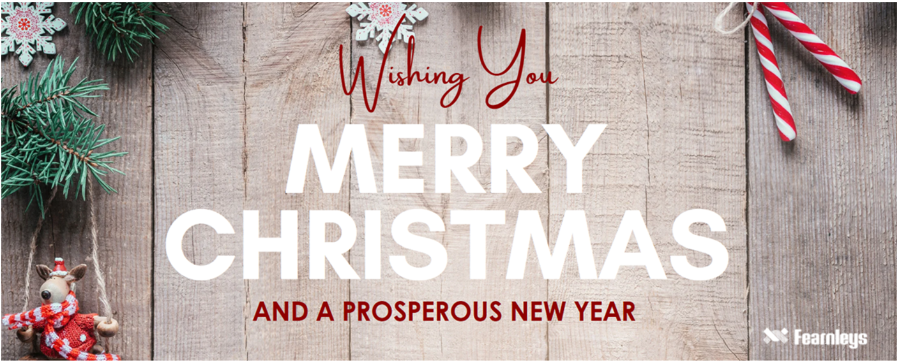
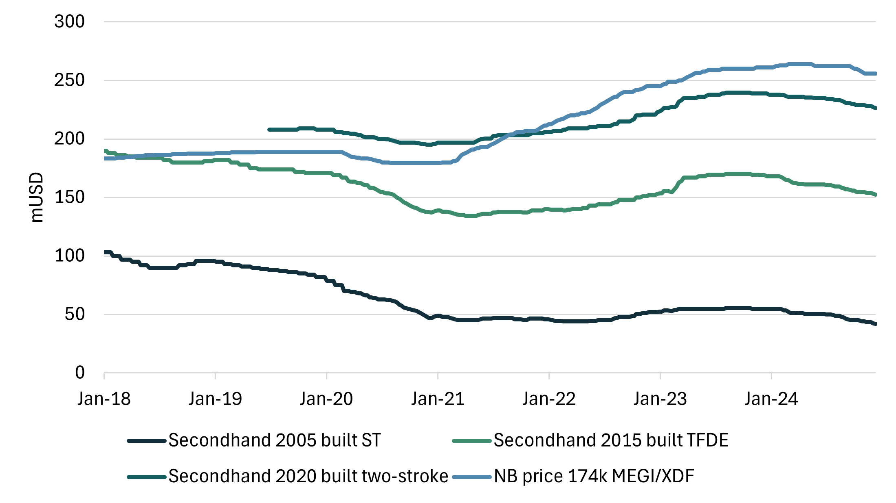
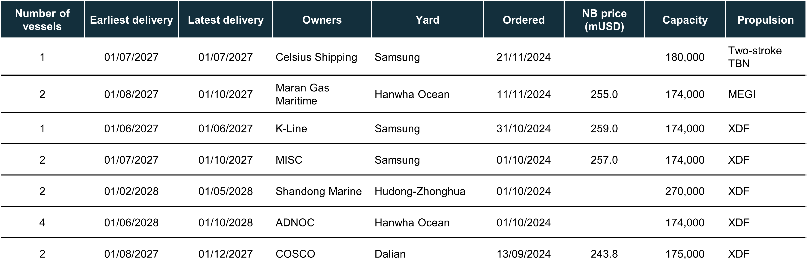
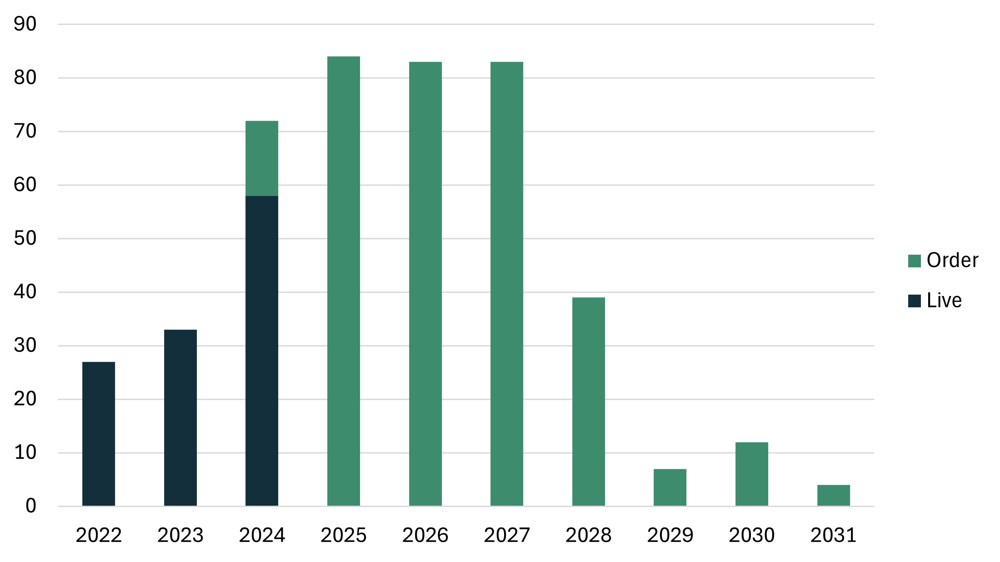
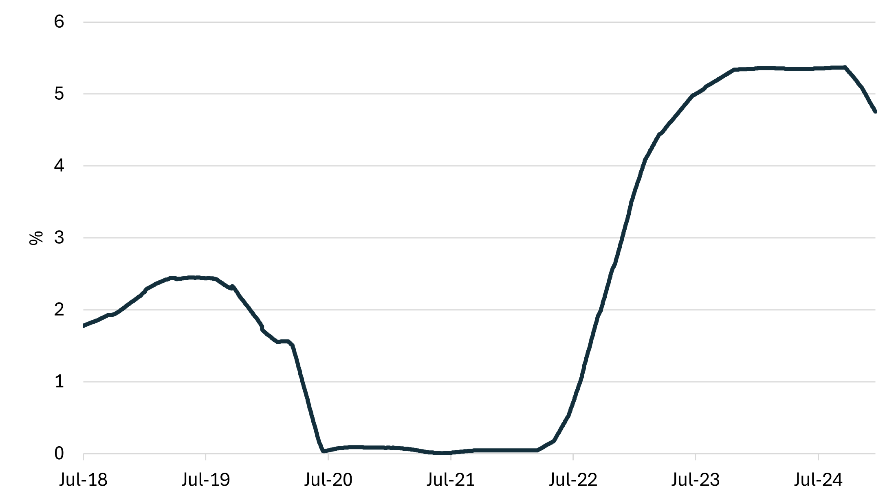
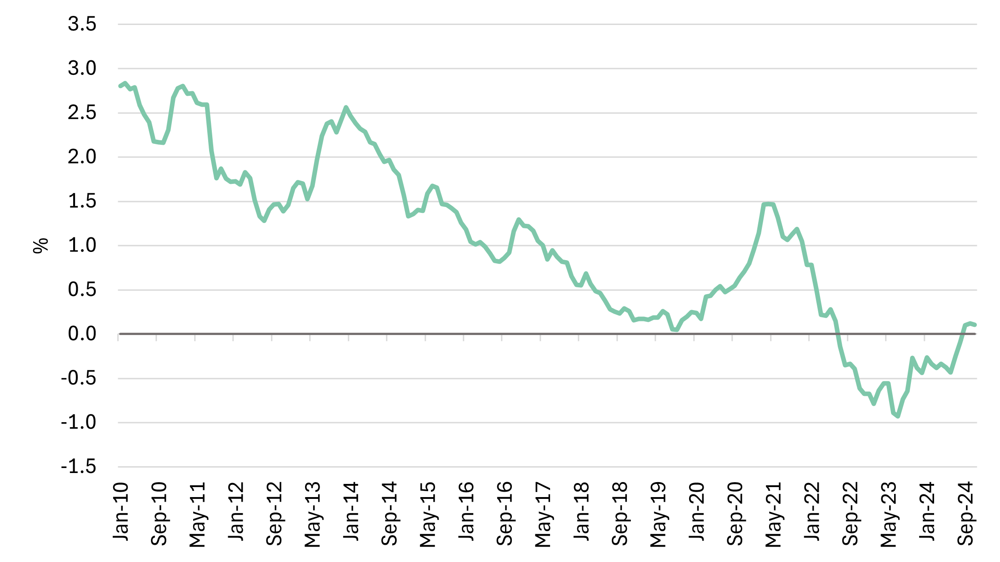

# LNG SnP report - December

**Date:** 2024-12-30 | **Department:** LNG | **Publisher:** Fearnleys AS  
**Original PDF:** [Local PDF](../pdfs/2024/2024-12-30_lng-snp-report-december-2024.pdf) | [Cloud Backup](https://pbrkapp.blob.core.windows.net/report/ef867da7-1e29-485a-a5cd-146b1d9a8e4b/report.pdf)  

---

> **Figure 1: Christmasgreeting**  
> [Local Asset](file:///C:/Users/Dell/Github/Shipping/corpus/01-brokers/fearnleys-md/images/ef867da7-1e29-485a-a5cd-146b1d9a8e4b/Christmasgreeting.png) | [Cloud Backup](https://pbrkapp.blob.core.windows.net/report/ef867da7-1e29-485a-a5cd-146b1d9a8e4b/Christmasgreeting.png)

## Market reflections

When reflecting on the year 2024 from an LNG Sale and Purchase (SNP) perspective, key aspects such as transaction volumes, fluctuations in asset values, challenges with KYC compliance, and the implementation of trading restrictions have shaped the landscape. Despite these complexities, we remain among the fortunate, navigating an industry that continues to adapt and thrive amidst shifting global dynamics.

2024 was a year of stark contrasts-a whirlwind of geopolitical tensions, devastating humanitarian crises, and glimmers of hope for a brighter future.

The ongoing conflict in Ukraine continued to cast a long shadow, with profound humanitarian consequences and destabilizing effects on the global stage. As we look to 2025, there is hope that world leaders will find pathways to de-escalation and peace.

In the Middle East, the shocking outbreak of violence underscored the fragility of peace, leaving a trail of destruction and loss while raising fears of a broader regional escalation.

Meanwhile, extreme weather events intensified by climate change wreaked havoc across the globe. Floods in India, wildfires in Canada, and droughts in Africa served as stark reminders of the urgent need for collective climate action. Each of us has a role to play in mitigating these impacts and driving positive change.

Deepening political and social divides within and between nations fueled unrest and hindered collaboration on critical global challenges, further emphasizing the need for unity in addressing shared issues.

Yet, amid these challenges, there were sparks of hope and progress:

Progress on climate action was achieved despite the difficulties. The COP28 summit in Azerbaijan saw renewed commitments to reduce emissions and invest in renewable energy and technology. The pressing question remains whether world leaders and industries will honor these commitments-and how these actions will shape the global landscape, including sectors like shipping, in the years to come.

Technological breakthroughs in artificial intelligence, medicine, and space exploration offered a glimpse of a brighter future, laying the groundwork for even greater advances in 2025.

In the face of adversity, communities around the globe displayed extraordinary resilience and solidarity. From ordinary citizens to local leaders, people stepped forward to help those in need, serving as a powerful reminder of our shared humanity.

As 2024 comes to a close, the world stands at a crossroads. The challenges ahead are significant, but so too is the potential for transformative change. Addressing global issues requires:

- Strengthened international cooperation and a renewed commitment to multilateralism.
- Prioritizing conflict prevention and resolution while addressing the root causes of violence.
- Accelerating climate action to secure a sustainable future.
- Upholding fundamental human rights and fostering a more just and equitable world.

While 2024 was marked by turbulence and uncertainty, it also highlighted the enduring power of hope, resilience, and the human spirit. As we navigate the complexities of the 21st century, let us strive together to build a more peaceful, sustainable, and just world for all.

From all of us in Fearnley LNG we thank you for the support in 2024 and look forward to continuing our good working relationship in 2025. We wish you all a Happy New Year in the coming days, and let's make 2025 a year to remember.

> **Figure 2: Recent sales**  
> [Local Asset](file:///C:/Users/Dell/Github/Shipping/corpus/01-brokers/fearnleys-md/images/ef867da7-1e29-485a-a5cd-146b1d9a8e4b/sales%20new.png) | [Cloud Backup](https://pbrkapp.blob.core.windows.net/report/ef867da7-1e29-485a-a5cd-146b1d9a8e4b/sales new.png)

> **Figure 3: Yearly sales**  
> [Local Asset](file:///C:/Users/Dell/Github/Shipping/corpus/01-brokers/fearnleys-md/images/ef867da7-1e29-485a-a5cd-146b1d9a8e4b/yrly%20sales%20new.png) | [Cloud Backup](https://pbrkapp.blob.core.windows.net/report/ef867da7-1e29-485a-a5cd-146b1d9a8e4b/yrly sales new.png)

> **Figure 4: Asset values**  
> [Local Asset](file:///C:/Users/Dell/Github/Shipping/corpus/01-brokers/fearnleys-md/images/ef867da7-1e29-485a-a5cd-146b1d9a8e4b/assetvalues.png) | [Cloud Backup](https://pbrkapp.blob.core.windows.net/report/ef867da7-1e29-485a-a5cd-146b1d9a8e4b/assetvalues.png)

## Newbuilding update

No significant changes in the New building sector since our last report. The only real question at this point in time is if someone will take a punt and secure some of the final 2027 slots or not.

> **Figure 5: Recent orders**  
> [Local Asset](file:///C:/Users/Dell/Github/Shipping/corpus/01-brokers/fearnleys-md/images/6bc6633c-97f0-4bc8-b609-5dd19e0144e6/orders2.png) | [Cloud Backup](https://pbrkapp.blob.core.windows.net/report/6bc6633c-97f0-4bc8-b609-5dd19e0144e6/orders2.png)

> **Figure 6: Deliveries incl. orderbook**  
> [Local Asset](file:///C:/Users/Dell/Github/Shipping/corpus/01-brokers/fearnleys-md/images/ef867da7-1e29-485a-a5cd-146b1d9a8e4b/deliveies.png) | [Cloud Backup](https://pbrkapp.blob.core.windows.net/report/ef867da7-1e29-485a-a5cd-146b1d9a8e4b/deliveies.png)

> **Figure 7: LNGC orders**  
> [Local Asset](file:///C:/Users/Dell/Github/Shipping/corpus/01-brokers/fearnleys-md/images/ef867da7-1e29-485a-a5cd-146b1d9a8e4b/orders%20graph.png) | [Cloud Backup](https://pbrkapp.blob.core.windows.net/report/ef867da7-1e29-485a-a5cd-146b1d9a8e4b/orders graph.png)

## Interest rates

Since our last update, the U.S. presidential election has concluded, ushering in a new leader expected to implement a series of policies and initiatives in the White House. These forthcoming changes are anticipated to significantly impact financial markets after the January inauguration.

Meanwhile, Federal Reserve Chair Jerome Powell has highlighted the difficulty of predicting future developments at this early stage. He noted, "There's nothing to model right now - it's such an early stage," further stating, "We don't guess, we don't speculate, and we don't assume." This cautious stance reflects the prevailing uncertainty regarding the economic and market outlook.
So on that note, all we can do is have a wait-and-see attitude for a little longer.

> **Figure 8: Interest rate (90 day avg. SOFR)**  
> [Local Asset](file:///C:/Users/Dell/Github/Shipping/corpus/01-brokers/fearnleys-md/images/ef867da7-1e29-485a-a5cd-146b1d9a8e4b/sofr.png) | [Cloud Backup](https://pbrkapp.blob.core.windows.net/report/ef867da7-1e29-485a-a5cd-146b1d9a8e4b/sofr.png)

> **Figure 9: 10-Year Treasury Constant Maturity Minus 2-Year Treasury Constant Maturity**  
> [Local Asset](file:///C:/Users/Dell/Github/Shipping/corpus/01-brokers/fearnleys-md/images/ef867da7-1e29-485a-a5cd-146b1d9a8e4b/10y2y.png) | [Cloud Backup](https://pbrkapp.blob.core.windows.net/report/ef867da7-1e29-485a-a5cd-146b1d9a8e4b/10y2y.png)

## Recycling

> **Figure 10: Demolition price (large tanker)**  
> [Local Asset](file:///C:/Users/Dell/Github/Shipping/corpus/01-brokers/fearnleys-md/images/ef867da7-1e29-485a-a5cd-146b1d9a8e4b/demo%20price.png) | [Cloud Backup](https://pbrkapp.blob.core.windows.net/report/ef867da7-1e29-485a-a5cd-146b1d9a8e4b/demo price.png)

## World fleet at a glance

> **Figure 11: Live fleet by propulsion**  
> [Local Asset](file:///C:/Users/Dell/Github/Shipping/corpus/01-brokers/fearnleys-md/images/ef867da7-1e29-485a-a5cd-146b1d9a8e4b/live%20by%20prop.png) | [Cloud Backup](https://pbrkapp.blob.core.windows.net/report/ef867da7-1e29-485a-a5cd-146b1d9a8e4b/live by prop.png)

> **Figure 12: Total fleet**  
> [Local Asset](file:///C:/Users/Dell/Github/Shipping/corpus/01-brokers/fearnleys-md/images/ef867da7-1e29-485a-a5cd-146b1d9a8e4b/fleet%20by%20status.png) | [Cloud Backup](https://pbrkapp.blob.core.windows.net/report/ef867da7-1e29-485a-a5cd-146b1d9a8e4b/fleet by status.png)

> **Figure 13: LNGC fleet by propulsion and delivery year**  
> [Local Asset](file:///C:/Users/Dell/Github/Shipping/corpus/01-brokers/fearnleys-md/images/ef867da7-1e29-485a-a5cd-146b1d9a8e4b/by%20prop%20and%20delivery.png) | [Cloud Backup](https://pbrkapp.blob.core.windows.net/report/ef867da7-1e29-485a-a5cd-146b1d9a8e4b/by prop and delivery.png)
