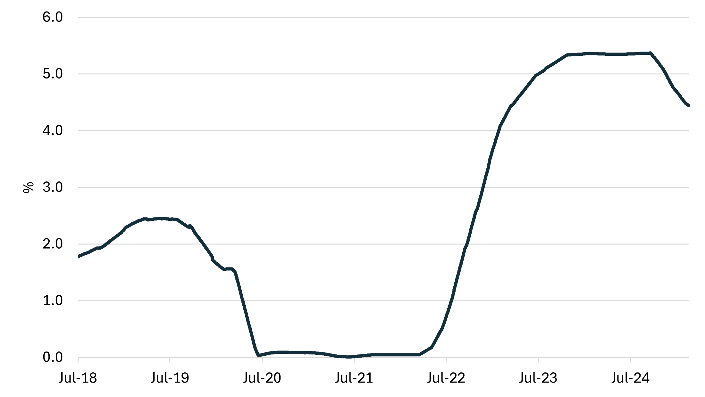
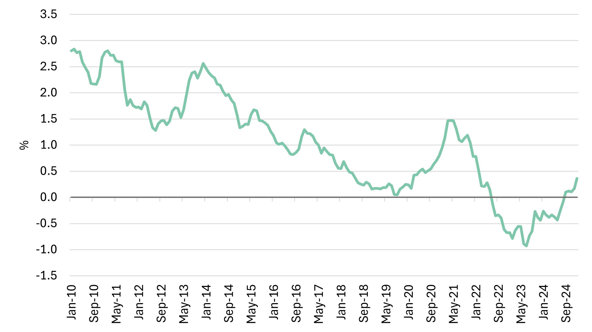

# LNG SnP report - January & February

**Date:** 2025-03-03 | **Department:** LNG | **Publisher:** Fearnleys AS  
**Original PDF:** [Download PDF](https://pbrkapp.blob.core.windows.net/report/f17a6927-c7e2-4e86-8c98-c5fcba7f3140/report.pdf)  

---

## Market reflections

The new year began with renewed interest in LNG vessel sales. The first two months have been active with rumors and movements; two vessels have found new owners, while one has been sent to the breakers. Notably, a substantial number of vessels are currently under consideration, indicating a robust pipeline of potential transactions for owners seeking to divest older tonnage. Based on current market dynamics, it is projected that an additional three to five vessel sales may be finalized shortly.

One trend among market participants is an increased focus on strategic timing for tonnage acquisition, largely attributed to the ongoing and forecast soft chartering market, particularly for older vessels. The lack of chartering opportunities is applying downward pressure on price expectations, leading to careful consideration of market entry points for potential buyers.

The market outlook remains cautiously optimistic, though. Activity in recent months suggests a healthy demand for vessels despite the challenges. The expected sale of more vessels in the near future supports this optimism. Stakeholders must stay vigilant and adaptable to navigate the complexities of market timings and price expectations in order to capitalize on emerging opportunities.

> **Figure 1: Recent sales**  
> [Local Asset](file:////home/runner/work/Shipping/Shipping/corpus/01-brokers/fearnleys-md/images/f17a6927-c7e2-4e86-8c98-c5fcba7f3140/latest%20sales.png) | [Cloud Backup](https://pbrkapp.blob.core.windows.net/report/f17a6927-c7e2-4e86-8c98-c5fcba7f3140/latest sales.png)

> **Figure 2: Yearly sales**  
> [Local Asset](file:////home/runner/work/Shipping/Shipping/corpus/01-brokers/fearnleys-md/images/f17a6927-c7e2-4e86-8c98-c5fcba7f3140/yearly%20sales.png) | [Cloud Backup](https://pbrkapp.blob.core.windows.net/report/f17a6927-c7e2-4e86-8c98-c5fcba7f3140/yearly sales.png)

> **Figure 3: Asset values**  
> [Local Asset](file:////home/runner/work/Shipping/Shipping/corpus/01-brokers/fearnleys-md/images/f17a6927-c7e2-4e86-8c98-c5fcba7f3140/asset%20values.png) | [Cloud Backup](https://pbrkapp.blob.core.windows.net/report/f17a6927-c7e2-4e86-8c98-c5fcba7f3140/asset values.png)

## Newbuilding update

The newbuilding market in general has started the year with a lack of inertia, in stark contrast to the container sector's continued activity. Across most segments, a "wait-and-see" stance prevails, with shipyards, owners, and charterers all showing caution. This uncertainty has widened the gap in pricing between yards, reflecting their varying levels of slot availability and risk appetite. Aside from notable orders from Celsius at SHI and Hanwha Shipping at their own facility, both order books and inquiry pipelines remain notably subdued.

> **Figure 4: Recent orders**  
> [Local Asset](file:////home/runner/work/Shipping/Shipping/corpus/01-brokers/fearnleys-md/images/f17a6927-c7e2-4e86-8c98-c5fcba7f3140/latest%20orders.png) | [Cloud Backup](https://pbrkapp.blob.core.windows.net/report/f17a6927-c7e2-4e86-8c98-c5fcba7f3140/latest orders.png)

> **Figure 5: Deliveries incl. orderbook**  
> [Local Asset](file:////home/runner/work/Shipping/Shipping/corpus/01-brokers/fearnleys-md/images/f17a6927-c7e2-4e86-8c98-c5fcba7f3140/yearly%20deliveries.png) | [Cloud Backup](https://pbrkapp.blob.core.windows.net/report/f17a6927-c7e2-4e86-8c98-c5fcba7f3140/yearly deliveries.png)

> **Figure 6: LNGC orders**  
> [Local Asset](file:////home/runner/work/Shipping/Shipping/corpus/01-brokers/fearnleys-md/images/f17a6927-c7e2-4e86-8c98-c5fcba7f3140/yearly%20orders.png) | [Cloud Backup](https://pbrkapp.blob.core.windows.net/report/f17a6927-c7e2-4e86-8c98-c5fcba7f3140/yearly orders.png)

## Interest rates

The flurry of activity seen since inauguration of the 47th president of the United States has had its effect on interest rates, as key benchmarks have trended lower. The implications of a potential increase in trade barriers and a more uncertain geopolitical environment is challenging the fundamental outlook on global growth, which the credit markets rapidly translate into lower interest rates.

A number of central banks have already commenced interest rate cuts (US, Eurozone), and while still citing inflation as the "guiding star" it feels as if growth prospects may become a central theme in the near-term. Of course, in the case of slower growth we can only hope that inflation tails off too, as market pundits have begun to whisper about stagflation scenarios. While our last comment included Mr. Powell's wait-and-see attitude, the sentiment seems to be more action than inaction these days and as such it would not be a surprise if we see a further slide interest rates.

> **Figure 7: Interest rate (90 day avg. SOFR)**  
> [Local Asset](file:////home/runner/work/Shipping/Shipping/corpus/01-brokers/fearnleys-md/images/f17a6927-c7e2-4e86-8c98-c5fcba7f3140/sofr.png) | [Cloud Backup](https://pbrkapp.blob.core.windows.net/report/f17a6927-c7e2-4e86-8c98-c5fcba7f3140/sofr.png)

> **Figure 8: 10-Year Treasury Constant Maturity Minus 2-Year Treasury Constant Maturity**  
> [Local Asset](file:////home/runner/work/Shipping/Shipping/corpus/01-brokers/fearnleys-md/images/f17a6927-c7e2-4e86-8c98-c5fcba7f3140/10y2y.png) | [Cloud Backup](https://pbrkapp.blob.core.windows.net/report/f17a6927-c7e2-4e86-8c98-c5fcba7f3140/10y2y.png)

## Recycling

> **Figure 9: Demolition price (large tanker)**  
> [Local Asset](file:////home/runner/work/Shipping/Shipping/corpus/01-brokers/fearnleys-md/images/ef867da7-1e29-485a-a5cd-146b1d9a8e4b/demo%20price.png) | [Cloud Backup](https://pbrkapp.blob.core.windows.net/report/ef867da7-1e29-485a-a5cd-146b1d9a8e4b/demo price.png)

## World fleet at a glance

> **Figure 10: Live fleet by propulsion**  
> [Local Asset](file:////home/runner/work/Shipping/Shipping/corpus/01-brokers/fearnleys-md/images/ef867da7-1e29-485a-a5cd-146b1d9a8e4b/live%20by%20prop.png) | [Cloud Backup](https://pbrkapp.blob.core.windows.net/report/ef867da7-1e29-485a-a5cd-146b1d9a8e4b/live by prop.png)

> **Figure 11: Total fleet**  
> [Local Asset](file:////home/runner/work/Shipping/Shipping/corpus/01-brokers/fearnleys-md/images/ef867da7-1e29-485a-a5cd-146b1d9a8e4b/fleet%20by%20status.png) | [Cloud Backup](https://pbrkapp.blob.core.windows.net/report/ef867da7-1e29-485a-a5cd-146b1d9a8e4b/fleet by status.png)

> **Figure 12: LNGC fleet by propulsion and delivery year**  
> [Local Asset](file:////home/runner/work/Shipping/Shipping/corpus/01-brokers/fearnleys-md/images/ef867da7-1e29-485a-a5cd-146b1d9a8e4b/by%20prop%20and%20delivery.png) | [Cloud Backup](https://pbrkapp.blob.core.windows.net/report/ef867da7-1e29-485a-a5cd-146b1d9a8e4b/by prop and delivery.png)
