# Fearnleys Tanker Market Wrap-up Apr 2025

**Date:** 2025-04-30 | **Department:** TANK | **Publisher:** Fearnleys AS  
**Original PDF:** [Local PDF](../pdfs/2025/2025-04-30_fearnleys-tanker-market-wrap-up-apr-2025.pdf) | [Cloud Backup](https://pbrkapp.blob.core.windows.net/report/ec3bcea6-a5e1-4786-86b5-d505e77312cd/report.pdf)  

---

## Choppier macro picture, tankers ride the waves

### Summary and outlook

In last month's report we questioned what was going to give, as fundamentals appeared stronger than rates suggested. Crude tanker rates have firmed in April, to the highest for VL, Suez and Aframax on average since January last year. Going forward, the normal seasonal downside into the summer may be counterweighed by increasing volumes from South America and OPEC+ and rates overall should remain strong for the season. 

The volatile geopolitical and macroeconomic landscape is, however, cause for concern, and gives downside risks. Although this is mostly into next year, it could also affect proceedings nearer term as greater uncertainty may deter longer-haul shipments etc.

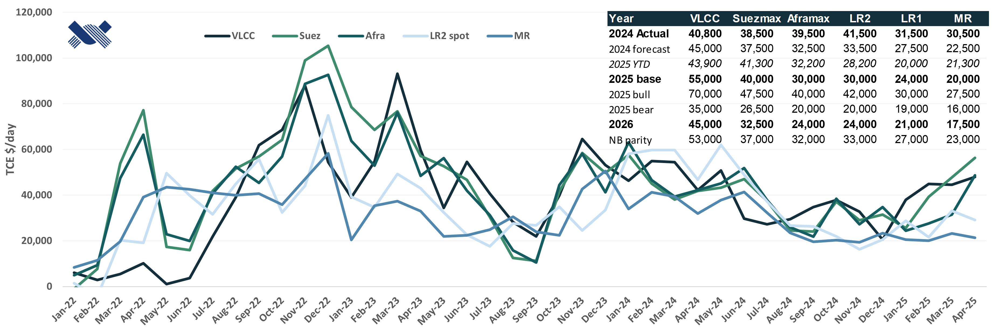

> **Figure 1: Rates and forecast**  
> [Local Asset](file:///C:/Users/Dell/Github/Shipping/corpus/01-brokers/fearnleys-md/images/ec3bcea6-a5e1-4786-86b5-d505e77312cd/rates.png) | [Cloud Backup](https://pbrkapp.blob.core.windows.net/report/ec3bcea6-a5e1-4786-86b5-d505e77312cd/rates.png)

While volumes overall have risen further in April, tonne-miles have indicatively declined slightly on less Atlantic-East movements for the biggest vessels especially. Some of that has been due to the trade wars and general uncertainty, and most recently also a narrower arbitrage. A declining Dubai physical premium suggests there may be something to the 'sources' saying that the OPEC+ will further unwind cuts in June, which will lift tanker volumes, but may reduce the West-East flow somewhat. 

Judging from crude oil in transit, there may be some more upside potential for rates, especially if volumes rise further in coming months, although a rebound for Atlantic-East trade may be needed. Product tanker rates have YTD been well supported by resilient refinery margins and relatively strong global refinery runs.

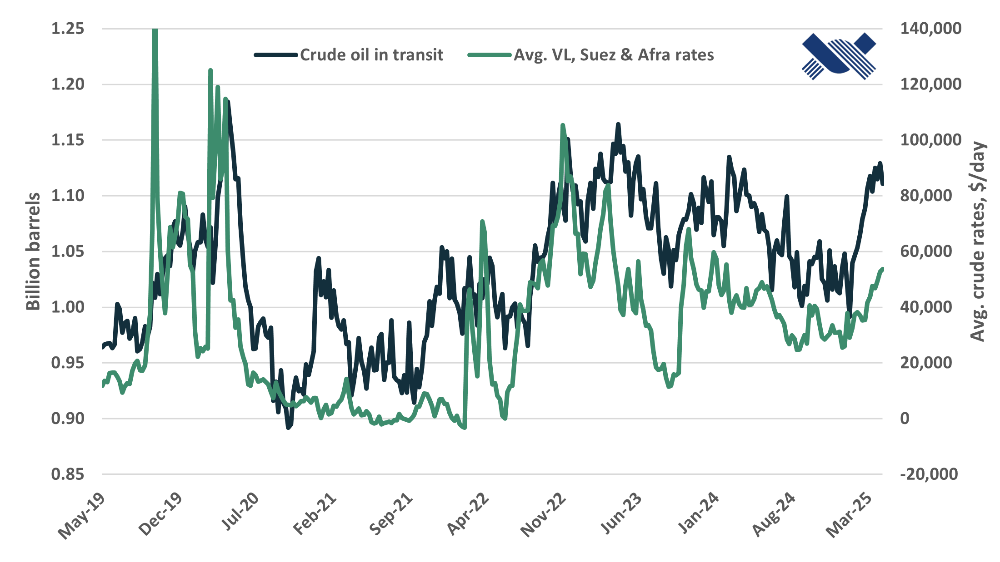

> **Figure 2: Crude oil in transit vs. crude tanker rates**  
> [Local Asset](file:///C:/Users/Dell/Github/Shipping/corpus/01-brokers/fearnleys-md/images/ec3bcea6-a5e1-4786-86b5-d505e77312cd/oow.png) | [Cloud Backup](https://pbrkapp.blob.core.windows.net/report/ec3bcea6-a5e1-4786-86b5-d505e77312cd/oow.png)

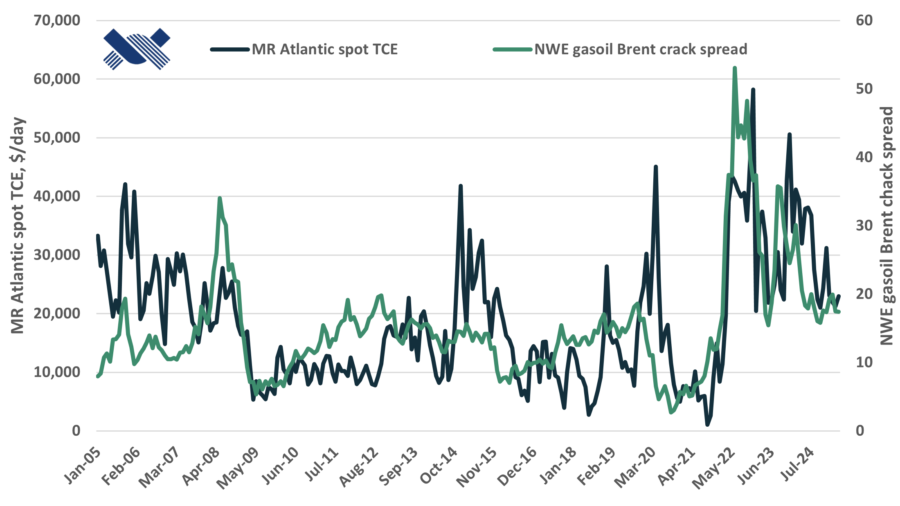

> **Figure 3: Northwest Europe crack spreads vs. MR rates**  
> [Local Asset](file:///C:/Users/Dell/Github/Shipping/corpus/01-brokers/fearnleys-md/images/ec3bcea6-a5e1-4786-86b5-d505e77312cd/mrcrack.png) | [Cloud Backup](https://pbrkapp.blob.core.windows.net/report/ec3bcea6-a5e1-4786-86b5-d505e77312cd/mrcrack.png)

### Oil and tanker demand development

Seaborne volumes have remained healthy over the last month, and there should be more to come. The OPEC+ will unwind cuts quicker than expected in May, and potentially also opt for a bigger hike in June according to 'sources'. However, between some potential compensation cuts (although, why should the over-producers all of a sudden start to comply now..?) and higher domestic consumption going forward, exports upside may be relatively small. For tanker demand, the timing and size of production increases from Brazil and Guyana will set the pace. Combined, OPEC+ increases and higher Americas production are likely to (at least partly) offset the normal seasonal downturn into the summer this year.

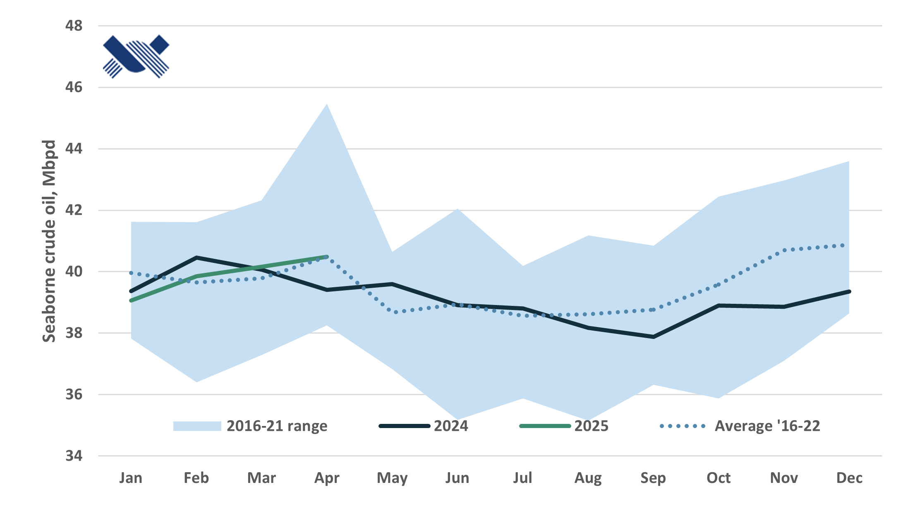

> **Figure 4: Crude tanker volumes, ex. Iran**  
> [Local Asset](file:///C:/Users/Dell/Github/Shipping/corpus/01-brokers/fearnleys-md/images/ec3bcea6-a5e1-4786-86b5-d505e77312cd/volc.png) | [Cloud Backup](https://pbrkapp.blob.core.windows.net/report/ec3bcea6-a5e1-4786-86b5-d505e77312cd/volc.png)

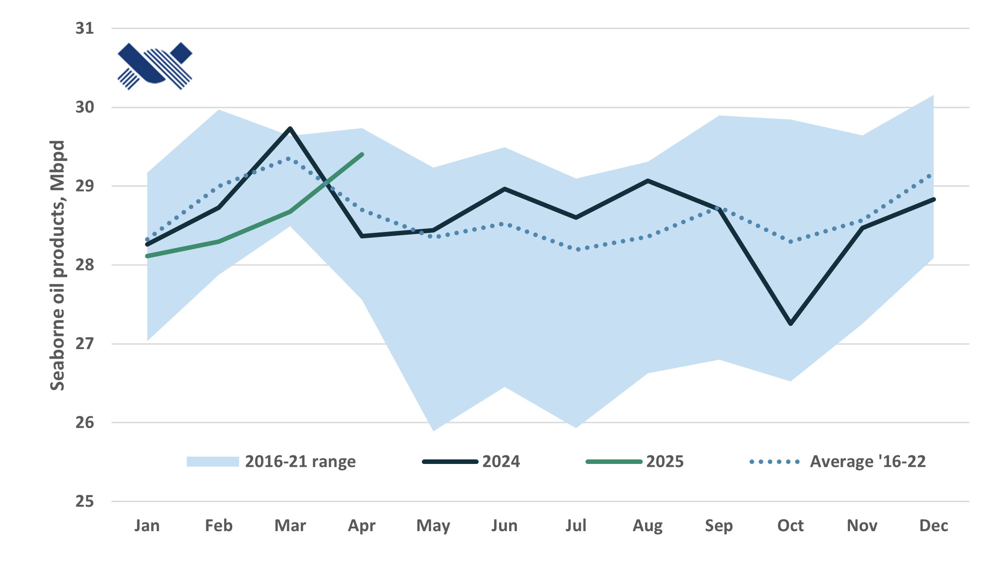

> **Figure 5: Product tanker volumes, ex. Iran**  
> [Local Asset](file:///C:/Users/Dell/Github/Shipping/corpus/01-brokers/fearnleys-md/images/ec3bcea6-a5e1-4786-86b5-d505e77312cd/volp.png) | [Cloud Backup](https://pbrkapp.blob.core.windows.net/report/ec3bcea6-a5e1-4786-86b5-d505e77312cd/volp.png)

While oil prices remain under some pressure, the physical market still looks relatively tight, with inventories flattish YTD and the forward curve still in backwardation. This contrasts with the IEA's expected 0.7 mbpd oversupplied market this year - also in Q1, and could be part of the reason why the OPEC+ is emboldened to ease cuts somewhat near-term. Next year the IEA expects the oil market to be nearly 1 mbpd oversupplied, which does not really leave room for any cut easing, suggesting other motives may be behind. 

At current prices, U.S. shale is unlikely to continue growing. Some downside is probably more likely, which could mean there is some downside risk to the IEA's estimates. However, that may also be counterweighed by negative impact on demand from U.S. tariffs unless these are walked back on or sorted in other ways. Hence, there may be downside risk to tanker volume growth next year too.

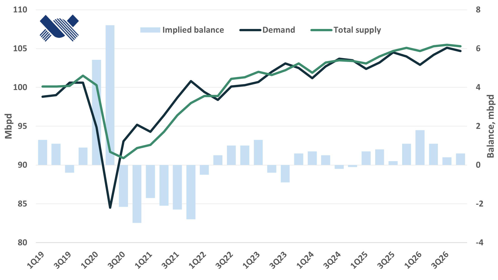

> **Figure 6: IEA oil market balance**  
> [Local Asset](file:///C:/Users/Dell/Github/Shipping/corpus/01-brokers/fearnleys-md/images/ec3bcea6-a5e1-4786-86b5-d505e77312cd/iea.png) | [Cloud Backup](https://pbrkapp.blob.core.windows.net/report/ec3bcea6-a5e1-4786-86b5-d505e77312cd/iea.png)

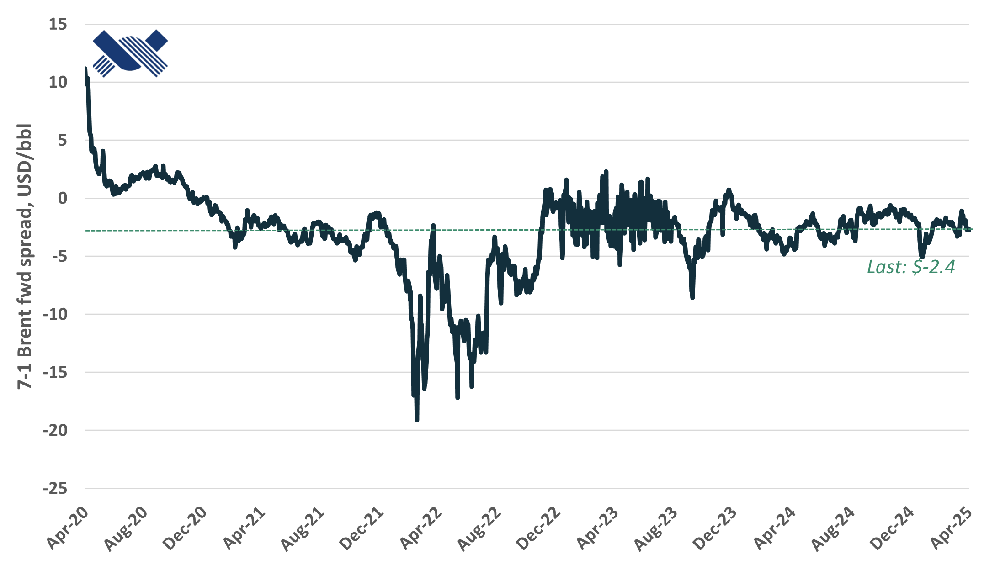

> **Figure 7: Brent 7-1 month forward spread**  
> [Local Asset](file:///C:/Users/Dell/Github/Shipping/corpus/01-brokers/fearnleys-md/images/ec3bcea6-a5e1-4786-86b5-d505e77312cd/backw.png) | [Cloud Backup](https://pbrkapp.blob.core.windows.net/report/ec3bcea6-a5e1-4786-86b5-d505e77312cd/backw.png)

Irrespective of OPEC, there is sufficient crude oil supply growth this year to support solid tanker demand growth. As has been the trend for a number of years already, oil supply grows in the West, while demand grows in the East. This year, the vast majority of Americas oil production growth is likely to come offshore, and most of it in Brazil and Guyana where four out of five shceduled FPSOs are now on field. This suggests export volumes should start to pick up within the next few months.

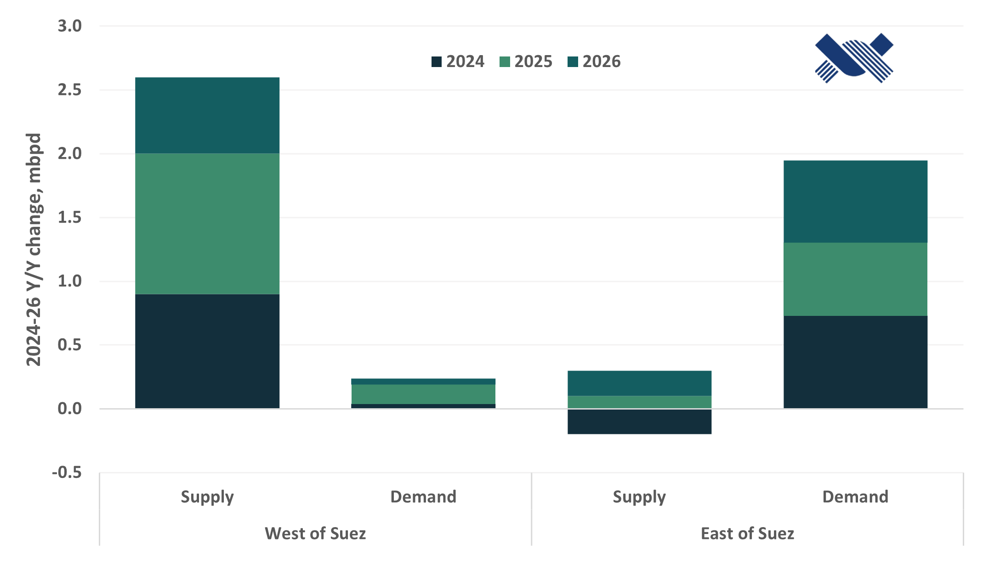

> **Figure 8: 2024-26 annual oil demand/supply growth by region**  
> [Local Asset](file:///C:/Users/Dell/Github/Shipping/corpus/01-brokers/fearnleys-md/images/ec3bcea6-a5e1-4786-86b5-d505e77312cd/change.png) | [Cloud Backup](https://pbrkapp.blob.core.windows.net/report/ec3bcea6-a5e1-4786-86b5-d505e77312cd/change.png)

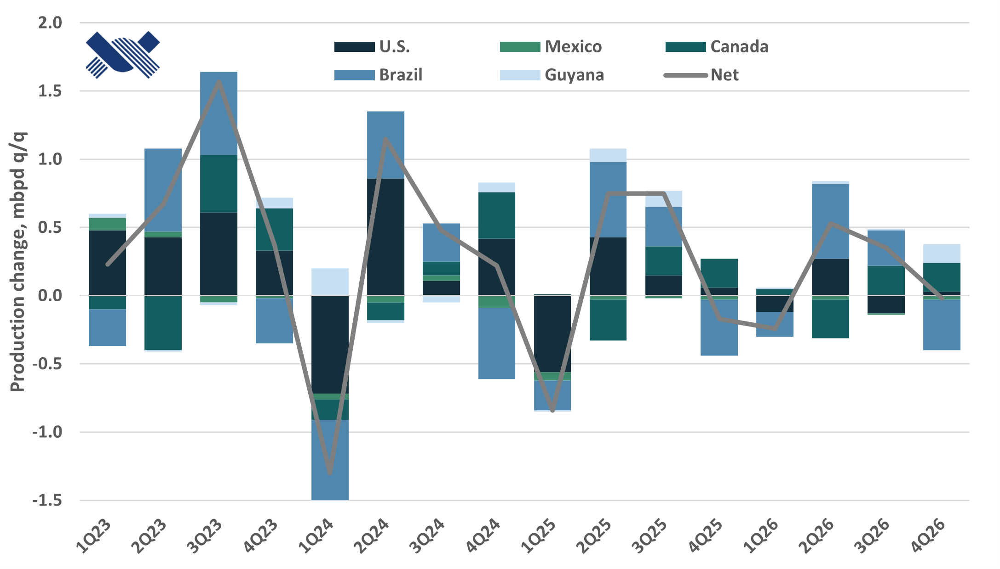

> **Figure 9: Quarterly Americas crude oil production growth**  
> [Local Asset](file:///C:/Users/Dell/Github/Shipping/corpus/01-brokers/fearnleys-md/images/ec3bcea6-a5e1-4786-86b5-d505e77312cd/supply.png) | [Cloud Backup](https://pbrkapp.blob.core.windows.net/report/ec3bcea6-a5e1-4786-86b5-d505e77312cd/supply.png)

A big part of the recent Suez- and Aframax outperformance vs. VLCCs has been driven by sanctions, where the OFAC listed fleet is no longer active in Russia, and alternatives have had to be found. Urals trade well below the G7 price cap, and as a result more compliant tonnage has entered into the Russia trade to enjoy high rates. 

On top of that, more CPC exports on Suezmaxes has been shipped to Asia, boosting tonne-miles substantially. As long as these two factors hold, rate outperformance may also hold.

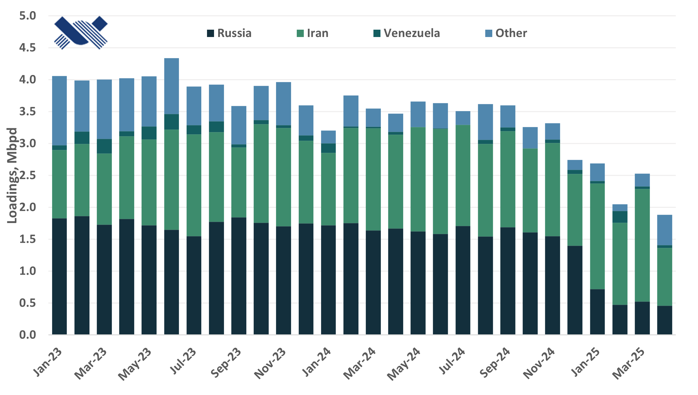

> **Figure 10: Loadings on OFAC listed vessels**  
> [Local Asset](file:///C:/Users/Dell/Github/Shipping/corpus/01-brokers/fearnleys-md/images/ec3bcea6-a5e1-4786-86b5-d505e77312cd/ofac.png) | [Cloud Backup](https://pbrkapp.blob.core.windows.net/report/ec3bcea6-a5e1-4786-86b5-d505e77312cd/ofac.png)

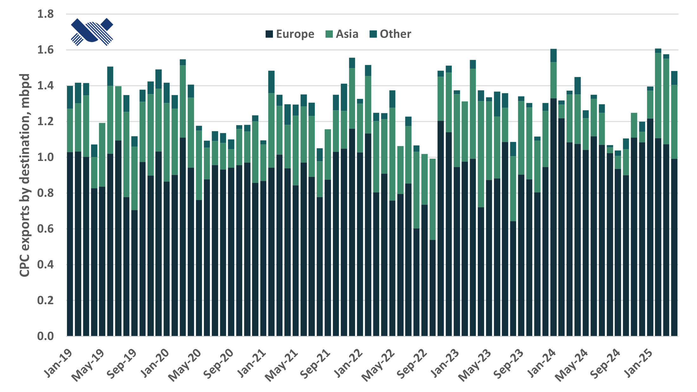

> **Figure 11: CPC exports by destination**  
> [Local Asset](file:///C:/Users/Dell/Github/Shipping/corpus/01-brokers/fearnleys-md/images/ec3bcea6-a5e1-4786-86b5-d505e77312cd/cpc.png) | [Cloud Backup](https://pbrkapp.blob.core.windows.net/report/ec3bcea6-a5e1-4786-86b5-d505e77312cd/cpc.png)

### Fleet development

While deliveries are set to pick up this year, the overall delivery tally is still relatively low in a historical context. Next year fleet growth will pick up further, which coupled with lower demand growth potential means a gradually softening tanker market balance.

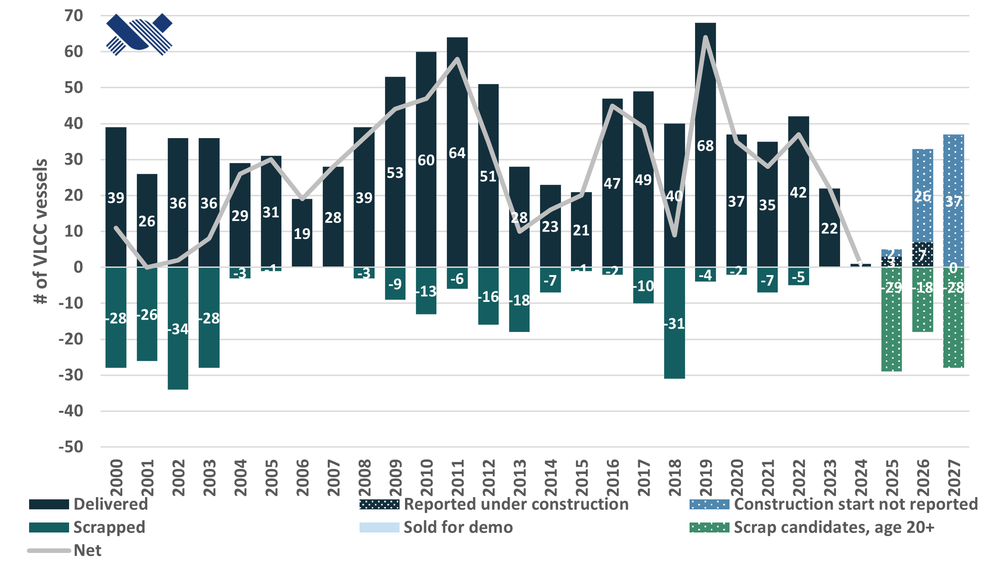

> **Figure 12: VLCC annual deliveries and phase-out**  
> [Local Asset](file:///C:/Users/Dell/Github/Shipping/corpus/01-brokers/fearnleys-md/images/ec3bcea6-a5e1-4786-86b5-d505e77312cd/delvl.png) | [Cloud Backup](https://pbrkapp.blob.core.windows.net/report/ec3bcea6-a5e1-4786-86b5-d505e77312cd/delvl.png)

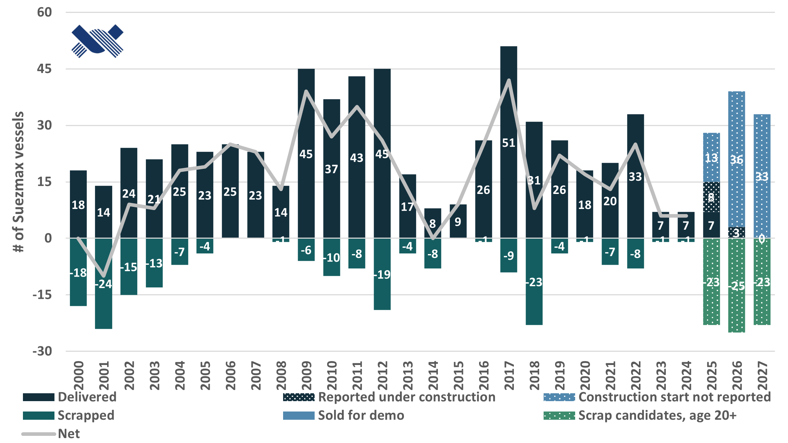

> **Figure 13: Suezmax annual deliveries and phase-out**  
> [Local Asset](file:///C:/Users/Dell/Github/Shipping/corpus/01-brokers/fearnleys-md/images/ec3bcea6-a5e1-4786-86b5-d505e77312cd/dels.png) | [Cloud Backup](https://pbrkapp.blob.core.windows.net/report/ec3bcea6-a5e1-4786-86b5-d505e77312cd/dels.png)

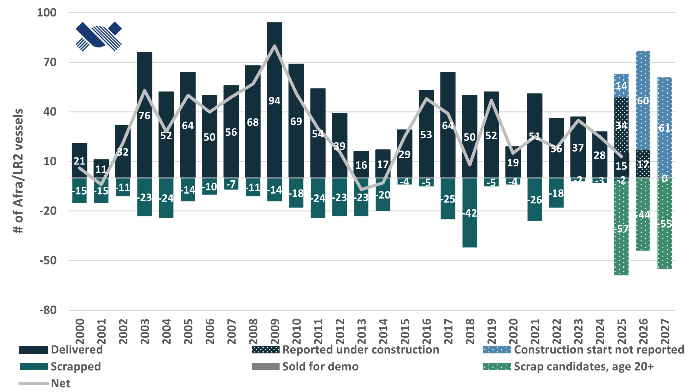

> **Figure 14: Afra/LR2 annual deliveries and phase-out**  
> [Local Asset](file:///C:/Users/Dell/Github/Shipping/corpus/01-brokers/fearnleys-md/images/ec3bcea6-a5e1-4786-86b5-d505e77312cd/dela.png) | [Cloud Backup](https://pbrkapp.blob.core.windows.net/report/ec3bcea6-a5e1-4786-86b5-d505e77312cd/dela.png)

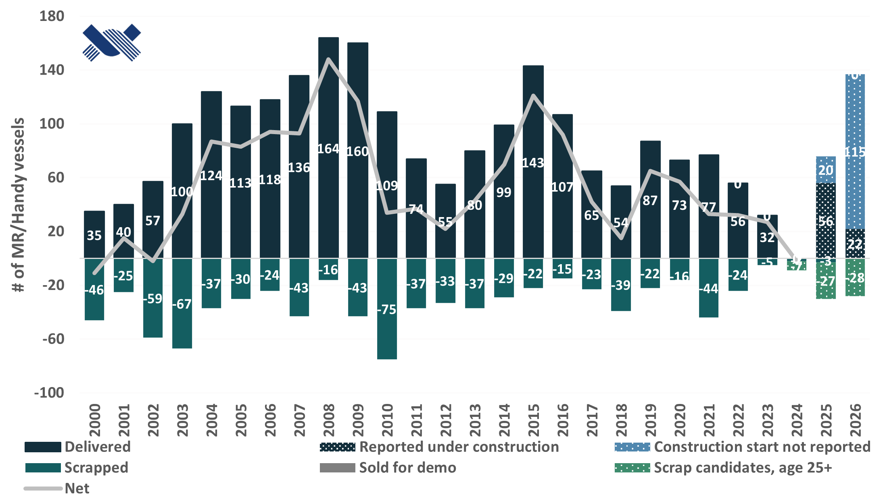

> **Figure 15: MR/Handy annual deliveries and phase-out**  
> [Local Asset](file:///C:/Users/Dell/Github/Shipping/corpus/01-brokers/fearnleys-md/images/ec3bcea6-a5e1-4786-86b5-d505e77312cd/delm.png) | [Cloud Backup](https://pbrkapp.blob.core.windows.net/report/ec3bcea6-a5e1-4786-86b5-d505e77312cd/delm.png)

Ordering has picked up slightly, or the reporting of orders has, so that the annualised ordering pace YTD is slightly above the historical average. It does seem like ordering interest is much lower than over the last couple of years, so unless yards meaningfully drop prices, there should not be another wave this year. Given relatively long backlogs, however, there should not be an urgency for yards to do that.. 

Scrapping has also picked up somewhat vs. the last couple of years, and given reports of plenty more vessels sold or offered for scrap there should be more to come, despite continued strong rates. The real decider for scrapping pace this year will likely be whether waivers are given for sanctioned vessels to be scrapped... It is at least interesting to note the relatively high interest for 2005-10 built VLCCs and Suezmaxes from 'undisclosed buyers,' which may suggest a renewal of the shadow fleet may be in the cards.

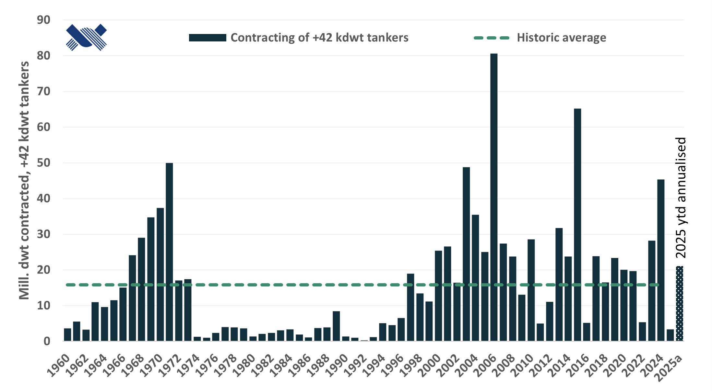

> **Figure 16: Annual tanker orders, +42k dwt**  
> [Local Asset](file:///C:/Users/Dell/Github/Shipping/corpus/01-brokers/fearnleys-md/images/ec3bcea6-a5e1-4786-86b5-d505e77312cd/order.png) | [Cloud Backup](https://pbrkapp.blob.core.windows.net/report/ec3bcea6-a5e1-4786-86b5-d505e77312cd/order.png)

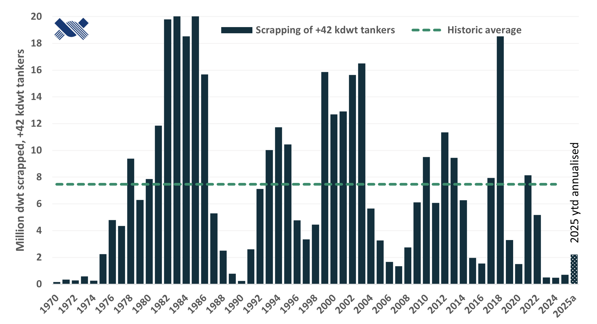

> **Figure 17: Annual tanker demolition, +42k dwt**  
> [Local Asset](file:///C:/Users/Dell/Github/Shipping/corpus/01-brokers/fearnleys-md/images/ec3bcea6-a5e1-4786-86b5-d505e77312cd/scrap.png) | [Cloud Backup](https://pbrkapp.blob.core.windows.net/report/ec3bcea6-a5e1-4786-86b5-d505e77312cd/scrap.png)
