# LNG Shipping - Quarterly Report Q2 2025

**Date:** 2025-07-04 | **Department:** LNG | **Publisher:** Fearnleys AS  
**Original PDF:** [Download PDF](https://pbrkapp.blob.core.windows.net/report/8325cf1a-b24a-4243-bf8a-0baf96ef331e/report.pdf)  

---

## Summary

To say that the shipping market is on a recovering path may be premature, but rates have seen a steady upwards - albeit bumpy - trend through the quarter. It is the first time since 2016 (excluding the market disruption in 2022 caused by the Russia/Ukraine conflict) that rates in Q2 have been higher than in Q1. However, that is more a testament as to how depressed Q1 really was. Moving into Q2, steady spot activityarose from a growth in LNG demand in the Atlantic/Mediterranean (Argentina, Egypt), tonnage being pulled from the spot market in advance of project startups (Canada LNG), the long-awaited commercial production from following Calcasieu Pass and Plaquemines towards end of Q1, and buyers reacting to a higher level of geopolitical uncertainty all combine to a slightly more optimistic near-term sentiment. That said, the fundamentals remain challenging and a reminder that freight should remain attractive for the coming year(s). Newbuild deliveries continues and based on the mismatching of pending start-ups and delivery schedules, we should not be surprised to see an erratic freight market through the next 12 months.

LNG prices in Europe and Asia largely traded in tandem throughout the quarter together with uncle crude, fluctuating between US$ 10-15/MMBtu. Initially dropping as crude fell on news of excess OPEC supply, there was a sharp turnaround on the geopolitical uncertainty erupting as the Israel-Iran conflict escalated. With no major regional events impacting product pricing, the arbitrage has been largely shut during the quarter. It is peculiar though that refilling of European gas storage is only at 58.9% as of 30th June; some 10% below the 5-year average and 18% below the 2024-level at the same time. Add to the mix a desire by the EU to phase out Russian LNG (which continues to flow into European countries), we should be in for an interesting second half of 2025.

The spot market has continued to see high activity, with the second consecutive quarter seeing 100+ spot fixtures (<90 days) concluded. While it keeps Owners, Charterers and brokers alike busy, it also highlights how the growth in volumes and ships on the water will drive the market to more short-term business activity. Another relevant observation during Q2 was the steep increase in short-term (<3 years) fixtures concluded by Owners as opposed to sublets, at 39% compared to Q1 at 26%. This suggests that Charterers are redelivering vessels as opposed to declaring what are likely out-of-the-money options.

We count 17 vessels delivered during the quarter, on par with the 16 delivered in Q1…leaving another 66 to go for the year according to our orderbook (of which nine are for Arctic LNG-2). To put that in context, it would imply an LNG carrier delivering every three days for the remainder of the year. Realistically, we do expect slippage of 2025-tonnage into 2026, with the driver being Owners delaying delivery to match better against delivery to charterers/projects. Although shipyards have been busy delivering ships, the new orders have been sparse with five vessels reported ordered during the quarter - taking the YTD tally to only eight. On the recycling side, four vessels were sold for their final voyage and the average age of vessels scrapped in 2025 is just shy of 25 years. There is no shortage of older vessels being circulated for sale, but with real/qualified buyers scarce on the ground we maintain the view that scrapping will become increasingly relevant for Owners with steam turbine tonnage coming off long-term charters, as prompt business for these ladies to continue trading is minimal. The fleet now stands at 718 vessels with 25 in layup and 298 still in the orderbooks. We note that our layup count has increased by seven over the course of the second quarter and expect this trend to continue - coinciding with our view on scrapping activity.

Despite the uncertainty created around US LNG export projects from an overzealous USTR, there were three FIDs during the quarter - two in the US breaking the drought: Woodside with Louisiana LNG (16.5mtpa with first LNG in 2029) and Cheniere announcing T8-9 at Corpus Christi (3mtpa with first LNG in 2028), which also includes debottlenecking on back of three firm offtake agreements. Golar also announced FID on their 2.4mtpa Hilli FLNG unit to Argentina starting 2027.

> **Figure 1: Spot charter rates and JKM**  
> [Local Asset](file:////home/runner/work/Shipping/Shipping/corpus/01-brokers/fearnleys-md/images/8325cf1a-b24a-4243-bf8a-0baf96ef331e/Spot%2BJKM.jpg) | [Cloud Backup](https://pbrkapp.blob.core.windows.net/report/8325cf1a-b24a-4243-bf8a-0baf96ef331e/Spot+JKM.jpg)

## Charter Rates

The average spot rate for a two-stroke in Q2 came in at US$ 30k/day; down 47% compared to Q2 2024. Rates hit a low of around US$ 20k/day in late-April before staging a comeback heading into July at US$ 46k/day. A clear premium on West developed over the quarter, reversing the marginal premium seen in the East during Q1and for much of 2024. Two-stroke tonnage in the West averaged US$ 34k/day vs US$ 25k/day in East. We are back to a level where Owners are not just covering OPEX (Q1 2025 average was US$17k), but there remains little left for contributions to equity. Although the fundamentals suggest a tough market ahead for Owners, we highlight the price sensitivity to end-users and the uncertainty of trade flows into H2 2025 potentially pointing to some risk to the upside on rates.

While it is rough sailing to be an owner of a two-stroke, its even rougher for those with TFDES as Q2 2025 average came in at US$ 16k/day - essentially covering OPEX. For steam turbines the reported average was US$ 3k/day, if managing to secure employment.

We see an increasing divergence between two-strokes and TFDE/DFDE/STs where Charterers have ample modern, fuel-efficient tonnage to chose from, and older propulsion types regularly get cut out of the equation in tenders. The frustration amongst Owners of TFDE/DFDE/ST is fully understandable and acknowledged, but sometimes a stop-loss can be a way to avoid the risk of long-term pain.

In the term market, 1-year deals for two-strokes are currently fixed in the US$ high-40s/day, up from US$ mid-30s/day at end of Q1. Liquidity in Q2 was predominantly centered around short-term (<90 days), as the bid-offer spread is a little wide for 3-yrs and 5-yrs. An interesting perspective here though is the implied curve, suggesting years 2 and 3 at around US$ high-60ss/day and years 4 and 5 at around US$ mid-80s/day. Hence, doing a 5-yr deal today taking us into mid-2030 should be an attractive position for Charterers. The flipside of that is Owners potentially looking to take some short-term pain over giving away upside and optionality in the medium-term.

> **Figure 2: Two-stroke spot charter rates (East/West)**  
> [Local Asset](file:////home/runner/work/Shipping/Shipping/corpus/01-brokers/fearnleys-md/images/8325cf1a-b24a-4243-bf8a-0baf96ef331e/2ST_East%26West.jpg) | [Cloud Backup](https://pbrkapp.blob.core.windows.net/report/8325cf1a-b24a-4243-bf8a-0baf96ef331e/2ST_East&West.jpg)

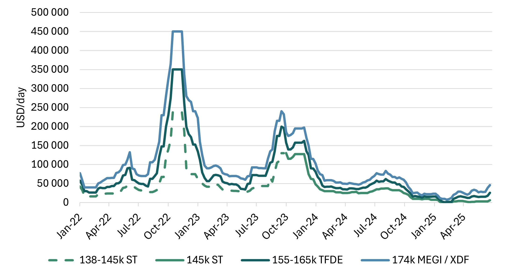

> **Figure 3: Average spot charter rates**  
> [Local Asset](file:////home/runner/work/Shipping/Shipping/corpus/01-brokers/fearnleys-md/images/8325cf1a-b24a-4243-bf8a-0baf96ef331e/All_sizes_Spot_Avg.jpg) | [Cloud Backup](https://pbrkapp.blob.core.windows.net/report/8325cf1a-b24a-4243-bf8a-0baf96ef331e/All_sizes_Spot_Avg.jpg)

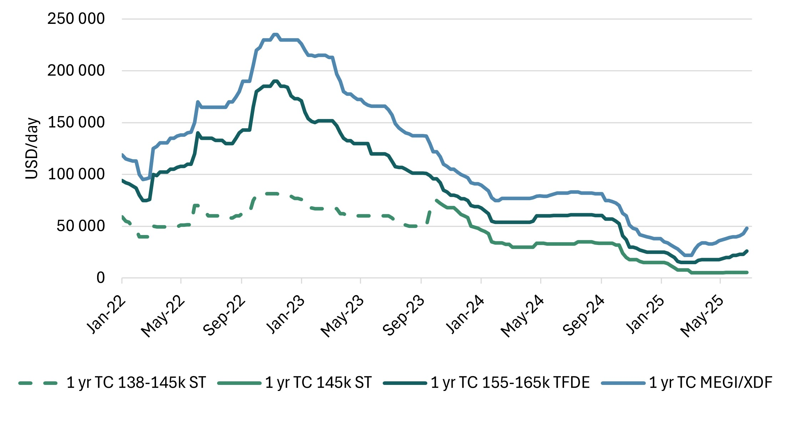

> **Figure 4: 1-year charter rates**  
> [Local Asset](file:////home/runner/work/Shipping/Shipping/corpus/01-brokers/fearnleys-md/images/8325cf1a-b24a-4243-bf8a-0baf96ef331e/1_YR_All_Sizes.jpg) | [Cloud Backup](https://pbrkapp.blob.core.windows.net/report/8325cf1a-b24a-4243-bf8a-0baf96ef331e/1_YR_All_Sizes.jpg)

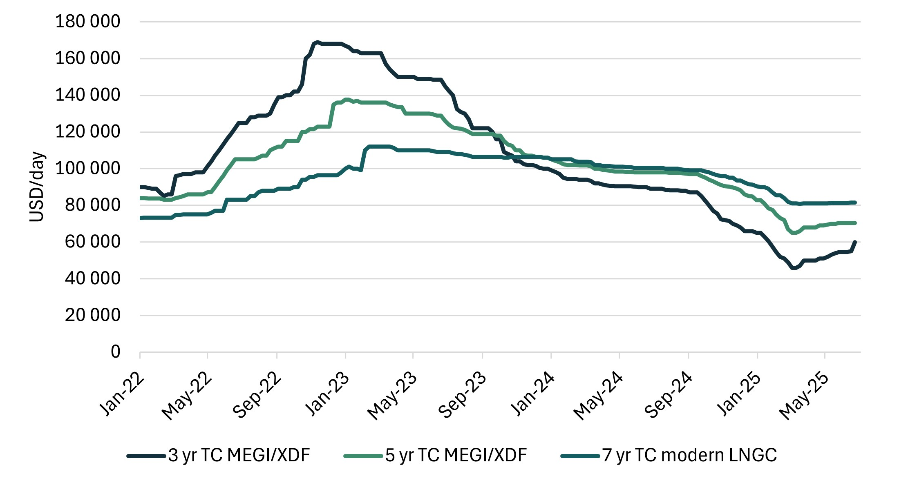

> **Figure 5: Term charter rates (two-stroke)**  
> [Local Asset](file:////home/runner/work/Shipping/Shipping/corpus/01-brokers/fearnleys-md/images/8325cf1a-b24a-4243-bf8a-0baf96ef331e/2ST_LT.jpg) | [Cloud Backup](https://pbrkapp.blob.core.windows.net/report/8325cf1a-b24a-4243-bf8a-0baf96ef331e/2ST_LT.jpg)

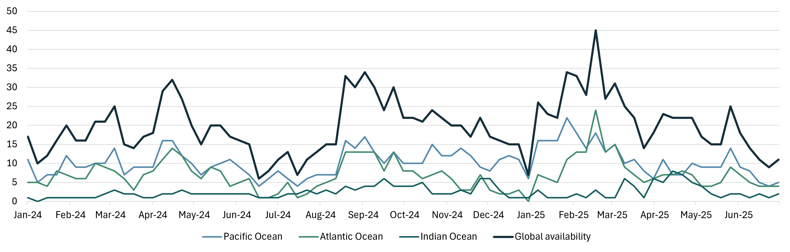

> **Figure 6: Prompt LNGC availability**  
> [Local Asset](file:////home/runner/work/Shipping/Shipping/corpus/01-brokers/fearnleys-md/images/8325cf1a-b24a-4243-bf8a-0baf96ef331e/AVAILABILITY.jpg) | [Cloud Backup](https://pbrkapp.blob.core.windows.net/report/8325cf1a-b24a-4243-bf8a-0baf96ef331e/AVAILABILITY.jpg)

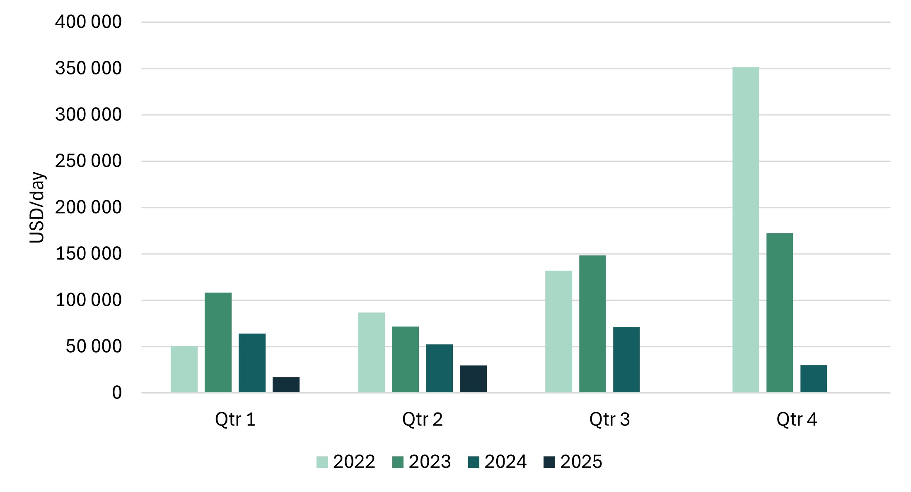

> **Figure 7: Quarterly spot charter rates (two-stroke)**  
> [Local Asset](file:////home/runner/work/Shipping/Shipping/corpus/01-brokers/fearnleys-md/images/8325cf1a-b24a-4243-bf8a-0baf96ef331e/2ST_QTR.jpg) | [Cloud Backup](https://pbrkapp.blob.core.windows.net/report/8325cf1a-b24a-4243-bf8a-0baf96ef331e/2ST_QTR.jpg)

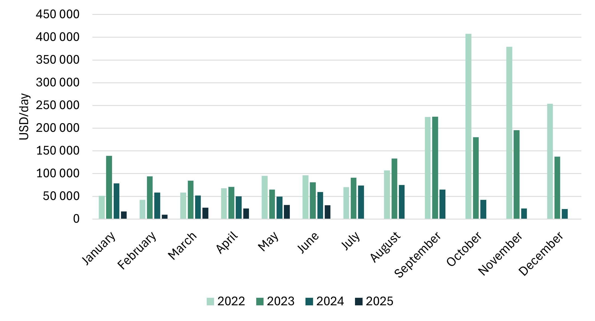

> **Figure 8: Monthly spot charter rates (two-stroke)**  
> [Local Asset](file:////home/runner/work/Shipping/Shipping/corpus/01-brokers/fearnleys-md/images/8325cf1a-b24a-4243-bf8a-0baf96ef331e/2ST_MTHLY.jpg) | [Cloud Backup](https://pbrkapp.blob.core.windows.net/report/8325cf1a-b24a-4243-bf8a-0baf96ef331e/2ST_MTHLY.jpg)

> **Figure 9: Quarterly spot charter rates (TFDE)**  
> [Local Asset](file:////home/runner/work/Shipping/Shipping/corpus/01-brokers/fearnleys-md/images/8325cf1a-b24a-4243-bf8a-0baf96ef331e/TFDE_QTR.jpg) | [Cloud Backup](https://pbrkapp.blob.core.windows.net/report/8325cf1a-b24a-4243-bf8a-0baf96ef331e/TFDE_QTR.jpg)

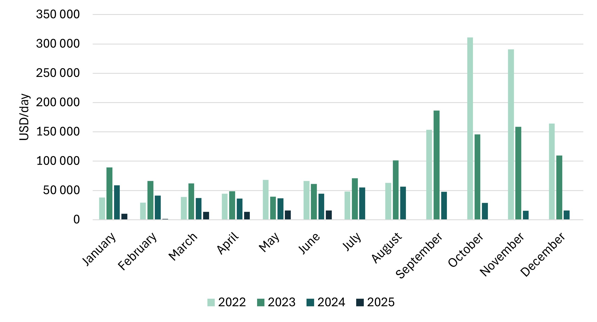

> **Figure 10: Monthly spot charter rates (TFDE)**  
> [Local Asset](file:////home/runner/work/Shipping/Shipping/corpus/01-brokers/fearnleys-md/images/8325cf1a-b24a-4243-bf8a-0baf96ef331e/TFDE_MTHLY.jpg) | [Cloud Backup](https://pbrkapp.blob.core.windows.net/report/8325cf1a-b24a-4243-bf8a-0baf96ef331e/TFDE_MTHLY.jpg)

## Chartering Activity

The quarterly number of spot fixtures was close to the all-time high (on record) with 106 short-term fixtures concluded. This is marginally below the 118 recorded in Q1. Looking at days fixed on spot, the average duration is flat Q-o-Q at around 21 days, which is still up on the average duration of <90-day charters for the past two years.

On multi-month, we recorded 15 fixtures in Q2 with the average duration being just short of 6 months - suggesting Owners may be more interested in having the vessel back ahead of the winter period. For up-to-3yr deals the quarter was weak at only 5 fixtures identified, albeit for longer periods (around 1.5 yrs on average) compared to what was done in Q1 and throughout 2024.

We are seeing more Charterers looking for longer term deals, potentially as their high-priced charters done a few years back are coming to an end, and they are incentivized to redeliver rather than declaring out-of-the-money options. There is also an increase in tender activity which we expect to materialize in H2 2025 and result in medium-/long-term charters.

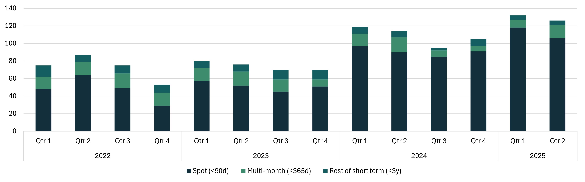

> **Figure 11: Short-term fixture activity (< 3 years)**  
> [Local Asset](file:////home/runner/work/Shipping/Shipping/corpus/01-brokers/fearnleys-md/images/8325cf1a-b24a-4243-bf8a-0baf96ef331e/ST_FIX_WIDE.jpg) | [Cloud Backup](https://pbrkapp.blob.core.windows.net/report/8325cf1a-b24a-4243-bf8a-0baf96ef331e/ST_FIX_WIDE.jpg)

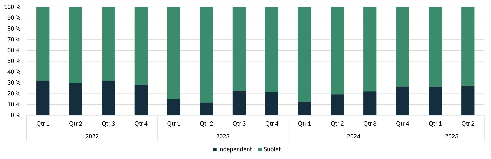

> **Figure 12: Short term fixtures by sublet vs independent owners**  
> [Local Asset](file:////home/runner/work/Shipping/Shipping/corpus/01-brokers/fearnleys-md/images/8325cf1a-b24a-4243-bf8a-0baf96ef331e/INDEP_SUBLET_2.jpg) | [Cloud Backup](https://pbrkapp.blob.core.windows.net/report/8325cf1a-b24a-4243-bf8a-0baf96ef331e/INDEP_SUBLET_2.jpg)

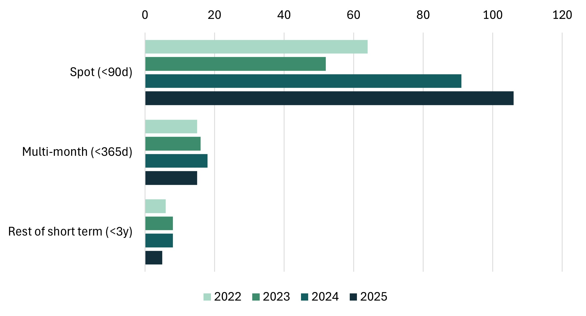

> **Figure 13: Short-term fixtures Q2 (count)**  
> [Local Asset](file:////home/runner/work/Shipping/Shipping/corpus/01-brokers/fearnleys-md/images/8325cf1a-b24a-4243-bf8a-0baf96ef331e/ST_FIX_QTR_COUNT.jpg) | [Cloud Backup](https://pbrkapp.blob.core.windows.net/report/8325cf1a-b24a-4243-bf8a-0baf96ef331e/ST_FIX_QTR_COUNT.jpg)

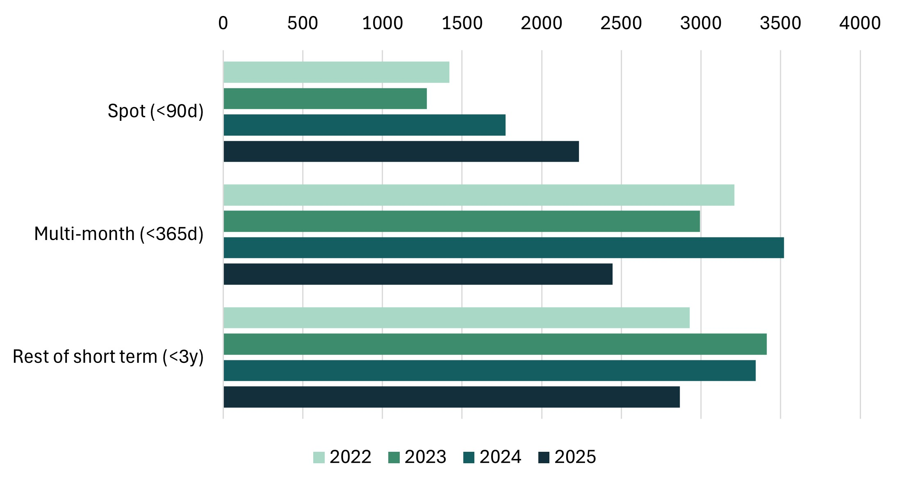

> **Figure 14: Short-term fixtures Q2 (fixed days)**  
> [Local Asset](file:////home/runner/work/Shipping/Shipping/corpus/01-brokers/fearnleys-md/images/8325cf1a-b24a-4243-bf8a-0baf96ef331e/ST_FIX_QTR_DAYS.jpg) | [Cloud Backup](https://pbrkapp.blob.core.windows.net/report/8325cf1a-b24a-4243-bf8a-0baf96ef331e/ST_FIX_QTR_DAYS.jpg)

## Trade Flows

A total of 107MT of LNG was loaded in Q2 2025, a touch down from the all-time high of 110MT in Q1, but up 7MT Y-o-Y (vs Q2 2024). Continued ramp-up of Plaquemines together with restored production from Nigeria, full production from Freeport, start-up of Gimi FLNG at Greater Tortue and Calcasieu Pass ramp-up were the largest contributors from Q1. On the other side of the spectrum, maintenance at Malaysia LNG, Hammerfest and Qatar LNG as well as lower volumes out of Sabine Pass and Cameron drove volumes down from the highs. US production was at 27MT for the quarter, representing 25% of global LNG supply and expected to continue growing. With Canada joining the list of LNG exporting countries and first cargo leaving LNG Canada at the very end of the quarter, we expect to finally see monthly loadings cross the 40MT mark by year-end.

On the receiving end, Chinese imports have dropped 3.5MT Y-o-Y with also Japan, Thailand and India pulling back, while European buyers including France, Belgium and Italy are growing imports. Egypt is also back in the mix of active buyers and expected to become even more active with a small armada of FSRUs getting ready to operate.

In terms of trade flows, more US LNG is heading towards Asia, with 18% of US volumes passing the Cape of Good Hope and adding to tonne-miles. Alas, it is still substantially below the 35% seen in Q2 2024 and the lack of recovery in US-Asia volumes is clearly a negative for the shipping market. One positive is that the Panama Canal is largely unutilized, so anything going East from US does the long-haul. Qatari volumes to Asia also reached the highest level on record in June with 85% - also not helping voyage distances in the overall tonne-mile demand.

It is becoming increasingly clear that two-strokes are favored for the long-hauls as 65% (51% in Q2 2024) of all Atlantic loadings go onboard the MEGI/MEGA/XDF-fleet. TFDEs account for 20% (27% in Q2 2024) while STs take the remaining 15% (22% in Q2 2024). The Y-o-Y development highlights both how the influx of new vessels and unit freight cost displaces less efficient tonnage.

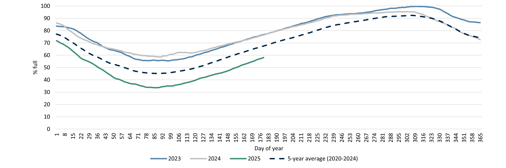

> **Figure 15: EU storage levels**  
> [Local Asset](file:////home/runner/work/Shipping/Shipping/corpus/01-brokers/fearnleys-md/images/8325cf1a-b24a-4243-bf8a-0baf96ef331e/EU_STORAGE3.jpg) | [Cloud Backup](https://pbrkapp.blob.core.windows.net/report/8325cf1a-b24a-4243-bf8a-0baf96ef331e/EU_STORAGE3.jpg)

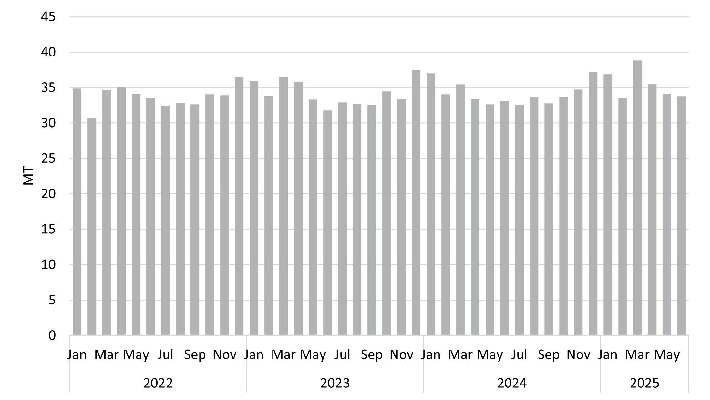

> **Figure 16: Loaded LNG**  
> [Local Asset](file:////home/runner/work/Shipping/Shipping/corpus/01-brokers/fearnleys-md/images/8325cf1a-b24a-4243-bf8a-0baf96ef331e/LOADED.jpg) | [Cloud Backup](https://pbrkapp.blob.core.windows.net/report/8325cf1a-b24a-4243-bf8a-0baf96ef331e/LOADED.jpg)

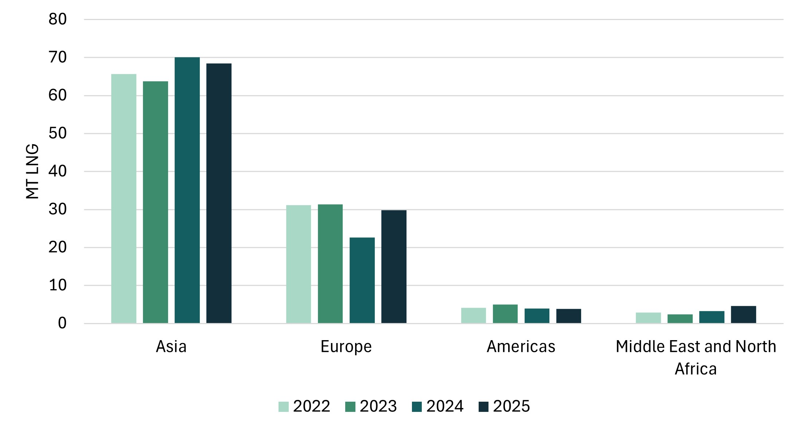

> **Figure 17: Q2 imports by region**  
> [Local Asset](file:////home/runner/work/Shipping/Shipping/corpus/01-brokers/fearnleys-md/images/8325cf1a-b24a-4243-bf8a-0baf96ef331e/LOADED_BY_DEMAND_REGION.jpg) | [Cloud Backup](https://pbrkapp.blob.core.windows.net/report/8325cf1a-b24a-4243-bf8a-0baf96ef331e/LOADED_BY_DEMAND_REGION.jpg)

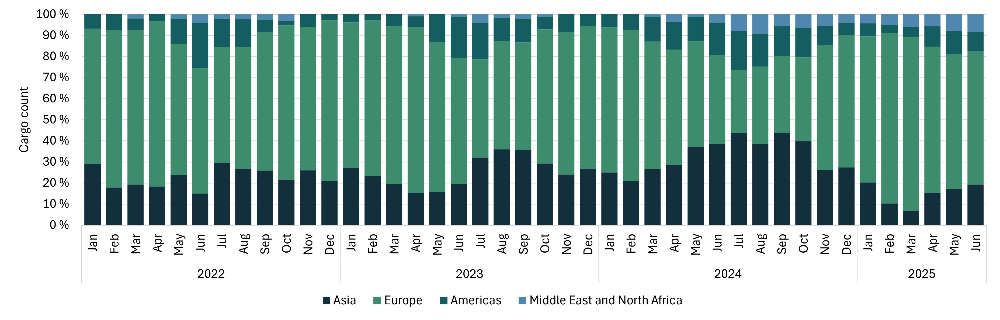

> **Figure 18: Destination of US LNG**  
> [Local Asset](file:////home/runner/work/Shipping/Shipping/corpus/01-brokers/fearnleys-md/images/8325cf1a-b24a-4243-bf8a-0baf96ef331e/US_LNG_DESTINATION.jpg) | [Cloud Backup](https://pbrkapp.blob.core.windows.net/report/8325cf1a-b24a-4243-bf8a-0baf96ef331e/US_LNG_DESTINATION.jpg)

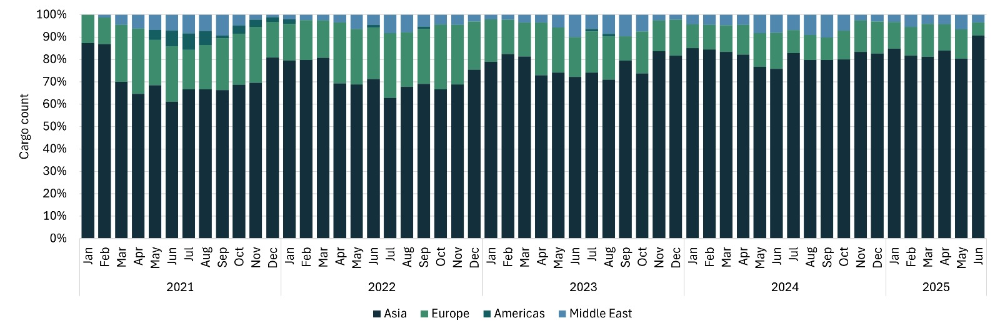

> **Figure 19: Destination of Qatar LNG**  
> [Local Asset](file:////home/runner/work/Shipping/Shipping/corpus/01-brokers/fearnleys-md/images/8325cf1a-b24a-4243-bf8a-0baf96ef331e/QAT_LNG_DESTINATION_2.jpg) | [Cloud Backup](https://pbrkapp.blob.core.windows.net/report/8325cf1a-b24a-4243-bf8a-0baf96ef331e/QAT_LNG_DESTINATION_2.jpg)

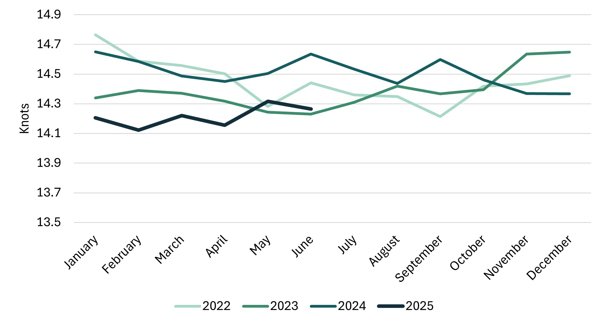

> **Figure 20: Average fleet speed (speeds > 6 knots)**  
> [Local Asset](file:////home/runner/work/Shipping/Shipping/corpus/01-brokers/fearnleys-md/images/8325cf1a-b24a-4243-bf8a-0baf96ef331e/SPEED_AVG.jpg) | [Cloud Backup](https://pbrkapp.blob.core.windows.net/report/8325cf1a-b24a-4243-bf8a-0baf96ef331e/SPEED_AVG.jpg)

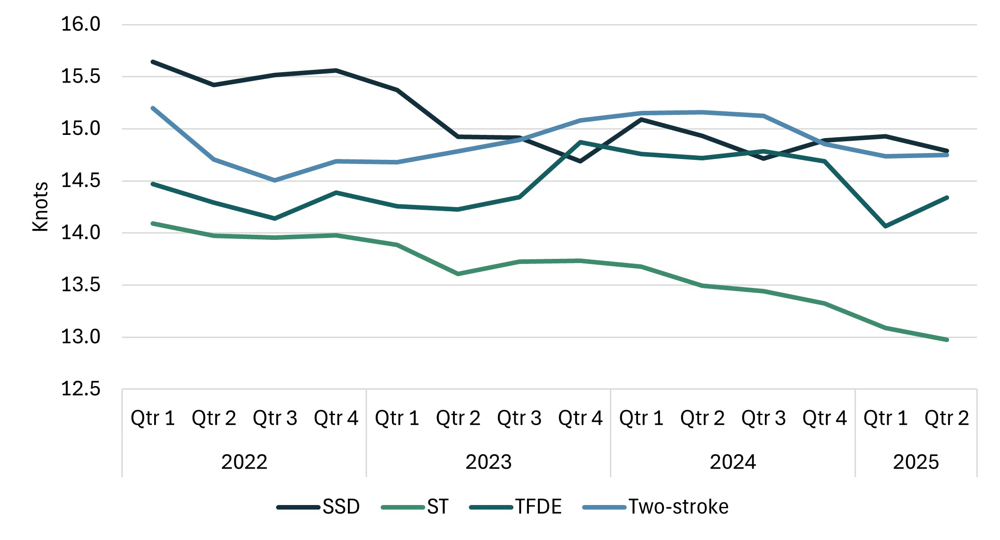

> **Figure 21: Average fleet speed by propulsion (speeds > 6 knots)**  
> [Local Asset](file:////home/runner/work/Shipping/Shipping/corpus/01-brokers/fearnleys-md/images/8325cf1a-b24a-4243-bf8a-0baf96ef331e/SPEED_AVG_PROP.jpg) | [Cloud Backup](https://pbrkapp.blob.core.windows.net/report/8325cf1a-b24a-4243-bf8a-0baf96ef331e/SPEED_AVG_PROP.jpg)

## LNGC Fleet

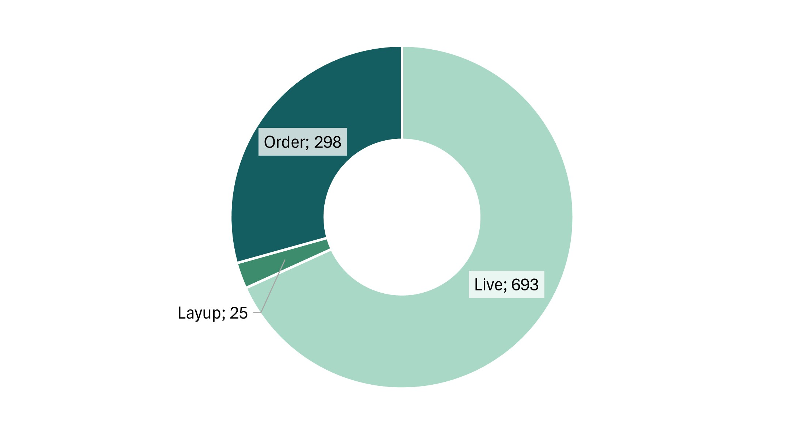

> **Figure 22: LNGC fleet by status**  
> [Local Asset](file:////home/runner/work/Shipping/Shipping/corpus/01-brokers/fearnleys-md/images/8325cf1a-b24a-4243-bf8a-0baf96ef331e/LNGC_FLEET_STATUS.jpg) | [Cloud Backup](https://pbrkapp.blob.core.windows.net/report/8325cf1a-b24a-4243-bf8a-0baf96ef331e/LNGC_FLEET_STATUS.jpg)

89 ships are currently on order in China, or 30% of the orderbook, with 55 at Hudong-Zhonghua. From our latest data, 26 ships in the orderbook are without charters, of which two deliver this year, 11 in 2026 and 13 in 2027. Although yards are happy with the backlog still, available slots will be for Q2 2028 delivery, and from there on - there is plenty of capacity. While we do not anticipate a full-on rush to yards from Owners, the number of potential tenders for both project and replacement programs suggests we will see more activity in H2 2025.

On the recycling front, another four vessels were sold for scrap during the quarter and with seven vessels now done for the year, 2025 will likely not only be a record for deliveries - but also for scrapping. It's a pity we're prone to see around 80 vessels delivered and far less scrapped. That said, we expect to see a shift in mentality with Owners in possession of steam turbines as they are marginalized in the freight market and the pace and magnitude of FSRU/FSU projects is not able to soak up all open tonnage. Scrapping age will most certainly remain well below the 35-40yr average seen in the past decade.

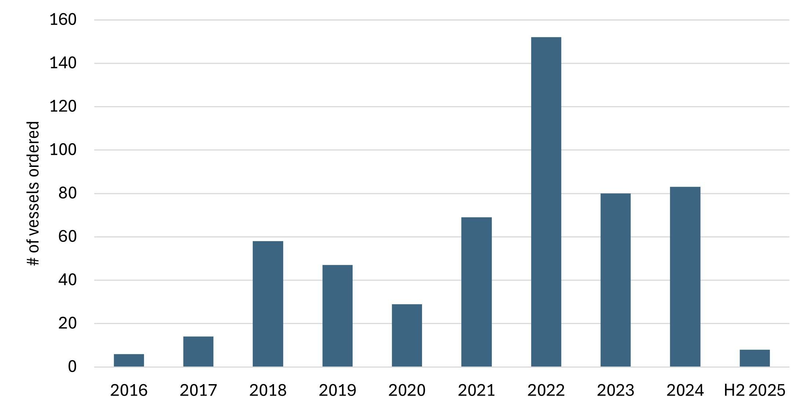

> **Figure 23: LNGC orders**  
> [Local Asset](file:////home/runner/work/Shipping/Shipping/corpus/01-brokers/fearnleys-md/images/8325cf1a-b24a-4243-bf8a-0baf96ef331e/LNGC_ORDERS_PLACED.jpg) | [Cloud Backup](https://pbrkapp.blob.core.windows.net/report/8325cf1a-b24a-4243-bf8a-0baf96ef331e/LNGC_ORDERS_PLACED.jpg)

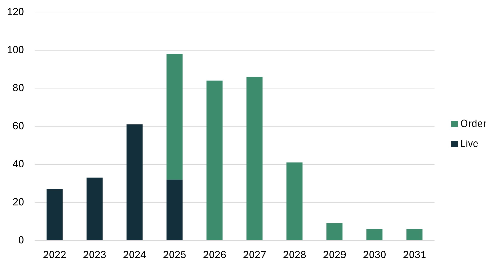

> **Figure 24: LNGC deliveries**  
> [Local Asset](file:////home/runner/work/Shipping/Shipping/corpus/01-brokers/fearnleys-md/images/8325cf1a-b24a-4243-bf8a-0baf96ef331e/OB_DELIVERIED_FORDELIVERY.jpg) | [Cloud Backup](https://pbrkapp.blob.core.windows.net/report/8325cf1a-b24a-4243-bf8a-0baf96ef331e/OB_DELIVERIED_FORDELIVERY.jpg)

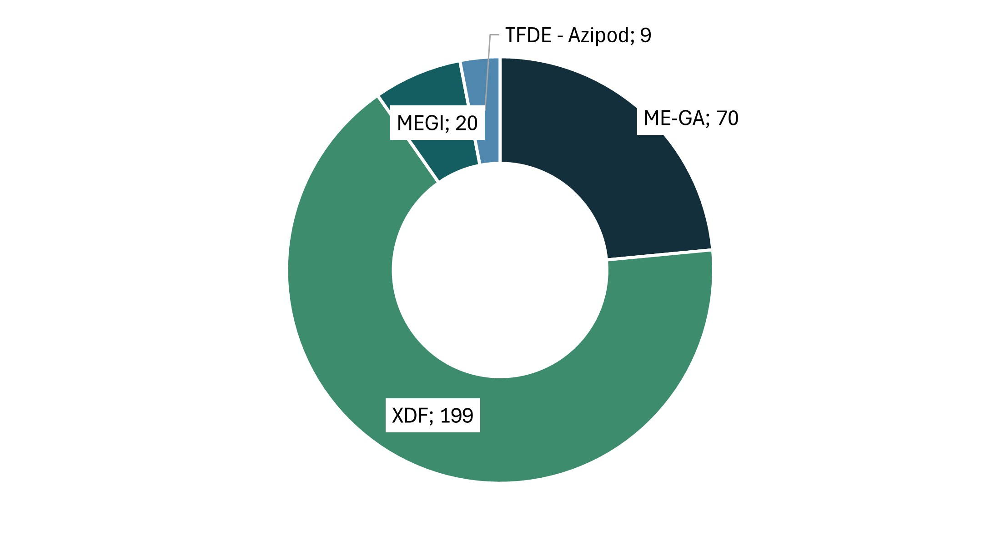

> **Figure 25: Orderbook by propulsion**  
> [Local Asset](file:////home/runner/work/Shipping/Shipping/corpus/01-brokers/fearnleys-md/images/8325cf1a-b24a-4243-bf8a-0baf96ef331e/OB_BY_PROP.jpg) | [Cloud Backup](https://pbrkapp.blob.core.windows.net/report/8325cf1a-b24a-4243-bf8a-0baf96ef331e/OB_BY_PROP.jpg)

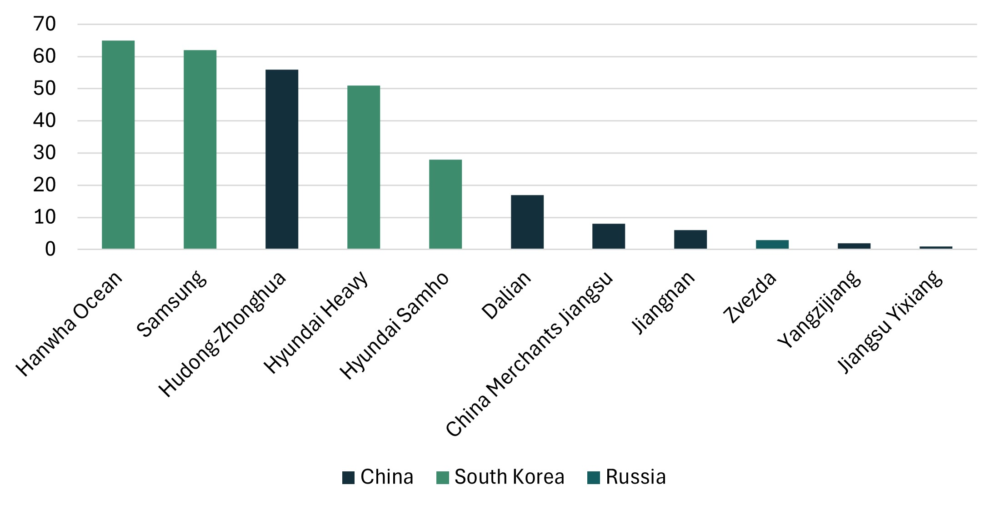

> **Figure 26: Orderbook by yard**  
> [Local Asset](file:////home/runner/work/Shipping/Shipping/corpus/01-brokers/fearnleys-md/images/8325cf1a-b24a-4243-bf8a-0baf96ef331e/OB_BY_YRD_CTRY.jpg) | [Cloud Backup](https://pbrkapp.blob.core.windows.net/report/8325cf1a-b24a-4243-bf8a-0baf96ef331e/OB_BY_YRD_CTRY.jpg)

The S&P market has been relatively subdued thus far in 2025 with the majority of transactions involving older tonnage with variable quality of buyers as KYC remains a focus. Asset values have come off further during the quarter across steam turbine, TDFE and two-strokes, but the gap between willing buyers and willing sellers needs to narrow.

Acquiring entities (that do pass KYC) tends to be focused on tonnage for project work on both steam turbines and TFDEs - which makes sense given the activity seen in the FSRU/FSU market. For two-strokes the discussions are fewer and further between.

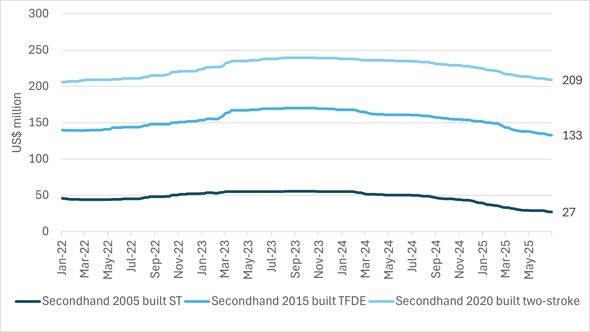

> **Figure 27: Asset values: Secondhand prices**  
> [Local Asset](file:////home/runner/work/Shipping/Shipping/corpus/01-brokers/fearnleys-md/images/8325cf1a-b24a-4243-bf8a-0baf96ef331e/SH_PRICES.jpg) | [Cloud Backup](https://pbrkapp.blob.core.windows.net/report/8325cf1a-b24a-4243-bf8a-0baf96ef331e/SH_PRICES.jpg)

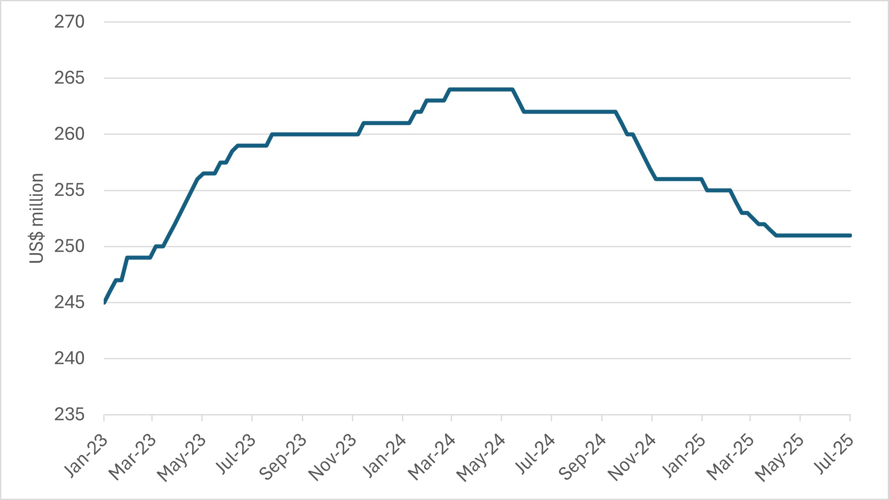

> **Figure 28: Asset values: Newbuild price (174kcbm 2-stroke)**  
> [Local Asset](file:////home/runner/work/Shipping/Shipping/corpus/01-brokers/fearnleys-md/images/8325cf1a-b24a-4243-bf8a-0baf96ef331e/NB_PRICE.jpg) | [Cloud Backup](https://pbrkapp.blob.core.windows.net/report/8325cf1a-b24a-4243-bf8a-0baf96ef331e/NB_PRICE.jpg)

## Outlook

The multi-billion dollar question we get asked (several times) daily is: when could the market tighten? Based on our supply/demand balance (with all the caveats that come with forecasting), the fundamentals show a broadly soft market through into 2027, and finally a real tightening materializing in 2028. This is the base case from Fearnleys, and as always trade volumes and flows can have material impacts on the market tightness. A widening of arbitrages absorbing more tonnage on US-Asia could be enough for rates to nudge higher - at least for a period of time. Another factor is whether the ships ordered to serve Qatar North Field Expansion, and Qatar Energy's share in Golden Pass, will be made available in the market when vessel deliveries occur earlier than volume start-ups. There are talks of some of these vessels being deferred for delivery which would help the market balance.

Another major question mark is how the vintage vessel fleet phase out will play out? While we take the view that "25 is the new 35" in terms of scrapping age, the inertia of LNGCs being sold to the breakers has historically been high. Owners of LNGCs seem at times to misprice the option cost of keeping technologically obsolete tonnage on the books. If the scrapping age drops to 20 years (which is a major step for owners, scrap yards and accounting teams alike) that would contribute to materially reduce fleet capacity. However, it should be clear that the transportation work done by the steam turbine fleet is diminishing - our forecasting is based on an "all vessels are created equal" in terms of utilization - which may itself offer some relief through layups which never return to market.

New FIDs will inevitably play a vital role for future shipping demand, and US FIDs are especially important. Seeing Japanese players ink up on major long-term SPAs underpins our view of continued growth in sailing distances and shipping requirements. Although Chinese demand growth is expected to continue, we see an increasing share of future LNG demand to be absorbed by emerging Asian markets. This adds, if nothing else, to the distance part of the tonne-mile equation.

However, our intelligence suggests a good flow of tender activity from a broad range of market participants, which will keep yards busy. For the time being, yards are pricing newbuilds at relatively high levels which underpin long-term charter deals in the US$ mid-/high-80s/day - deterring some Owners as returns are not sufficiently attractive. Fast-forward 12 months with limited order intake and yards may have a slightly softer stance which may entice Owners to fill the late-2028 and 2029 slots - potentially extending the time of a fundamental market recovery.

While our outlook may be a sobering one, it is important to keep in mind that LNG is the fastest growing fossil fuel and that the growth in supply is set to grow by a whopping 50% by 2030 (vs 2024) according to S&P Platts. That is the equivalent of some 200+MT of LNG which must be moved. The near-term pain will drive older tonnage out of the market as scrapping is a function of a bad market (and not a catalyst for boom times), which means that Owners need to hold on tight, focus on keeping OPEX in check and maintain a strong relationship with the banks. Charterers on their side should be positioned to pick up attractive deals - after having paid the price a few years back.

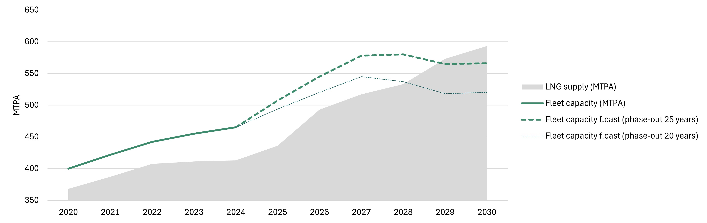

> **Figure 29: Fleet balance (at phase-out ages of 20 and 25 years)**  
> [Local Asset](file:////home/runner/work/Shipping/Shipping/corpus/01-brokers/fearnleys-md/images/8325cf1a-b24a-4243-bf8a-0baf96ef331e/S_D_BALANCE.jpg) | [Cloud Backup](https://pbrkapp.blob.core.windows.net/report/8325cf1a-b24a-4243-bf8a-0baf96ef331e/S_D_BALANCE.jpg)
