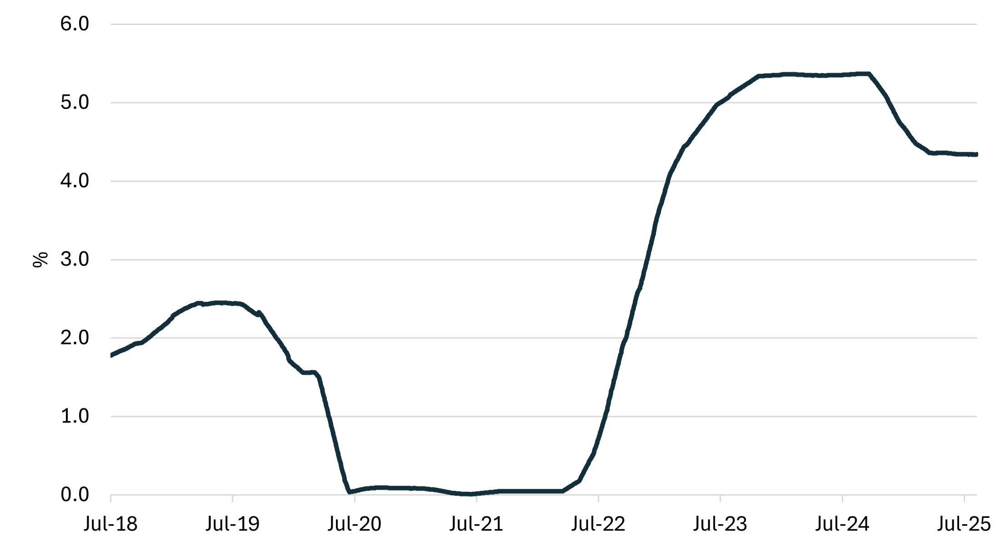
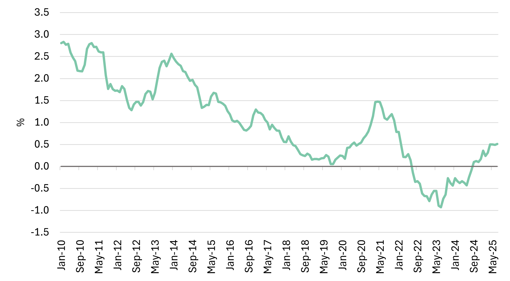

# LNG SnP report - June & July

**Date:** 2025-08-07 | **Department:** LNG | **Publisher:** Fearnleys AS  
**Original PDF:** [Download PDF](https://pbrkapp.blob.core.windows.net/report/e726f5d2-513f-4f95-945f-97ffbedb63e1/report.pdf)  

---

## Market reflections

The LNG S&P market is undergoing a notable transformation this year. Initial expectations for a robust second-hand market have been tempered by constant changes stemming from the United States, which have created a complex and sometimes unpredictable environment-a veritable "old-fashioned stew." This mix of ingredients-from decisions on recycling and refinancing to new KYC requirements and volatile interest rates-has created some truly interesting market "tastes."

Since our last report, these dynamics have been demonstrated by several key developments. We have seen discussions surrounding a modern vessel being refinanced through a Japanese Leasing structure, the confirmation of four additional vessels sold for recycling (bringing the total to ten), and multiple instances of vessels being placed on and off "subs." In these cases, buyers have shown a looser interpretation of MOAs than their formal terms, with cultural nuances and ultimate beneficial ownership often emerging as common denominators.

While it remains challenging to determine conclusive transaction levels in the current climate, it is increasingly clear that Steam Turbine vessels are destined for a bifurcated future: either bespoke projects (Steamer Nirvana) or recycling (Steamer Samsara). Similarly, DFDE/TFDE vessels are facing market struggles, though their outlook is somewhat more favorable due to their size and potential for UFS impact in tailormade projects. It is particularly noteworthy that inquiries for alternative uses for STs and DFDE/TDFEs are currently more prevalent than those seeking a cyclical shipping play with 2-stroke vessels.

### Recent sales

> **Figure 1: Yearly sales**  
> [Local Asset](file:////home/runner/work/Shipping/Shipping/corpus/01-brokers/fearnleys-md/images/e726f5d2-513f-4f95-945f-97ffbedb63e1/Yearly%20sales.png) | [Cloud Backup](https://pbrkapp.blob.core.windows.net/report/e726f5d2-513f-4f95-945f-97ffbedb63e1/Yearly sales.png)

> **Figure 2: Asset values**  
> [Local Asset](file:////home/runner/work/Shipping/Shipping/corpus/01-brokers/fearnleys-md/images/e726f5d2-513f-4f95-945f-97ffbedb63e1/Asset%20prices.png) | [Cloud Backup](https://pbrkapp.blob.core.windows.net/report/e726f5d2-513f-4f95-945f-97ffbedb63e1/Asset prices.png)

## Newbuilding update

Market activity on the newbuilding front has been limited, with the notable exception of Capital's latest orders. These are believed to be speculative, placed in anticipation of tendering activity in the second half of the year.

Amid a renewed focus on building LNG carriers with US participation, Hanwa Philly Shipyards has secured an order for one firm and one optional vessel. The final price for this order will be a point of considerable interest, as historical comparisons with less complex shipbuilding segments suggest this will be a high-cost endeavor for the owner. 
Shipyards, however, are still holding relatively firm on their pricing, and we do not anticipate a significant change as of now.

We can also confirm that Purus, a subject of rumors earlier this year, has officially entered the newbuilding LNG market. This is a welcome development that introduces a new entrant into the sector. The key question now is the extent of their appetite for additional vessels in the remaining months of the year.

> **Figure 3: Deliveries incl. orderbook**  
> [Local Asset](file:////home/runner/work/Shipping/Shipping/corpus/01-brokers/fearnleys-md/images/e726f5d2-513f-4f95-945f-97ffbedb63e1/Deliveries%20inc%20order.png) | [Cloud Backup](https://pbrkapp.blob.core.windows.net/report/e726f5d2-513f-4f95-945f-97ffbedb63e1/Deliveries inc order.png)

> **Figure 4: LNGC orders**  
> [Local Asset](file:////home/runner/work/Shipping/Shipping/corpus/01-brokers/fearnleys-md/images/e726f5d2-513f-4f95-945f-97ffbedb63e1/LNG%20oders.png) | [Cloud Backup](https://pbrkapp.blob.core.windows.net/report/e726f5d2-513f-4f95-945f-97ffbedb63e1/LNG oders.png)

## Interest rates

The volatility in the financial markets continue to create challenges when trying to predict the level at which interest rates will stabilize or even reduce somewhat. It seems clear that what we expected to be a softening of interest rates is unlikely as long as the geopolitical conditions are as unpredictable as they are currently. As we stated in our last report the gap between US and ECB interest rates is such that we still see it as a likely outcome that more may move their transactions towards the Euro as a countermeasure to the current US Administration.

> **Figure 5: Interest rate (90 day avg. SOFR)**  
> [Local Asset](file:////home/runner/work/Shipping/Shipping/corpus/01-brokers/fearnleys-md/images/e726f5d2-513f-4f95-945f-97ffbedb63e1/SOFR.png) | [Cloud Backup](https://pbrkapp.blob.core.windows.net/report/e726f5d2-513f-4f95-945f-97ffbedb63e1/SOFR.png)

> **Figure 6: 10-Year Treasury Constant Maturity Minus 2-Year Treasury Constant Maturity**  
> [Local Asset](file:////home/runner/work/Shipping/Shipping/corpus/01-brokers/fearnleys-md/images/e726f5d2-513f-4f95-945f-97ffbedb63e1/10y2y.png) | [Cloud Backup](https://pbrkapp.blob.core.windows.net/report/e726f5d2-513f-4f95-945f-97ffbedb63e1/10y2y.png)

## Recycling

> **Figure 7: Demolition price (large tanker)**  
> [Local Asset](file:////home/runner/work/Shipping/Shipping/corpus/01-brokers/fearnleys-md/images/e726f5d2-513f-4f95-945f-97ffbedb63e1/Demolition%20prices.png) | [Cloud Backup](https://pbrkapp.blob.core.windows.net/report/e726f5d2-513f-4f95-945f-97ffbedb63e1/Demolition prices.png)

## World fleet at a glance

> **Figure 8: Live fleet by propulsion**  
> [Local Asset](file:////home/runner/work/Shipping/Shipping/corpus/01-brokers/fearnleys-md/images/e726f5d2-513f-4f95-945f-97ffbedb63e1/fleet%20by%20propulsion.png) | [Cloud Backup](https://pbrkapp.blob.core.windows.net/report/e726f5d2-513f-4f95-945f-97ffbedb63e1/fleet by propulsion.png)

> **Figure 9: Total fleet**  
> [Local Asset](file:////home/runner/work/Shipping/Shipping/corpus/01-brokers/fearnleys-md/images/e726f5d2-513f-4f95-945f-97ffbedb63e1/total%20fleet.png) | [Cloud Backup](https://pbrkapp.blob.core.windows.net/report/e726f5d2-513f-4f95-945f-97ffbedb63e1/total fleet.png)

> **Figure 10: LNGC fleet by propulsion and delivery year**  
> [Local Asset](file:////home/runner/work/Shipping/Shipping/corpus/01-brokers/fearnleys-md/images/e726f5d2-513f-4f95-945f-97ffbedb63e1/fleet%20by%20prooulsion%20and%20delivery%20year.png) | [Cloud Backup](https://pbrkapp.blob.core.windows.net/report/e726f5d2-513f-4f95-945f-97ffbedb63e1/fleet by prooulsion and delivery year.png)
