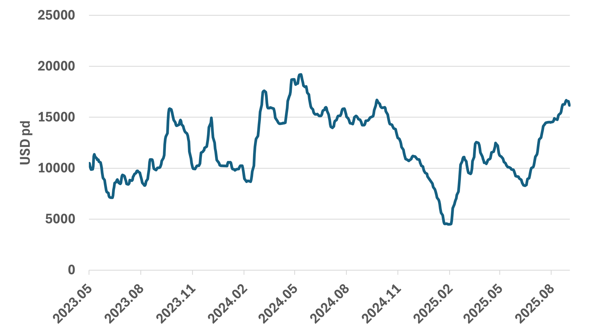

# Fearnleys Dry Bulk Weekly

**Date:** 2025-09-03 | **Department:** BULK | **Publisher:** Fearnleys AS  
**Original PDF:** [Download PDF](https://pbrkapp.blob.core.windows.net/report/4b2c3013-9fd6-4b9b-8c6f-f5d7592014bf/report.pdf)  

---

## Capesize/Newcastlemax

Last week, we wrote: *Profit margins at Chinese steel mills have weakened noticeably over the last weeks, with the average margins for rebar turning negative for the first time since early June. Along with that, the near-month iron ore futures curve remains in contango. As shown on the top right chart, changes in the futures curve often lead the Capesize market direction accurately. 
So, there are a few clear downside risks in the coming months, but on the other hand, imported iron ore consumption in China is still high at close to 3.0 million tons per day, and Bauxite shipments is at the seasonal low point.*

Since last week, China's imported iron ore consumption has fallen slightly, but the share of profitable mills remains high, so there is no indication of a significant drop. Last week, Guinea Bauxite exports were the highest since late May, suggesting we are past the seasonal low point of this year. 
However, the iron ore futures curve lead (top right chart) suggests the best is behind us for this year. The coal market is also cooling down, which could put downward pressure on Capes via a weakening Panamax market. 
So, the picture remains mixed, but slightly more bearish than last week.

> **Figure 1: China Daily Imported Iron Ore Consumption**  
> [Local Asset](file:////home/runner/work/Shipping/Shipping/corpus/01-brokers/fearnleys-md/images/4b2c3013-9fd6-4b9b-8c6f-f5d7592014bf/china%20imported%20iron%20ore%20consumption.png) | [Cloud Backup](https://pbrkapp.blob.core.windows.net/report/4b2c3013-9fd6-4b9b-8c6f-f5d7592014bf/china imported iron ore consumption.png)

> **Figure 2: Iron Ore Futures Spread, 1st Month Minus 3rd Month (4 Months Lead) vs BCI5TC 60 Days Rolling Average**  
> [Local Asset](file:////home/runner/work/Shipping/Shipping/corpus/01-brokers/fearnleys-md/images/4b2c3013-9fd6-4b9b-8c6f-f5d7592014bf/IRON%20ORE%20FUTURES%20LEAD%20VS%20CAPE.png) | [Cloud Backup](https://pbrkapp.blob.core.windows.net/report/4b2c3013-9fd6-4b9b-8c6f-f5d7592014bf/IRON ORE FUTURES LEAD VS CAPE.png)

> **Figure 3: China - Share of Steel Mills that are Profitable, 7 weeks lead, vs Daily Hot Metal Output**  
> [Local Asset](file:////home/runner/work/Shipping/Shipping/corpus/01-brokers/fearnleys-md/images/4b2c3013-9fd6-4b9b-8c6f-f5d7592014bf/STEEL%20MILL%20PROFITABILITY%20VS%20HOT%20METAL%20OUTPUT.png) | [Cloud Backup](https://pbrkapp.blob.core.windows.net/report/4b2c3013-9fd6-4b9b-8c6f-f5d7592014bf/STEEL MILL PROFITABILITY VS HOT METAL OUTPUT.png)

> **Figure 4: Cape/Newc Guinea Bauxite Loadings 24 vs 25**  
> [Local Asset](file:////home/runner/work/Shipping/Shipping/corpus/01-brokers/fearnleys-md/images/4b2c3013-9fd6-4b9b-8c6f-f5d7592014bf/Capenewc%20bauxite%20guinea.png) | [Cloud Backup](https://pbrkapp.blob.core.windows.net/report/4b2c3013-9fd6-4b9b-8c6f-f5d7592014bf/Capenewc bauxite guinea.png)

---

## Panamax/Kamsarmax

As we have entered September, the coal futures curve has flipped into contango for the near-months as well, reflecting that the coal market does not see an urgent need for purchases. Indonesia RVs are therefore likely to be under pressure, but should we trust the coal futures curve lead displayed on the top right chart, the market will not drop to the lows seen during the 1st half of this year, as the curve was more in contango then...
In the Atlantic, Soybeans could be a bearish factor in the near term, as some analysts report that China is fully covered through October, even without US beans.

> **Figure 5: Panamax / Kamsarmax Heading to Indonesia**  
> [Local Asset](file:////home/runner/work/Shipping/Shipping/corpus/01-brokers/fearnleys-md/images/4b2c3013-9fd6-4b9b-8c6f-f5d7592014bf/PANAMAX%20KAMSARMAX%20HEADING%20TO%20INDONESIA.png) | [Cloud Backup](https://pbrkapp.blob.core.windows.net/report/4b2c3013-9fd6-4b9b-8c6f-f5d7592014bf/PANAMAX KAMSARMAX HEADING TO INDONESIA.png)

> **Figure 6: P5 vs Newcastle Coal Futures Curve Spread (Lead 2 Months)**  
> [Local Asset](file:////home/runner/work/Shipping/Shipping/corpus/01-brokers/fearnleys-md/images/4b2c3013-9fd6-4b9b-8c6f-f5d7592014bf/P5%20vs%20Newcastle%20Coal%20Futures%20Spread%20Lead.png) | [Cloud Backup](https://pbrkapp.blob.core.windows.net/report/4b2c3013-9fd6-4b9b-8c6f-f5d7592014bf/P5 vs Newcastle Coal Futures Spread Lead.png)

> **Figure 7: Panamax/Kamsarmax Brazil Soybean Loadings 24 vs 25**  
> [Local Asset](file:////home/runner/work/Shipping/Shipping/corpus/01-brokers/fearnleys-md/images/4b2c3013-9fd6-4b9b-8c6f-f5d7592014bf/BRAZIL%20SOYBEAN%20LOADINGS.png) | [Cloud Backup](https://pbrkapp.blob.core.windows.net/report/4b2c3013-9fd6-4b9b-8c6f-f5d7592014bf/BRAZIL SOYBEAN LOADINGS.png)

> **Figure 8: Panamax / Kamsarmax USA Soybeans Loadings  24 vs 25**  
> [Local Asset](file:////home/runner/work/Shipping/Shipping/corpus/01-brokers/fearnleys-md/images/4b2c3013-9fd6-4b9b-8c6f-f5d7592014bf/USA%20Soybean%20Loadings.png) | [Cloud Backup](https://pbrkapp.blob.core.windows.net/report/4b2c3013-9fd6-4b9b-8c6f-f5d7592014bf/USA Soybean Loadings.png)

---

## Supramax/Ultramax

In last week's report, we speculated that the market might be due for a breather, with our main clue then being a sharp reversal in FFAs for all segments. Minor bulk shipments remain strong, but the factors mentioned in the Panamax part of this report are likely to put downward pressure Supras/Ultras as well.

> **Figure 9: Supramax Ultramax Weekly Total Loadings 2024 vs 2025**  
> [Local Asset](file:////home/runner/work/Shipping/Shipping/corpus/01-brokers/fearnleys-md/images/4b2c3013-9fd6-4b9b-8c6f-f5d7592014bf/supra%20ultra%20total%20weekly%20shipment%20volumes.png) | [Cloud Backup](https://pbrkapp.blob.core.windows.net/report/4b2c3013-9fd6-4b9b-8c6f-f5d7592014bf/supra ultra total weekly shipment volumes.png)

> **Figure 10: Copper Price 6 months Change, 4 Month Lead vs Supramax 1 Year TC 6 Months Change**  
> [Local Asset](file:////home/runner/work/Shipping/Shipping/corpus/01-brokers/fearnleys-md/images/affeeef6-6d7d-4e59-b482-06fd79a2d1ab/COPPER%20PRICE%20VS%20SUPRAMAX%201%20YEAR%20TC.png) | [Cloud Backup](https://pbrkapp.blob.core.windows.net/report/affeeef6-6d7d-4e59-b482-06fd79a2d1ab/COPPER PRICE VS SUPRAMAX 1 YEAR TC.png)

> **Figure 11: China - Indonesia - China RV**  
> [Local Asset](file:////home/runner/work/Shipping/Shipping/corpus/01-brokers/fearnleys-md/images/4b2c3013-9fd6-4b9b-8c6f-f5d7592014bf/S10.png) | [Cloud Backup](https://pbrkapp.blob.core.windows.net/report/4b2c3013-9fd6-4b9b-8c6f-f5d7592014bf/S10.png)

> **Figure 12: Supramax 10TC vs Supramax/Handy Spread**  
> [Local Asset](file:////home/runner/work/Shipping/Shipping/corpus/01-brokers/fearnleys-md/images/4b2c3013-9fd6-4b9b-8c6f-f5d7592014bf/SUPRA%20HANDY%20SPREAD.png) | [Cloud Backup](https://pbrkapp.blob.core.windows.net/report/4b2c3013-9fd6-4b9b-8c6f-f5d7592014bf/SUPRA HANDY SPREAD.png)
