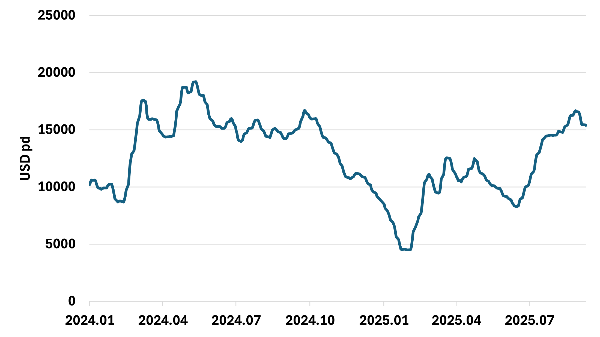

# Fearnleys Dry Bulk Weekly

**Date:** 2025-09-10 | **Department:** BULK | **Publisher:** Fearnleys AS  
**Original PDF:** [Download PDF](https://pbrkapp.blob.core.windows.net/report/a801a57f-cc13-49fd-9adb-090e7f39da40/report.pdf)  

---

## Capesize/Newcastlemax

Data from last week's production curbs in China is now visible, and it was quite a drop, with imported iron ore consumption and hot metal output falling to the lowest level since January.
A V-shaped recovery back up to pre-production curbs is likely, given that the share of profitable steel mills has not changed much, but it remains to be seen (bottom left chart). 
The iron ore futures curve has for some time suggested weakening demand, and surely some of that was because of these production curbs, but probably not the only reason. The Capesize index's 60-day rolling average appears to be peaking now, as indicated by the lead shown in the top right chart. 
China's Golden Week is three weeks away. Since 2018, the market has peaked that week every year, except for 2023.

> **Figure 1: China Daily Imported Iron Ore Consumption**  
> [Local Asset](file:////home/runner/work/Shipping/Shipping/corpus/01-brokers/fearnleys-md/images/a801a57f-cc13-49fd-9adb-090e7f39da40/china%20imported%20iron%20ore%20consumption.png) | [Cloud Backup](https://pbrkapp.blob.core.windows.net/report/a801a57f-cc13-49fd-9adb-090e7f39da40/china imported iron ore consumption.png)

> **Figure 2: Iron Ore Futures Spread, 1st Month Minus 3rd Month (3 Months Lead) vs BCI5TC 60 Days Rolling Average**  
> [Local Asset](file:////home/runner/work/Shipping/Shipping/corpus/01-brokers/fearnleys-md/images/a801a57f-cc13-49fd-9adb-090e7f39da40/IRON%20ORE%20FUTURES%20LEAD%20VS%20CAPE.png) | [Cloud Backup](https://pbrkapp.blob.core.windows.net/report/a801a57f-cc13-49fd-9adb-090e7f39da40/IRON ORE FUTURES LEAD VS CAPE.png)

> **Figure 3: China - Share of Steel Mills that are Profitable, 7 weeks lead, vs Daily Hot Metal Output**  
> [Local Asset](file:////home/runner/work/Shipping/Shipping/corpus/01-brokers/fearnleys-md/images/a801a57f-cc13-49fd-9adb-090e7f39da40/STEEL%20MILL%20PROFITABILITY%20VS%20HOT%20METAL%20OUTPUT.png) | [Cloud Backup](https://pbrkapp.blob.core.windows.net/report/a801a57f-cc13-49fd-9adb-090e7f39da40/STEEL MILL PROFITABILITY VS HOT METAL OUTPUT.png)

> **Figure 4: Cape/Newc Weekly Shipment Volumes 24 vs 25**  
> [Local Asset](file:////home/runner/work/Shipping/Shipping/corpus/01-brokers/fearnleys-md/images/a801a57f-cc13-49fd-9adb-090e7f39da40/Capenewc%20Weekly%20Shipment%20Volumes.png) | [Cloud Backup](https://pbrkapp.blob.core.windows.net/report/a801a57f-cc13-49fd-9adb-090e7f39da40/Capenewc Weekly Shipment Volumes.png)

---

## Panamax/Kamsarmax

Last week, we wrote: *As we have entered September, the coal futures curve has flipped into contango for the near-months as well, reflecting that the coal market does not see an urgent need for purchases. Indonesia RVs are therefore likely to be under pressure, but should we trust the coal futures curve lead displayed on the top right chart, the market will not drop to the lows seen during the 1st half of this year, as the curve was more in contango then...
In the Atlantic, Soybeans could be a bearish factor in the near term, as some analysts report that China is fully covered through October, even without US beans.*

Coal prices have kept falling over the last week, but the futures curve spreads have not changed much, so the suggestion given by the lead shown on the top right chart remains for P5 to be rangebound in the next months. 
In the Atlantic, the market remains firm, so no sign yet of the US's zero Soybean sales to China impacting things negatively.

> **Figure 5: Panamax / Kamsarmax Heading to Indonesia**  
> [Local Asset](file:////home/runner/work/Shipping/Shipping/corpus/01-brokers/fearnleys-md/images/a801a57f-cc13-49fd-9adb-090e7f39da40/PANAMAX%20KAMSARMAX%20HEADING%20TO%20INDONESIA.png) | [Cloud Backup](https://pbrkapp.blob.core.windows.net/report/a801a57f-cc13-49fd-9adb-090e7f39da40/PANAMAX KAMSARMAX HEADING TO INDONESIA.png)

> **Figure 6: P5 vs Newcastle Coal Futures Curve Spread (Lead 2 Months)**  
> [Local Asset](file:////home/runner/work/Shipping/Shipping/corpus/01-brokers/fearnleys-md/images/a801a57f-cc13-49fd-9adb-090e7f39da40/P5%20vs%20Newcastle%20Coal%20Futures%20Spread%20Lead.png) | [Cloud Backup](https://pbrkapp.blob.core.windows.net/report/a801a57f-cc13-49fd-9adb-090e7f39da40/P5 vs Newcastle Coal Futures Spread Lead.png)

> **Figure 7: Panamax/Kamsarmax Brazil Soybean Loadings 24 vs 25**  
> [Local Asset](file:////home/runner/work/Shipping/Shipping/corpus/01-brokers/fearnleys-md/images/a801a57f-cc13-49fd-9adb-090e7f39da40/USA%20Soybean%20Loadings.png) | [Cloud Backup](https://pbrkapp.blob.core.windows.net/report/a801a57f-cc13-49fd-9adb-090e7f39da40/USA Soybean Loadings.png)

> **Figure 8: Panamax / Kamsarmax USA Soybeans Loadings  24 vs 25**  
> [Local Asset](file:////home/runner/work/Shipping/Shipping/corpus/01-brokers/fearnleys-md/images/a801a57f-cc13-49fd-9adb-090e7f39da40/usa%20soybean%20loadings%202.png) | [Cloud Backup](https://pbrkapp.blob.core.windows.net/report/a801a57f-cc13-49fd-9adb-090e7f39da40/usa soybean loadings 2.png)

---

## Supramax/Ultramax

Last week, we wrote: *In last week's report, we speculated that the market might be due for a breather, with our main clue then being a sharp reversal in FFAs for all segments. Minor bulk shipments remain strong, but the factors mentioned in the Panamax part of this report are likely to put downward pressure Supras/Ultras as well.*

Pacific markets stalling, but Atlantic markets keep rising, and the 11TC/10TC indices are flattening out. As covered often in this report, the price of copper works very well as a leading indicator for Supras and Handies, as the commodity is a proxy for global industrial activity and minor bulks demand. The upper charts display two variations of this. The key message is that the latest downturn in the price of copper suggests market momentum could be close to peaking.

> **Figure 9: Copper Price 3 Months Change, 3 Months Lead vs 3 Months Change of Supra 10TC**  
> [Local Asset](file:////home/runner/work/Shipping/Shipping/corpus/01-brokers/fearnleys-md/images/a801a57f-cc13-49fd-9adb-090e7f39da40/3%20MONTHS%20CHANGE%20OF%20COPPER%20VS%203%20MONTHS%20CHANGE%20OF%20SUPRA%2010%20TC.png) | [Cloud Backup](https://pbrkapp.blob.core.windows.net/report/a801a57f-cc13-49fd-9adb-090e7f39da40/3 MONTHS CHANGE OF COPPER VS 3 MONTHS CHANGE OF SUPRA 10 TC.png)

> **Figure 10: Copper Price 6 months Change, 4 Month Lead vs Supramax 1 Year TC 6 Months Change**  
> [Local Asset](file:////home/runner/work/Shipping/Shipping/corpus/01-brokers/fearnleys-md/images/affeeef6-6d7d-4e59-b482-06fd79a2d1ab/COPPER%20PRICE%20VS%20SUPRAMAX%201%20YEAR%20TC.png) | [Cloud Backup](https://pbrkapp.blob.core.windows.net/report/affeeef6-6d7d-4e59-b482-06fd79a2d1ab/COPPER PRICE VS SUPRAMAX 1 YEAR TC.png)

> **Figure 11: China - Indonesia - China RV**  
> [Local Asset](file:////home/runner/work/Shipping/Shipping/corpus/01-brokers/fearnleys-md/images/a801a57f-cc13-49fd-9adb-090e7f39da40/S10.png) | [Cloud Backup](https://pbrkapp.blob.core.windows.net/report/a801a57f-cc13-49fd-9adb-090e7f39da40/S10.png)

> **Figure 12: Supramax 10TC vs Supramax/Handy Spread**  
> [Local Asset](file:////home/runner/work/Shipping/Shipping/corpus/01-brokers/fearnleys-md/images/a801a57f-cc13-49fd-9adb-090e7f39da40/SUPRA%20HANDY%20SPREAD.png) | [Cloud Backup](https://pbrkapp.blob.core.windows.net/report/a801a57f-cc13-49fd-9adb-090e7f39da40/SUPRA HANDY SPREAD.png)
