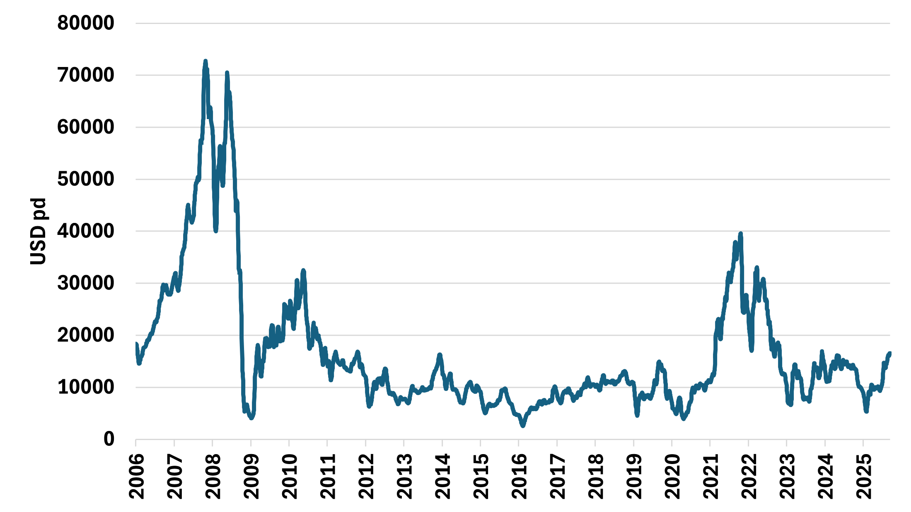

# Fearnleys Dry Bulk Weekly

**Date:** 2025-10-01 | **Department:** BULK | **Publisher:** Fearnleys AS  
**Original PDF:** [Download PDF](https://pbrkapp.blob.core.windows.net/report/720efc6b-2f2b-44f6-8047-64f911ad0b31/report.pdf)  

---

## Capesize/Newcastlemax

The market is correcting, in line with usual seasonal developments. The share of profitable steel mills suggests that iron ore consumption in China is peaking, as it has fallen from close to 70% to about 58% over the last month. However, significant drops in consumption usually do not happen unless the share of profitable mills falls below 50%. 

Regarding the BHP story, there could be fewer cargoes than usual for a short period, but China buys approximately 250 million tons of BHP iron ore annually, out of a total of 1.2 billion tons. For that reason, the iron ore markets have not been spooked by the temporary ban, as China is dependant on BHP supply...

> **Figure 1: Cape/Newc Ballaster/Laden Vessel Ratio**  
> [Local Asset](file:////home/runner/work/Shipping/Shipping/corpus/01-brokers/fearnleys-md/images/720efc6b-2f2b-44f6-8047-64f911ad0b31/CAPENEWC%20BALLASTER%20LADEN%20VESSEL%20RATIO.png) | [Cloud Backup](https://pbrkapp.blob.core.windows.net/report/720efc6b-2f2b-44f6-8047-64f911ad0b31/CAPENEWC BALLASTER LADEN VESSEL RATIO.png)

> **Figure 2: Iron Ore Futures Spread, 1st Month Minus 3rd Month (3 Months Lead) vs BCI5TC 60 Days Rolling Average**  
> [Local Asset](file:////home/runner/work/Shipping/Shipping/corpus/01-brokers/fearnleys-md/images/720efc6b-2f2b-44f6-8047-64f911ad0b31/IRON%20ORE%20FUTURES%20LEAD%20VS%20CAPE.png) | [Cloud Backup](https://pbrkapp.blob.core.windows.net/report/720efc6b-2f2b-44f6-8047-64f911ad0b31/IRON ORE FUTURES LEAD VS CAPE.png)

> **Figure 3: China - Share of Steel Mills that are Profitable, 7 weeks lead, vs Daily Hot Metal Output**  
> [Local Asset](file:////home/runner/work/Shipping/Shipping/corpus/01-brokers/fearnleys-md/images/720efc6b-2f2b-44f6-8047-64f911ad0b31/STEEL%20MILL%20PROFITABILITY%20VS%20HOT%20METAL%20OUTPUT.png) | [Cloud Backup](https://pbrkapp.blob.core.windows.net/report/720efc6b-2f2b-44f6-8047-64f911ad0b31/STEEL MILL PROFITABILITY VS HOT METAL OUTPUT.png)

> **Figure 4: Cape/Newc Weekly Shipment Volumes 24 vs 25**  
> [Local Asset](file:////home/runner/work/Shipping/Shipping/corpus/01-brokers/fearnleys-md/images/720efc6b-2f2b-44f6-8047-64f911ad0b31/Capenewc%20Weekly%20Shipment%20Volumes.png) | [Cloud Backup](https://pbrkapp.blob.core.windows.net/report/720efc6b-2f2b-44f6-8047-64f911ad0b31/Capenewc Weekly Shipment Volumes.png)

---

## Panamax/Kamsarmax

P5 correcting slightly, as China's Golden Week have set in and coal buying slows down. The range-bound market seems to continue, as suggested for a while by the coal futures curves.
Vessel supply in the South Atlantic has tightened, so if volumes increase, the markets there could be in for a rebound. So far, there is no sign in AIS data that Argentina's temporary tax exemptions are leading to higher vessel demand, however. Further, US volumes remain substantially lower than the same period last year.

> **Figure 5: Panamax / Kamsarmax Ballasting to Argentina**  
> [Local Asset](file:////home/runner/work/Shipping/Shipping/corpus/01-brokers/fearnleys-md/images/720efc6b-2f2b-44f6-8047-64f911ad0b31/Panamax%20Kamsarmax%20Ballasting%20to%20Argentina.png) | [Cloud Backup](https://pbrkapp.blob.core.windows.net/report/720efc6b-2f2b-44f6-8047-64f911ad0b31/Panamax Kamsarmax Ballasting to Argentina.png)

> **Figure 6: P5 vs Newcastle Coal Futures Curve Spread (Lead 2 Months)**  
> [Local Asset](file:////home/runner/work/Shipping/Shipping/corpus/01-brokers/fearnleys-md/images/720efc6b-2f2b-44f6-8047-64f911ad0b31/P5%20vs%20Newcastle%20Coal%20Futures%20Spread%20Lead.png) | [Cloud Backup](https://pbrkapp.blob.core.windows.net/report/720efc6b-2f2b-44f6-8047-64f911ad0b31/P5 vs Newcastle Coal Futures Spread Lead.png)

> **Figure 7: Panamax/Kamsarmax Ballasting to the US, 24 vs 25**  
> [Local Asset](file:////home/runner/work/Shipping/Shipping/corpus/01-brokers/fearnleys-md/images/720efc6b-2f2b-44f6-8047-64f911ad0b31/PmxKmx%20AIS%20USA.png) | [Cloud Backup](https://pbrkapp.blob.core.windows.net/report/720efc6b-2f2b-44f6-8047-64f911ad0b31/PmxKmx AIS USA.png)

> **Figure 8: South Atlantic Vessel Tightness Indicator (Lead 1 Month), vs P6**  
> [Local Asset](file:////home/runner/work/Shipping/Shipping/corpus/01-brokers/fearnleys-md/images/720efc6b-2f2b-44f6-8047-64f911ad0b31/P6%20vs%20SATL%20Tightness.png) | [Cloud Backup](https://pbrkapp.blob.core.windows.net/report/720efc6b-2f2b-44f6-8047-64f911ad0b31/P6 vs SATL Tightness.png)

---

## Supramax/Ultramax

Last week, we wrote: *The Pacific is softening slightly, whereas tightness remains in the Atlantic, which probably will remain the case in the near term as vessels positioned in the basin have fallen further over the last week. Further, the Kamsarmax market could tighten in the South Atlantic. 
What we wrote last week still applies, though, and this suggests the headline indices will not see further highs towards year-end.*

The divergence between the Atlantic and the Pacific keeps getting more extreme. Most of the volumes are in the Pacific/Indian Ocean, and as the markets there soften, how long can the Atlantic continue to rise? There will be a sudden and sharp correction there eventually, but extremes can get more extreme. In late 2023, for example, S4A peaked at over 40kpd, whereas the Pacific was then at 13kpd. Currently, we are at 35kpd vs 15.5 kpd...

> **Figure 9: Copper Price 3 Months Change, 3 Months Lead vs 3 Months Change of Supra 10TC**  
> [Local Asset](file:////home/runner/work/Shipping/Shipping/corpus/01-brokers/fearnleys-md/images/a801a57f-cc13-49fd-9adb-090e7f39da40/3%20MONTHS%20CHANGE%20OF%20COPPER%20VS%203%20MONTHS%20CHANGE%20OF%20SUPRA%2010%20TC.png) | [Cloud Backup](https://pbrkapp.blob.core.windows.net/report/a801a57f-cc13-49fd-9adb-090e7f39da40/3 MONTHS CHANGE OF COPPER VS 3 MONTHS CHANGE OF SUPRA 10 TC.png)

> **Figure 10: Copper Price 6 months Change, 4 Month Lead vs Supramax 1 Year TC 6 Months Change**  
> [Local Asset](file:////home/runner/work/Shipping/Shipping/corpus/01-brokers/fearnleys-md/images/affeeef6-6d7d-4e59-b482-06fd79a2d1ab/COPPER%20PRICE%20VS%20SUPRAMAX%201%20YEAR%20TC.png) | [Cloud Backup](https://pbrkapp.blob.core.windows.net/report/affeeef6-6d7d-4e59-b482-06fd79a2d1ab/COPPER PRICE VS SUPRAMAX 1 YEAR TC.png)

> **Figure 11: Supramax 6TC 2006-2025**  
> [Local Asset](file:////home/runner/work/Shipping/Shipping/corpus/01-brokers/fearnleys-md/images/a7b7d051-2b47-43c1-8e28-79f911978e1a/Supra6TC.png) | [Cloud Backup](https://pbrkapp.blob.core.windows.net/report/a7b7d051-2b47-43c1-8e28-79f911978e1a/Supra6TC.png)

> **Figure 12: Supra/Ultra Ballaster/Laden Vessel Ratio**  
> [Local Asset](file:////home/runner/work/Shipping/Shipping/corpus/01-brokers/fearnleys-md/images/720efc6b-2f2b-44f6-8047-64f911ad0b31/SUPRAMAX%20ULTRAMAX%20BALLASTER%20LADEN%20VESSEL%20RATIO.png) | [Cloud Backup](https://pbrkapp.blob.core.windows.net/report/720efc6b-2f2b-44f6-8047-64f911ad0b31/SUPRAMAX ULTRAMAX BALLASTER LADEN VESSEL RATIO.png)
