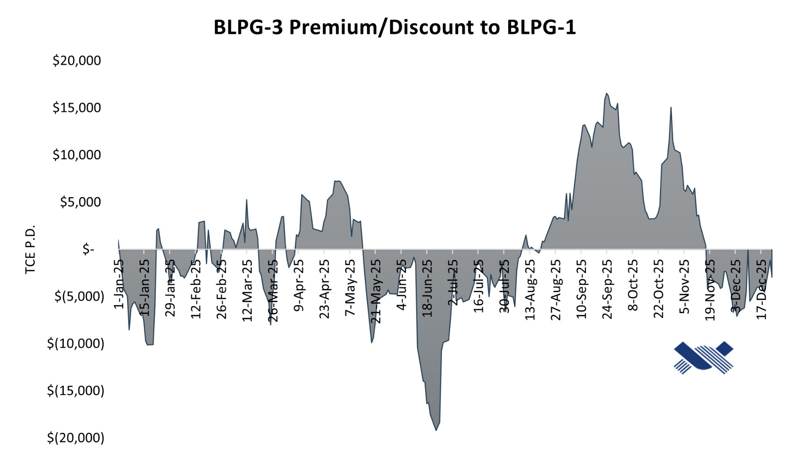
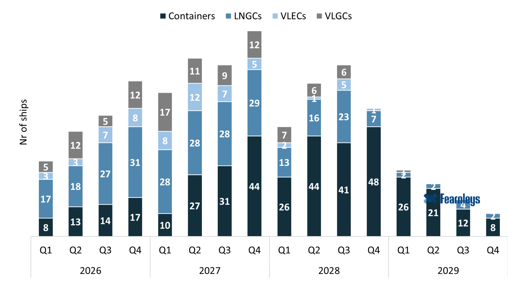
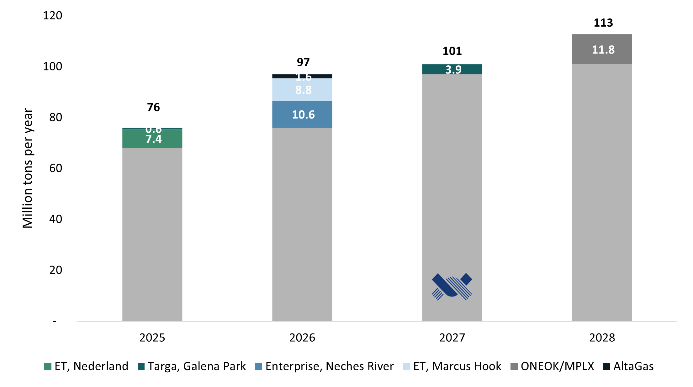

# VLGC Quarterly Report - 2025 Review

**Date:** 2026-01-14 | **Department:** LPG | **Publisher:** Fearnleys AS  
**Original PDF:** [Local PDF](../pdfs/2026/2026-01-14_vlgc-quarterly-market-report-q4-2025.pdf) | [Cloud Backup](https://pbrkapp.blob.core.windows.net/report/9d012376-4fb6-405e-a762-772651ef992a/report.pdf)  

---

### Freight rates & Earnings

> **Figure 1: Blpg Dollar Per Ton**  
> [Local Asset](file:///C:/Users/Dell/Github/Shipping/corpus/01-brokers/fearnleys-md/images/9d012376-4fb6-405e-a762-772651ef992a/BLPG%20dollar%20per%20ton.png) | [Cloud Backup](https://pbrkapp.blob.core.windows.net/report/9d012376-4fb6-405e-a762-772651ef992a/BLPG dollar per ton.png)

> **Figure 2: Premiumdiscount**  
> [Local Asset](file:///C:/Users/Dell/Github/Shipping/corpus/01-brokers/fearnleys-md/images/9d012376-4fb6-405e-a762-772651ef992a/PremiumDiscount.png) | [Cloud Backup](https://pbrkapp.blob.core.windows.net/report/9d012376-4fb6-405e-a762-772651ef992a/PremiumDiscount.png)

The average daily spot earnings across the three index routes reached $61,500 per day in Q4, a result from a stable market at relatively high levels. Earnings in all three months of the quarter exceeded those of the previous year. The Middle East-Asia route rose by 53%, while the U.S.-Asia route increased by 30%. With Q4 concluded, **2025's average TCE earnings closed at $55,700 per day**, marking another strong year for VLGCs - a 10% increase compared to 2024.

On a dollar per metric ton basis, BLPG-1 averaged at $67.9 in Q4, BLPG-2 at $62.3 and BLPG-3 at $125.4.

Following a hectic year marked by numerous geopolitical curveballs, the last quarter was defined by a calmer market with fewer abrupt trade disruptions. The spread between West and East cargo premiums narrowed compared to the prior quarter, signaling a more balanced fleet. The abolition of USTR measures and retaliatory port fees on U.S.-linked ships on November 9 allowed the market to regain equilibrium after two volatile quarters. Nevertheless, despite the abrupt cancellation of fees, both owners and charterers remain cautious about potential renewed turmoil.

---

### Exports and Imports

> **Figure 3: Global Lpg**  
> [Local Asset](file:///C:/Users/Dell/Github/Shipping/corpus/01-brokers/fearnleys-md/images/9d012376-4fb6-405e-a762-772651ef992a/Global%20LPG.png) | [Cloud Backup](https://pbrkapp.blob.core.windows.net/report/9d012376-4fb6-405e-a762-772651ef992a/Global LPG.png)

> **Figure 4: Top Exporters**  
> [Local Asset](file:///C:/Users/Dell/Github/Shipping/corpus/01-brokers/fearnleys-md/images/9d012376-4fb6-405e-a762-772651ef992a/Top%20Exporters.png) | [Cloud Backup](https://pbrkapp.blob.core.windows.net/report/9d012376-4fb6-405e-a762-772651ef992a/Top Exporters.png)

> **Figure 5: Top Importers**  
> [Local Asset](file:///C:/Users/Dell/Github/Shipping/corpus/01-brokers/fearnleys-md/images/9d012376-4fb6-405e-a762-772651ef992a/Top%20importers.png) | [Cloud Backup](https://pbrkapp.blob.core.windows.net/report/9d012376-4fb6-405e-a762-772651ef992a/Top importers.png)

### U.S. Production and Terminal Capacity Expansion

> **Figure 6: Us Production**  
> [Local Asset](file:///C:/Users/Dell/Github/Shipping/corpus/01-brokers/fearnleys-md/images/9d012376-4fb6-405e-a762-772651ef992a/US%20Production.jpg) | [Cloud Backup](https://pbrkapp.blob.core.windows.net/report/9d012376-4fb6-405e-a762-772651ef992a/US Production.jpg)

> **Figure 7: Us Inventories**  
> [Local Asset](file:///C:/Users/Dell/Github/Shipping/corpus/01-brokers/fearnleys-md/images/9d012376-4fb6-405e-a762-772651ef992a/US%20Inventories.png) | [Cloud Backup](https://pbrkapp.blob.core.windows.net/report/9d012376-4fb6-405e-a762-772651ef992a/US Inventories.png)

U.S. LPG production continues to rise, with total output increasing 90% from 2015 to 2025. While growth is expected to moderate to approximately 5% over the next three years, export capacity is projected to expand significantly during the same period. Domestic consumption remains stable at around 60%, though household heating demand is forecasted to decline by 2% this winter. Propane production will increase by 2% compared with last winter. Coupled with continuous expansion of export capacity at several major terminals, conditions are aligned for a solid start to 2026.

*Furthermore, production from the Permian Basin is projected to grow at an annual rate of 7% through 2030, outpacing crude oil growth by 4%.*

Propane inventories reached a new peak in the final week of October at 106 million barrels, more than 20% higher than the three-year average. The U.S. exported 67 million tons in 2025, of which VLGCs accounted for 82% (55 million tons) - an increase of 2 million tons from 2024. The majority of volumes were shipped to the Far East, while 15-20% headed to Europe and Africa, representing substantially shorter voyages.

> **Figure 8: Waypoint Transits Laden Us Cargoes**  
> [Local Asset](file:///C:/Users/Dell/Github/Shipping/corpus/01-brokers/fearnleys-md/images/9d012376-4fb6-405e-a762-772651ef992a/Waypoint%20transits%20Laden%20US%20cargoes.png) | [Cloud Backup](https://pbrkapp.blob.core.windows.net/report/9d012376-4fb6-405e-a762-772651ef992a/Waypoint transits Laden US cargoes.png)

> **Figure 9: Orderbook**  
> [Local Asset](file:///C:/Users/Dell/Github/Shipping/corpus/01-brokers/fearnleys-md/images/9d012376-4fb6-405e-a762-772651ef992a/Orderbook.png) | [Cloud Backup](https://pbrkapp.blob.core.windows.net/report/9d012376-4fb6-405e-a762-772651ef992a/Orderbook.png)

> **Figure 10: Expansions**  
> [Local Asset](file:///C:/Users/Dell/Github/Shipping/corpus/01-brokers/fearnleys-md/images/d254833f-b752-48b8-bd36-58b75bc53202/Expansions.png) | [Cloud Backup](https://pbrkapp.blob.core.windows.net/report/d254833f-b752-48b8-bd36-58b75bc53202/Expansions.png)

---

### The Middle East

> **Figure 11: Middle East Exports**  
> [Local Asset](file:///C:/Users/Dell/Github/Shipping/corpus/01-brokers/fearnleys-md/images/9d012376-4fb6-405e-a762-772651ef992a/Middle%20East%20Exports.png) | [Cloud Backup](https://pbrkapp.blob.core.windows.net/report/9d012376-4fb6-405e-a762-772651ef992a/Middle East Exports.png)

Middle East exports surpassed 40 million tons in 2025, a year-on-year increase of only 1%. Key contributors remain Qatar, the UAE, and Iran, each accounting for 22-24% respectively. Notably, 92% of Iranian LPG exports were destined for China, with 96% transported by VLGCs, primarily by the dedicated part of the fleet, which is 14% of the total fleet, 60 ships that are currently sanctioned.

New natural gas developments in Qatar, including the North Field projects, are expected to come online in 2026 and 2027, adding 6.2 MTPA and raising regional export capacity from 46 to 52 MTPA. Saudi Arabia's shale gas project in Jafurah is set to produce 2.5 MTPA of LPG in 2026, with volumes projected to surpass 10 MTPA by 2030. In 2025, Saudi Arabia accounted for 6% of all VLGC volumes. This incremental supply will help balance a fleet that is growing substantially over the next three years.

In the latter half of the year, Saudi CP was lowered each month, reaching $475/mt for propane and $460/mt for butane in November-the lowest point of 2025 - before readjusting upward toward year-end.

### Chinese Demand

> **Figure 12: Chinese Improts**  
> [Local Asset](file:///C:/Users/Dell/Github/Shipping/corpus/01-brokers/fearnleys-md/images/9d012376-4fb6-405e-a762-772651ef992a/Chinese%20improts.png) | [Cloud Backup](https://pbrkapp.blob.core.windows.net/report/9d012376-4fb6-405e-a762-772651ef992a/Chinese improts.png)

> **Figure 13: Chinese Imports By Origin**  
> [Local Asset](file:///C:/Users/Dell/Github/Shipping/corpus/01-brokers/fearnleys-md/images/9d012376-4fb6-405e-a762-772651ef992a/Chinese%20imports%20by%20Origin.png) | [Cloud Backup](https://pbrkapp.blob.core.windows.net/report/9d012376-4fb6-405e-a762-772651ef992a/Chinese imports by Origin.png)

After a period of market instability following "Liberation Day" in April, trade flows are gradually returning to normal. However, U.S.-China LPG trade remains below previous levels, with both countries diversifying supply and demand - a trend expected to continue into 2026. Though imports decreased towards the end of the year, total imports reached 33.82 million tons, up 1% from 2024. This was below expectations, though not surprising given the tensions in trade. Imports are expected to reach 36 MTPA in 2026. With increased demand, the Asian propane price is expected to rise, and with the U.S. set to increase their production and exports, this will likely push the arbitrage wider, supporting the freight environment. 

China's LPG demand continues to be primarily driven by the petrochemical sector, with ongoing growth in propane dehydrogenation (PDH) capacity. Although Chinese PDH plants are currently facing negative margins, recent improvements in run rates have been observed, currently around 72%.

### New trade routes have emerged

> **Figure 14: Historical Flows From Us To India**  
> [Local Asset](file:///C:/Users/Dell/Github/Shipping/corpus/01-brokers/fearnleys-md/images/9d012376-4fb6-405e-a762-772651ef992a/Historical%20flows%20from%20US%20to%20India.png) | [Cloud Backup](https://pbrkapp.blob.core.windows.net/report/9d012376-4fb6-405e-a762-772651ef992a/Historical flows from US to India.png)

> **Figure 15: 2025 Flows**  
> [Local Asset](file:///C:/Users/Dell/Github/Shipping/corpus/01-brokers/fearnleys-md/images/9d012376-4fb6-405e-a762-772651ef992a/2025%20Flows.png) | [Cloud Backup](https://pbrkapp.blob.core.windows.net/report/9d012376-4fb6-405e-a762-772651ef992a/2025 Flows.png)

In November, an Indian one-year tender for 2.2 MTPA of LPG was won by U.S. energy majors. This diversification of supply is a clear effect from the tariff-turmoils in 2025, which has allowed new trade routes to emerge. This requirement is equivalent to more than 40 VLGC cargoes, representing a 190% increase from volumes traded in 2024. Rumors of another market tender is swirling, but nothing is confirmed yet. India is set for further growth in 2026, with their first PDH plant with an annual propane demand of 600,000 tons. The biggest pipeline of its kind, will also come online, which connects India's West Coast terminals to its inland demand centres in the north. The pipeline will be able to transport 8.25 MTPA of LPG.

### Fleet and Orderbook

> **Figure 16: Historical Fleet Development**  
> [Local Asset](file:///C:/Users/Dell/Github/Shipping/corpus/01-brokers/fearnleys-md/images/9d012376-4fb6-405e-a762-772651ef992a/Historical%20fleet%20development.png) | [Cloud Backup](https://pbrkapp.blob.core.windows.net/report/9d012376-4fb6-405e-a762-772651ef992a/Historical fleet development.png)

12 newbuilds were delivered in 2025, with two ships rolling over into 2026 and one scheduled for 2026 delivered early. The fleet now stands at 412 ships, including floating storages. The orderbook consists of 109 ships, resulting in an orderbook-to-fleet ratio of 26%, slightly above the 20-year average of 21%. The fleet is set to grow by 20% through 2026 and 2027, which could lead to an accumulated oversupply.

As the Panama Canal is expected to become increasingly congested in the coming years-driven by rising U.S. exports of ethane and LNG, along with the addition of over 100 VLGCs on the water-there is reason to anticipate that a larger share of the fleet will regularly utilize the Cape of Good Hope (COGH) route. This shift will stretch fleet capacity and reduce overall vessel availability. At the same time, new LPG export capacity is coming online in the U.S., requiring additional transportation. These dynamics suggest a potential need for more ships, as longer sailing distances reduce the number of voyages each vessel can complete annually.

> **Figure 17: Ob Del**  
> [Local Asset](file:///C:/Users/Dell/Github/Shipping/corpus/01-brokers/fearnleys-md/images/9d012376-4fb6-405e-a762-772651ef992a/OB%20Del.png) | [Cloud Backup](https://pbrkapp.blob.core.windows.net/report/9d012376-4fb6-405e-a762-772651ef992a/OB Del.png)

> **Figure 18: Ob Yards**  
> [Local Asset](file:///C:/Users/Dell/Github/Shipping/corpus/01-brokers/fearnleys-md/images/9d012376-4fb6-405e-a762-772651ef992a/OB%20Yards.png) | [Cloud Backup](https://pbrkapp.blob.core.windows.net/report/9d012376-4fb6-405e-a762-772651ef992a/OB Yards.png)

Ordering activity in 2025 remained modest compared to the previous two years, due to high newbuilding prices and the size of the orderbook. Hyundai in South Korea remains the largest builder, while one-quarter of newbuilds are being constructed in China. No significant price differences have emerged between Japanese/Korean and Chinese yards. The last recorded VLAC order was priced at $120.44 million in December - Hyundai building for Benelux, with delivery in Q2 and Q3 2028.

On the ammonia side, market interest and activity has remained limited throughout the year. Smaller ship segments are currently under pressure, although the large orderbook for MGCs is expected to accommodate any incremental volumes entering the market. More critically, the infrastructure investments required to support seaborne ammonia trade via VLACs are not being made. These investments typically involve long lead times, further delaying market readiness. Additionally, the market lacks sufficient project development to generate new ammonia volumes. The first VLAC in the orderbook is scheduled for delivery in June, but as previously noted, these ships are expected to operate as conventional VLGCs for the foreseeable future. We do not differentiate them within the fleet, aside from their technical capability to carry ammonia at 98% capacity, if required.

---

### Outlook

*Fearnleys expects earnings to remain broadly in line with 2025 levels throughout 2026.*

The coming year will bring additional capacity expansions in the U.S., coupled with a projected supply boost from the Middle East. These developments are anticipated to help offset the impact of fleet growth over the next 12 months, which includes 36 newbuild deliveries in total.

Following a volatile year marked by uncertain trade relations, flows are gradually normalizing, though new trade patterns have emerged. India is set to increase its imports of U.S. LPG, while China will continue sourcing volumes from Canada's West Coast. This voyage is shorter and it offers greater flexibility by avoiding transit volatility at the Panama Canal, which will maintain its Long-Term Slot Allocation System in 2026, continuing to reduce Neo-lock capacity. Additionally, the substantial orderbook for container vessels and VLECs is likely to absorb canal capacity, as these segments have a higher willingness to pay than VLGCs. Transit availability is expected to tighten further with these newbuild deliveries, likely forcing more VLGCs to sail around the Cape of Good Hope.

Supply will continue to grow for both LPG and VLGCs in the coming year; however, demand from the petrochemical sector remains fragile. PDH margins in China are under pressure despite increasing plant capacity. Traditionally, the LPG market has been considered supply-driven. If this dynamic holds, 2026 could offer a shipping market with relative stability - though underlying demand risks suggest this is not guaranteed. As witnessed in the past year, the geopolitical dice could be thrown in any direction, and markets will have to follow.

---
