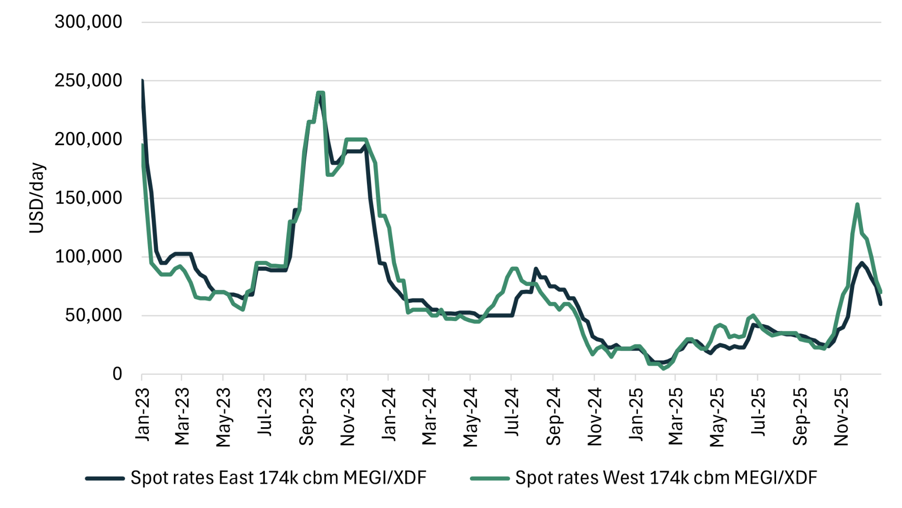
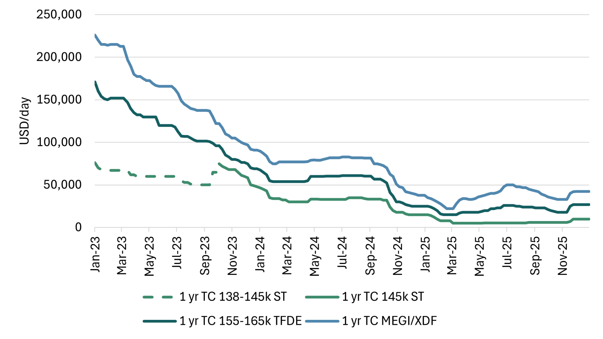
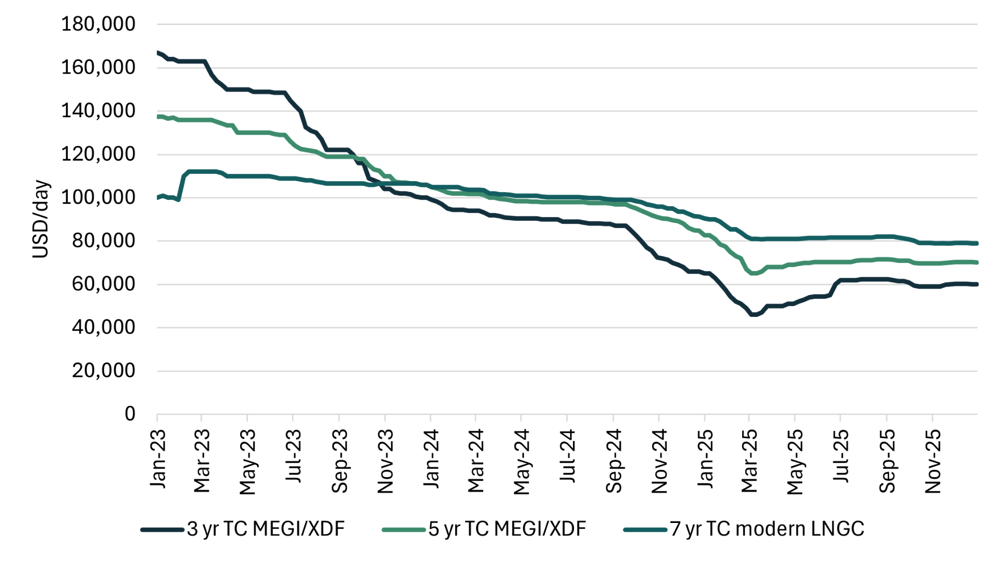
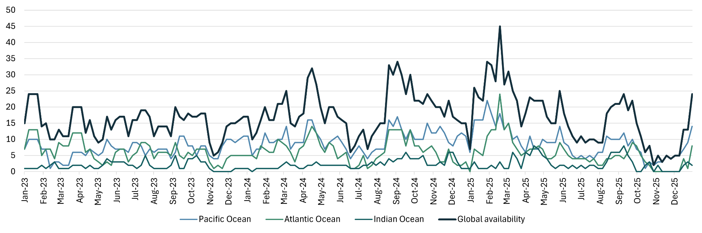
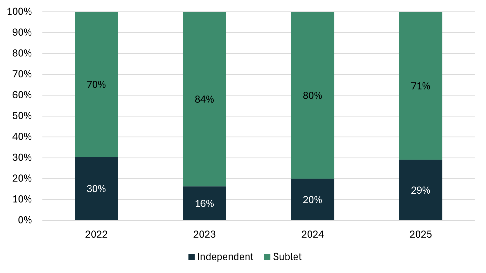
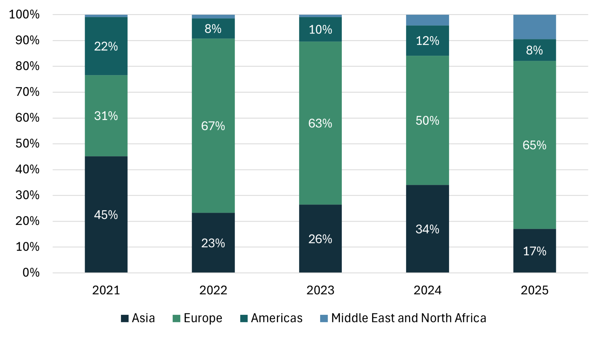
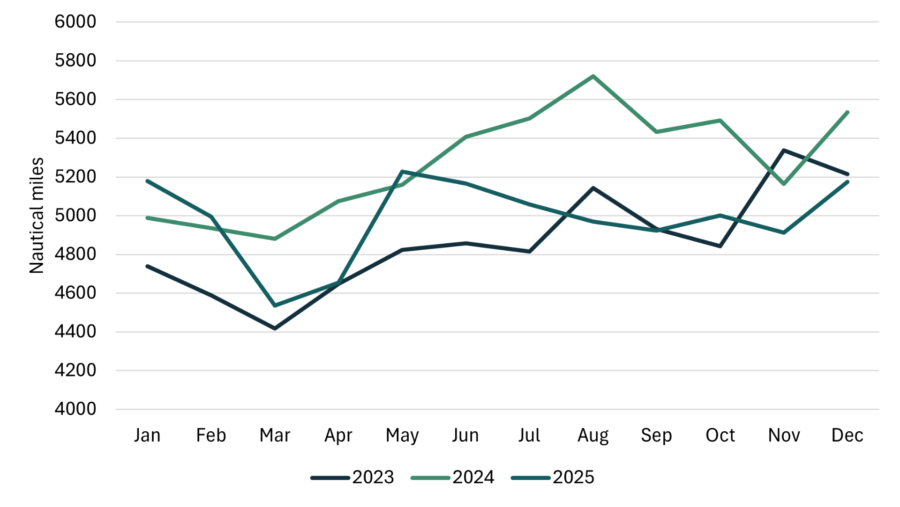
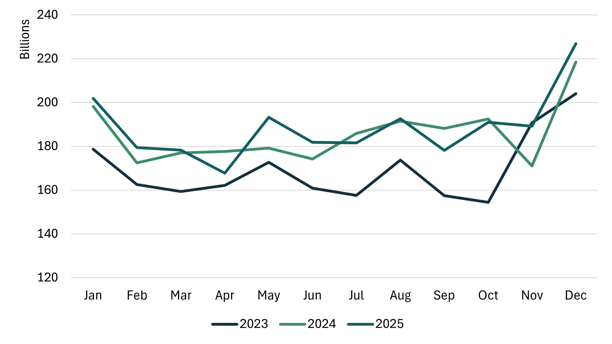
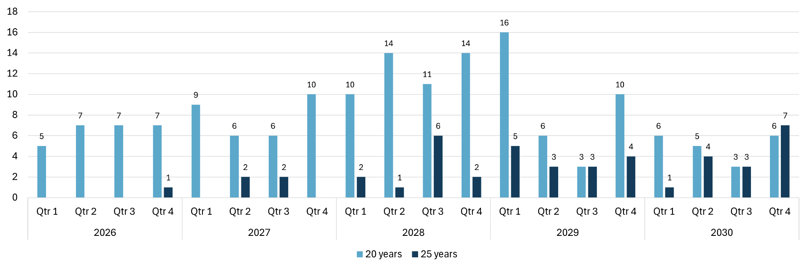
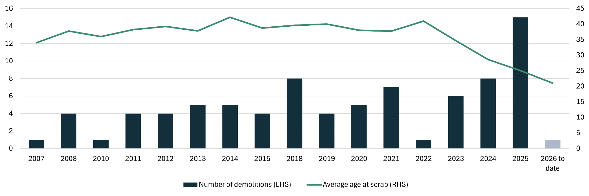

# LNG Shipping - Annual Report 2025

**Date:** 2026-01-27 | **Department:** LNG | **Publisher:** Fearnleys AS  
**Original PDF:** [Download PDF](https://pbrkapp.blob.core.windows.net/report/34f73751-7089-4e38-8363-b8d0dbfbcdd7/report.pdf)  

---

## Summary

The LNG shipping market in 2025 was defined by continued pressure on rates, with annual average charter levels for two‑stroke vessels falling by around USD 17,000/day compared with 2024. Global LNG trade expanded by nearly 30 million tonnes year on year, but this was not enough to offset the impact of significant fleet growth, as 80 newbuilds entered service. Shipping demand was further softened by shorter average voyage distances, driven by a record share-nearly 70%-of U.S. exports flowing to Europe.

Despite the oversupplied market, a brief winter peak emerged, with two‑stroke spot rates exceeding USD 100,000/day. This was supported by unexpectedly high U.S. Gulf production and a strong preference for modern tonnage. However, by year‑end, rates had resumed their downward trend, reflecting underlying fundamentals.

Vessel retirements reached new highs, with 15 ships sold for demolition and a clear shift toward younger scrapping ages. Delivery delays in 2025 resulted in an orderbook of roughly 100 vessels scheduled for 2026, followed by 88 in 2027 and 72 in 2028. The LNG carrier market is therefore expected to remain oversupplied at least through to 2028, even though long‑term fundamentals remain constructive due to increasing long‑haul trade and fleet‑renewal needs.

Gas and LNG prices trended downward throughout the year. Both JKM and TTF peaked around USD 17/MMBtu in February, but only briefly dipped below USD 10/MMBtu at the end of the year-not for long enough to trigger price‑sensitive demand.

2025 was extraordinary for FIDs: eight projects (some multi‑phase) moved forward, adding more than 80 million tonnes of future liquefaction capacity. Nearly 70% of these new volumes are U.S.‑based.

> **Figure 1: Spot charter rates and JKM**  
> [Local Asset](file:////home/runner/work/Shipping/Shipping/corpus/01-brokers/fearnleys-md/images/34f73751-7089-4e38-8363-b8d0dbfbcdd7/gas%20price%20and%20rates.png) | [Cloud Backup](https://pbrkapp.blob.core.windows.net/report/34f73751-7089-4e38-8363-b8d0dbfbcdd7/gas price and rates.png)

## Charter Rates

The average 2025 spot rate for modern two‑strokes was USD 37,000/day-a record low, even compared with historical TFDE levels. Excluding Q4, the average falls to just USD 27,000/day, underscoring the importance of the brief winter peak. The year began with exceptionally low rates and high vessel availability, which later corrected modestly without any strong fundamental driver. 

A persistent Atlantic premium remained, with modern ships earning on average USD 6,600/day more West of Suez due to stronger demand for large, modern vessels versus older tonnage. TFDEs averaged USD 22,000/day, and 145k steamers averaged USD 6,000/day-both historically low. The rate differentials versus two‑strokes (approximately USD 15k/day for TFDEs and USD 30k/day for steamers) were broadly unchanged from 2024.

In the term market, the decline that began in late 2022 bottomed out early in 2025. One‑year rates reached the low USD 20k/day range in Q1. Five‑year rates remained stable around USD 70,000/day, as charterers maintained appetite for longer coverage despite visible oversupply heading into 2026.

> **Figure 2: Two-stroke spot charter rates (East/West)**  
> [Local Asset](file:////home/runner/work/Shipping/Shipping/corpus/01-brokers/fearnleys-md/images/34f73751-7089-4e38-8363-b8d0dbfbcdd7/eastwest2.png) | [Cloud Backup](https://pbrkapp.blob.core.windows.net/report/34f73751-7089-4e38-8363-b8d0dbfbcdd7/eastwest2.png)

> **Figure 3: Average spot charter rates**  
> [Local Asset](file:////home/runner/work/Shipping/Shipping/corpus/01-brokers/fearnleys-md/images/34f73751-7089-4e38-8363-b8d0dbfbcdd7/spot%20rate.png) | [Cloud Backup](https://pbrkapp.blob.core.windows.net/report/34f73751-7089-4e38-8363-b8d0dbfbcdd7/spot rate.png)

> **Figure 4: 1-year charter rates**  
> [Local Asset](file:////home/runner/work/Shipping/Shipping/corpus/01-brokers/fearnleys-md/images/34f73751-7089-4e38-8363-b8d0dbfbcdd7/1year.png) | [Cloud Backup](https://pbrkapp.blob.core.windows.net/report/34f73751-7089-4e38-8363-b8d0dbfbcdd7/1year.png)

> **Figure 5: Term charter rates (two-stroke)**  
> [Local Asset](file:////home/runner/work/Shipping/Shipping/corpus/01-brokers/fearnleys-md/images/34f73751-7089-4e38-8363-b8d0dbfbcdd7/longterm.png) | [Cloud Backup](https://pbrkapp.blob.core.windows.net/report/34f73751-7089-4e38-8363-b8d0dbfbcdd7/longterm.png)

> **Figure 6: Prompt LNGC availability**  
> [Local Asset](file:////home/runner/work/Shipping/Shipping/corpus/01-brokers/fearnleys-md/images/34f73751-7089-4e38-8363-b8d0dbfbcdd7/avail.png) | [Cloud Backup](https://pbrkapp.blob.core.windows.net/report/34f73751-7089-4e38-8363-b8d0dbfbcdd7/avail.png)

> **Figure 7: Yearly spot charter rates**  
> [Local Asset](file:////home/runner/work/Shipping/Shipping/corpus/01-brokers/fearnleys-md/images/34f73751-7089-4e38-8363-b8d0dbfbcdd7/yearly%20rates.png) | [Cloud Backup](https://pbrkapp.blob.core.windows.net/report/34f73751-7089-4e38-8363-b8d0dbfbcdd7/yearly rates.png)

> **Figure 8: Quarterly spot charter rates**  
> [Local Asset](file:////home/runner/work/Shipping/Shipping/corpus/01-brokers/fearnleys-md/images/34f73751-7089-4e38-8363-b8d0dbfbcdd7/qrtly%20spot.png) | [Cloud Backup](https://pbrkapp.blob.core.windows.net/report/34f73751-7089-4e38-8363-b8d0dbfbcdd7/qrtly spot.png)

## Chartering Activity

Liquidity was exceptionally high in 2025: more than 450 spot fixtures were concluded-the highest number ever in LNG. The spot fixture count grew 28% year on year, while total fixed days increased 44%, indicating a rise in average fixture duration.

Two‑strokes accounted for 64% of all spot fixtures, consistent with the growing modern fleet. In contrast, steam turbine spot activity collapsed by more than 80%, representing only ~2% of total spot fixtures. Many steamers now lie idle and uncommitted, highlighting a clear market preference for larger and more efficient vessels.

Term activity (1-5 years) remained broadly similar to 2024, though with slightly more volume toward the longer durations. Both 2024 and 2025 saw significantly less term fixing compared with 2021-2023, when energy‑security concerns dominated. Interest in multi‑year (>5 years) terms remained muted, reflected in the low ordering activity of just 33 vessels-far below the recent four‑year average of 97.

> **Figure 9: Short-term fixture activity (< 3 years)**  
> [Local Asset](file:////home/runner/work/Shipping/Shipping/corpus/01-brokers/fearnleys-md/images/34f73751-7089-4e38-8363-b8d0dbfbcdd7/yrly%20fixt.png) | [Cloud Backup](https://pbrkapp.blob.core.windows.net/report/34f73751-7089-4e38-8363-b8d0dbfbcdd7/yrly fixt.png)

> **Figure 10: Short term fixtures by sublet vs independent owners**  
> [Local Asset](file:////home/runner/work/Shipping/Shipping/corpus/01-brokers/fearnleys-md/images/34f73751-7089-4e38-8363-b8d0dbfbcdd7/indep.png) | [Cloud Backup](https://pbrkapp.blob.core.windows.net/report/34f73751-7089-4e38-8363-b8d0dbfbcdd7/indep.png)

> **Figure 11: Spot fixtures by propulsion**  
> [Local Asset](file:////home/runner/work/Shipping/Shipping/corpus/01-brokers/fearnleys-md/images/34f73751-7089-4e38-8363-b8d0dbfbcdd7/spot%20by%20prop.png) | [Cloud Backup](https://pbrkapp.blob.core.windows.net/report/34f73751-7089-4e38-8363-b8d0dbfbcdd7/spot by prop.png)

> **Figure 12: Spot fixtures by propulsion (share)**  
> [Local Asset](file:////home/runner/work/Shipping/Shipping/corpus/01-brokers/fearnleys-md/images/34f73751-7089-4e38-8363-b8d0dbfbcdd7/spot%20by%20prop%20pct.png) | [Cloud Backup](https://pbrkapp.blob.core.windows.net/report/34f73751-7089-4e38-8363-b8d0dbfbcdd7/spot by prop pct.png)

> **Figure 13: Short-term fixtures yearly (count)**  
> [Local Asset](file:////home/runner/work/Shipping/Shipping/corpus/01-brokers/fearnleys-md/images/34f73751-7089-4e38-8363-b8d0dbfbcdd7/short%20term%20count.png) | [Cloud Backup](https://pbrkapp.blob.core.windows.net/report/34f73751-7089-4e38-8363-b8d0dbfbcdd7/short term count.png)

> **Figure 14: Short-term fixtures yearly (fixed days)**  
> [Local Asset](file:////home/runner/work/Shipping/Shipping/corpus/01-brokers/fearnleys-md/images/34f73751-7089-4e38-8363-b8d0dbfbcdd7/short%20term%20fixed%20days.png) | [Cloud Backup](https://pbrkapp.blob.core.windows.net/report/34f73751-7089-4e38-8363-b8d0dbfbcdd7/short term fixed days.png)

> **Figure 15: Term fixtures by propulsion**  
> [Local Asset](file:////home/runner/work/Shipping/Shipping/corpus/01-brokers/fearnleys-md/images/34f73751-7089-4e38-8363-b8d0dbfbcdd7/term%20by%20prop.png) | [Cloud Backup](https://pbrkapp.blob.core.windows.net/report/34f73751-7089-4e38-8363-b8d0dbfbcdd7/term by prop.png)

> **Figure 16: Top companies 2025 (< 3 years duration)**  
> [Local Asset](file:////home/runner/work/Shipping/Shipping/corpus/01-brokers/fearnleys-md/images/34f73751-7089-4e38-8363-b8d0dbfbcdd7/top%20companies.png) | [Cloud Backup](https://pbrkapp.blob.core.windows.net/report/34f73751-7089-4e38-8363-b8d0dbfbcdd7/top companies.png)

## Trade Flows

Global LNG trade increased by 27 million tonnes, almost entirely driven by U.S. supply growth. U.S. output rose by 21 million tonnes, supported by strong ramp‑up at Plaquemines, which alone loaded 2 million tonnes in December. October-December were all record months for global loadings. Slightly counteracting that growth, several exporters recorded small reductions in volume.

Egypt registered the largest import increase (+6.4 MT), driven by declining domestic production, high summer demand, and reduced pipeline inflows from Israel. Most other demand growth came from Europe, which increased LNG imports by 26 MT to 123 MT-matching 2022 levels following the loss of Russian pipeline gas.

China reduced LNG imports by 8 MT, shifting toward cheaper pipeline gas and domestic production, with geopolitics and tariffs further influencing flows.

Europe sourced 56% of its LNG from the U.S.; a record 66% of U.S. LNG cargoes was absorbed by Europe. Strong TTF pricing consistently diverted flexible cargoes away from Asia. The increased demand is a result of low renewable energy output and lower pipeline flows from Russia (with no flows through Ukraine since start of 2025). High European demand continues into early 2026, supported by lower storage levels and cold weather.

Despite more loadings particularly later in the year, tonne‑miles remained flat year on year due to shorter voyage distances. In 2024, there were significantly more U.S.-Asia cargoes than in 2025, which largely routed the long voyage via the Cape. Qatar flow to Europe, also via Cape, was also higher in 2024. With nearly 80 newbuilds joining the fleet in 2025 and tonne-miles flat, fleet utilization was low. However, with increased segmentation of the fleet, it is important to note that the underutilization largely targets the old, less efficient ships. Steam turbine volumes fell 22% year on year, even though their fleet size shrank only 9%, resulting in sharply lower utilization. Two‑strokes saw steady utilization, with tonne‑mile growth largely matching fleet expansion. Interestingly, TFDEs reduced tonne-miles by 13% globally, but number of loadings in the Atlantic saw a reduction of 20%. This is likely a result of FuelEU Maritime, which includes methane in the emission calculations. This trend is likely to continue, as the EU ETS as of January 2026 also includes methane emissions.

> **Figure 17: Yearly loaded LNG**  
> [Local Asset](file:////home/runner/work/Shipping/Shipping/corpus/01-brokers/fearnleys-md/images/34f73751-7089-4e38-8363-b8d0dbfbcdd7/loaded%20yrly.png) | [Cloud Backup](https://pbrkapp.blob.core.windows.net/report/34f73751-7089-4e38-8363-b8d0dbfbcdd7/loaded yrly.png)

> **Figure 18: Monthly loaded LNG**  
> [Local Asset](file:////home/runner/work/Shipping/Shipping/corpus/01-brokers/fearnleys-md/images/34f73751-7089-4e38-8363-b8d0dbfbcdd7/loaded%20mntly.png) | [Cloud Backup](https://pbrkapp.blob.core.windows.net/report/34f73751-7089-4e38-8363-b8d0dbfbcdd7/loaded mntly.png)

> **Figure 19: Yearly exports of top 5 exporting markets**  
> [Local Asset](file:////home/runner/work/Shipping/Shipping/corpus/01-brokers/fearnleys-md/images/34f73751-7089-4e38-8363-b8d0dbfbcdd7/exports%20by%20top.png) | [Cloud Backup](https://pbrkapp.blob.core.windows.net/report/34f73751-7089-4e38-8363-b8d0dbfbcdd7/exports by top.png)

> **Figure 20: Year-on-year change in imports**  
> [Local Asset](file:////home/runner/work/Shipping/Shipping/corpus/01-brokers/fearnleys-md/images/34f73751-7089-4e38-8363-b8d0dbfbcdd7/yoy%20change%20imports.png) | [Cloud Backup](https://pbrkapp.blob.core.windows.net/report/34f73751-7089-4e38-8363-b8d0dbfbcdd7/yoy change imports.png)

> **Figure 21: Destination of US LNG**  
> [Local Asset](file:////home/runner/work/Shipping/Shipping/corpus/01-brokers/fearnleys-md/images/34f73751-7089-4e38-8363-b8d0dbfbcdd7/uslng.png) | [Cloud Backup](https://pbrkapp.blob.core.windows.net/report/34f73751-7089-4e38-8363-b8d0dbfbcdd7/uslng.png)

> **Figure 22: Destination of Qatar LNG**  
> [Local Asset](file:////home/runner/work/Shipping/Shipping/corpus/01-brokers/fearnleys-md/images/34f73751-7089-4e38-8363-b8d0dbfbcdd7/qatar%20lng%20yrly.png) | [Cloud Backup](https://pbrkapp.blob.core.windows.net/report/34f73751-7089-4e38-8363-b8d0dbfbcdd7/qatar lng yrly.png)

> **Figure 23: Average fleet distance (laden)**  
> [Local Asset](file:////home/runner/work/Shipping/Shipping/corpus/01-brokers/fearnleys-md/images/34f73751-7089-4e38-8363-b8d0dbfbcdd7/distance.png) | [Cloud Backup](https://pbrkapp.blob.core.windows.net/report/34f73751-7089-4e38-8363-b8d0dbfbcdd7/distance.png)

> **Figure 24: Tonne-miles**  
> [Local Asset](file:////home/runner/work/Shipping/Shipping/corpus/01-brokers/fearnleys-md/images/34f73751-7089-4e38-8363-b8d0dbfbcdd7/tmi.png) | [Cloud Backup](https://pbrkapp.blob.core.windows.net/report/34f73751-7089-4e38-8363-b8d0dbfbcdd7/tmi.png)

> **Figure 25: Tonne-miles by propulsion**  
> [Local Asset](file:////home/runner/work/Shipping/Shipping/corpus/01-brokers/fearnleys-md/images/34f73751-7089-4e38-8363-b8d0dbfbcdd7/tmi%20prop.png) | [Cloud Backup](https://pbrkapp.blob.core.windows.net/report/34f73751-7089-4e38-8363-b8d0dbfbcdd7/tmi prop.png)

> **Figure 26: Atlantic loadings by propulsion**  
> [Local Asset](file:////home/runner/work/Shipping/Shipping/corpus/01-brokers/fearnleys-md/images/34f73751-7089-4e38-8363-b8d0dbfbcdd7/atlantic%20loadings.png) | [Cloud Backup](https://pbrkapp.blob.core.windows.net/report/34f73751-7089-4e38-8363-b8d0dbfbcdd7/atlantic loadings.png)

## LNGC Fleet

> **Figure 27: LNGC fleet by status**  
> [Local Asset](file:////home/runner/work/Shipping/Shipping/corpus/01-brokers/fearnleys-md/images/34f73751-7089-4e38-8363-b8d0dbfbcdd7/fleet%20status.png) | [Cloud Backup](https://pbrkapp.blob.core.windows.net/report/34f73751-7089-4e38-8363-b8d0dbfbcdd7/fleet status.png)

Deliveries in 2025 reached 79 ships-a new record-though slightly below the planned schedule. Qatar's North Field Expansion accounted for 35% of these. With 102 vessels scheduled for delivery in 2026, followed by significant volumes in 2027 and 2028, the fleet will continue to expand rapidly.

Two‑strokes now represent 46% of the fleet; steam turbines 26%. Ageing is becoming a major theme:
- 37 ships are older than 25 years
- 84 ships are older than 20 years
- 81 steam turbines will turn 20 within the next four years

Given costly drydock requirements and weak employment prospects, many owners face challenging decisions for older vessels. Demolitions reached a record 15 ships, continuing the trend of increasing scrap volumes and declining scrapping age. 15 LNGCs were sold for demolition in 2025; by far a new record. The last few years have seen a trend in increasing number of demolitions, and decreasing age at demolition.

> **Figure 28: LNGC orders**  
> [Local Asset](file:////home/runner/work/Shipping/Shipping/corpus/01-brokers/fearnleys-md/images/34f73751-7089-4e38-8363-b8d0dbfbcdd7/lngc%20orders.png) | [Cloud Backup](https://pbrkapp.blob.core.windows.net/report/34f73751-7089-4e38-8363-b8d0dbfbcdd7/lngc orders.png)

> **Figure 29: LNGC deliveries**  
> [Local Asset](file:////home/runner/work/Shipping/Shipping/corpus/01-brokers/fearnleys-md/images/34f73751-7089-4e38-8363-b8d0dbfbcdd7/lngc%20delivereies.png) | [Cloud Backup](https://pbrkapp.blob.core.windows.net/report/34f73751-7089-4e38-8363-b8d0dbfbcdd7/lngc delivereies.png)

> **Figure 30: Orderbook by cargo carrying capacity (cbm)**  
> [Local Asset](file:////home/runner/work/Shipping/Shipping/corpus/01-brokers/fearnleys-md/images/34f73751-7089-4e38-8363-b8d0dbfbcdd7/ob%20size.png) | [Cloud Backup](https://pbrkapp.blob.core.windows.net/report/34f73751-7089-4e38-8363-b8d0dbfbcdd7/ob size.png)

> **Figure 31: Orderbook by yard**  
> [Local Asset](file:////home/runner/work/Shipping/Shipping/corpus/01-brokers/fearnleys-md/images/34f73751-7089-4e38-8363-b8d0dbfbcdd7/by%20yard.png) | [Cloud Backup](https://pbrkapp.blob.core.windows.net/report/34f73751-7089-4e38-8363-b8d0dbfbcdd7/by yard.png)

> **Figure 32: LNGC 20 and 25-year "birthdays"**  
> [Local Asset](file:////home/runner/work/Shipping/Shipping/corpus/01-brokers/fearnleys-md/images/34f73751-7089-4e38-8363-b8d0dbfbcdd7/birthdays.png) | [Cloud Backup](https://pbrkapp.blob.core.windows.net/report/34f73751-7089-4e38-8363-b8d0dbfbcdd7/birthdays.png)

> **Figure 33: LNGC demolitions and demolition age**  
> [Local Asset](file:////home/runner/work/Shipping/Shipping/corpus/01-brokers/fearnleys-md/images/34f73751-7089-4e38-8363-b8d0dbfbcdd7/demos.png) | [Cloud Backup](https://pbrkapp.blob.core.windows.net/report/34f73751-7089-4e38-8363-b8d0dbfbcdd7/demos.png)

## Outlook

A clear mismatch between LNG supply and vessel availability persists across 2024-27, reflected in sustained rate weakness. While major new liquefaction capacity will tighten the market over time-particularly long‑haul U.S. exports that increase tonne‑miles-the LNGC market is unlikely to become fundamentally tight before late 2028.
Even in a scenario where scrapping age falls to 20 years, vessel supply is expected to exceed demand in both 2026 and 2027. Short‑term fluctuations will continue to be driven by weather, arbitrage, portfolio strategies, and geopolitics.

In 2026, roughly three ships will be added for every new million tonnes of LNG-an elevated ratio given today's voyage distances. The ratio improves modestly in 2027 and further in 2028, with increasing supply and fewer deliveries. This indicates gradual tightening, but the already present oversupply also needs to be absorbed before we can expect a structurally tight market.

> **Figure 34: LNG supply forecast (considering projects with FID)**  
> [Local Asset](file:////home/runner/work/Shipping/Shipping/corpus/01-brokers/fearnleys-md/images/34f73751-7089-4e38-8363-b8d0dbfbcdd7/lng%20supply.png) | [Cloud Backup](https://pbrkapp.blob.core.windows.net/report/34f73751-7089-4e38-8363-b8d0dbfbcdd7/lng supply.png)

> **Figure 35: Ships/mtpa (considering current orderbook and projects with FID)**  
> [Local Asset](file:////home/runner/work/Shipping/Shipping/corpus/01-brokers/fearnleys-md/images/34f73751-7089-4e38-8363-b8d0dbfbcdd7/ships%20per%20mtpa.png) | [Cloud Backup](https://pbrkapp.blob.core.windows.net/report/34f73751-7089-4e38-8363-b8d0dbfbcdd7/ships per mtpa.png)
