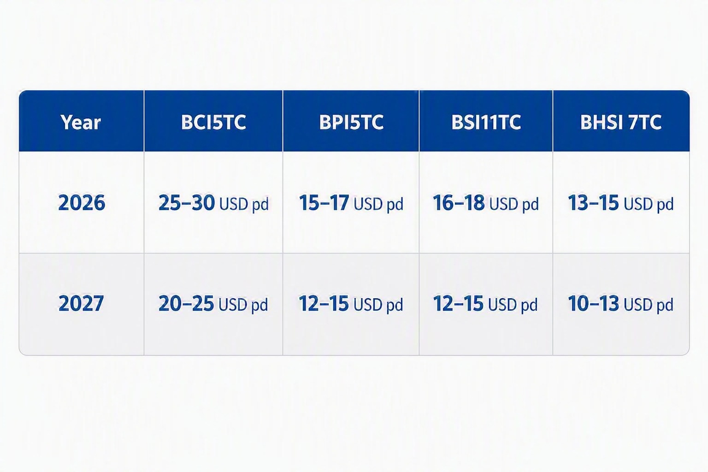

# Fearnleys Dry Bulk Market Outlook

**Date:** 2026-07-30 | **Department:** BULK | **Publisher:** Fearnleys AS  
**Original PDF:** [Download PDF](https://pbrkapp.blob.core.windows.net/report/21e4e00c-3d15-44cd-a218-058c36d67c9d/report.pdf)  

---

### SUMMARY AND OUTLOOK

In our previous update sent in late June, we wrote:

*Since our previous report, oil prices have dropped significantly. Based on the correlation between oil prices and BDI, included, as usual, in the final page of this report, the outlook for the second half of 2027 has thus improved considerably. That said, the volatility in energy markets and the complicated physical fundamental situation are unusual, so leading indicators like the one we use might not be as accurate as previously going forward. Regardless, the point is that low oil prices are good for economic growth, and vice versa. Coal volume growth has increased notably in the last few months. An opening of the Strait of Hormuz is a relief for macro but suppresses the upside potential in coal. Industrial metals prices have fallen over the last month, suggesting that global industrial activity is struggling to maintain upward momentum and may even be declining. That is especially the case in China, where iron ore and steel consumption remain lower than last year, and inventories remain higher. Global credit growth rates continue to fall, as reflected by a strengthening US dollar index. The dollar index correlates tightly with dry bulk volume growth and clearly suggests volume growth will continue to fall in the next few months.* 

Since our last report, oil prices have increased significantly, as a lasting solution between the US/Israel and Iran still seems far off. The recent rise in oil prices has caused the year-on-year change to increase from 0% in June to above 30% in July. The last few years' correlation between the year-on-year change of oil prices and the BDI thus suggests a negative development through the first half of 2027 (chart as usual shown on the last page of this report). Notwithstanding that negative outlook, Brent oil prices have averaged about 100 dollars per barrel since the Hormuz Strait closed. That price level calculates to an "oil expenditure to GDP ratio" of about 3%, which is the average ratio since 1970. In other words, we are still far from a global energy crisis by that measure, which is positive, relatively speaking. 
Iron ore fundamentals look weaker than they did a month ago. Steel mill profitability in China has fallen sharply, reaching its lowest level since September 2024, making a reduction in hot metal output very likely. In late 2024, the Cape/Newc market weakened significantly; with iron ore fundamentals now resembling that period, the risk of a similar market development is considerable. Minor bulk shipment growth has followed a similar path to iron ore, as global manufacturing momentum has faded. A stronger US dollar, higher US government bond yields, lower precious and industrial metals prices, and higher energy and grain prices all point to an emerging economic downcycle, suggesting that minor bulk shipment growth will decline going forward. The outlook for grains shipments is also not looking too bright according to the International Grains Council. Coal remains a different story, but seaborne supply remains a constraint, evident by the fact that shipments in the first half of this year were lower than in the first half of 2024. Still, the current energy market situation likely means supply will increase going forward.  
Overall, we think the spot market levels in May were the peak of this year. The Cape/Newc and Panamax/Kamsarmax segments seem to be on a "lower highs and lower lows" trajectory since then. The Supra/Ultra market has, over the last few weeks, displayed signs of weakness, and the Handysize market struggled to follow the Supra/Ultra market push in the first weeks of July - which it normally does.

> **Figure 1: Earnings Forecasts 26 and 27**  
> [Local Asset](file:////home/runner/work/Shipping/Shipping/corpus/01-brokers/fearnleys-md/images/62118945-2965-4faa-a7d1-c2f7c220f56b/Designer.jpg) | [Cloud Backup](https://pbrkapp.blob.core.windows.net/report/62118945-2965-4faa-a7d1-c2f7c220f56b/Designer.jpg)

> **Figure 2: Dry Bulk Shipment Volume Growth vs Supply Growth (All Segments)**  
> [Local Asset](file:////home/runner/work/Shipping/Shipping/corpus/01-brokers/fearnleys-md/images/21e4e00c-3d15-44cd-a218-058c36d67c9d/supply%20vs%20demand.png) | [Cloud Backup](https://pbrkapp.blob.core.windows.net/report/21e4e00c-3d15-44cd-a218-058c36d67c9d/supply vs demand.png)

---

### Fleet Statistics (In Million DWT)

> **Figure 3: Ship Sailing**  
> [Local Asset](file:////home/runner/work/Shipping/Shipping/corpus/01-brokers/fearnleys-md/images/436c0724-14ee-4032-bd46-544971cf69bf/SHIP%20SAILING.jfif) | [Cloud Backup](https://pbrkapp.blob.core.windows.net/report/436c0724-14ee-4032-bd46-544971cf69bf/SHIP SAILING.jfif)

---

## Fleet Growth and Forward Estimates (ex Scrapping and Delivery Delays or Cancellations)

> **Figure 4: Total Gross Fleet Growth Including Estimate**  
> [Local Asset](file:////home/runner/work/Shipping/Shipping/corpus/01-brokers/fearnleys-md/images/21e4e00c-3d15-44cd-a218-058c36d67c9d/total%20fleet%20growth.png) | [Cloud Backup](https://pbrkapp.blob.core.windows.net/report/21e4e00c-3d15-44cd-a218-058c36d67c9d/total fleet growth.png)

> **Figure 5: Cape/Newc Gross Fleet Growth Including Estimate**  
> [Local Asset](file:////home/runner/work/Shipping/Shipping/corpus/01-brokers/fearnleys-md/images/21e4e00c-3d15-44cd-a218-058c36d67c9d/capenewc%20fleet%20growth.png) | [Cloud Backup](https://pbrkapp.blob.core.windows.net/report/21e4e00c-3d15-44cd-a218-058c36d67c9d/capenewc fleet growth.png)

> **Figure 6: VLOC Fleet Gross Growth Including Estimate**  
> [Local Asset](file:////home/runner/work/Shipping/Shipping/corpus/01-brokers/fearnleys-md/images/21e4e00c-3d15-44cd-a218-058c36d67c9d/vloc%20fleet%20growth.png) | [Cloud Backup](https://pbrkapp.blob.core.windows.net/report/21e4e00c-3d15-44cd-a218-058c36d67c9d/vloc fleet growth.png)

> **Figure 7: Panamax/Kamsarmax Gross Fleet Growth Including Estimate**  
> [Local Asset](file:////home/runner/work/Shipping/Shipping/corpus/01-brokers/fearnleys-md/images/21e4e00c-3d15-44cd-a218-058c36d67c9d/panamax%20fleet%20growth.png) | [Cloud Backup](https://pbrkapp.blob.core.windows.net/report/21e4e00c-3d15-44cd-a218-058c36d67c9d/panamax fleet growth.png)

> **Figure 8: Supramax/Ultramax Gross Fleet Growth Including Estimate**  
> [Local Asset](file:////home/runner/work/Shipping/Shipping/corpus/01-brokers/fearnleys-md/images/21e4e00c-3d15-44cd-a218-058c36d67c9d/supramax%20fleet%20growth.png) | [Cloud Backup](https://pbrkapp.blob.core.windows.net/report/21e4e00c-3d15-44cd-a218-058c36d67c9d/supramax fleet growth.png)

> **Figure 9: Handysize Fleet Gross Growth Including Estimate**  
> [Local Asset](file:////home/runner/work/Shipping/Shipping/corpus/01-brokers/fearnleys-md/images/21e4e00c-3d15-44cd-a218-058c36d67c9d/handysize%20fleet%20growth.png) | [Cloud Backup](https://pbrkapp.blob.core.windows.net/report/21e4e00c-3d15-44cd-a218-058c36d67c9d/handysize fleet growth.png)

---

## PERIOD RATES AND ASSET VALUES

In our previous report in late June, we wrote:

*Values ex-Capes/Newcs have risen above the heights of 2024, following the development in 1-year TC rates. Further value increases now are hard to expect, given the correction in chartering markets. 

Newbuilding prices keep increasing, and going forward, the next year and a half, we do not see any major change to the general asset value situation/regime. I.e. if we are correct that chartering markets are in for a weaker period, the downside should be limited to the lows seen last year. 

In the case of Capes and Newcs, the situation is different and more complicated. As values kept climbing last year despite lower average earnings than in 2024, comparisons are harder to make. Capes/Newcs values have tracked the longer end of the futures curve in the last 5 years, so it seems a significant change has to happen there for there to be a significant change to values.*

Values increased slightly in July, as period rates increased for all segments at the start of July except Panamax/Kamsarmax, despite falling spot rates. However, in the last couple of weeks, period markets have softened a bit in the Handysize and Ultramax segments, whereas Capes/Newc remain around year-to-date highs still.

> **Figure 10: Capesize 1 Year TC vs Capesize 10 Year Old (Japanese)**  
> [Local Asset](file:////home/runner/work/Shipping/Shipping/corpus/01-brokers/fearnleys-md/images/21e4e00c-3d15-44cd-a218-058c36d67c9d/cape1yr%20tc%20vs%20asset.png) | [Cloud Backup](https://pbrkapp.blob.core.windows.net/report/21e4e00c-3d15-44cd-a218-058c36d67c9d/cape1yr tc vs asset.png)

> **Figure 11: Panamax/Kamsarmax 1 Year TC vs Panamax/Kamsarmax 10 Year Old (Japanese)**  
> [Local Asset](file:////home/runner/work/Shipping/Shipping/corpus/01-brokers/fearnleys-md/images/21e4e00c-3d15-44cd-a218-058c36d67c9d/panamax%201%20yr%20tc%20vs%20asset.png) | [Cloud Backup](https://pbrkapp.blob.core.windows.net/report/21e4e00c-3d15-44cd-a218-058c36d67c9d/panamax 1 yr tc vs asset.png)

> **Figure 12: Supramax/Ultramax 1 Year TC vs Supramax/Ultramax 10 Year Old (Japanese)**  
> [Local Asset](file:////home/runner/work/Shipping/Shipping/corpus/01-brokers/fearnleys-md/images/21e4e00c-3d15-44cd-a218-058c36d67c9d/Ultramax%201%20year%20tc%20vs%20asset.png) | [Cloud Backup](https://pbrkapp.blob.core.windows.net/report/21e4e00c-3d15-44cd-a218-058c36d67c9d/Ultramax 1 year tc vs asset.png)

> **Figure 13: Handysize 1 Year TC vs Handysize 10 Year Old (Japanese)**  
> [Local Asset](file:////home/runner/work/Shipping/Shipping/corpus/01-brokers/fearnleys-md/images/21e4e00c-3d15-44cd-a218-058c36d67c9d/handysize%201yr%20tc%20vs%20asset.png) | [Cloud Backup](https://pbrkapp.blob.core.windows.net/report/21e4e00c-3d15-44cd-a218-058c36d67c9d/handysize 1yr tc vs asset.png)

---

### Asset Values vs Commodity Prices

Since April, our view has been that values would peak between May and July. Our value assessments have increased each of the last few months, so for our prediction to be correct, values must trend sideways or downwards from now on. The correlations with copper prices and industrial metals in general clearly suggest that upward momentum has peaked, but also that there will not be a major correction for the remainder of this year. The loss of upwards momentum in industrial metals prices are also seen in spot markets, where the highs of May seems hard to surpass now for Capes and Panamaxes, whereas recent weakness have appeared in the Ultramax and Handysize segments as well.

> **Figure 14: Copper Price 6 Months Change (Lead 6 Months) vs Capesize 10 Year Old**  
> [Local Asset](file:////home/runner/work/Shipping/Shipping/corpus/01-brokers/fearnleys-md/images/21e4e00c-3d15-44cd-a218-058c36d67c9d/copper%20vs%20capesize.png) | [Cloud Backup](https://pbrkapp.blob.core.windows.net/report/21e4e00c-3d15-44cd-a218-058c36d67c9d/copper vs capesize.png)

> **Figure 15: Copper Price 6 Months Change (Lead 6 Months) vs Kamsarmax 10 Year Old**  
> [Local Asset](file:////home/runner/work/Shipping/Shipping/corpus/01-brokers/fearnleys-md/images/21e4e00c-3d15-44cd-a218-058c36d67c9d/copper%20vs%20kamsarmax.png) | [Cloud Backup](https://pbrkapp.blob.core.windows.net/report/21e4e00c-3d15-44cd-a218-058c36d67c9d/copper vs kamsarmax.png)

> **Figure 16: Copper Price vs Ultramax 10 Year Old**  
> [Local Asset](file:////home/runner/work/Shipping/Shipping/corpus/01-brokers/fearnleys-md/images/21e4e00c-3d15-44cd-a218-058c36d67c9d/copper%20vs%20ultramax.png) | [Cloud Backup](https://pbrkapp.blob.core.windows.net/report/21e4e00c-3d15-44cd-a218-058c36d67c9d/copper vs ultramax.png)

> **Figure 17: Copper Price vs Handysize 10 Year Old**  
> [Local Asset](file:////home/runner/work/Shipping/Shipping/corpus/01-brokers/fearnleys-md/images/21e4e00c-3d15-44cd-a218-058c36d67c9d/copper%20vs%20handysize.png) | [Cloud Backup](https://pbrkapp.blob.core.windows.net/report/21e4e00c-3d15-44cd-a218-058c36d67c9d/copper vs handysize.png)

---

## TRADE FLOWS YEAR ON YEAR GROWTH

---

## MACRO ECONOMIC OUTLOOK

This page gives brief comments on what the charts on the next page tell us. We have pointed to an increasingly bearish picture being painted for the second half of this year and the next year over the last months. Shipment volume growth has tumbled sharply, and the next page's indicators suggest this development will continue.

Top left chart:

The BDI year-on-year change has been strongly positive since September last year, as usual, lagging behind increased credit growth in China. 
However, the credit growth rate has tumbled sharply during the last few months, which suggests a negative BDI development going forward. Interest rates and reserve requirement ratio changes do not point to any imminent turnaround in China's liquidity conditions. 

Top right chart:

Except for a decoupling in 2024, the change in bond yields in China and the US has been a good leading indicator for dry bulk demand growth. This year it has so far called the demand growth development perfectly, as growth has tumbled sharply following the peak in Q2. 

Middle left chart:

Lower crude oil prices are bullish for economic growth, and vice versa. The chart displays that since 2017, there has been a tight correlation between lower year-on-year oil prices and a higher year-on-year BDI, with the oil price change leading by 1 year. 
Lower oil prices suggest the BDI could remain positive year-on-year throughout 2026. However, the increase in oil prices since late February suggest the market will be lower during the first half of next year. 

Middle right chart:

The OECD diffusion index momentum keeps falling, and suggest the year on year change of the BDI will turn less and less positive over the coming six months. 

Bottom left chart:

The OECD diffusion index correlation with the BDI is very high, as usual. The OECD index reading is comparable to previous cycle peaks. The index seems to be tipping over, as the reading has fallen from 18 between January and April to 16 in June. 

Bottom right chart:

Shipment volume growth has, as usual, tracked the development of the US dollar index (a very good proxy for global liquidity conditions).

> **Figure 18: Baltic Dry Index Year on Year Change vs China Credit Growth (12 Months Lead)**  
> [Local Asset](file:////home/runner/work/Shipping/Shipping/corpus/01-brokers/fearnleys-md/images/21e4e00c-3d15-44cd-a218-058c36d67c9d/CHINA%20CREDIT%20vs%20BDI.png) | [Cloud Backup](https://pbrkapp.blob.core.windows.net/report/21e4e00c-3d15-44cd-a218-058c36d67c9d/CHINA CREDIT vs BDI.png)

> **Figure 19: China + US Gov Bond Yield Change, 18 Months Lead. vs Dry Bulk Demand Growth**  
> [Local Asset](file:////home/runner/work/Shipping/Shipping/corpus/01-brokers/fearnleys-md/images/21e4e00c-3d15-44cd-a218-058c36d67c9d/INTEREST%20RATES%20VS%20DRY%20BULK%20DEMAND.png) | [Cloud Backup](https://pbrkapp.blob.core.windows.net/report/21e4e00c-3d15-44cd-a218-058c36d67c9d/INTEREST RATES VS DRY BULK DEMAND.png)

> **Figure 20: WTI Crude Oil Price YoY, 1 Year Lead vs BDI YoY**  
> [Local Asset](file:////home/runner/work/Shipping/Shipping/corpus/01-brokers/fearnleys-md/images/21e4e00c-3d15-44cd-a218-058c36d67c9d/CRUDE%20OIL%20PRICE%20LEAD%20VS%20BDI.png) | [Cloud Backup](https://pbrkapp.blob.core.windows.net/report/21e4e00c-3d15-44cd-a218-058c36d67c9d/CRUDE OIL PRICE LEAD VS BDI.png)

> **Figure 21: OECD Diffusion Index 6 Months Change vs BDI YoY**  
> [Local Asset](file:////home/runner/work/Shipping/Shipping/corpus/01-brokers/fearnleys-md/images/21e4e00c-3d15-44cd-a218-058c36d67c9d/OECD%20Diffusion%20Index%206m%20change%206m%20lead%20vs%20BDI%20YoY.png) | [Cloud Backup](https://pbrkapp.blob.core.windows.net/report/21e4e00c-3d15-44cd-a218-058c36d67c9d/OECD Diffusion Index 6m change 6m lead vs BDI YoY.png)

> **Figure 22: OECD G-20 Diffusion Index vs BDI YoY**  
> [Local Asset](file:////home/runner/work/Shipping/Shipping/corpus/01-brokers/fearnleys-md/images/21e4e00c-3d15-44cd-a218-058c36d67c9d/OECD%20Diffusion%20Index%20vs%20BDI%20YoY.png) | [Cloud Backup](https://pbrkapp.blob.core.windows.net/report/21e4e00c-3d15-44cd-a218-058c36d67c9d/OECD Diffusion Index vs BDI YoY.png)

> **Figure 23: Broad US Dollar Index Year on Year vs Dry Bulk Shipment Volume Growth**  
> [Local Asset](file:////home/runner/work/Shipping/Shipping/corpus/01-brokers/fearnleys-md/images/21e4e00c-3d15-44cd-a218-058c36d67c9d/dollar%20vs%20dry%20bulk%20demand.png) | [Cloud Backup](https://pbrkapp.blob.core.windows.net/report/21e4e00c-3d15-44cd-a218-058c36d67c9d/dollar vs dry bulk demand.png)
