# Fearnleys Tanker Market Wrap-up Sep 2026

**Date:** 2026-09-25 | **Department:** TANK | **Publisher:** Fearnleys AS  
**Original PDF:** [Download PDF](https://pbrkapp.blob.core.windows.net/report/0be848a1-a006-4a49-b2d4-c406e1fe4d29/report.pdf)  

---

## Uncharted. Off the charts. Still standing...

### Summary and outlook

Over the last month refinery margins have strengthened further, accommodating higher oil prices and record freight. Thus, the conditions for a paradoxical equilibrium in which rates can stay at staggering heights still hold. On top of previously highlighted disruptions and inefficiencies, there is now increasing export volumes from both the MEG and other areas - last week global loadings were for the first time above pre-war levels. 

The outlook is not without downside risks for rates (who would have thought, from all time highs..?) - the biggest of which are a U.S.-Iran deal (although a more sustainably solid demand scenario for the next 12-18 months) and a significant escalation (lower volumes and potential demand destruction from higher energy prices). 

For now, however, volumes look set to continue growing, and then there are seasonal factors to come too... Not to mention a potential U.S. gasoil export ban which may further boost crude tanker and LR demand. As long as oil pricing can handle it, the rate momentum can last - key indicators to watch will be physical oil price premiums vs. futures and crack spreads.

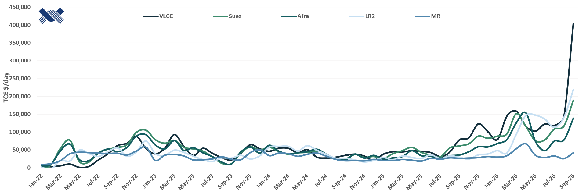

> **Figure 1: Monthly average rates - constantly adjusting the Y-axis**  
> [Local Asset](file:////home/runner/work/Shipping/Shipping/corpus/01-brokers/fearnleys-md/images/0be848a1-a006-4a49-b2d4-c406e1fe4d29/rates.png) | [Cloud Backup](https://pbrkapp.blob.core.windows.net/report/0be848a1-a006-4a49-b2d4-c406e1fe4d29/rates.png)

### Volumes nearly recovered - demand at all-time-high

More and more crude oil makes its way through the Hormuz Strait, 10 mbpd at the most recent reading, which coupled with other outlets has brought total crude loadings back above the pre-war level. There may be further upside near-term as MEG producers ramp up further (normally reliable sources now suggest that transits may even have risen further toward 12 mbpd), seasonal exports ramp up from the Americas, possible continued SPR releases and a proposed U.S. gasoil/diesel export ban. Recent reports about the two latter points have driven USG export arbitrages to open again in recent days. 

The increased crude flow has in turn spurred higher refinery runs and products exports, although the latter has not quite yet caught up as much as crude. There should be more to come given greater crude availability and very high refinery margins.

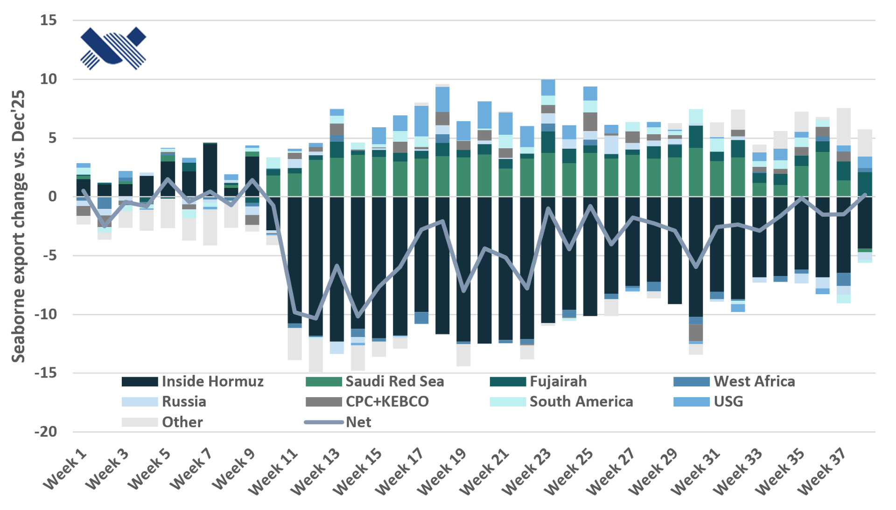

> **Figure 2: Seaborne crude oil loadings vs. Dec'25**  
> [Local Asset](file:////home/runner/work/Shipping/Shipping/corpus/01-brokers/fearnleys-md/images/0be848a1-a006-4a49-b2d4-c406e1fe4d29/flowc.png) | [Cloud Backup](https://pbrkapp.blob.core.windows.net/report/0be848a1-a006-4a49-b2d4-c406e1fe4d29/flowc.png)

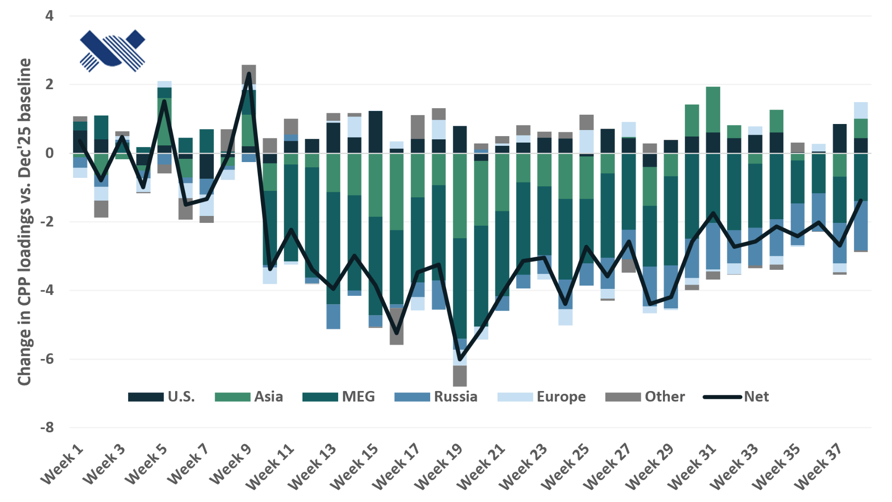

> **Figure 3: Seaborne oil product loadings vs. Dec'25**  
> [Local Asset](file:////home/runner/work/Shipping/Shipping/corpus/01-brokers/fearnleys-md/images/0be848a1-a006-4a49-b2d4-c406e1fe4d29/flowp.png) | [Cloud Backup](https://pbrkapp.blob.core.windows.net/report/0be848a1-a006-4a49-b2d4-c406e1fe4d29/flowp.png)

Although it was the case a few weeks ago, the most potent leg of the rate rally has not been arbitrage driven, but rather a sourcing driven rally. Despite increasing Hormuz transits the physical oil market is tight, as SPR releases slow and Chinese buyers have stepped back into the market. This can be seen in a steepening backwardation in oil forward curves, and again big premiums for physical vs. futures. As in previous instances, fears of oil shortages drive hoarding, where securing the barrels and ships trump cost - hence producing these phenomenal rates. This time forward curve backwardation is steeper than in other instances, such as 2004-05, 2008, 2019 and 2022, and producing higher rates - partly also as the tanker market balance was very tight already going into this. 

The rally has also been fueled by very high refinery margins, particularly for diesel. What is so far lacking is some follow/up for MR rates in the Atlantic basin vs. those strong crack spreads - diverging from the normal relation, partly due to an overhang of tonnage. With better fortunes in the Pacific, however, due to the significant difference in earnings, there should be some West-East migration of tonnage going forward. Crude economics even justify dirtying up MRs for Atlantic-East voyages - still returning vast TCEs after accounting for clean-up.

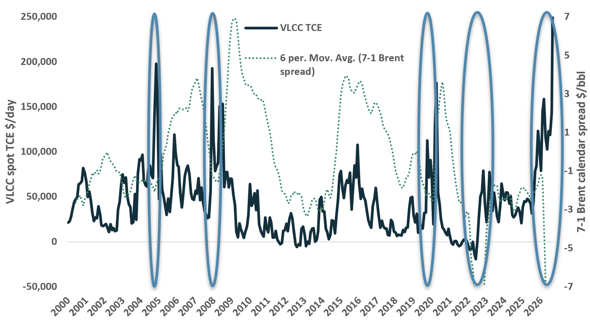

> **Figure 4: Brent fwd. spread vs. VLCC rates**  
> [Local Asset](file:////home/runner/work/Shipping/Shipping/corpus/01-brokers/fearnleys-md/images/0be848a1-a006-4a49-b2d4-c406e1fe4d29/fwd.png) | [Cloud Backup](https://pbrkapp.blob.core.windows.net/report/0be848a1-a006-4a49-b2d4-c406e1fe4d29/fwd.png)

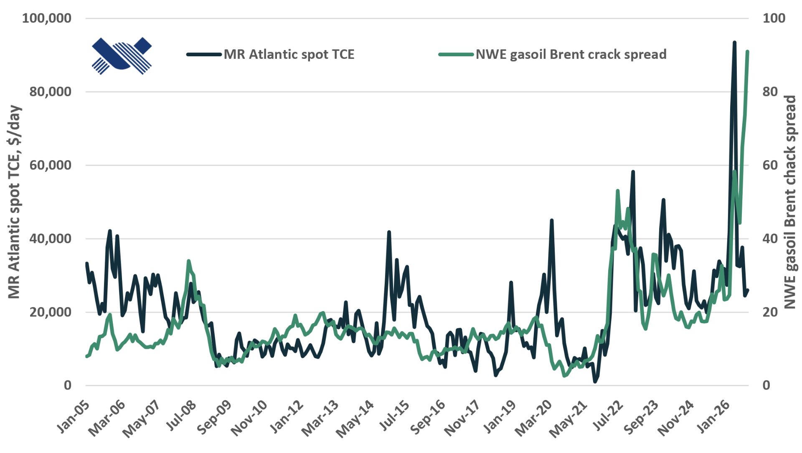

> **Figure 5: Northwest Europe gasoil crack vs. Atlantic MR rates**  
> [Local Asset](file:////home/runner/work/Shipping/Shipping/corpus/01-brokers/fearnleys-md/images/0be848a1-a006-4a49-b2d4-c406e1fe4d29/crackmr.png) | [Cloud Backup](https://pbrkapp.blob.core.windows.net/report/0be848a1-a006-4a49-b2d4-c406e1fe4d29/crackmr.png)

In line with rising volumes and persistent inefficiencies, tonne-day demand has risen again over the last month. Here too, crude leads the way with the biggest m/m gains, but products slowly catching up. VLCCs still lag the other crude tanker segments in terms of explicit demand, but more idle ships, congestion and waiting time, coupled with bad weather in the Far East has given a very tight position list, which makes up for that difference and produces these vast rates. 

The increased flow out of Hormuz has seemingly exhausted GOO STS capacity, with more requests for STS off India instead over the last few weeks, as more Saudi volumes have come into play too. In other words, no efficiency gains just yet, with waiting time likely to persist. As long as this flow is maintained, while there is also a pull of Atlantic cargoes to the (Far) East demand may continue growing near-term and into year-end.

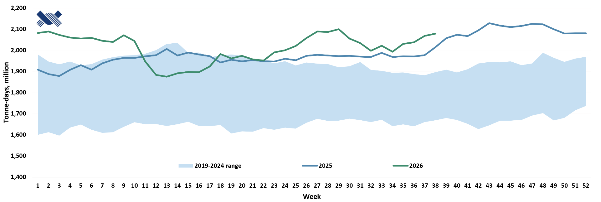

> **Figure 6: Total tanker tonne-day demand (+3% YTD)**  
> [Local Asset](file:////home/runner/work/Shipping/Shipping/corpus/01-brokers/fearnleys-md/images/0be848a1-a006-4a49-b2d4-c406e1fe4d29/tmtot.png) | [Cloud Backup](https://pbrkapp.blob.core.windows.net/report/0be848a1-a006-4a49-b2d4-c406e1fe4d29/tmtot.png)

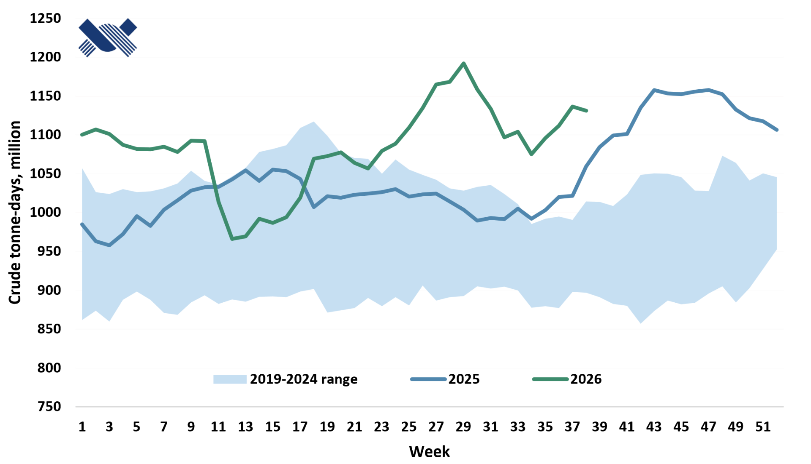

> **Figure 7: Total crude tanker tonne-day demand (+7% YTD)**  
> [Local Asset](file:////home/runner/work/Shipping/Shipping/corpus/01-brokers/fearnleys-md/images/0be848a1-a006-4a49-b2d4-c406e1fe4d29/tmc.png) | [Cloud Backup](https://pbrkapp.blob.core.windows.net/report/0be848a1-a006-4a49-b2d4-c406e1fe4d29/tmc.png)

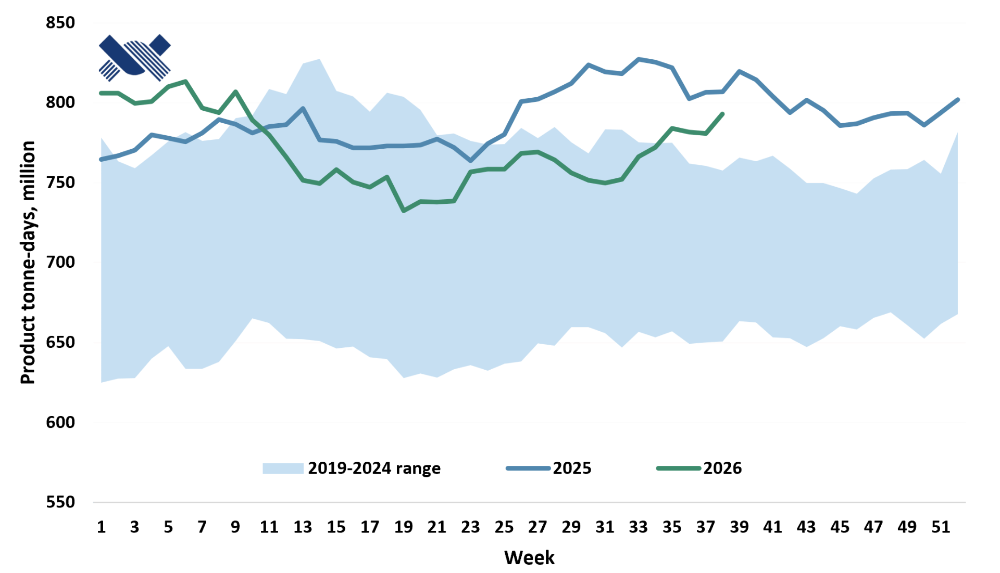

> **Figure 8: Total product tanker tonne-day demand (-2% YTD)**  
> [Local Asset](file:////home/runner/work/Shipping/Shipping/corpus/01-brokers/fearnleys-md/images/0be848a1-a006-4a49-b2d4-c406e1fe4d29/tmp.png) | [Cloud Backup](https://pbrkapp.blob.core.windows.net/report/0be848a1-a006-4a49-b2d4-c406e1fe4d29/tmp.png)

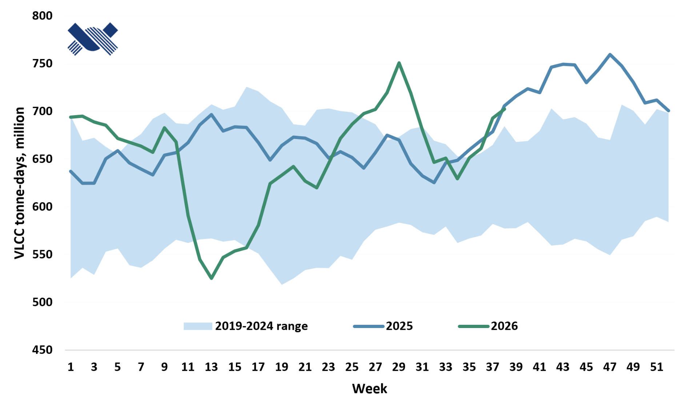

> **Figure 9: Total VLCC tonne-day demand (-1% YTD)**  
> [Local Asset](file:////home/runner/work/Shipping/Shipping/corpus/01-brokers/fearnleys-md/images/0be848a1-a006-4a49-b2d4-c406e1fe4d29/tmv.png) | [Cloud Backup](https://pbrkapp.blob.core.windows.net/report/0be848a1-a006-4a49-b2d4-c406e1fe4d29/tmv.png)

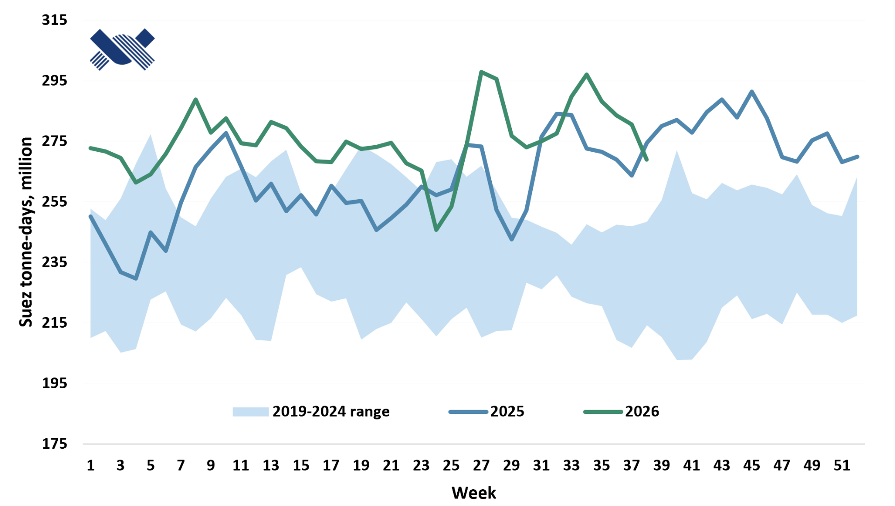

> **Figure 10: Total Suez tonne-day demand (+6% YTD)**  
> [Local Asset](file:////home/runner/work/Shipping/Shipping/corpus/01-brokers/fearnleys-md/images/0be848a1-a006-4a49-b2d4-c406e1fe4d29/tms.png) | [Cloud Backup](https://pbrkapp.blob.core.windows.net/report/0be848a1-a006-4a49-b2d4-c406e1fe4d29/tms.png)

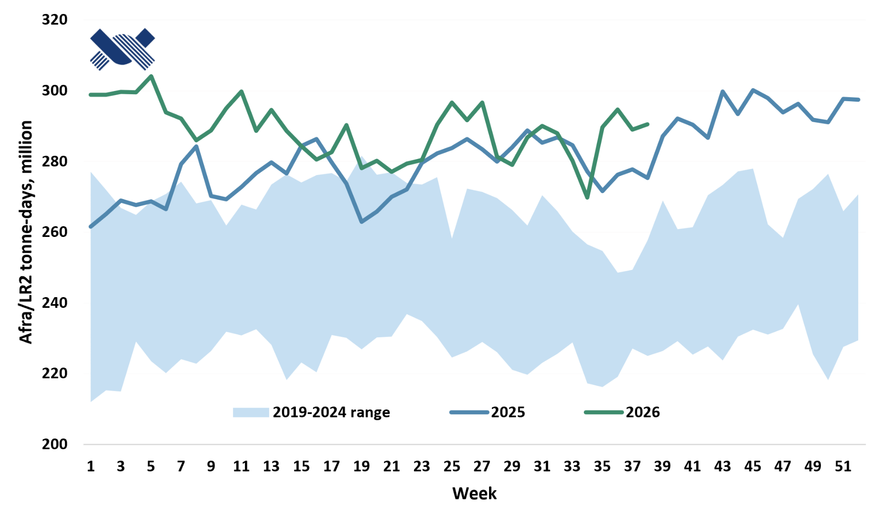

> **Figure 11: Total Afra/LR2 tonne-day demand (+4% YTD)**  
> [Local Asset](file:////home/runner/work/Shipping/Shipping/corpus/01-brokers/fearnleys-md/images/0be848a1-a006-4a49-b2d4-c406e1fe4d29/tma.png) | [Cloud Backup](https://pbrkapp.blob.core.windows.net/report/0be848a1-a006-4a49-b2d4-c406e1fe4d29/tma.png)

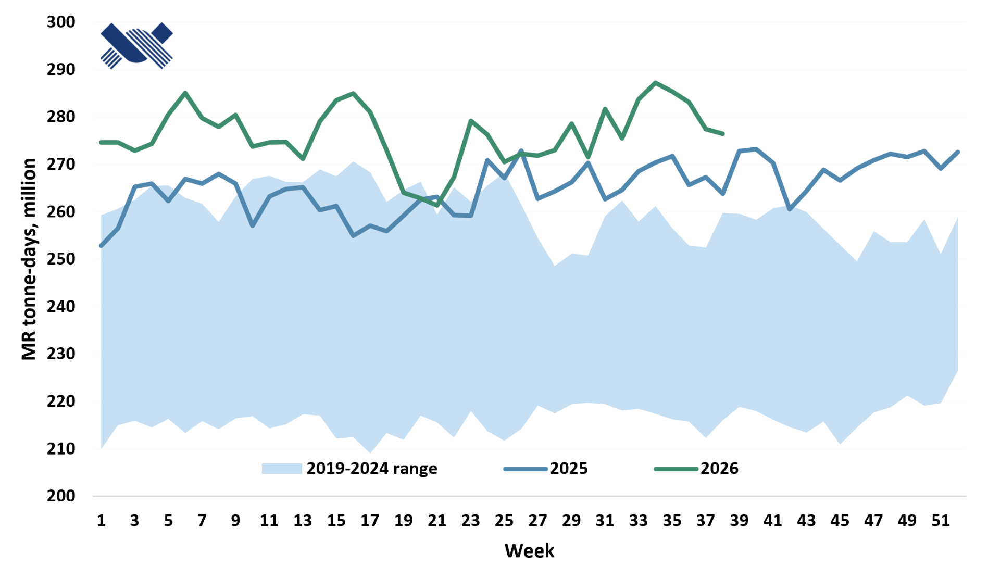

> **Figure 12: Total MR tonne-day demand (+5% YTD)**  
> [Local Asset](file:////home/runner/work/Shipping/Shipping/corpus/01-brokers/fearnleys-md/images/0be848a1-a006-4a49-b2d4-c406e1fe4d29/tmm.png) | [Cloud Backup](https://pbrkapp.blob.core.windows.net/report/0be848a1-a006-4a49-b2d4-c406e1fe4d29/tmm.png)

### Oil market still short and supportive

Onshore stocks have gently eased since hitting a peak in March, accelerating a bit most recently, to bring draws to 180 mb. Over the same period, however, compliant crude oil on the water has risen by nearly the same amount. Non-compliant crude on the water has drawn by 130 mb. That is much less draws than feared, a balance has largely been shored up by China as a swing buyer and lower global refinery runs. The latter means the real tightness is in products, as also reflected in crack spreads. 

The draw-down of non-compliant crude oil also explains why Chinese buyers have been more active in the crude market recently - as does a rebound in Chinese refinery runs.

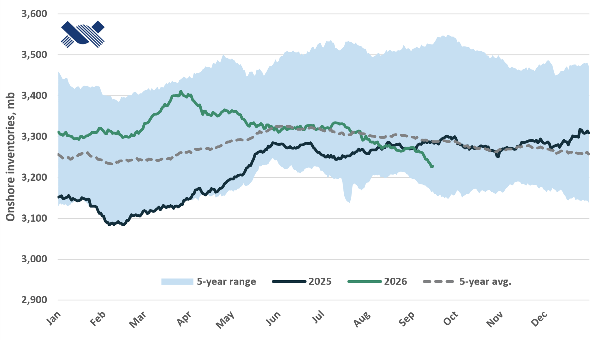

> **Figure 13: Global onshore crude oil storage**  
> [Local Asset](file:////home/runner/work/Shipping/Shipping/corpus/01-brokers/fearnleys-md/images/0be848a1-a006-4a49-b2d4-c406e1fe4d29/onshore.png) | [Cloud Backup](https://pbrkapp.blob.core.windows.net/report/0be848a1-a006-4a49-b2d4-c406e1fe4d29/onshore.png)

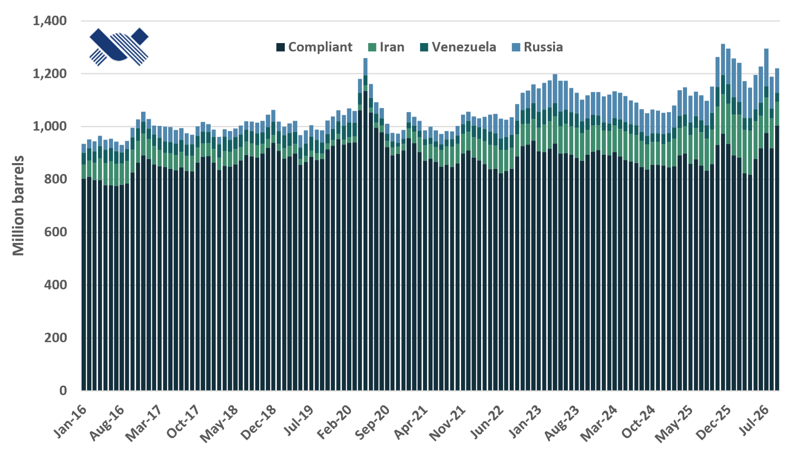

> **Figure 14: Crude oil on the water by source**  
> [Local Asset](file:////home/runner/work/Shipping/Shipping/corpus/01-brokers/fearnleys-md/images/0be848a1-a006-4a49-b2d4-c406e1fe4d29/oow.png) | [Cloud Backup](https://pbrkapp.blob.core.windows.net/report/0be848a1-a006-4a49-b2d4-c406e1fe4d29/oow.png)

Chinese refinery runs recovered to nearly 14 mbpd in August, from a low of 12.5 mbpd the preceding months. This is still 1 mbpd shy of the same month last year. Meanwhile, apparent main products demand has been 6% lower y/y through the first eight months of the year, and remained down 1.3 mbpd in August. It remains to be seen whether this is structural (in line with other industrial indicators), or a controlled temporary adjustment. 

There may be some recovery going forward, but a further recovery for runs perhaps to a greater extent rests on the export market, for which economics are highly supportive especially considering the global gasoil shortage. All eyes on potential additional export quotas - or a lift for the government imposed ceiling for domestic product prices.

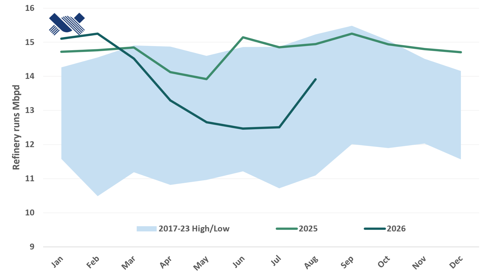

> **Figure 15: Chinese refinery runs rebounding**  
> [Local Asset](file:////home/runner/work/Shipping/Shipping/corpus/01-brokers/fearnleys-md/images/0be848a1-a006-4a49-b2d4-c406e1fe4d29/runchina.png) | [Cloud Backup](https://pbrkapp.blob.core.windows.net/report/0be848a1-a006-4a49-b2d4-c406e1fe4d29/runchina.png)

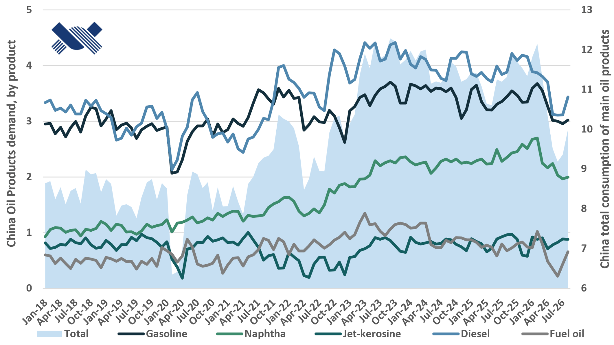

> **Figure 16: Apparent demand still low, but recovering slightly**  
> [Local Asset](file:////home/runner/work/Shipping/Shipping/corpus/01-brokers/fearnleys-md/images/0be848a1-a006-4a49-b2d4-c406e1fe4d29/chidem.png) | [Cloud Backup](https://pbrkapp.blob.core.windows.net/report/0be848a1-a006-4a49-b2d4-c406e1fe4d29/chidem.png)

Refinery margins have continued to strengthen over the last month, mainly on capacity constraints but partly also relatively resilient demand. This should incentivise higher runs, but capacity other than in China is mostly maxed out. There should still be some more recovery through year-end, supporting product tanker demand.

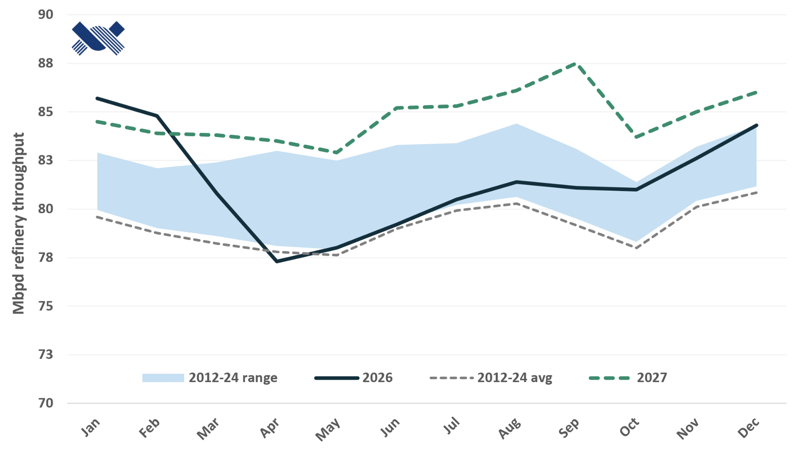

> **Figure 17: Global refinery runs**  
> [Local Asset](file:////home/runner/work/Shipping/Shipping/corpus/01-brokers/fearnleys-md/images/0be848a1-a006-4a49-b2d4-c406e1fe4d29/refrun.png) | [Cloud Backup](https://pbrkapp.blob.core.windows.net/report/0be848a1-a006-4a49-b2d4-c406e1fe4d29/refrun.png)

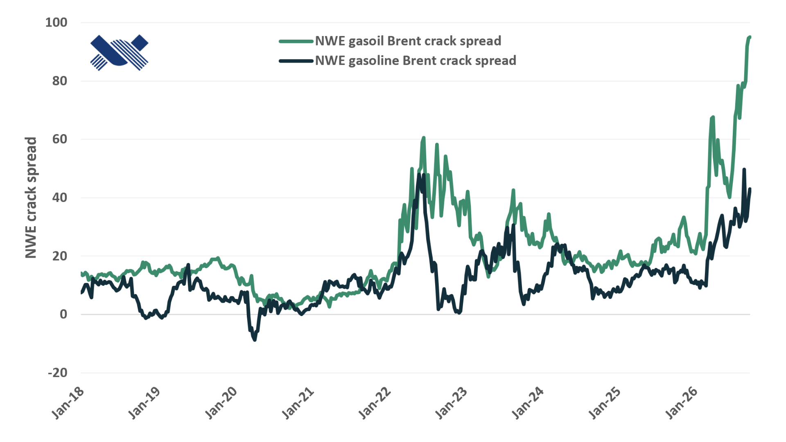

> **Figure 18: Northwest Europe crack spreads**  
> [Local Asset](file:////home/runner/work/Shipping/Shipping/corpus/01-brokers/fearnleys-md/images/0be848a1-a006-4a49-b2d4-c406e1fe4d29/refeu.png) | [Cloud Backup](https://pbrkapp.blob.core.windows.net/report/0be848a1-a006-4a49-b2d4-c406e1fe4d29/refeu.png)

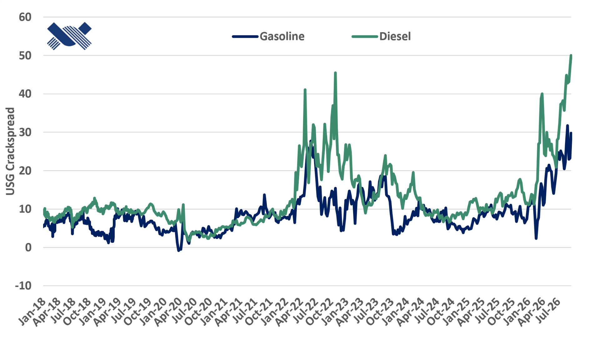

> **Figure 19: U.S. Gulf Coast crack spreads**  
> [Local Asset](file:////home/runner/work/Shipping/Shipping/corpus/01-brokers/fearnleys-md/images/0be848a1-a006-4a49-b2d4-c406e1fe4d29/Refus.png) | [Cloud Backup](https://pbrkapp.blob.core.windows.net/report/0be848a1-a006-4a49-b2d4-c406e1fe4d29/Refus.png)

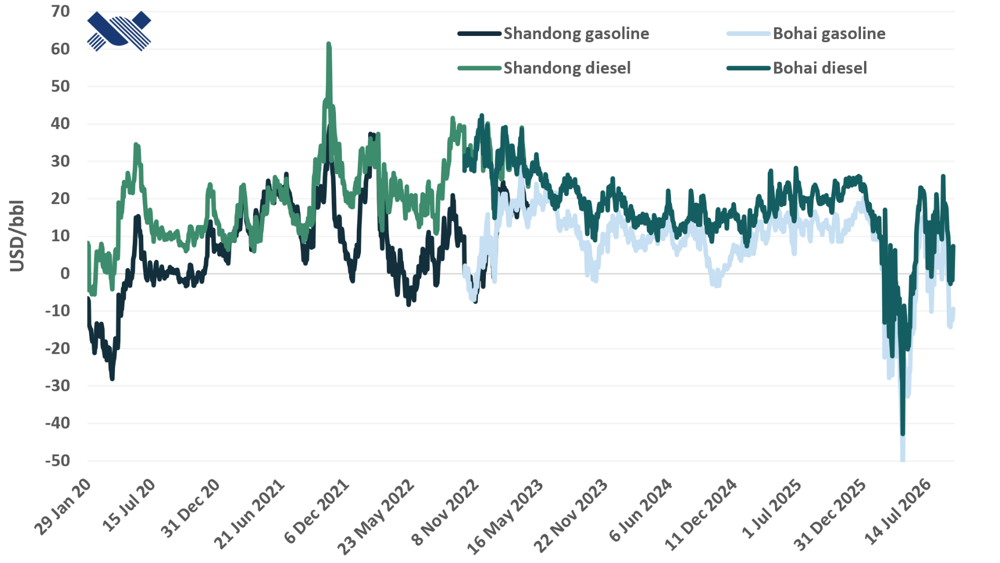

> **Figure 20: Bohai Bay crack spreads**  
> [Local Asset](file:////home/runner/work/Shipping/Shipping/corpus/01-brokers/fearnleys-md/images/0be848a1-a006-4a49-b2d4-c406e1fe4d29/refchi.png) | [Cloud Backup](https://pbrkapp.blob.core.windows.net/report/0be848a1-a006-4a49-b2d4-c406e1fe4d29/refchi.png)

### Another layer - potential 90 day U.S. gasoil export ban

The U.S. makes up 18% of global gasoil/diesel seaborne loadings YTD, hence an export ban or restriction can cause further shortages, especially in the Atlantic basin (continued Russia diesel ban does not help either). Global gasoil loadings have recovered nearly all lost ground post the U.S.-Iran conflict - mostly driven by the U.S. Asian and MEG refiners might make up for some U.S. shortfall on better crude availability and more Hormuz CPP transits. Asian gasoil crack spreads are also likely to strengthen, supporting higher refinery runs wherever possible. 

The primary effect on tankers is lower TC14 demand and therefore lower Atlantic MR rates. However, there may also be scrambling for East-West gasoil fixtures, boosting an already firm Pacific market. Coupled with other inefficiencies, this is a very potent set-up for LR2s, of which about two thirds are currently tied up in dirty trade. There could thus be spillover also for smaller vessels as fleet positioning can again be wrong-footed. 

A full export ban can trap USGC gasoil/diesel onshore as there is 'only' 15-20 mb upside to 10-year highs for U.S. Gulf Coast distillate inventories - which would only take 2-3 weeks to fill. Workarounds such as tweaks and optimisation of refinery output to minimise distillates and maximise gasoline, and Jones Act tankers to shuttle excess gasoil to other regions, are only minor at this scale. 30% of U.S. refinery output is distillates, hence up to 3-4 mbpd of runs may worst case be at risk. This could in turn drive U.S. gasoil prices higher (talk about a policy error..) and drive TC2 import demand, offsetting some Atlantic MR weakness. Another secondary effect is (much) softer WTI with excess crude, reopening  export arbitrages. This could also come at the same time as the U.S. may release another 30 mb from SPR - further boosting potential USG crude oil exports.

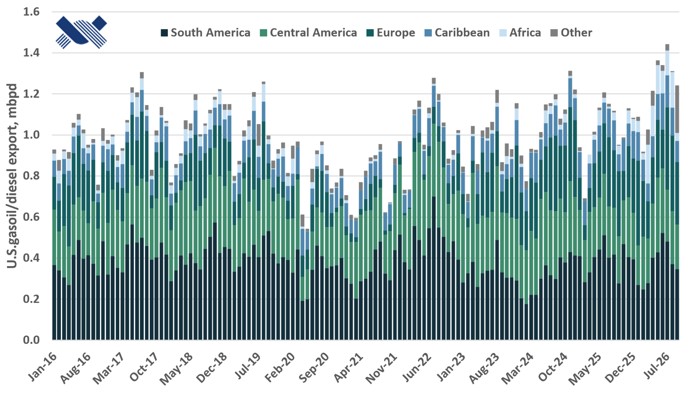

> **Figure 21: U.S. Gasoil/diesel exports by destination**  
> [Local Asset](file:////home/runner/work/Shipping/Shipping/corpus/01-brokers/fearnleys-md/images/0be848a1-a006-4a49-b2d4-c406e1fe4d29/usgas.png) | [Cloud Backup](https://pbrkapp.blob.core.windows.net/report/0be848a1-a006-4a49-b2d4-c406e1fe4d29/usgas.png)

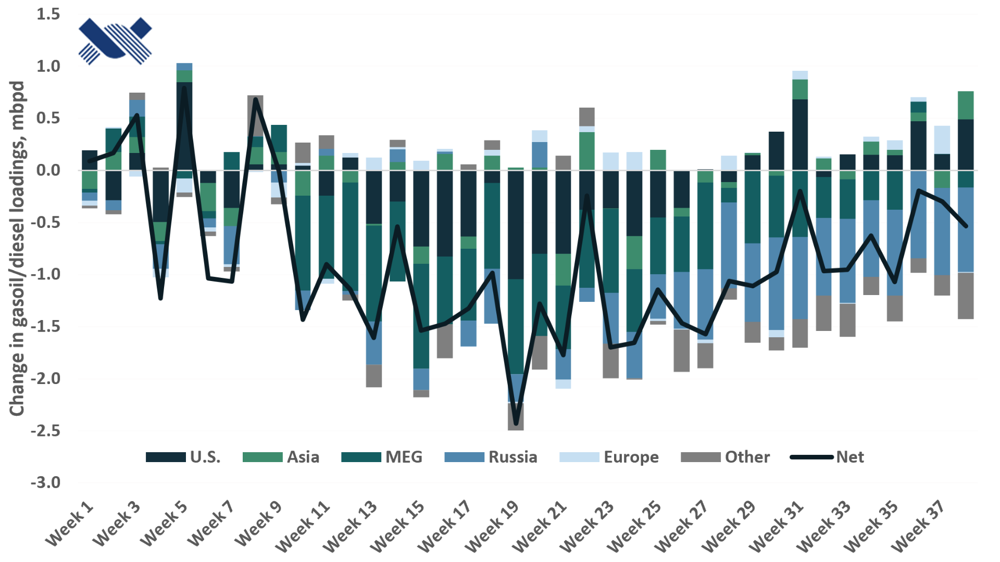

> **Figure 22: Global gasoil/diesel loadings vs. Dec'25 baseline**  
> [Local Asset](file:////home/runner/work/Shipping/Shipping/corpus/01-brokers/fearnleys-md/images/0be848a1-a006-4a49-b2d4-c406e1fe4d29/gasoil.png) | [Cloud Backup](https://pbrkapp.blob.core.windows.net/report/0be848a1-a006-4a49-b2d4-c406e1fe4d29/gasoil.png)

### Some thoughts on next year - more oil almost balances more ships

The range of outcomes going into next year is vast, considering the layers of geopolitical factors which may affect the market. Setting that aside, however, there is solid volume growth potential, which may offset accelerating fleet growth. 

The EIA projects nearly 1.2 mbpd of crude oil production growth in the Americas next year, significantly higher growth than previously estimated due to higher activity amid supportive oil prices. That is consistent with the IEA, who on top of that forecasts significant growth mainly for the UAE, taking total non-OPEC+ growth next year to 2.5 mbpd. 

A bigger question mark for next year is refining. The IEA's 3 mbpd run growth estimate partly suggests a normalisation (only 0.5 mbpd higher than 2025) in Hormuz with nearly half of the increase coming in the MEG. The rest is mainly Asia, whiich is more doable considering better crude availability re. non-OPEC+ growth. The relatively small increase in global runs next year suggests refinery margins may remain high - which for product tankers may mean somewhat better demand prospects than otherwise negligible volume growth would suggest. 

2.5 mbpd of non-OPEC+ crude oil supply growth may be enough to just about balance the market next year - especially as nearly half of it gives potential for long-haul flow. Gross scheduled fleet growth is set to rise from 5.8% this year to 6.5% next year. Not a lot of scrapping can be expected, but as seen this year, there may be some casualties and forced retirements. Should that limit net fleet growth next year to about 5%, that would only mean a slightly less tight market balance than now. 

That means historically very elevated rates may persist - in line with what current 1-year TC rates suggest, albeit off the extreme current levels.
