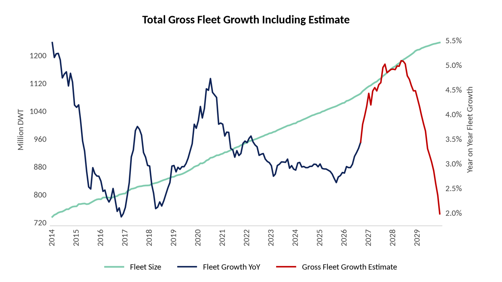
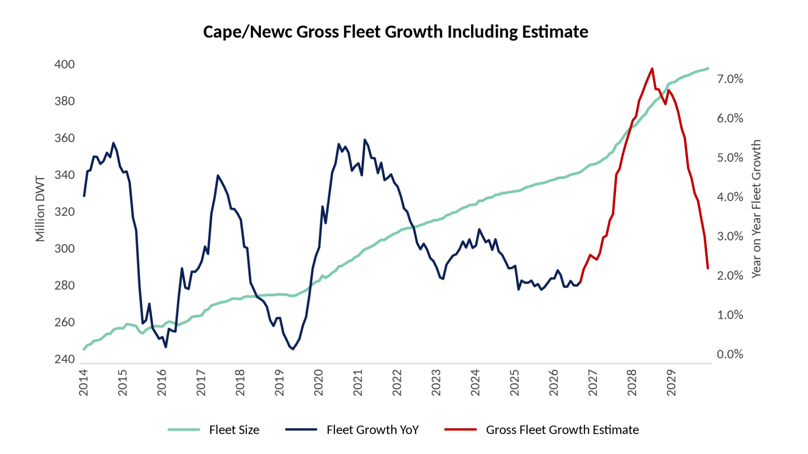
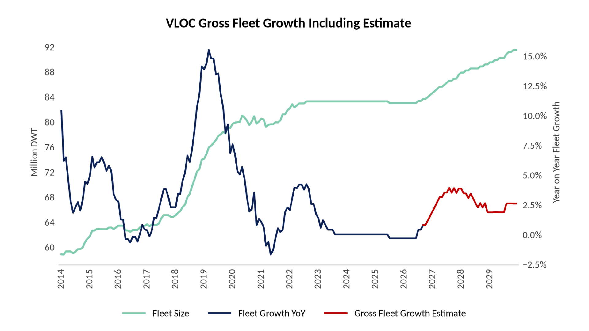
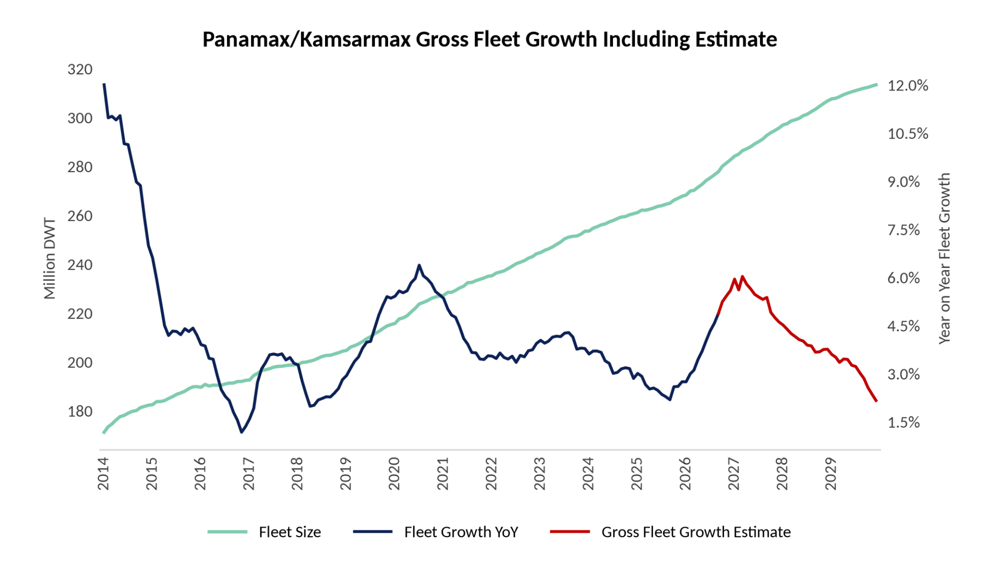
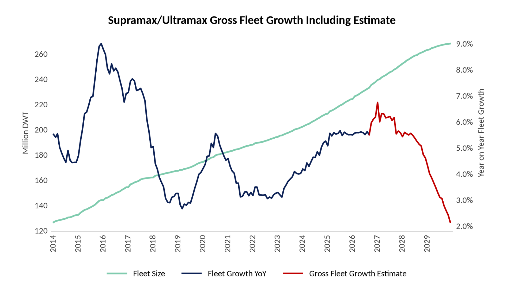
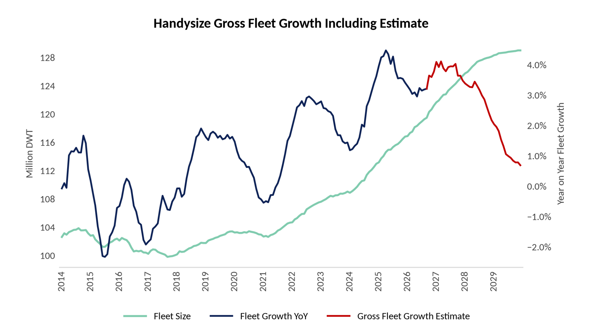

# Fearnleys Dry Bulk Market Outlook

**Date:** 2026-09-30 | **Department:** BULK | **Publisher:** Fearnleys AS  
**Original PDF:** [Local PDF](../pdfs/2026/2026-09-30_fearnleys-dry-bulk-market-outlook-august-2026-6.pdf) | [Cloud Backup](https://pbrkapp.blob.core.windows.net/report/4d554557-4e28-4e1a-82f2-c7f9758d7fa6/report.pdf)  

---

### SUMMARY AND OUTLOOK

Total global shipment volume growth continues to fall, and quite significantly so. On a 3-month average basis, through week 39 of this year, volume growth was just 0.7 %. Ton-time growth remains higher, with preliminary estimates showing that growth was 4.4% through the same period - down from 9.0% three months ago. DWT supply growth is 3.4%, rising slightly from the low of 2.8% earlier this year. The decline in volume and ton-time growth has come in accordance with our expectations, but market levels have gone the opposite way, which is highly unusual to see. What explains this divergence? The answer is not entirely clear to us. Sentiment in commodity markets certainly explains some of it, and headline volume and ton-time figures might not capture the inefficiencies to the full extent. Regardless, we remain bearish on volume growth and therefore still expect lower markets in 2027. 

Iron Ore

Fundamentals have been soft for several months, and have deteriorated further in August and September. 
In China, steel production is down 3% compared to the same period last year, whereas blast furnace iron ore output is down 0.5%. Profit margins at steel mills have fallen sharply since April and are now deeply negative. Only 6% of steel mills are reportedly making a profit, as of the end of September. 
Iron ore inventories in Chinese ports remain elevated. Total inventories were 172 million tons at the latest reading, up 18% on the same period last year. Beneath the headline figure, there is a clear difference between inventory levels, as the bulk of the oversupply is Australian iron ore, whereas Brazilian iron ore inventory levels remain low. The latter, we think, is a reflection of the underlying trend of a preference for higher grades of iron ore amongst steel mills. Further, it probably means that South Atlantic shipment volumes will remain stable, even as the outlook for the rest of the World is more bearish. 
Due to weaker underlying fundamentals, iron ore shipment volume growth has tumbled quite sharply, with the 6-months average growth rate dropping from 8% in February to -1% in August. We do not expect growth to improve over the coming 9 to 12 months. So, why has the Cape/Newc market performed so strongly over the last few months, coincident with the weakening of iron ore? Because Bauxite shipments have performed exceptionally well. 

Bauxite

China's Bauxite imports seem excessive when compared to underlying fundamentals. Aluminium production has not increased compared to 2025 levels, whereas Bauxite imports are on track to rise by around 12%. As a result of this discrepancy, inventories have accumulated in both ports and at coastal Alumina refineries, with the latter reportedly at over 90 days of consumption. Bauxite exporters and Alumina producers largely have negative profit margins. At some point, shipment flows have to adjust to the onshore reality, but when? Hard to predict. 

Coal

Global coal shipments are up by 2.6% compared to last year, which is unimpressive considering the circumstances in energy markets. Coal prices and the coal futures curve are far from signalling a real rush toward coal. Prices have increased, but the futures curve has often been in contango over the last months, which signals no real urgency to procure. The lack of seaborne supply remains an issue, so even if demand keeps increasing, it is questionable how bullish it will be for dry bulk markets.
Indonesia's government wants to restrict coal exports to use more supply domestically; Russia's supply has been constrained by the war, and even more so now lately due to the escalation in the Black Sea. Australia, South Africa and the US do not have the capacity to increase exports by a significant amount. Due to these issues, the largest import market, China, has increased its domestic production of coal.

---

Grains

Through August, global grains shipment volumes were up by 8% compared to the same period in 2025. Growth was very strong until July, when growth tumbled to 0%, and then fell even further in August, dropping 10% on last year. Preliminary estimates for September show another year-on-year decline. This decline is primarily due to falling Brazilian volumes, with Argentina also contributing negatively in August. Along with that, there are, of course, the issues in the Black Sea. Both the USDA and the IGC expect lower global grains shipments in the 26/27 season than in the current one. 

Minor Bulks

Shipment volume growth has fallen significantly over the last months, declining from a peak of 7.4% in February to 2.8% in August. Shipment growth was climbing steadily ever since early 2023, so the last few months mark a sharp reversal of that uptrend. Macroeconomic issues have increased this year, with the Hormuz Strait partial closure going along with (or perhaps causing) tightening monetary conditions seen through a rising USD and rising interest rates everywhere except China. The partial closure of the Hormuz Strait has also had a direct impact on minor bulk shipment growth, as MEG volumes have been cut dramatically. 
Digging a bit deeper into the trade flows, we observe that 9/10 of the most voluminous minor bulk commodities are still growing positively year on year, meaning that the weakness below that is very broad. In stock markets, "participation" or "advancers minus decliners" are frequently used as measures of the breadth of market strength. Usually, weakening "participation" precedes a correction in the headline indices, though it can sometimes also resolve in a positive way. Handysize and Ultramax earnings remain in an uptrend despite weaker volume growth (below dwt supply growth in both segments) and weaker "participation". In what way will these divergences resolve? It remains to be seen.

> **Figure 1: Earnings Forecasts 26 and 27**  
> [Local Asset](file:///C:/Users/Dell/Github/Shipping/corpus/01-brokers/fearnleys-md/images/4d554557-4e28-4e1a-82f2-c7f9758d7fa6/Designer%20%282%29.png) | [Cloud Backup](https://pbrkapp.blob.core.windows.net/report/4d554557-4e28-4e1a-82f2-c7f9758d7fa6/Designer (2).png)

> **Figure 2: Dry Bulk Shipment Volume Growth vs Supply Growth (All Segments)**  
> [Local Asset](file:///C:/Users/Dell/Github/Shipping/corpus/01-brokers/fearnleys-md/images/4d554557-4e28-4e1a-82f2-c7f9758d7fa6/supply%20vs%20demand.png) | [Cloud Backup](https://pbrkapp.blob.core.windows.net/report/4d554557-4e28-4e1a-82f2-c7f9758d7fa6/supply vs demand.png)

---

### Fleet Statistics (In Million DWT)

> **Figure 3: Ship Sailing**  
> [Local Asset](file:///C:/Users/Dell/Github/Shipping/corpus/01-brokers/fearnleys-md/images/436c0724-14ee-4032-bd46-544971cf69bf/SHIP%20SAILING.jfif) | [Cloud Backup](https://pbrkapp.blob.core.windows.net/report/436c0724-14ee-4032-bd46-544971cf69bf/SHIP SAILING.jfif)

---

## Fleet Growth and Forward Estimates (ex Scrapping and Delivery Delays or Cancellations)

> **Figure 4: 1 Total Fleet Growth**  
> [Local Asset](file:///C:/Users/Dell/Github/Shipping/corpus/01-brokers/fearnleys-md/images/4d554557-4e28-4e1a-82f2-c7f9758d7fa6/1_Total_fleet_growth.png) | [Cloud Backup](https://pbrkapp.blob.core.windows.net/report/4d554557-4e28-4e1a-82f2-c7f9758d7fa6/1_Total_fleet_growth.png)

> **Figure 5: 2 Cape Newc Fleet Growth**  
> [Local Asset](file:///C:/Users/Dell/Github/Shipping/corpus/01-brokers/fearnleys-md/images/4d554557-4e28-4e1a-82f2-c7f9758d7fa6/2_Cape_Newc_fleet_growth.png) | [Cloud Backup](https://pbrkapp.blob.core.windows.net/report/4d554557-4e28-4e1a-82f2-c7f9758d7fa6/2_Cape_Newc_fleet_growth.png)

> **Figure 6: 3 Vloc Fleet Growth**  
> [Local Asset](file:///C:/Users/Dell/Github/Shipping/corpus/01-brokers/fearnleys-md/images/4d554557-4e28-4e1a-82f2-c7f9758d7fa6/3_VLOC_fleet_growth.png) | [Cloud Backup](https://pbrkapp.blob.core.windows.net/report/4d554557-4e28-4e1a-82f2-c7f9758d7fa6/3_VLOC_fleet_growth.png)

> **Figure 7: 4 Panamax Kamsarmax Fleet Growth**  
> [Local Asset](file:///C:/Users/Dell/Github/Shipping/corpus/01-brokers/fearnleys-md/images/4d554557-4e28-4e1a-82f2-c7f9758d7fa6/4_Panamax_Kamsarmax_fleet_growth.png) | [Cloud Backup](https://pbrkapp.blob.core.windows.net/report/4d554557-4e28-4e1a-82f2-c7f9758d7fa6/4_Panamax_Kamsarmax_fleet_growth.png)

> **Figure 8: 5 Supramax Ultramax Fleet Growth**  
> [Local Asset](file:///C:/Users/Dell/Github/Shipping/corpus/01-brokers/fearnleys-md/images/4d554557-4e28-4e1a-82f2-c7f9758d7fa6/5_Supramax_Ultramax_fleet_growth.png) | [Cloud Backup](https://pbrkapp.blob.core.windows.net/report/4d554557-4e28-4e1a-82f2-c7f9758d7fa6/5_Supramax_Ultramax_fleet_growth.png)

> **Figure 9: 6 Handysize Fleet Growth**  
> [Local Asset](file:///C:/Users/Dell/Github/Shipping/corpus/01-brokers/fearnleys-md/images/4d554557-4e28-4e1a-82f2-c7f9758d7fa6/6_Handysize_fleet_growth.png) | [Cloud Backup](https://pbrkapp.blob.core.windows.net/report/4d554557-4e28-4e1a-82f2-c7f9758d7fa6/6_Handysize_fleet_growth.png)

---

## PERIOD RATES AND ASSET VALUES

Period rates have kept rising over the last two months. The gains have now moved from the larger sizes to the mid- and small-size segments. Capesize levels have come off their early-September peak, while Panamax and geared rates are still climbing.

Capesize / Newcastlemax. Over the last two months, our Capesize 1-year TC assessments rose from $31,150 to $37,150 (+19%), and our Newcastlemax assessment from $43,000 to $50,400 (+17%). Both peaked in the second week of September ($39,000 and $52,700) and have since eased by about 5%. Period interest has thinned slightly. Most enquiry is for short and medium periods (4-7 months), and owners prefer index-linked deals. Second-hand values rose in September, with 5-year-old Newcastlemaxes up $3m and Capesizes up $2m.

Panamax / Kamsarmax. Over the last two months, Kamsarmax 1-year TC rose from $19,500 to $23,250 (+19%), and Panamax from $17,000 to $20,750 (+22%). Activity has been quite high, with 1-year ideas at $23,000-24,000 on modern Kamsarmaxes and growing interest in index-linked deals. In our assessment, second-hand values increased slightly in September. 

Ultramax / Supramax / Handysize. Over the last two months, Ultramax 1-year TC rose from $18,000 to $21,000 (+17%), Supramax from $16,500 to $18,500 (+12%), and Handysize from $14,500 to $16,000 (+10%). Fixed Ultramax ideas are at $22,500-24,500, and Handysize 1-year ideas are around $18,000, both above the latest assessments. There is also clear demand for multi-year and newbuilding deals. Second-hand values rose slightly in September, by about $0.5-1m for Ultramaxes and Handysizes.

> **Figure 10: Capesize 1 Year TC vs Capesize 10 Year Old (Japanese)**  
> [Local Asset](file:///C:/Users/Dell/Github/Shipping/corpus/01-brokers/fearnleys-md/images/4d554557-4e28-4e1a-82f2-c7f9758d7fa6/cape1yr%20tc%20vs%20asset.png) | [Cloud Backup](https://pbrkapp.blob.core.windows.net/report/4d554557-4e28-4e1a-82f2-c7f9758d7fa6/cape1yr tc vs asset.png)

> **Figure 11: Panamax/Kamsarmax 1 Year TC vs Panamax/Kamsarmax 10 Year Old (Japanese)**  
> [Local Asset](file:///C:/Users/Dell/Github/Shipping/corpus/01-brokers/fearnleys-md/images/4d554557-4e28-4e1a-82f2-c7f9758d7fa6/panamax%201%20yr%20tc%20vs%20asset.png) | [Cloud Backup](https://pbrkapp.blob.core.windows.net/report/4d554557-4e28-4e1a-82f2-c7f9758d7fa6/panamax 1 yr tc vs asset.png)

> **Figure 12: Supramax/Ultramax 1 Year TC vs Supramax/Ultramax 10 Year Old (Japanese)**  
> [Local Asset](file:///C:/Users/Dell/Github/Shipping/corpus/01-brokers/fearnleys-md/images/4d554557-4e28-4e1a-82f2-c7f9758d7fa6/supramax%201%20yr%20tc%20vs%20asset.png) | [Cloud Backup](https://pbrkapp.blob.core.windows.net/report/4d554557-4e28-4e1a-82f2-c7f9758d7fa6/supramax 1 yr tc vs asset.png)

> **Figure 13: Handysize 1 Year TC vs Handysize 10 Year Old (Japanese)**  
> [Local Asset](file:///C:/Users/Dell/Github/Shipping/corpus/01-brokers/fearnleys-md/images/4d554557-4e28-4e1a-82f2-c7f9758d7fa6/handysize%201yr%20tc%20vs%20asset.png) | [Cloud Backup](https://pbrkapp.blob.core.windows.net/report/4d554557-4e28-4e1a-82f2-c7f9758d7fa6/handysize 1yr tc vs asset.png)

---

### Asset Values vs Commodity Prices

There is an observable loss of momentum in the asset value upturn, which follows from the loss of upward momentum in industrial metals prices. Going forward, the suggestion from industrial metals is that the trend will be a continued softening of momentum. There is an important difference between momentum and absolute levels, though. Industrial metals prices remain relatively firm and therefore suggest second-hand values will be stable at worst through the end of this year.

> **Figure 14: Copper Price 6 Months Change (Lead 6 Months) vs Capesize 10 Year Old**  
> [Local Asset](file:///C:/Users/Dell/Github/Shipping/corpus/01-brokers/fearnleys-md/images/4d554557-4e28-4e1a-82f2-c7f9758d7fa6/COPPER%20PRICE%20LEAD%20VS%20CAPESIZE%2010%20YEAR%20OLD.png) | [Cloud Backup](https://pbrkapp.blob.core.windows.net/report/4d554557-4e28-4e1a-82f2-c7f9758d7fa6/COPPER PRICE LEAD VS CAPESIZE 10 YEAR OLD.png)

> **Figure 15: Copper Price 6 Months Change (Lead 6 Months) vs Kamsarmax 10 Year Old**  
> [Local Asset](file:///C:/Users/Dell/Github/Shipping/corpus/01-brokers/fearnleys-md/images/4d554557-4e28-4e1a-82f2-c7f9758d7fa6/COPPER%20PRICE%20LEAD%20VS%20KAMSARMAX%2010%20YEAR%20OLD.png) | [Cloud Backup](https://pbrkapp.blob.core.windows.net/report/4d554557-4e28-4e1a-82f2-c7f9758d7fa6/COPPER PRICE LEAD VS KAMSARMAX 10 YEAR OLD.png)

> **Figure 16: Copper Price 6 Months Change (Lead 6 Months) vs Ultramax 10 Year Old**  
> [Local Asset](file:///C:/Users/Dell/Github/Shipping/corpus/01-brokers/fearnleys-md/images/4d554557-4e28-4e1a-82f2-c7f9758d7fa6/COPPER%20PRICE%20LEAD%20VS%20SUPRAMAX%2010%20YEAR%20OLD.png) | [Cloud Backup](https://pbrkapp.blob.core.windows.net/report/4d554557-4e28-4e1a-82f2-c7f9758d7fa6/COPPER PRICE LEAD VS SUPRAMAX 10 YEAR OLD.png)

> **Figure 17: Copper Price 6 Months Change (Lead 6 Months) vs Handysize 10 Year Old**  
> [Local Asset](file:///C:/Users/Dell/Github/Shipping/corpus/01-brokers/fearnleys-md/images/4d554557-4e28-4e1a-82f2-c7f9758d7fa6/COPPER%20PRICE%20LEAD%20VS%20HANDYSIZE%2010%20YEAR%20OLD.png) | [Cloud Backup](https://pbrkapp.blob.core.windows.net/report/4d554557-4e28-4e1a-82f2-c7f9758d7fa6/COPPER PRICE LEAD VS HANDYSIZE 10 YEAR OLD.png)

---

## TRADE FLOWS YEAR ON YEAR GROWTH

---

## MACRO ECONOMIC OUTLOOK

This page gives brief comments on what the charts on the next page tell us. We have pointed to an increasingly bearish picture being painted for the second half of this year and the next year over the last four months. The BDI year-on-year change has rolled over and is expected to continue falling. 

Top left chart:

The BDI year-on-year change has been strongly positive since September last year, as usual, lagging behind increased credit growth in China. 
However, the credit growth rate has tumbled sharply during the last few months, which suggests a negative BDI development going forward. Interest rates and reserve requirement ratio changes do not point to any imminent turnaround in China's liquidity conditions. Still, we do notice the increasing rumours and talks about fresh stimulus measures amongst economists. 

Top right chart:

Except for a decoupling in 2024, the change in bond yields in China and the US has been a good leading indicator for dry bulk demand growth. This year, it has so far called the demand growth development perfectly, as growth has tumbled sharply following the peak in Q2. 

Middle left chart:

Lower crude oil prices are bullish for economic growth, and vice versa. The chart displays that since 2017, there has been a tight correlation between lower year-on-year oil prices and a higher year-on-year BDI, with the oil price change leading by 1 year. 
The low oil prices of last year suggest the BDI could remain positive year-on-year throughout 2026. However, the increase in oil prices since late February suggest the market will be lower during the first three quarters of next year. 

Middle right chart:

The OECD diffusion index momentum keeps falling, and suggest the year on year change of the BDI will turn less and less positive over the coming six months. 

Bottom left chart:

The OECD diffusion index correlation with the BDI is very high, as usual. The OECD index reading is comparable to previous cycle peaks. The index seems to be rolling over, as the reading has fallen from 18 between January and April to 14 in August. 

Bottom right chart:

Shipment volume growth has, as usual, tracked the development of the US dollar index (a very good proxy for global liquidity conditions).

> **Figure 18: Baltic Dry Index Year on Year Change vs China Credit Growth (12 Months Lead)**  
> [Local Asset](file:///C:/Users/Dell/Github/Shipping/corpus/01-brokers/fearnleys-md/images/4d554557-4e28-4e1a-82f2-c7f9758d7fa6/CHINA%20CREDIT%20vs%20BDI.png) | [Cloud Backup](https://pbrkapp.blob.core.windows.net/report/4d554557-4e28-4e1a-82f2-c7f9758d7fa6/CHINA CREDIT vs BDI.png)

> **Figure 19: China + US Gov Bond Yield Change, 18 Months Lead. vs Dry Bulk Demand Growth**  
> [Local Asset](file:///C:/Users/Dell/Github/Shipping/corpus/01-brokers/fearnleys-md/images/4dfb1920-1099-4251-adb9-9c625147d433/INTEREST%20RATES%20VS%20DRY%20BULK%20DEMAND.png) | [Cloud Backup](https://pbrkapp.blob.core.windows.net/report/4dfb1920-1099-4251-adb9-9c625147d433/INTEREST RATES VS DRY BULK DEMAND.png)

> **Figure 20: WTI Crude Oil Price YoY, 1 Year Lead vs BDI YoY**  
> [Local Asset](file:///C:/Users/Dell/Github/Shipping/corpus/01-brokers/fearnleys-md/images/4d554557-4e28-4e1a-82f2-c7f9758d7fa6/CRUDE%20OIL%20PRICE%20LEAD%20VS%20BDI.png) | [Cloud Backup](https://pbrkapp.blob.core.windows.net/report/4d554557-4e28-4e1a-82f2-c7f9758d7fa6/CRUDE OIL PRICE LEAD VS BDI.png)

> **Figure 21: OECD Diffusion Index 6 Months Change vs BDI YoY**  
> [Local Asset](file:///C:/Users/Dell/Github/Shipping/corpus/01-brokers/fearnleys-md/images/4d554557-4e28-4e1a-82f2-c7f9758d7fa6/OECD%20Diffusion%20Index%206m%20change%206m%20lead%20vs%20BDI%20YoY.png) | [Cloud Backup](https://pbrkapp.blob.core.windows.net/report/4d554557-4e28-4e1a-82f2-c7f9758d7fa6/OECD Diffusion Index 6m change 6m lead vs BDI YoY.png)

> **Figure 22: OECD G-20 Diffusion Index vs BDI YoY**  
> [Local Asset](file:///C:/Users/Dell/Github/Shipping/corpus/01-brokers/fearnleys-md/images/4d554557-4e28-4e1a-82f2-c7f9758d7fa6/OECD%20Diffusion%20Index%20vs%20BDI%20YoY.png) | [Cloud Backup](https://pbrkapp.blob.core.windows.net/report/4d554557-4e28-4e1a-82f2-c7f9758d7fa6/OECD Diffusion Index vs BDI YoY.png)

> **Figure 23: Broad US Dollar Index Year on Year vs Dry Bulk Shipment Volume Growth**  
> [Local Asset](file:///C:/Users/Dell/Github/Shipping/corpus/01-brokers/fearnleys-md/images/4d554557-4e28-4e1a-82f2-c7f9758d7fa6/dollar%20vs%20dry%20bulk%20demand.png) | [Cloud Backup](https://pbrkapp.blob.core.windows.net/report/4d554557-4e28-4e1a-82f2-c7f9758d7fa6/dollar vs dry bulk demand.png)
