# Fearnleys Dry Bulk Weekly

**Date:** 2026-09-30 | **Department:** BULK | **Publisher:** Fearnleys AS  
**Original PDF:** [Local PDF](../pdfs/2026/2026-09-30_fearnleys-dry-bulk-weekly-30th-september-2026-27.pdf) | [Cloud Backup](https://pbrkapp.blob.core.windows.net/report/190c6f48-0d96-416d-8157-70474979f10c/report.pdf)  

---

## Capesize/Newcastlemax

We made a model consisting of factors like the global ballast/laden vessel ratio, West of Singapore ballasters, and a couple of other AIS indicators. Below the charts are tables showing where the model sits currently. It is only at extremes that these models give very clear suggestions about the near-term outlook. 

Since last week, the models have turned more constructive, primarily because of the drop in West of Singapore ballasters seen over the last month. Bearish signals remain live until the middle of October. 

The total DWT of West of Singapore ballasters is currently at the same level as last year. That would have been a bullish indication over the last few months, but a trend shift might be starting to emerge demand-wise. 
Over the last two weeks, total volumes in the South Atlantic were lower than in the corresponding weeks last year. Both bauxite and iron ore volumes slowed down, primarily because freight levels rose so high that it impacted the profitability of several mining companies negatively. Several iron ore miners in Brazil have announced production/export cuts recently.

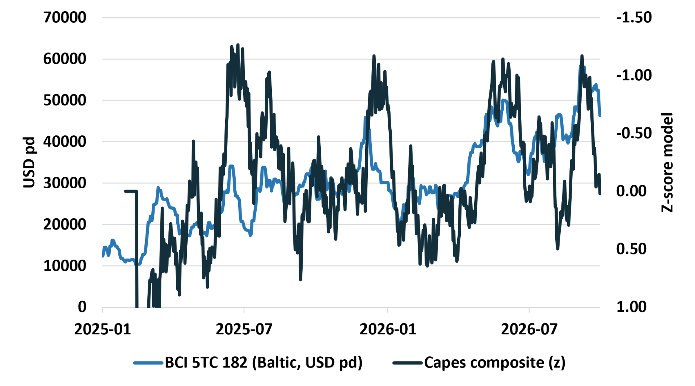
*Figure: Cape/Newc Composite Model*

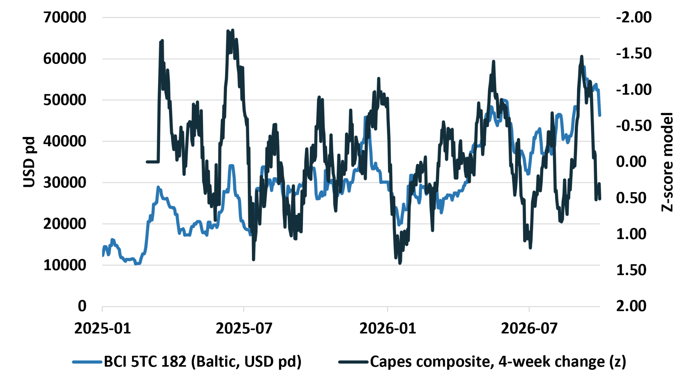
*Figure: Cape/Newc Composite Model - 4 Weeks Change*

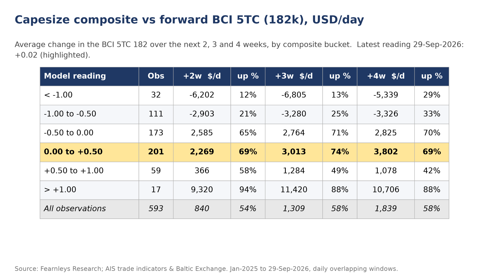
*Figure: Indicator Chart*

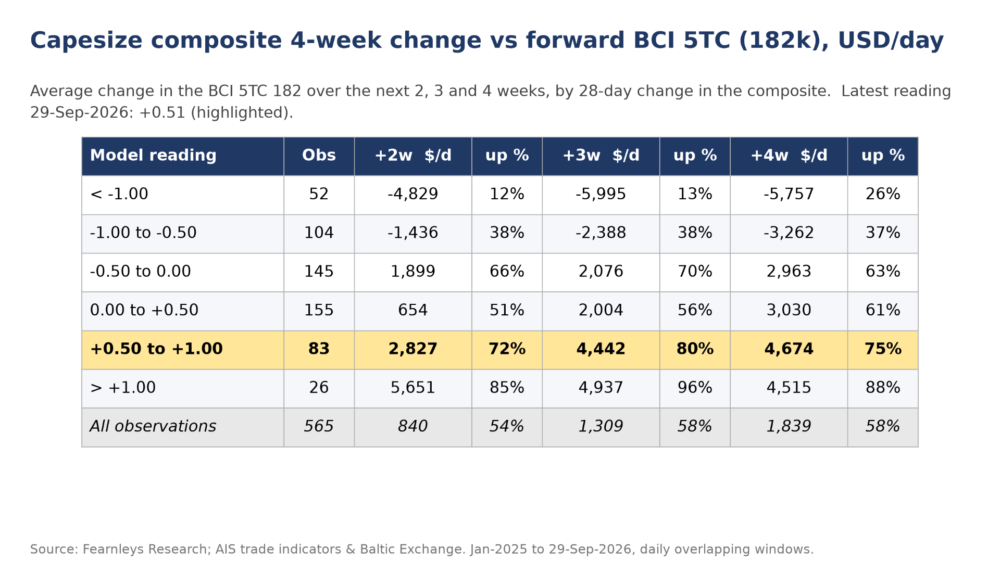
*Figure: Indicator Chart*

---

## Panamax/Kamsarmax

Shipment volume growth continues to be lower than DWT supply growth. Through week 39, growth was 2.9%, compared to DWT supply growth of 4.2%. However, there has been a relative improvement over the last 10 weeks, with volume growth no longer negative, rising by 0.7% compared to the corresponding weeks of last year. 

The Pacific tightness indicator turned more bearish since last week. That one is now suggesting the market will drop once China is back from holiday next week. The South Atlantic tightness indicator has not changed and still suggests a sideways-trending market. 

**Top left chart:** Shipment volumes were up 2.9% year on year through week 39. In the last ten weeks, volumes were down -2.0% compared to the same period last year. Supply growth was 4.2% at the latest reading. 
**Top right chart:** The 2-month lead of the coal futures curve suggests the market could be past the peak. 
**Bottom left chart:** The Pacific tightness indicator suggests the market will drop after the Chinese holidays. 
**Bottom right chart:** The SATL tightness indicator suggests P6 will stabilize around current levels.

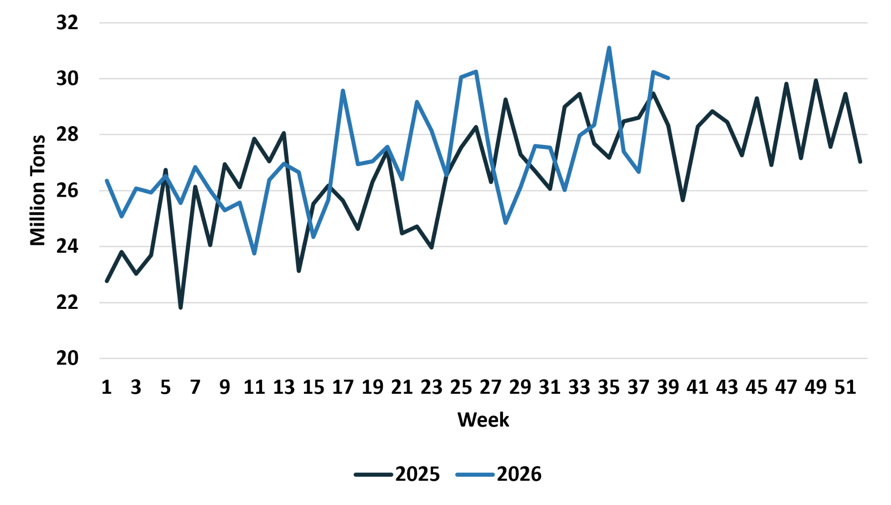
*Figure: Weekly Shipment Volumes*

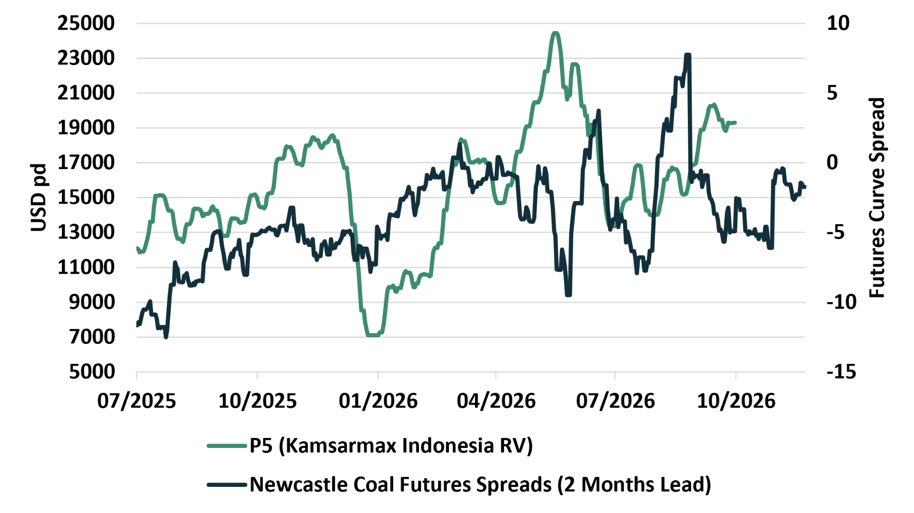
*Figure: P5 vs Newcastle Coal Futures Curve Spread (Lead 2 Months)*

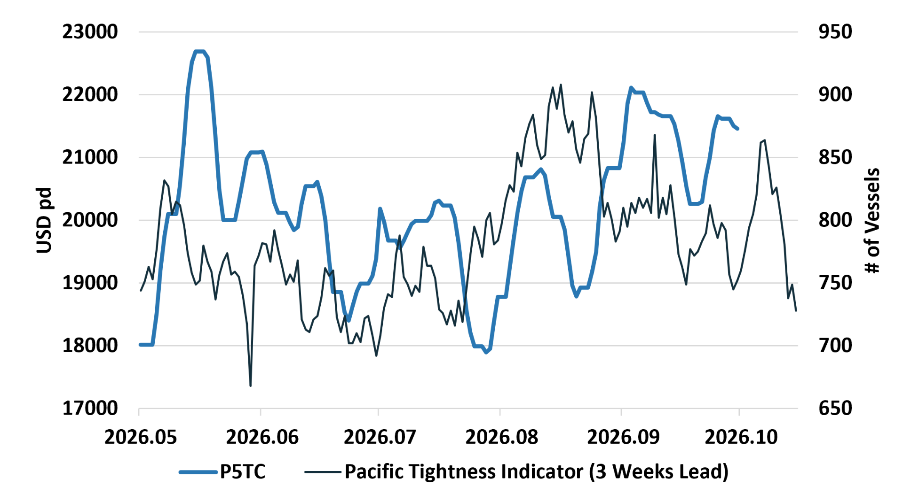
*Figure: P5TC vs Pacific Vessel Tightness Indicator (Lead 3 Weeks)*

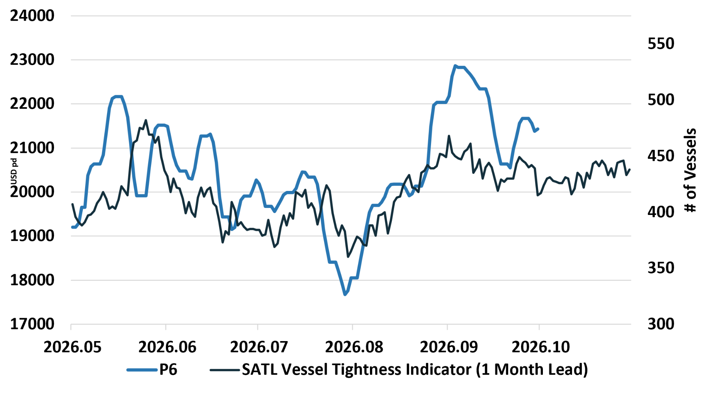
*Figure: P6 vs South Atlantic Vessel Tightness Indicator (Lead 1 Month)*

---

## Supramax/Ultramax

Through week 39, shipment volume growth was 3.8%. Over the last 10 weeks, volumes increased by 2.6% compared to the same period last year.  DWT Supply growth remains at 5.2%. 

Our comment from last week regarding fundamentals still applies... lower volume growth will not matter until it suddenly matters:

*The lower volumes are reflected in the ballast/laden vessel ratio shown below. This ratio has diverged from earnings over the last month and a half. If the market keeps rising even though volume/ton-time vs supply growth suggests it shouldn't, what causes it to rise? Fear of not getting hold of physical commodities certainly explains part of it. This phenomenon is much more common in the Tanker segment, where freight can get excessively bid for that reason.*

**Top left chart:** Weekly shipment volumes, 2026 ytd vs 2025. 
**Top right chart:** S11TC vs the Ballaster/Laden vessel ratio. A lower ratio indicates a looser market balance, and vice versa. The index and the ballast/laden ratio have diverged from the index over the last month and a half
**Bottom left chart:** The industrial metals index is composed of copper, aluminium, zinc and nickel, and weighted according to market value. The 9-month change of this index has a high correlation with the 9-month change of the Ultramax 1-year TC rate, and leads by about 3 months. 
**Bottom right chart:** The 9-month change of the price of copper has a high correlation with the 9-month change of the Ultramax 1-year TC rate. The copper price change leads by about 4 months.

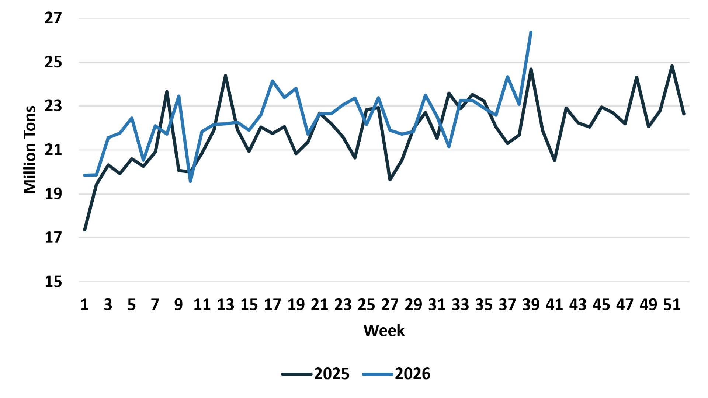
*Figure: Weekly Shipment Volumes*

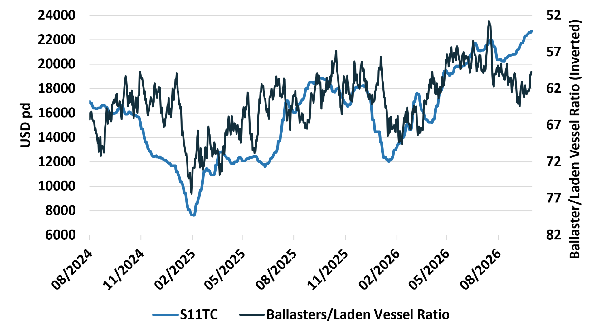
*Figure: Ballaster/Laden Vessel Ratio vs S11TC*

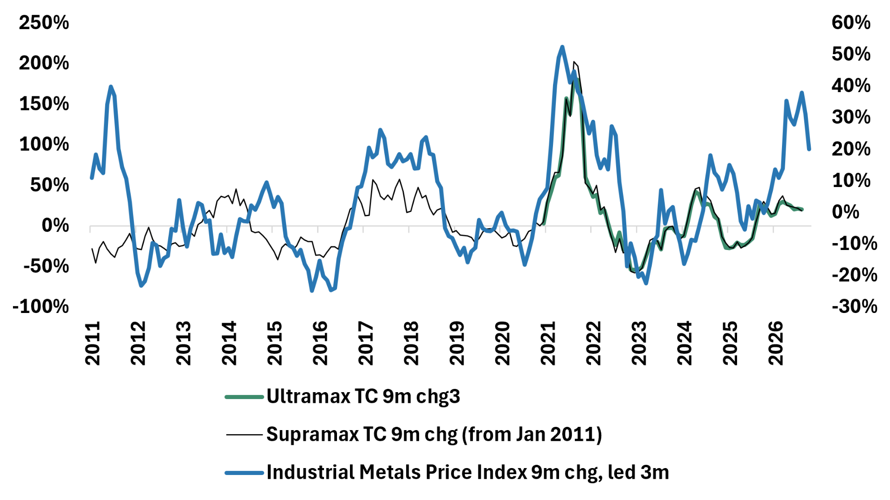
*Figure: Industrial Metals Price Index vs Ultra/Supra 1 Year TC*

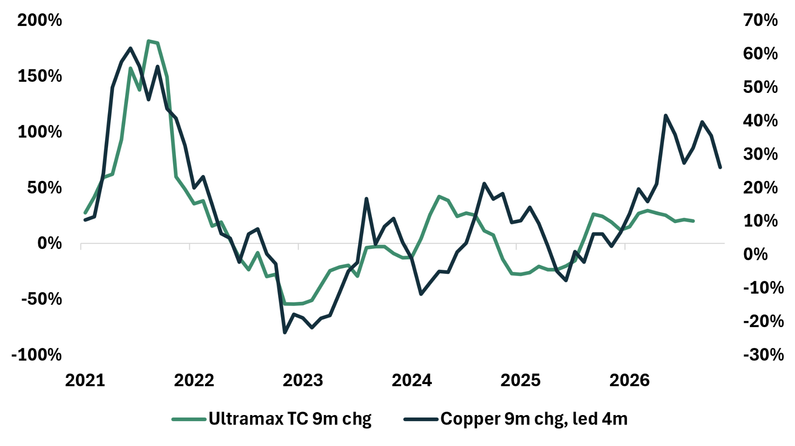
*Figure: Copper Price vs Ultramax 1 Year TC*

---

## Handysize

Through week 39, shipment volume growth grew by an estimated 1.0% compared to last year. DWT supply growth remains at 3.2%. The market remains firmer than the weak headline figures suggest. In the near term, the strength of the Ultramax segment suggests continued sideways/slightly up in this segment. 

**Top left chart:** The ratio between Rio-Recalada / Skaw-Passero (HS3) and SEA / Singapore-Japan (HS5) is usually a good predictor of tops and bottoms of the HS3 route. A higher ratio suggests a market top, and a lower ratio suggests a market bottom. 
**Top right chart:** Through week 39, Handysize shipment volumes were 1.0% higher year on year, declining from the 3%+ figures seen in the last months. DWT supply growth was 3.2% at the latest reading. 
**Bottom left chart:** The correlation between the S11TC and HS7TC is over 90%. The correlation is even higher when the S11TC index is shifted forward a few days, which means that movements in the S11TC index often lead the movements of the HS7TC. 
**Bottom right chart:** The change in the price of copper is usually an accurate leading indicator for asset values.

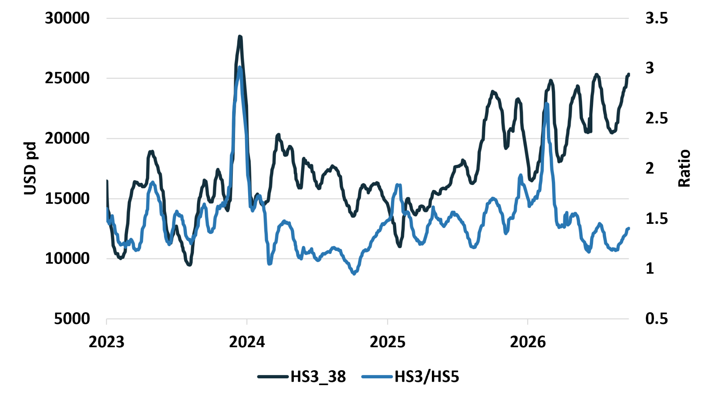
*Figure: HS3 vs Ratio of HS3 and HS5*

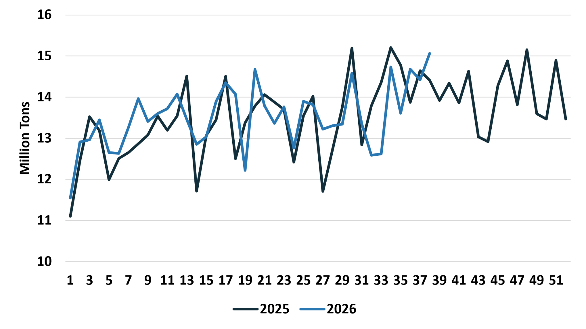
*Figure: Weekly Shipment Volumes*

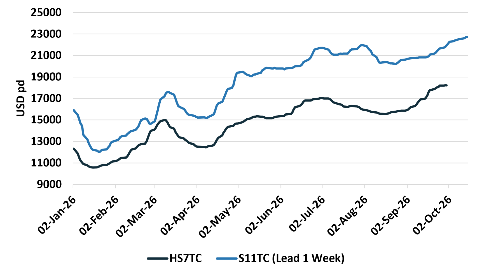
*Figure: S11TC Shifted 1 Week Forward, vs HS7TC*

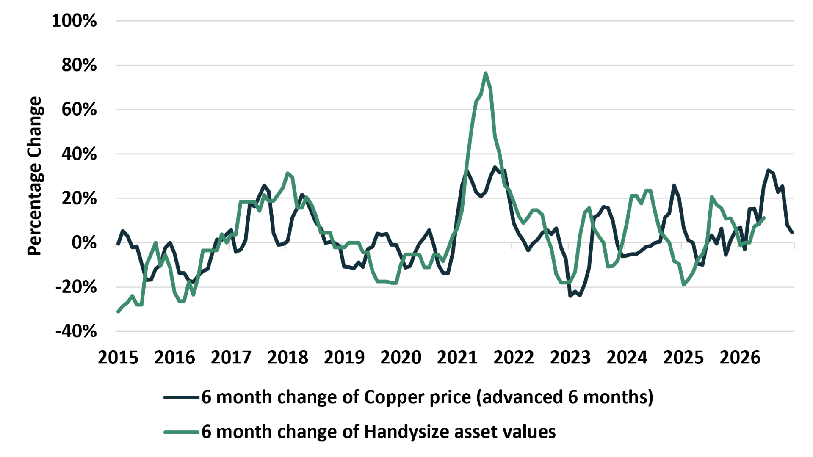
*Figure: Copper Price 6 Months Change, 6 Months Lead, vs Handysize 10 Year Old 6 Months Change*

---

## Fundamentals and Macro

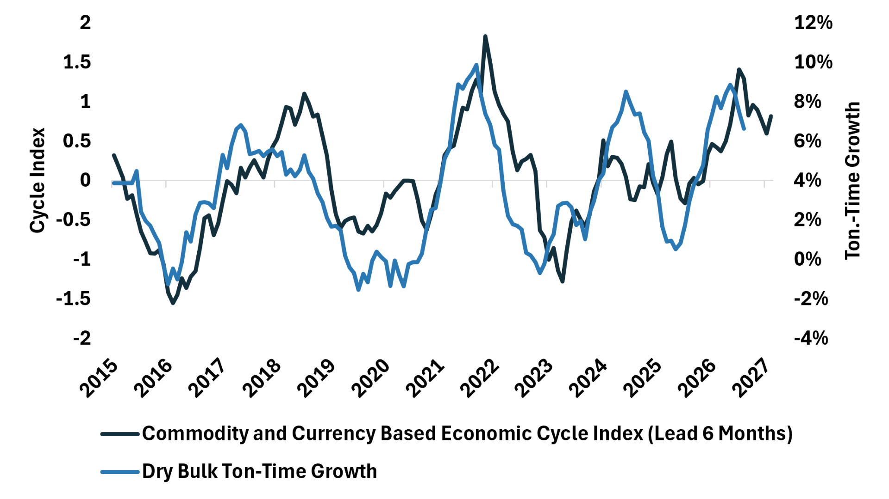
*Figure: Economic Cycle Index vs Dry Bulk Ton-Time Growth*

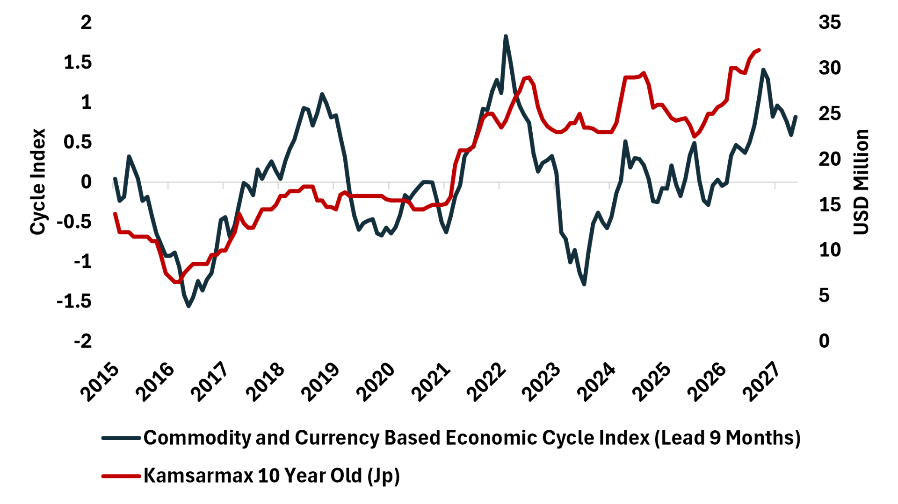
*Figure: Economic Cycle Index vs Kamsarmax 10-Year Old*

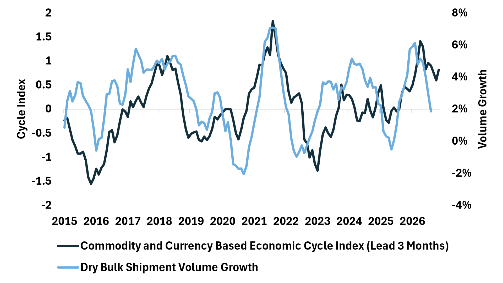
*Figure: Economic Cycle Index vs Dry Bulk Volume Growth*

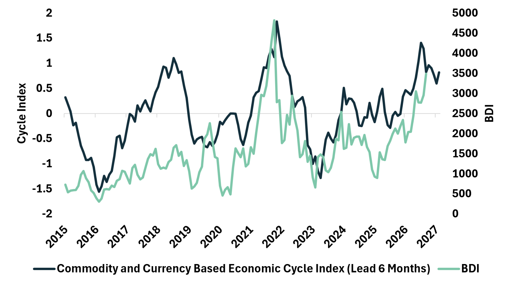
*Figure: Economic Cycle Index vs BDI*

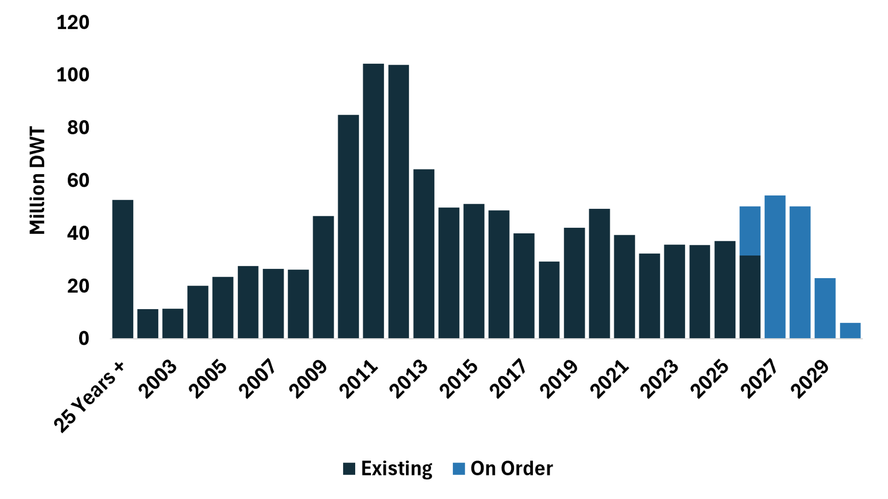
*Figure: Fleet Age Profile*

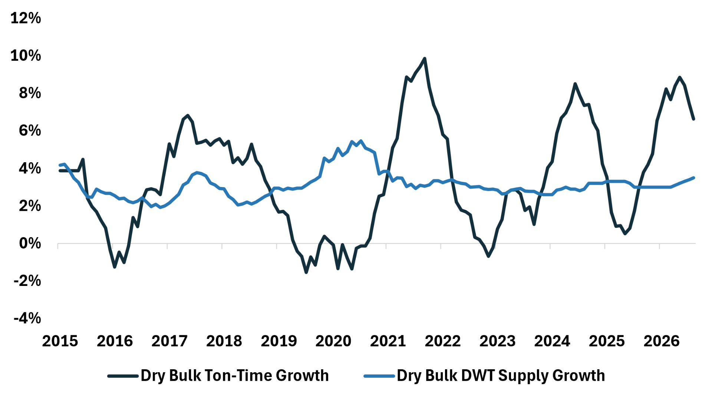
*Figure: Ton-Time Growth vs DWT Supply Growth*
