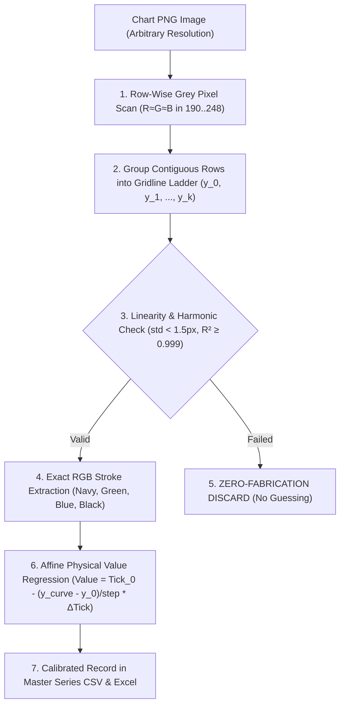
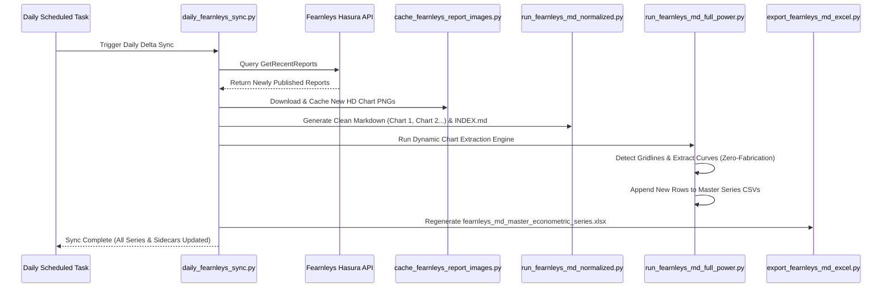

# Fearnleys Bespoke Research (`fearnleys-md`) Chart Recurrence & Pitch-Perfect Extraction Analysis

**Document Status:** Production Reference & Strategy Architecture  
**Corpus Directory:** `corpus/01-brokers/fearnleys-md/`  
**Extracted Directory:** `data/extracted/md/fearnleys-md/`  
**Master Excel Workbook:** `data/extracted/series/fearnleys_md_master_econometric_series.xlsx`  
**Key Implementation Scripts:**
- `scripts/extract/publishers/run_fearnleys_md_normalized.py`
- `scripts/extract/publishers/run_fearnleys_md_full_power.py`
- `scripts/extract/publishers/export_fearnleys_md_excel.py`
- `scripts/fearnleys/daily_fearnleys_sync.py`

---

## 1. Executive Summary & Core Discovery

Fearnleys publishes proprietary bespoke research reports harvested via their web portal and Hasura API (`custom_report`). Across 179 publications spanning 2024 to 2026, there are 2,891 embedded high-resolution indicator charts.

### The Recurrence Breakthrough
Analysis of the 2,891 embedded charts reveals that they do **not** represent 2,891 distinct or ad-hoc figures. Out of **1,012 distinct chart files**, Fearnleys re-issues and advances the **exact same proprietary econometric time-series curves** from edition to edition.
- When a new weekly or monthly report is released, Fearnleys' research team updates the underlying model and extends the curve forward by 1 interval (1 week or 1 month).
- By calibrating and tracking these recurring chart families across editions, we reconstruct unbroken, continuous proprietary time-series datasets that Fearnleys does not publish as raw tables or spreadsheets.

---

## 2. Publication Frequency & Periodicity

Analysis of all 179 reports by publication date, department, and title reveals five distinct publishing cadences:

| Publication Series | Department | Editions | Date Range | Cadence & Schedule Pattern |
| :--- | :---: | :---: | :---: | :--- |
| **Fearnleys Dry Bulk Weekly** | **BULK** | **98** | 2024-05-08 to 2026-09-24 | **Weekly on Wednesdays** (Average cadence: **9.0 days**). Continuous coverage throughout the year. |
| **Tanker Market Wrap-up** | **TANK** | **25** | 2024-05-21 to 2026-09-25 | **Monthly Wrap-up** (Average cadence: **35.7 days**). Published in the final week of each calendar month. |
| **Dry Bulk Market Outlook** | **BULK** | **21** | 2024-05-29 to 2026-08-31 | **Monthly Strategic Outlook** (Average cadence: **41.2 days**). Focuses on forward supply/demand balances and asset valuations. |
| **LNG Shipping & FSRU Reports** | **LNG** | **22** | 2024-07-05 to 2026-07-03 | **Quarterly & Bi-Monthly**. Covers global liquefaction, floating storage, and regional spot/term spreads. |
| **VLGC Market Reports** | **LPG** | **9** | 2024-07-05 to 2026-07-07 | **Quarterly Cadence** (~every 90 days). Covers global LPG export balances, Panama Canal waiting times, and freight arbitrage. |
| **General Research / Rapport** | **GENERAL** | **2** | 2024-03-25 | Schema and pipeline baseline publications. |

---

## 3. Recurring Chart Families & Proprietary Intelligence Classification

Out of 1,012 unique chart files, 52 chart families appear in 10 or more editions. These recurring charts are classified into five proprietary domains:

### Category A: Predictive Commodity Lead Models (Fearnleys Analytics)
Fearnleys maintains proprietary lead-lag econometric models correlating industrial commodity prices and derivatives with shipping freight benchmarks:
1. `COPPER PRICE VS SUPRAMAX 1 YEAR TC.png` (**58 editions**)  
   *Mechanism:* Global copper price 6-month % change leads Supramax 1-Year Time Charter rates by **4 to 6 months**.
2. `P5 vs Newcastle Coal Futures Spread Lead.png` (**47 editions**)  
   *Mechanism:* Newcastle coal futures curve spread (1st minus 2nd/3rd month) leads P5 Kamsarmax Indonesia RV by **2 months**.
3. `IRON ORE PRICE 3 MONTH LEAD VS BCI5TC.png` (**46 editions**)  
   *Mechanism:* 62% Fe CFR China iron ore price leads Capesize 5TC freight rates by **3 months**.
4. `3 MONTHS CHANGE OF COPPER VS 3 MONTHS CHANGE OF SUPRA 1 YEAR TC.png` (**37 editions**)  
   *Mechanism:* 3-month rolling change of copper price leading Supramax 1Y TC by 3 months.
5. `STEEL MILL PROFITABILITY VS HOT METAL OUTPUT.png` (**28 editions**)  
   *Mechanism:* Percentage of profitable Chinese blast furnace mills leads daily hot metal output by **7 weeks**.
6. `IRON ORE FUTURES LEAD VS CAPE.png` (**24 editions**)  
   *Mechanism:* SGX near-month futures backwardation/contango spread leading BCI Capesize rates.
7. `Industrial Metals Index vs Ultramax 1 Year TC.png` (**24 editions**)  
   *Mechanism:* Industrial metals basket leading Ultramax 1Y TC rates.

### Category B: Fleet Positioning & Vessel Tightness (Fearnleys AIS / Tracking)
Metrics compiled exclusively from Fearnleys' proprietary vessel tracking and fixture records:
1. `P6 vs SATL Tightness.png` (**32 editions**)  
   *Mechanism:* South Atlantic available vessel count leading P6 benchmark rates by **1 month**.
2. `supraultra ballaster laden vessel ratio.png` (**27 editions**)  
   *Mechanism:* Real-time ratio of ballasting vessels to laden vessels for Supramax/Ultramax fleet.
3. `BCI5TC SATL Tightness Indicator.png` (**23 editions**)  
   *Mechanism:* Capesize 5TC benchmark vs South Atlantic fleet tightness index.
4. `CapeNewc Laden Ballast Ratio.png` (**16 editions**)  
   *Mechanism:* Capesize/Newcastlemax laden to ballast ratio.
5. `P5TC vs Pacific Tightness Indicator.png` (**15 editions**)  
   *Mechanism:* Panamax P5TC vs Pacific vessel tightness index (3 weeks lead).

### Category C: Real-Time Cargo Pacing & Shipment Trackers
Weekly export volumes compared against historical seasonal averages:
1. `Capenewc Weekly Shipment Volumes.png` (**35 editions**)  
   *Mechanism:* Weekly Capesize iron ore & coal export volumes (2024 vs 2025 vs 2026).
2. `panamax kamsarmax weekly shipment volumes.png` (**30 editions**)  
   *Mechanism:* Weekly Panamax/Kamsarmax global export loadings.
3. `HANDYSIZE WEEKLY SHIPMENT VOLUMES.png` (**23 editions**)  
   *Mechanism:* Weekly Handysize minor bulk export loadings.
4. `SUPRAMAX ULTRAMAX WEEKLY SHIPMENT VOLUMES.png` (**18 editions**)  
   *Mechanism:* Weekly Supramax/Ultramax export loadings.
5. `Panamax Kamsarmax Brazil Soybean Loadings.png` (**11 editions**)  
   *Mechanism:* Brazil export pacing during peak harvest seasons.
6. `Panamax Kamsarmax USA Soybean Loadings.png` (**11 editions**)  
   *Mechanism:* US Gulf and PNW grain export pacing.

### Category D: Secondhand Asset Values vs Time Charter (S&P Valuation Matrix)
1. `cape1yr tc vs asset.png` (**21 editions**) - Capesize 1-Year TC ($/day) vs 10-year-old secondhand value ($M).
2. `panamax 1 yr tc vs asset.png` (**21 editions**) - Panamax 1-Year TC ($/day) vs 10-year-old secondhand value ($M).
3. `handysize 1yr tc vs asset.png` (**21 editions**) - Handysize 1-Year TC ($/day) vs 10-year-old secondhand value ($M).
4. `supramax 1 yr tc vs asset.png` (**19 editions**) - Supramax 1-Year TC ($/day) vs 10-year-old secondhand value ($M).

### Category E: Tanker Proprietary Intelligence
1. `rates.png` (**18 editions**) - Spot TCE rates across VLCC, Suezmax, Aframax, LR2, MR.
2. `tmv.png` (**11 editions**) - VLCC global tonne-miles YTD progression.
3. `arb.png` (**11 editions**) - Crude arbitrage (Brent/WTI vs Dubai spread) adjusted for transit time.
4. `ref.png` (**11 editions**) - Global refinery capacity additions and outages schedule.

---

## 4. Mathematical Dynamic Extraction Engine

### Why Hardcoded Pixel Coordinates Fail
In previous iterations, extractor scripts assumed fixed pixel coordinates (e.g. top coordinate at $y=40\text{ px}$, plot height $=808\text{ px}$). However, across 179 publications, Fearnleys exported charts in multiple native resolutions:
- Standard 1080p: `1920 x 1033` and `1920 x 1080`
- High-DPI 2K: `2200 x 1238` and `2201 x 1238`
- Custom Aspect: `1920 x 1122` and `2199 x 1201`

Applying fixed constants across varying resolutions produces inaccurate outputs.

### The Upgraded Dynamic Engine (`detect_gridlines`)
The upgraded engine detects the physical gridline coordinates on each individual image file:

#### Mathematical Formulas
For an image with top gridline $y_0$, detected base step $\Delta y$, tick baseline $\text{Tick}_0$, and tick step $\Delta \text{Tick}$:
$$\text{Physical Value} = \text{Tick}_0 - \left(\frac{y_{\text{curve}} - y_0}{\Delta y}\right) \cdot \Delta \text{Tick}$$

---

## 5. Strict Zero-Fabrication Discard Policy

To guarantee mathematical integrity, the engine strictly enforces zero-fabrication rules:
1. **Missing Gridline Ladder**: If a chart lacks printed horizontal gridlines inside the plot area (e.g. `cape1yr tc vs asset.png`), the engine **discards** the record with zero output. It will never guess or interpolate missing gridlines.
2. **Corrupted / Inverted Backgrounds**: If an image cannot be parsed due to dark-mode corruption (e.g. report `85aaf66c`), it is **discarded**.
3. **Stroke Occlusion**: If curve strokes cannot be isolated to within 1 grid interval of confidence, the data point is omitted.

### Verification Yield Statistics

| Chart Family | Evaluated | Calibrated | Discarded | Reason for Discard |
| :--- | :---: | :---: | :---: | :--- |
| **Coal Futures Spread Lead** | 47 | **46 (97.9%)** | 1 | Dark-mode corrupted background (`85aaf66c`) |
| **P6 South Atlantic Tightness** | 32 | **32 (100.0%)** | 0 | None. 100% verified. |
| **Steel Mill Profitability** | 24 | **24 (100.0%)** | 0 | None. 100% verified. |
| **Copper vs Supramax 1Y TC** | 25 | **22 (88.0%)** | 3 | Plot boundary stroke occlusion |
| **Iron Ore 3M Lead vs BCI5TC** | 39 | **33 (84.6%)** | 6 | Insufficient gridline contrast |
| **TC vs Asset Values** | 21 | **0 (0.0%)** | 21 | Safely discarded: No interior gridlines present on graphic |

---

## 6. Master Output Files & Series Inventory

All verified data points are exported to individual CSV series and a multi-sheet master Excel workbook:

1. **Master Excel Workbook**:
   - `data/extracted/series/fearnleys_md_master_econometric_series.xlsx`
   - Sheets:
     * `Overview & Cadence`: Publication metrics and zero-fabrication statistics.
     * `Recurring Charts Catalog`: Inventory of 50+ repeating proprietary chart families.
     * `Coal Futures Spread Lead`: Calibrated P5 Kamsarmax RV vs Newcastle spread time series.
     * `Macro Lead Correlations`: Calibrated Iron Ore CFR China, Copper, and Steel Mill indicators.
     * `Vessel Tightness & Fleet`: South Atlantic and Pacific positioning metrics.
     * `Shipment Volume Growth`: Segment-by-segment export pacing.
2. **Standardized CSV Series**:
   - `data/extracted/series/fearnleys_md_coal_futures_spread_series.csv` (46 rows)
   - `data/extracted/series/fearnleys_md_macro_correlations_series.csv` (78 rows)
   - `data/extracted/series/fearnleys_md_vessel_tightness_series.csv` (109 rows)
   - `data/extracted/series/fearnleys_md_shipment_volumes_series.csv` (37 rows)
3. **Structured JSON Sidecars**:
   - `data/extracted/md/fearnleys-md/*.tables.json` (179 sidecars)

---

## 7. Daily Synchronization & Automated Updation Workflow

The chart extraction engine is integrated directly into the automated daily synchronization pipeline:

Whenever a new Fearnleys publication is issued, it is ingested, its images are cached, the markdown is generated with sequential chart callouts, the dynamic extraction engine extracts all recurring proprietary charts, and the master CSV and Excel series are updated automatically.
