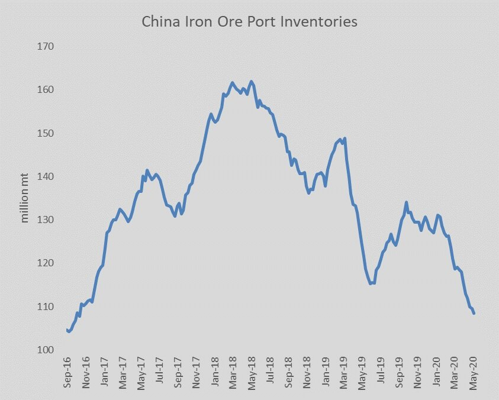

# Atlantic market is tightening

**Date:** June 05, 2020  
**Publisher:** Breakwave Advisors | **Category:** Market Insights  
**Original URL:** [https://www.breakwaveadvisors.com/insights/2020/6/5/atlantic-market-is-tightening](https://www.breakwaveadvisors.com/insights/2020/6/5/atlantic-market-is-tightening)  

---

There is some much needed tightening going on in the Atlantic market, as evident by a rumored North Atlantic fixture that was reported late in the day, albeit for a shorter duration voyage and a better described ship.

The Capesize index now stands at 7,307, but we are marking it closer to 8,500, based on today’s fixtures, rumors and bunkers. Only time will tell, but Early next week looks positive.

At the same time, iron ore inventories in China continue to decline, now below 110 mt.

> **Figure 1: Inventories**  
> [Local Asset](file:///C:/Users/Dell/Github/Shipping/corpus/03-breakwave/insights/2020/assets/2020-06-05_atlantic-market-is-tightening_img_inventories_305591519f6e.jpg)

Next week will be interesting on how the spot versus paper markets interact, as premiums remain high, but optimism is in the air for further spot gains.

---

**Tags:** Shipping, Dry Bulk  
