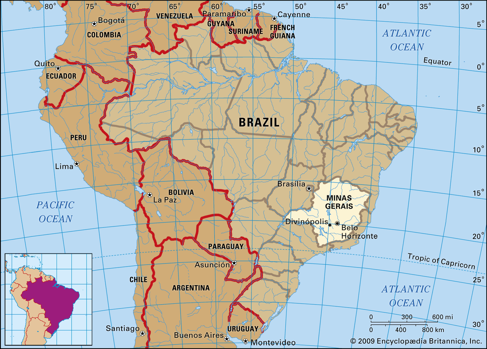
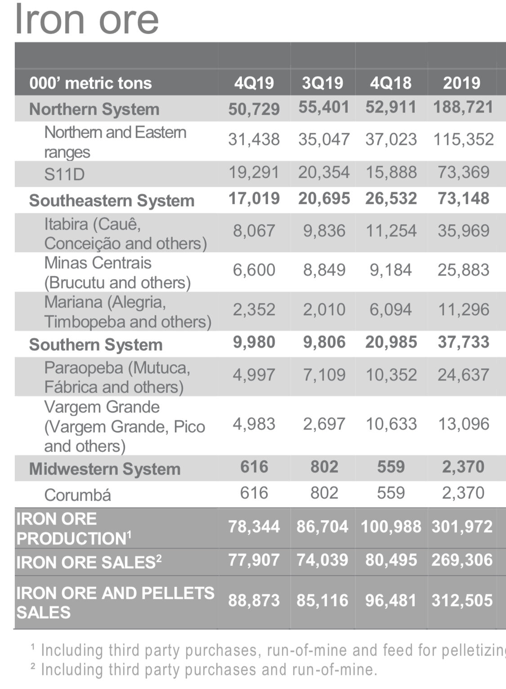

# The drama continues, as Brazilian judge halts Vale's iron ore operations in the south

**Date:** June 06, 2020  
**Publisher:** Breakwave Advisors | **Category:** Market Insights  
**Original URL:** [https://www.breakwaveadvisors.com/insights/2020/6/6/the-drama-continues-as-brazilan-judge-hats-vales-iron-ore-operations-in-the-south](https://www.breakwaveadvisors.com/insights/2020/6/6/the-drama-continues-as-brazilan-judge-hats-vales-iron-ore-operations-in-the-south)  

---

Once again, the iron ore market has to make sense of the ever developing situation in Brazil, with Vale’s iron ore output struggling to find a footing between COVID-19, heavy rains, regulatory issues related to last year’s dam accident and Carajas logistical issues.
The latest development is again focused on the southern mining complex, where, as Reuters reports,[a Brazilian judge has shut down several mines in the Minas Gerais region](https://www.reuters.com/article/us-health-coronavirus-brazil-vale-sa/brazilian-judge-shuts-down-vale-complex-due-to-coronavirus-concerns-idUSKBN23C34K), which has been the target of regulators over the past year.

Obviously, such order by itself is a negative development, although it is unclear what the impact will end up being, as limited information is available at this time on the extend of the shutdown.( Vale put out a press release late Saturday, as updated below)

From Reuters:

“*A Brazilian judge ordered the closure of a series of mines operated by mining company Vale SA over coronavirus concerns, labor prosecutors said on Friday, a development that puts more than 10% of the firm’s iron ore output offline and will likely send jitters through the global iron ore market. Prosecutors had alleged that workers were at risk at the mine complex, known as Itabira in the state of Minas Gerais, after 188 of them tested positive for the coronavirus.”*

Physiologically, the impact on freight futures should be quite negative, given the rally in Capesizes on Thursday and Friday. Such correction will lead to a contraction in the premium to spot that has recently expanded due on optimism of higher Brazilian exports, a welcome development given the uncertainly.

> **Figure 1: “The Iron Ore Fines Production Guidance of 310-330 Mt in 2020**  
> *“The iron ore fines production guidance of 310-330 Mt in 2020 considers a negative impact of 15Mt from eventual impacts resulting from the fight against COVID-19. Considering (i) the expected monthly production of 2.7Mt from the Itabira Complex for the coming months and (ii) the provisioning of up to 15Mt of losses associated with COVID-19 in 2020, there is no need, at this moment, to revise the guidance. Vale informs, however, that there may be a temporary shortage of pellets for the domestic market, while the Itabira Complex shutdown remains, given that the complex provides pellet feed for the pelletizers of the Tubarão Complex.”*  
> **Interactive Data & Source:** [Saladeimprensa Vale](http://saladeimprensa.vale.com/en/Paginas/Articles.aspx?r=Vale_informs_on_Dicao_Leste_dam&rID=1378&s=Mining&sID=6) | [Local Asset](file:///C:/Users/Dell/Github/Shipping/corpus/03-breakwave/insights/2020/assets/2020-06-06_the-drama-continues-as-brazilan-judge-hats-vales-iron-ore-operations-in-the-sout_img_map-minas-gerais-brazil_fc088b057bd4.jpg)

Still, lots are up in the air, as Vale in the past has managed to overturn such orders.

The production impact is sizable, but once again information on which specific mines were shut is scarce. The Itabira region accounted for ~12% of Vale’s 2019 iron ore output. Most of such iron ore is shipped through the country’s southern ports (Tubarao).

UPDATE: Late on Saturday, Vale put out a[press release](http://saladeimprensa.vale.com/en/Paginas/Articles.aspx?r=Vale_informs_on_Dicao_Leste_dam&rID=1378&s=Mining&sID=6), where it reaffirmed their iron ore production guidance for 2020 of 310-330 milion tons.
Vale concluded:

For now, it seems the overall impact on shipping volumes is minor. The duration and the potential spillover to other regions, however, are the major unknowns and a greater risk for dry bulk shipping.

Here is 2019 Vale’s production by region:

> **Figure 2: Img 1960**  
> [Local Asset](file:///C:/Users/Dell/Github/Shipping/corpus/03-breakwave/insights/2020/assets/2020-06-06_the-drama-continues-as-brazilan-judge-hats-vales-iron-ore-operations-in-the-sout_img_img-1960_8a20a313afb5.jpg)

---

**Tags:** Shipping, Dry Bulk, Vale  
