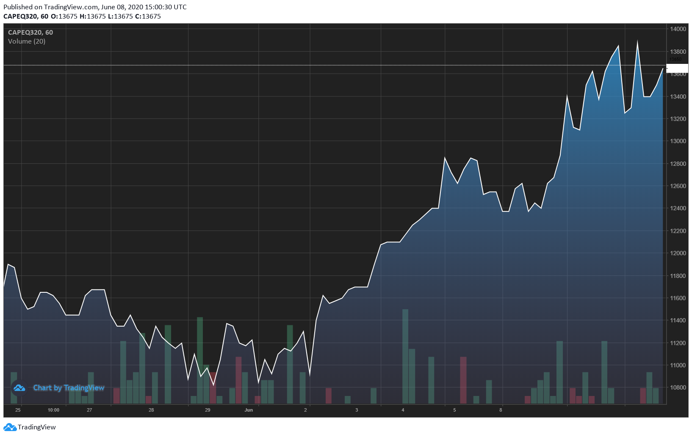

# Iron Ore rips, Capesizes snooze, in a volatile trading day

**Date:** June 08, 2020  
**Publisher:** Breakwave Advisors | **Category:** Market Insights  
**Original URL:** [https://www.breakwaveadvisors.com/insights/2020/6/8/iron-ore-rips-capesizes-snooze-in-a-volatile-trading-day](https://www.breakwaveadvisors.com/insights/2020/6/8/iron-ore-rips-capesizes-snooze-in-a-volatile-trading-day)  

---

> **Figure 1: “For the Time Being**  
> *“For the time being, we are still keeping our 310mt shipment forecast for 2020 which is at the bottom of Vale’s production guidance for 2020, but the risks of not reaching this guidance have been increasing.”*  
> [Local Asset](file:///C:/Users/Dell/Github/Shipping/corpus/03-breakwave/insights/2020/assets/2020-06-08_iron-ore-rips-capesizes-snooze-in-a-volatile-trading-day_img_image-asset_144f0c3e42a5.jpeg)

With the weekend news relating to Vale’s mining operations flowing into the Asian market early Monday, iron ore futures gapped up, reaching the highest level since last summer and trading above the psychological $100/t mark. Supply concerns, that have dominated the news cycle relating to iron ore once again are front and center, and uncertainty about the future availability of high quality iron ore out of Brazil kept the iron ore market well bid all day.

Capesize futures initially saw similar volatility, with the prompt quarter (Q3) contract gapping down ~9%, but very quickly offers disappeared and prices rallied back to Friday’s closing levels, a surprising development for much of the market participants. The Capesize index posted another gain, up 438 (below expectations) and now it stands at 7745.

Most analysts remain cautiously optimistic on the outcome of the recent stoppage out of Brazil. Credit Suisse notes:

We tend to also agree that it is too early to make adjustments solely on this event, as previous stoppages have been reverted even in a matter of hours, let alone days. Vale is filling an injunction in order to resume operations ASAP and there is enough stocks to make up for the reduced output for now. In addition, for shipping is all about exports, and the sharp decline in domestic steelmaking bodes well for more exports of iron ore out of Brazil to China.

As for the Capesize market, futures closed relatively unchanged, with limited physical news with the balance of the month for Capesize average spot rates now priced at almost 11000, while the Q3 contract is back to recent highs, as the chart below shows:

> **Figure 2: Q3 Cape 6 8**  
> [Local Asset](file:///C:/Users/Dell/Github/Shipping/corpus/03-breakwave/insights/2020/assets/2020-06-08_iron-ore-rips-capesizes-snooze-in-a-volatile-trading-day_img_q3cape6-8_1b55815cc15e.png)
