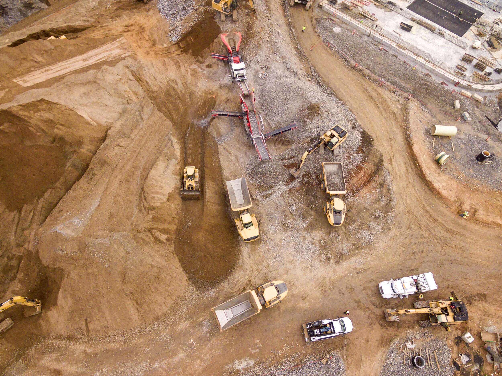
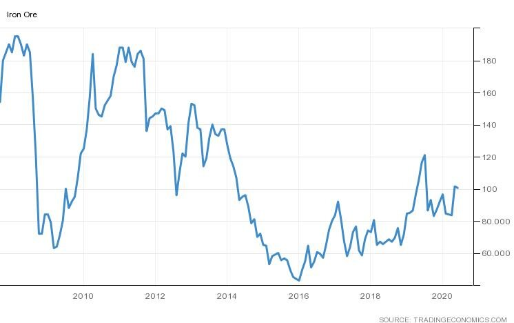

# Chasing the rally: Analysts keep raising their iron ore forecasts

**Date:** June 09, 2020  
**Publisher:** Breakwave Advisors | **Category:** Market Insights  
**Original URL:** [https://www.breakwaveadvisors.com/insights/2020/6/9/chasing-the-rally-analysts-raising-their-iron-ore-forecasts](https://www.breakwaveadvisors.com/insights/2020/6/9/chasing-the-rally-analysts-raising-their-iron-ore-forecasts)  

---

> **Figure 1: Others Are Still Cautious**  
> *Others are still cautious. According to Bloomberg, ANZ said that the“rally looks increasingly stretched, with strengthening headwinds in the steel industry likely to put downward pressure on prices in the coming months”though they also noted that“ Vale disruption comes amid strong demand from China. Imports in May were up 3.9% y/y, pushing the year-to-date total up 5%,”*  
> **Interactive Data & Source:** [Spglobal](https://www.spglobal.com/marketintelligence/en/news-insights/latest-news-headlines/global-steel-sector-faces-uncertain-road-to-recovery-in-wake-of-pandemic-58611532) | [Local Asset](file:///C:/Users/Dell/Github/Shipping/corpus/03-breakwave/insights/2020/assets/2020-06-09_chasing-the-rally-analysts-raising-their-iron-ore-forecasts_img_image-asset_b5a625fe3458.jpeg)

Once again, the iron ore market find itself in a position where macroeconomic forecasts and prices are diverging. A few months ago, the majority of analysts where looking for lower iron ore prices as increasing supply out of Brazil and weaker steel production would lead to looser iron ore balances and thus lower prices.

Fast forward to today, and a number of analysts are revising such assumptions. Yesterday, JP Morgan raised its iron ore price forecasts for 2020 and 2021 by ~10%, with China steel production growth expected now to be up 1.2%, versus -1.5% previously. The bank highlighted Vale’s difficulty in lifting their run rate following heavy rains during the first half of the year but also the better than expected Chinese demand coming from steel mills despite the relatively low margins.

Interestingly, strong demand from China has lifted exports from a number of other regions, as[Europe’s steel sector remains in a “industrial depression](https://www.spglobal.com/marketintelligence/en/news-insights/latest-news-headlines/global-steel-sector-faces-uncertain-road-to-recovery-in-wake-of-pandemic-58611532)”, thus demand for iron ore has waned quite a bit.

From Arrow Research:*“Dire conditions in the European steel industry**is forcing its major iron ore**suppliers to divert cargoes to China. Ukraine, Canada and Russia saw their exports to China rise by 166%, 77% and 12% respectively during Jan-May”*

> **Figure 2: “Some Are Skeptical**  
> *“Some are skeptical. Vale will have to ramp-up drastically to achieve full-year guidance, something that won’t be easy given the outbreak, according to Hongyuan Futures Ltd. It needs to ship 180 million tons in the second half, requiring a scale that is “near impossible to achieve,” analysts including Sun Jiaxing said in a report. “Supply will still not be able to meet demand.”*  
> **Interactive Data & Source:** [Abc Net](https://www.abc.net.au/news/2020-06-07/australia-china-racism-coronavirus-how-did-relationship-get-here/12330250) | [Local Asset](file:///C:/Users/Dell/Github/Shipping/corpus/03-breakwave/insights/2020/assets/2020-06-09_chasing-the-rally-analysts-raising-their-iron-ore-forecasts_img_arrow_d2d09ee0d34a.jpg)

Still a number of bullish voices remain, citing the chronic inability of Vale to deliver results in line with their guidance. As Bloomberg reports, this is what continues to drive bullish sentiment:

Finally, the question is what happens to iron ore prices if Europe recovers faster and stronger than anticipated? Or, even worse, what happens if the[relationship between China and Australia worsens](https://www.abc.net.au/news/2020-06-07/australia-china-racism-coronavirus-how-did-relationship-get-here/12330250)leading to even the slightest curtailment of iron ore trade between the two countries? Can we see iron ore above $150/t again, a level not seen since 2011?

> **Figure 3: Market Chart 3**  
> [Local Asset](file:///C:/Users/Dell/Github/Shipping/corpus/03-breakwave/insights/2020/assets/2020-06-09_chasing-the-rally-analysts-raising-their-iron-ore-forecasts_img_image-asset_06e250205128.jpeg)
