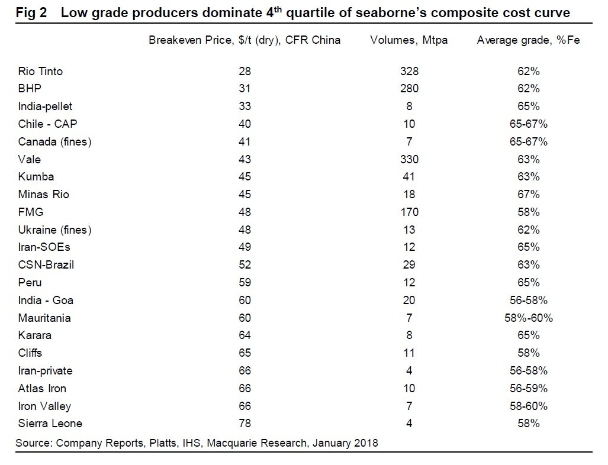
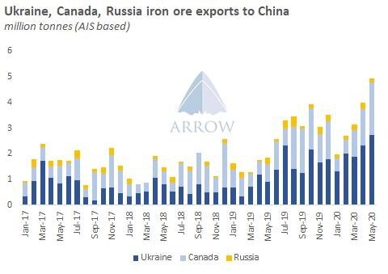
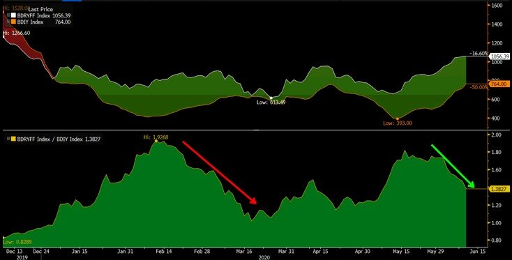
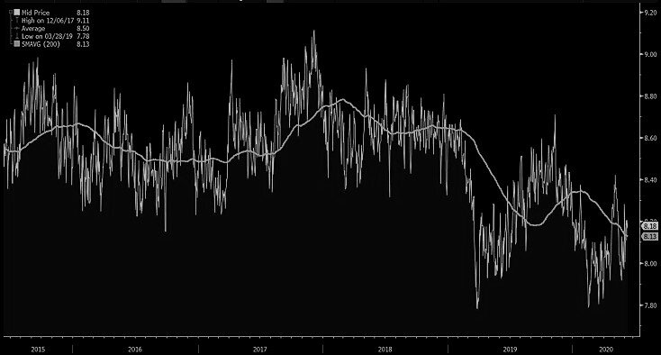
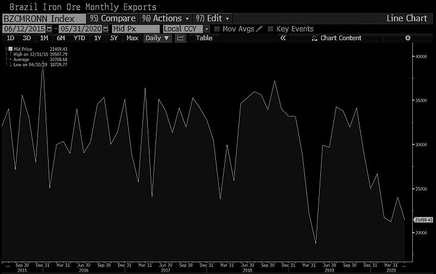

# What is driving Capesize rates higher?

**Date:** June 10, 2020  
**Publisher:** Breakwave Advisors | **Category:** Market Insights  
**Original URL:** [https://www.breakwaveadvisors.com/insights/2020/6/10/what-is-driving-capesize-rates-higher](https://www.breakwaveadvisors.com/insights/2020/6/10/what-is-driving-capesize-rates-higher)  

---

> **Figure 1: Market Chart 1**  
> [Local Asset](file:///C:/Users/Dell/Github/Shipping/corpus/03-breakwave/insights/2020/assets/2020-06-10_what-is-driving-capesize-rates-higher_img_image-asset_0b09e0d762fe.jpeg)

Capesize rates have been increasing steadily in the last few weeks and are up 350% in the last month (although % are not very meaningful for freight), and very soon (maybe tomorrow?) they will reach double digit territory for the first time since mid-April, possibly even hit their highest level in six months. Futures prices have been anticipating such a move to some extent, as rates have recently reached their lowest level for this time of the year ever. The move higher has been surprising to some. Yet, there are a few things in play here to consider following the recent move in Capesize spot rates:

**1.Australia pushing a lot of cargo in the water:**There are two relevant factors leading to higher iron ore exports out of Australia. First, with iron ore prices north of $100/ton, Australian miners have every incentive to sell as much product as they can. Cash breakevens for Australian miners are in the $25/ton to $35/ton range (except FMG that is closer to $45/ton), so the margins are extremely high. Paying up a bit for freight in order to sell highly profitable product makes a lot of sense. In addition, both BHP and FMG fiscal years end on June 30th, so selling as much as they can now to lock in those revenues for their current fiscal year also makes sense.

> **Figure 2: Source: Macquarie Bank, Basis 2018 Results**  
> [Local Asset](file:///C:/Users/Dell/Github/Shipping/corpus/03-breakwave/insights/2020/assets/2020-06-10_what-is-driving-capesize-rates-higher_img_iorn-ore-brekeven-rates-mqg-jan-2018_ecab95dace82.jpg)

Source: Macquarie Bank, basis 2018 results

**2. North Atlantic cargoes to China on the rise:**With Europe still at the very early stages of recovery following the global pandemic, demand for iron ore from the Continent remains very low. As a result, Canadian miners (and to some extend Ukrainian), who are also highly profitable at current iron ore prices, are shipping as much as they can to China instead of their usual customers in Europe. The significant distance difference to China (about 115-125 days round trip vs less than 30 days to Europe) increases ton-mile demand, and thus is tightening the supply/demand balance in the Capesize market. Also, the East Coast Canada ports can mainly accommodate standard Capesize vessels, thus it is even more beneficial for the sub-200kdwt Capesize market.

> **Figure 3: Source: Arrow Research**  
> [Local Asset](file:///C:/Users/Dell/Github/Shipping/corpus/03-breakwave/insights/2020/assets/2020-06-10_what-is-driving-capesize-rates-higher_img_arrow_d2d09ee0d34a.jpg)

Source: Arrow Research

**3. Freight arbitrage:**The freight futures market has recently been pricing a recovery in rates. Although that can always be quite speculative in nature, for ship operators, it present an opportunity to sell freight forward and charter-in ships at lower spot rates. Thus, given the recent wide spread, there was an incentive to pay up in the physical spot market and sell the futures, thus locking in a profitable spread in freight. As the spread closes, the incentive is less profound, but that also means spot prices are moving higher during that process.

> **Figure 4: Bdryff (Futures Index) vs BDI (Spot Index)**  
> [Local Asset](file:///C:/Users/Dell/Github/Shipping/corpus/03-breakwave/insights/2020/assets/2020-06-10_what-is-driving-capesize-rates-higher_img_bdryffvsbdi_66b2aeb427cb.jpg)

BDRYFF (futures index) vs BDI (spot index)

**4. Slow steaming/higher scrapping/higher slippage/COVID-19 delays:**Low rates bring slow steaming, and thus tightening the available tonnage supply. That has been the case so far this year, with average sailing speeds reaching new lows. In addition, higher scrapping over the last several months has removed quite a bit of older Capesize tonnage from the market, aiding the supply side of the equation. Finally, COVID-19 has caused various delays for vessels, whether it is for inspections, crew changes or port regulations. More importantly, new vessel delivery slippage is quickly approaching 40%, meaning actual newbuilding ship deliveries are lower than previously anticipated. All of the above have a positive effect on reducing effective supply, thus helping the balance in the dry bulk market.

> **Figure 5: Average Capesize Speed in Knots**  
> [Local Asset](file:///C:/Users/Dell/Github/Shipping/corpus/03-breakwave/insights/2020/assets/2020-06-10_what-is-driving-capesize-rates-higher_img_capespeed28229_b415d8286163.jpg)

Average Capesize speed in knots

Overall, it is a recovering Capesize market, yet still at the low end of the historical range and still below breakeven levels for most shipowners. What happens from here highly depends on Brazilian iron ore exports. If there is any increase in iron ore shipments out of Brazil in the coming weeks, then rates can rapidly move in the high-teens/low 20’s region, something that currently is only partially priced in the futures market.

It is said that history does not repeat itself, but last year the Capesize market rallied from mid-June to mid-July to reach 33,000/day in terms of spot rates. Supply is tightening, demand is increasing and a spark out of Brazil that has been hovering at the lowest export run rate of iron ore in years can change sentiment and prices around very easily, especially in the highly volatile freight world.

> **Figure 6: Brazil Iron Ore Exports**  
> [Local Asset](file:///C:/Users/Dell/Github/Shipping/corpus/03-breakwave/insights/2020/assets/2020-06-10_what-is-driving-capesize-rates-higher_img_brazilironoreexports_aa7d9eecc530.jpg)

---

**Tags:** Capesize, Dry Bulk, Shipping, Brazil  
