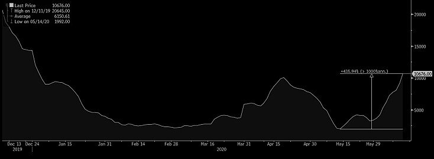

# Freight rates push higher as oil slumps

**Date:** June 11, 2020  
**Publisher:** Breakwave Advisors | **Category:** Market Insights  
**Original URL:** [https://www.breakwaveadvisors.com/insights/2020/6/11/freight-rates-push-higher-as-oil-slumps](https://www.breakwaveadvisors.com/insights/2020/6/11/freight-rates-push-higher-as-oil-slumps)  

---

> **Figure 1: Market Chart 1**  
> [Local Asset](file:///C:/Users/Dell/Github/Shipping/corpus/03-breakwave/insights/2020/assets/2020-06-11_freight-rates-push-higher-as-oil-slumps_img_image-asset_9a2025b009a9.jpeg)

A good day for owners of dry bulk ships, as rates continue to advance across every asset class. This is particularly true for ships able to do business in the Atlantic, as cargo flow remains healthy and ship availability relatively low.

The Capesize market is closing in to last year’s levels (by tomorrow we believe the index will be only a few thousand USD away from last year’s level), while the futures market is already more or less there, at roughly 15,000-16,000 for the third quarter expected average rates.

If one was to look only at dry bulk shipping, the comparison to last year seems staggering. Vale’s disruptions, Chinese steel demand strong, expectations about a better second half and continuing uncertainty about grains (i.e. soybeans) trade.

However, the world is so much different today: COVID-19 is wreaking havoc in societies everywhere, a global recession is underway, unemployment skyrocketing across the globe and oil prices move a several dollars per day without hesitation.

Shipping is not immune, but for now, things are looking up. Shipping is truly an uncorrelated “asset”, at least over short periods of time, as supply/demand imbalances take time to correct. And that usually causes rates to fluctuate, sometimes wildly. Capes are up ~9,000 from their lows last month, while on a percentage basis the gains look even more impressive.

> **Figure 2: Capes 6 11**  
> [Local Asset](file:///C:/Users/Dell/Github/Shipping/corpus/03-breakwave/insights/2020/assets/2020-06-11_freight-rates-push-higher-as-oil-slumps_img_capes6-11_5edd1ac83a75.jpg)

Going back to last year, how did 2019 progress from June onward?

Well, on June 11, 2019, the Capesize futures market was expecting the third quarter average rate to be approximately 16,000. Fast forward, and the market ended up averaging more than 29,000. That is a staggering performance for Capesize rates, but also show the inability of the futures market to accurately predict rates, even a few months out. Actually, the last three years, Capesize rates have settled more or less at or above current futures prices, while only two of the last 10 years have settled materially lower.

Missing image: https://images.squarespace-cdn.com/content/v1/5a4d1d26e5dd5b537a6647c5/1591888027145-LTUD970QJPH4W7QW8VM0/Q3+settle.png

Time will tell, but for now, the dry bulk market looks strong, aided by healthier cargo flow, relatively thin Atlantic vessel availability and declining oil prices (at least for today). The week should end on a high note with further gains tomorrow for the indices, although futures might decide to pause and reflect on all the above following the strong rally this week.

---

**Tags:** Dry Bulk, Shipping, Capesize  
