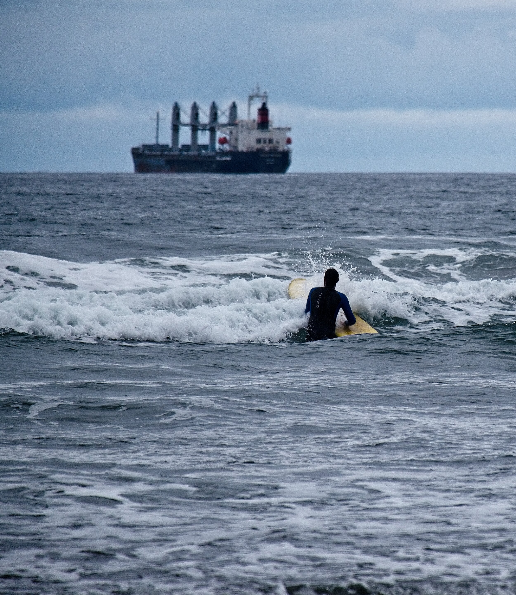
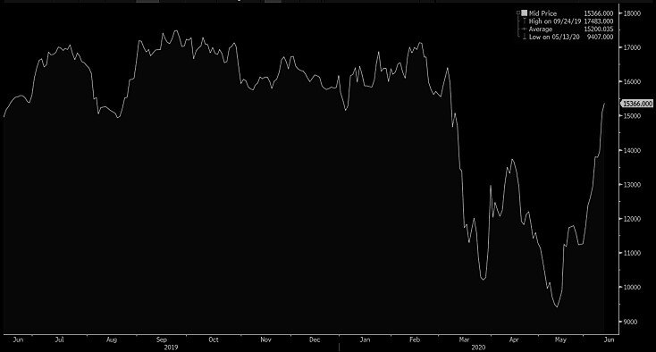

# Highest Capesize print of the year, as Brazil comes back to life

**Date:** June 12, 2020  
**Publisher:** Breakwave Advisors | **Category:** Market Insights  
**Original URL:** [https://www.breakwaveadvisors.com/insights/2020/6/12/highest-capesize-index-print-of-the-year-as-brazil-comes-back-to-life](https://www.breakwaveadvisors.com/insights/2020/6/12/highest-capesize-index-print-of-the-year-as-brazil-comes-back-to-life)  

---

> **Figure 1: Market Chart 1**  
> [Local Asset](file:///C:/Users/Dell/Github/Shipping/corpus/03-breakwave/insights/2020/assets/2020-06-12_highest-capesize-index-print-of-the-year-as-brazil-comes-back-to-life_img_image-asset_dae01bbd78db.jpeg)

Capesize spot rates continued to advance, as the Index hits the highest level of the year on the back of strong interest from major miners, both in Australia as well as in Brazil, for iron ore shipments to China. Still, the transatlantic market is lagging, as European demand for bulk commodities remains lackluster.

For now however, China’s appetite for iron ore is more than enough to keep the momentum in freight going. After all,[iron ore inventories in China continue to drop](assets/2020-06-12_highest-capesize-index-print-of-the-year-as-brazil-comes-back-to-life_weekly-chinas-iron-ore-port-stocks-f_4b33c6ddb8e6.html), now sitting at 3-year lows, and sooner or later a restocking cycle has to develop. Iron ore is the best performing major commodity in the world this year, reflecting the high utilization of China’s steel industry and a tight global iron ore supply (see Brazil’s COVID-19[virus developments](https://www.bloombergquint.com/business/vale-plant-shut-by-brazilian-judge-on-virus-fears-reuters-says)), at least until now. But that might be about to change, with Brazil coming back into the market with increasing iron ore shipping requirements in the past week.

The futures market for the past few weeks has been anticipating such move higher for both the Capesize and Panamax spot indices, and despite a lot of bearish calls from market participants for high premiums on futures and unattainable levels, the spot market once again is the one that, by moving higher, is closing the wide gap to the futures (futures contracts in freight settle against average spot prices).

With third quarter Capesize futures trading at 16,000, and more importantly, with the July contract at 16,000, expectations is for further gains in the index next week (The last done fixture we heard today was still above the spot index pointing to further gains for spot early next week).

> **Figure 2: Capesize Spot: +5103**  
> *Capesize Spot: +5103*  
> [Local Asset](file:///C:/Users/Dell/Github/Shipping/corpus/03-breakwave/insights/2020/assets/2020-06-12_highest-capesize-index-print-of-the-year-as-brazil-comes-back-to-life_img_q3capesize_8e5616c79c4c.jpg)

**Capesize Q3 2020 Contrac**t

Additionally, the movement in Capesize futures has been more cautious versus the index, so the high premiums of the last few months are slowly disappearing, a welcoming development for shipping investors.

For the week:

- *Capesize Q3 Futures: +2200 (+15%)*
- *Panamax Spot: +341*
- *Panamax Q3 Futures: +900 (+9%)*

Of note however, is the relative bearishness of the market for the fourth quarter, where the Capesize contract is trading at the same price as the third quarter one (Historically, the fourth quarter of the year is seasonally the strongest period for dry bulk so it has usually commanded a premium to the third quarter in the futures market; more on dry bulk seasonality[here](../pdfs/2020-06-12_highest-capesize-index-print-of-the-year-as-brazil-comes-back-to-life_seasonalityindrybulk_c4ddd68cb95f.pdf)).

Our suspicion is that concerns relating to a potential second wave of the COVID-19 virus are keeping traders cautious for the fourth quarter, as China may decide to stockpile iron ore well in advance of the winter this time around (which might end up making the third quarter look better for Capesize rates).

Finally, looking at the big picture, it was only a month ago that the Capesize spot index was at 2,000, so we can’t blame market participants for being generally cautious, after a 10,000+ move in the index. An exciting, volatile market, after all!
