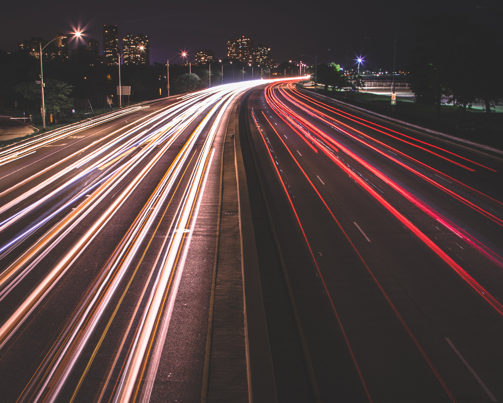

# China Road Traffic Update

**Date:** June 15, 2020  
**Publisher:** Breakwave Advisors | **Category:** Market Insights  
**Original URL:** [https://www.breakwaveadvisors.com/insights/2020/6/15/china-road-traffic-update](https://www.breakwaveadvisors.com/insights/2020/6/15/china-road-traffic-update)  

---

> **Figure 1: Also of Note Is Reuters Has Reported That A"beijing District Put**  
> *Also of note is Reuters has reported that a"Beijing district put itself on a wartime footing and the capital banned tourism and sports events on Saturday after a cluster of novel coronavirus infections centred around a major wholesale market sparked fears of a new wave of COVID-19. 45 people out of 517 tested with throat swabs at the Xinfadi market in the city's southwestern Fengtai district had tested positive for the coronavirus"". Reuters has also reported that "11 neighbourhoods in the vicinity of the market, which claims to be the largest agricultural wholesale market in Asia, had been locked down with 24-hour guards put in place".*  
> [Local Asset](file:///C:/Users/Dell/Github/Shipping/corpus/03-breakwave/insights/2020/assets/2020-06-15_china-road-traffic-update_img_image-asset_8f20cdb1e955.jpeg)

Collectively, traffic at 8AM in Shanghai, Beijing, Shenzhen, Guangzhou, and Chengdu today was up by 16% from 2019's average. In comparison, one week ago it was up by 12% from 2019's average. Traffic at 12PM today was down by 5% from 2019's average. One week ago, it was down by 4% from 2019's average. Traffic at 3PM was down today by 15% from 2019's average. One week ago, it was down by 14% from 2019's average.

Regarding weekend traffic, traffic at 12PM in the cities we have been monitoring was down this past Saturday and Sunday by 10% from 2019’s average. During the previous weekend, it was down by 9%. Traffic at 3PM was down by 23% from 2019’s average. During the previous weekend, it was down by 18%. Traffic at 5PM was down by 25% from 2019’s average. During the previous weekend, it was down by 17%. Overall, it remains only rush hour traffic that has normalized.

We are continuing to monitor all coronavirus-related developments closely and will be continuing to publish updates. As we discussed most recently in our June 8th Weekly China Report, weekend traffic has long remained weakest in Beijing. It is noteworthy to us that China's latest coronavirus cluster has occurred in Beijing.
