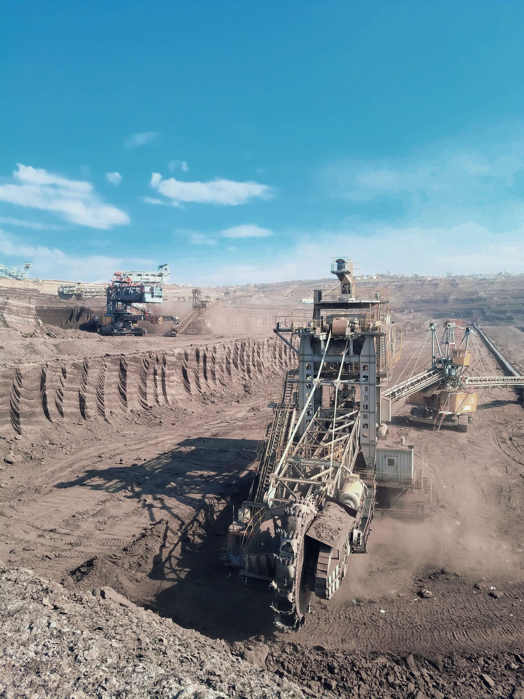
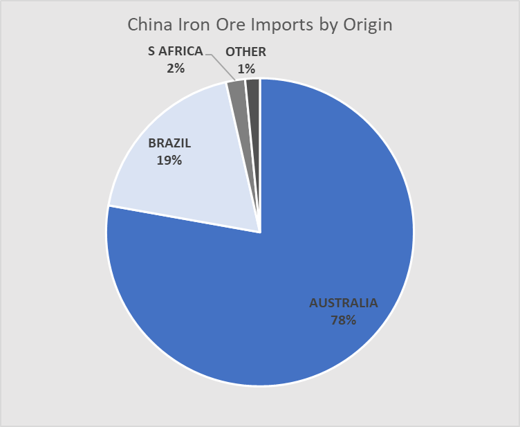

# What happens to shipping if China stops buying Australian iron ore?

**Date:** June 15, 2020  
**Publisher:** Breakwave Advisors | **Category:** Market Insights  
**Original URL:** [https://www.breakwaveadvisors.com/insights/2020/6/15/what-happens-to-shipping-if-china-stops-buying-australian-iron-ore](https://www.breakwaveadvisors.com/insights/2020/6/15/what-happens-to-shipping-if-china-stops-buying-australian-iron-ore)  

---

> **Figure 1: “Despite the Rapid Deterioration of China-Australia Relations**  
> *“Despite the rapid deterioration of China-Australia relations over recent dispute, some observers believe that Beijing is unlikely to target Australian iron ore exports due to China's heavy dependence on this imported commodity…. There is indeed some truth in the argument that curbing Australian iron ore imports would have negative impacts on China's economy, but Australia would suffer much greater economic damage if China were to make such a move. Without Australian iron ore, China may have to pay more and spend time seek alternatives from Brazil or Africa and cultivate domestic iron ore sources. Australia, however, will never find big buyer to replace China, especially considering the coronavirus pandemic has weighed down global demand for commodities.While there is no denying that China would face economic repercussions if it bans or restricts Australian iron ore imports, the Australian economy would definitely suffer more.It would be a big mistake for anyone to think that despite its dependence on iron ore China wouldn't cut Australian imports(emphasis added). China will not tolerate further behavior that touches its bottom line, even if retaliation comes at the expense of its economic interests.”*  
> **Interactive Data & Source:** [Globaltimes](http://www.globaltimes.cn/content/1191579.shtml) | [Local Asset](file:///C:/Users/Dell/Github/Shipping/corpus/03-breakwave/insights/2020/assets/2020-06-15_what-happens-to-shipping-if-china-stops-buying-australian-iron-ore_img_image-asset_e8be15f4d485.jpeg)

The[weekend article in Global Times](http://www.globaltimes.cn/content/1191579.shtml)that touched on China-Australia relations and the impact on iron ore trade is of particular importance for the dry bulk market. Australia ships more than 700 million tons of iron ore per year to China, and thus such trade is one the most important demand drivers for dry bulk shipping globally. The article discusses the potential for a disruption in iron ore trade between the two countries due to recent trade frictions and how Australia’s economy will be equally hurt in such a scenario.

For dry bulk shipping, such a development will be catastrophic.

Global Times reports:

As one looks at negotiating tactics between the two countries, game theory is definitely relevant and threats serve a purpose in reaching an agreement down the road. However, that does not mean things can not go wrong during such process.

Given the strong ties of the above publication to the Chinese government, one should not simply disregard such an article. For shipping investors, this is even more meaningful, and definitely something to worry about, as it increases the risk to shipping especially for the Capesize segment. It is easy to make the assumption that, because both players will equally loose, such a development is highly unlikely. In recent years, other geopolitical disputes have shown that when it comes to countries’ relationships, traditional game theory might not always provide the answer.

Last year, Australia accounted for approximately 78% of all iron ore imports to China. More importantly, 81% of all exported iron ore from Australia ended up in China. Thus, the interdependence of the two countries on iron ore trade is impossible to downplay.

> **Figure 2: 2019 Iron Ore Imports to China**  
> *2019 Iron Ore Imports to China*  
> [Local Asset](file:///C:/Users/Dell/Github/Shipping/corpus/03-breakwave/insights/2020/assets/2020-06-15_what-happens-to-shipping-if-china-stops-buying-australian-iron-ore_img_ioimports2019_db85028e8ea6.png)

For dry bulk shipping, the Australia-China iron ore trade corresponded to about 10% of total ton-mile dry bulk demand and appropriately 33% of Capesize ton-mile demand, according to our estimates.

Any disruption in that trade, and there is not enough iron ore in the world to make up for the difference. Although iron ore prices will probably skyrocket on such a development, Brazil (that already is still recovering from last year’s dam incident and now struggling with COVID-19 issues) and South Africa (that operates almost at capacity) won’t be able to increase exports enough to make up for the shortfall. The iron ore market will explode in volatility, established trading patterns will see major disruptions, defaults and renegotiations on long term shipping contracts will increase dramatically and credit defaults will skyrocket given the high leverage of the relevant industries.

All of the above seem distant scenarios today and we believe the risk of such disastrous developments remains low. However, after Sunday’s article, such low probability risk has increased.

---

**Tags:** Shipping, Capesize, Dry Bulk, China, Brazil, Australia  
