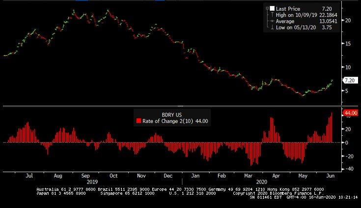
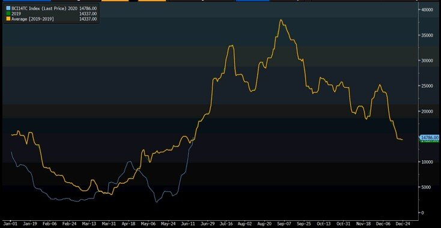

# Capesize futures surge as the Atlantic market comes back roaring

**Date:** June 16, 2020  
**Publisher:** Breakwave Advisors | **Category:** Market Insights  
**Original URL:** [https://www.breakwaveadvisors.com/insights/2020/6/16/capesize-futures-surge-as-the-atlantic-market-comes-back-roaring](https://www.breakwaveadvisors.com/insights/2020/6/16/capesize-futures-surge-as-the-atlantic-market-comes-back-roaring)  

---

> **Figure 1: Market Chart 1**  
> **Interactive Data & Source:** [Braemarscreen](https://braemarscreen.com/home) | [Local Asset](file:///C:/Users/Dell/Github/Shipping/corpus/03-breakwave/insights/2020/assets/2020-06-16_capesize-futures-surge-as-the-atlantic-market-comes-back-roaring_img_image-asset_da8729e3150a.jpeg)

A mad day in[freight futures today](https://braemarscreen.com/home), as improving spot rates across the globe and better sentiment in macroeconomic fundamentals (see[infrastructure spending](https://www.foxbusiness.com/markets/us-stocks-june-16-2020)) pushed freight futures higher, aided by significant short covering of bearish bets made earlier in the year.

As the spot Capesize market is repeating its year ago pattern (with a brief interruption in May), and with significant volume expected out of[Brazil in the second half of the year](https://www.argusmedia.com/en/news/2112224-vale-keeps-iron-ore-guidance-after-itabira-halted), physical players seem to have been caught short freight (i.e. not enough chartered-in vessels to ship the anticipated higher volume), rushing into the futures market to take cover. At the same time, a number of owners/operators that have sold futures to hedge their positions earlier in the year due to fears of the COVID-19 trade disruptions, rushed to cover their positions, causing in the process one of the biggest upward moves in freight futures in quite sometime.

[BDRY, the dry bulk ETF](https://etfmg.com/funds/bdry/), is having its best two weeks on record, up ~44%, on high volume and is up more than 90% from the recent lows just only a month ago:

> **Figure 2: Brazil Is Shipping More Iron Ore**  
> *Brazil is shipping more iron ore, with the last count this week pointing to more than 30 million tons in exports for June, by far the highest number in six months*  
> **Interactive Data & Source:** [Breakwave Advisors Market Insights](https://www.breakwaveadvisors.com/insights/2020/6/10/what-is-driving-capesize-rates-higher) | [Local Asset](file:///C:/Users/Dell/Github/Shipping/corpus/03-breakwave/insights/2020/assets/2020-06-16_capesize-futures-surge-as-the-atlantic-market-comes-back-roaring_img_bdryroc_7d17bcc33e0f.jpg)

The drivers for the higher activity, and thus, stronger rates, remain the same (also see our comment from last week[here](https://www.breakwaveadvisors.com/insights/2020/6/10/what-is-driving-capesize-rates-higher)):

- *Australia has absorbed a lot of ships, as their iron ore shipments have also been close to record highs, on the back of*[*iron ore prices*](https://www.australianmining.com.au/news/iron-ore-prices-soar-as-vale-shuts-mines-down/)*that are hovering around $100/ton*
- *Macro data is improving, with strong stimulus across every major economy around the world: China new loan activity is booming, Chinese steel production in May was record high (China produced more steel in the month of May that the US is producing in a year) while new infrastructure projects are accelerating across the country*
- *Europe is slowly reopening, and pent-up demand will drive more imports into the Continent (though in reality yet to be seen)*
- *Vessels have cut their speed at record lows as rates collapsed, while delays due to COVID-19 have increased and port inspections/regulations/crew changes are causing even longer than expected trips, tightening ship supply*
- *Incremental cargo exports out of East Coast Canada (given that economic activity in Europe was slow, most iron ore exports from the region were diverted to China, thus absorbing more ships due to the longer voyages) and from West Africa (bauxite exports have reached record highs out of Guinea, with almost one Capesize cargo per day currently, versus a few cargoes per week just two years ago)*

All of the above is causing a major upward push in the dry bulk sector, which combined now with bullish sentiment, could continue to support strong rates for the next several months. Smaller size vessels are also catching up, and both Panamax and Supramax spot rates are increasing. Dry bulk is highly levered to the macro environment, and thus the higher activity is no surprise, given other economic indicators that point to the same direction.

Finally, here is how Capesize rates have so far performed versus last year:

> **Figure 3: Capesize Spot Rates Are Now Where They Were This Time Last Year**  
> [Local Asset](file:///C:/Users/Dell/Github/Shipping/corpus/03-breakwave/insights/2020/assets/2020-06-16_capesize-futures-surge-as-the-atlantic-market-comes-back-roaring_img_capesize2019_73fcee269b27.jpg)

Capesize spot rates are now where they were this time last year

### Will History Repeat Itself and We See $40,000/day Capesize Rates Soon?

---

**Tags:** Shipping, Capesize, China, Dry Bulk, Australia, Brazil  
