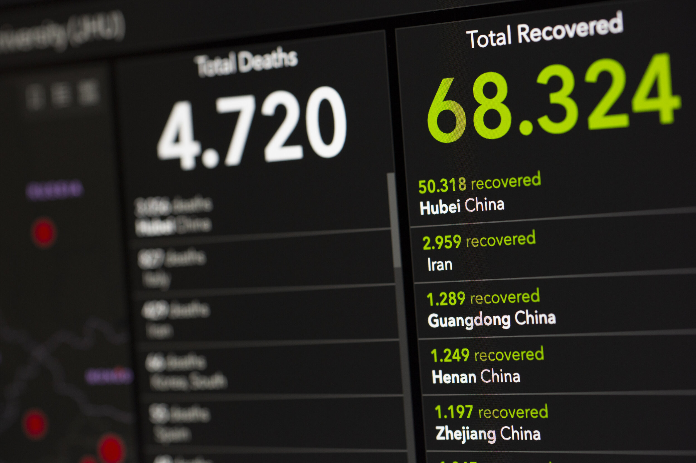

# China/Brazil Coronavirus update

**Date:** June 17, 2020  
**Publisher:** Breakwave Advisors | **Category:** Market Insights  
**Original URL:** [https://www.breakwaveadvisors.com/insights/2020/6/17/chinabrazil-coronavirus-update](https://www.breakwaveadvisors.com/insights/2020/6/17/chinabrazil-coronavirus-update)  

---

> **Figure 1: According to China's Global Times**  
> *According to China's Global Times, Beijing has raised its COVID-19 emergency response to Level 2 from Level 3 which includes "reinstating closed managements on communities, requiring people to have temperatures taken, register, and check health codes before entry. Communities, sub-districts, streets in high/middle risk areas would ban outsiders and cars from entering; and communities of high risk sub-districts would have closed-off management, allowing no one to leave".*  
> [Local Asset](file:///C:/Users/Dell/Github/Shipping/corpus/03-breakwave/insights/2020/assets/2020-06-17_chinabrazil-coronavirus-update_img_image-asset_078f6346d78f.jpeg)

This comes on the heels of an earlier decision this week in which all schools in Beijing will be closed starting today.

Noteworthy is that only 40 new cases of coronavirus were reported throughout all of China yesterday. As we have stressed in our work, though, we do not take China's coronavirus data seriously. The government's actions this year, however, continue to help provide more of a sense of what is actually occurring. As with a few months ago, we again believe that China has more coronavirus cases than the government is letting on.

Also of note is that Brazil yesterday reported a record 37,278 new cases of coronavirus. This marks the largest one-day total that Brazil has ever reported. As we have continued to stress in our work, the outbreak in Brazil continues to intensify. The same is true for the world at large. Globally, a record 142,557 new cases of coronavirus were reported yesterday.

---

**Tags:** Brazil, China, Shipping, Coronavirus  
