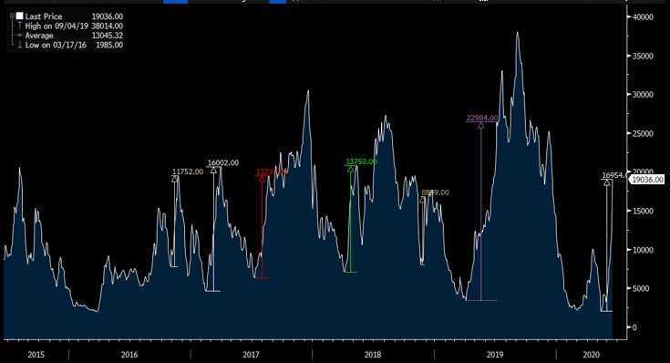
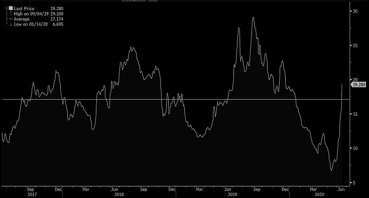
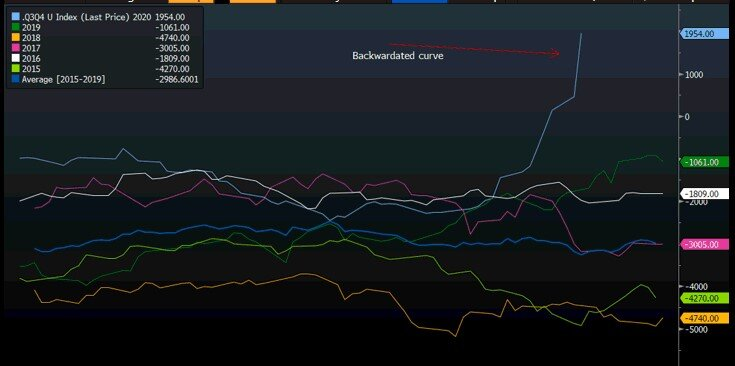

# Is it time for a breather in dry bulk rates?

**Date:** June 17, 2020  
**Publisher:** Breakwave Advisors | **Category:** Market Insights  
**Original URL:** [https://www.breakwaveadvisors.com/insights/2020/6/17/is-it-time-for-a-breather-in-dry-bulk-rates](https://www.breakwaveadvisors.com/insights/2020/6/17/is-it-time-for-a-breather-in-dry-bulk-rates)  

---

> **Figure 1: Market Chart 1**  
> **Interactive Data & Source:** [Gcaptain](https://gcaptain.com/baltic-dry-index-tops-1000-for-first-time-in-six-months/) | [Local Asset](file:///C:/Users/Dell/Github/Shipping/corpus/03-breakwave/insights/2020/assets/2020-06-17_is-it-time-for-a-breather-in-dry-bulk-rates_img_image-asset_fc4789c7df3b.jpeg)

An impressive[rally in dry bulk freight rates](https://gcaptain.com/baltic-dry-index-tops-1000-for-first-time-in-six-months/)has once again revealed the extremely volatile nature of shipping, where short term imbalances between supply and demand can cause sharp moves in freight rates, in any macro environment. This time around, Capesize rates have skyrocketed in less than a month from ~3,000/day to more than 20,000/day in a relentless rally that has caught even seasoned traders and physical users of freight by surprise.

However, the significant increase in rates is naturally bringing up the question of where does the upward move end. After all, shipping is a cyclical market, which means sharp rallies but also sharp drops.

We think the market is due for a breather to digest the recent price action before resuming its ascent, supported by a favorable supply/demand balances for the next several months (see[here](../pdfs/2020-06-17_is-it-time-for-a-breather-in-dry-bulk-rates_breakwavemay262020report_aeafc973de53.pdf)and[here](https://www.breakwaveadvisors.com/insights/2020/6/10/what-is-driving-capesize-rates-higher)).

Our crystal ball is no different that anyone else’s in such a volatile environment. However, history might be of some assistance here, given the cyclical natural of dry bulk rates.

Looking at the recent past, spikes in spot Capesize rates have averaged approximately 15,000 from the most recent bottom to the next available peak. Last year, the rally was much stronger, totaling more than 23,000 from bottom to top (actually the rally was even stronger, but we think the last leg was a very localized squeeze). Excluding last year’s impressive rally, the average upward move has been around 13,000.

> **Figure 2: Capesize Spikes**  
> [Local Asset](file:///C:/Users/Dell/Github/Shipping/corpus/03-breakwave/insights/2020/assets/2020-06-17_is-it-time-for-a-breather-in-dry-bulk-rates_img_capesizespikes_de8f064ce695.jpg)

The move higher in Capesize rates from the most recent low on May 13 has been almost 17,000 (and counting as we expect another big up index tomorrow). That is above average levels and above any such rally recently (with the exception of last year). Although such approach ignores fundamental reasons (i.e. cargo flow versus available ships, positioning, ballast lists, etc), it is fair to assume that a lot of cargo has already been fixed in the process.

Furthermore, the all important C3 Capesize route rate (that is the Brazil to China freight cost in USD per ton of cargo carried) is now once again exceeding its long term average of ~$17/ton(it is at $19/ton to $21/ton currently) after moving almost $13/ton in a month!

> **Figure 3: C3**  
> [Local Asset](file:///C:/Users/Dell/Github/Shipping/corpus/03-breakwave/insights/2020/assets/2020-06-17_is-it-time-for-a-breather-in-dry-bulk-rates_img_c3_73c6e3f5ed83.jpg)

Although that does not mean there is no more potential upside, for commodity traders/miners, that is the level that has been budgeted more or less, in our view, so there might be more resistance near term to pay up (on the other hand, iron ore prices are $100/ton, so there is still significant margin potential for them even at higher freight cost).

Furthermore, the futures curve on the Capesize segment has flipped to backwardation (future prices are lower that near dated prices), as the August, September and Q4 contracts are now trading at a discount to both the spot rate as well as the July contract. Although that has historically been a very inaccurate indicator for the direction of the spot, nevertheless it removes the “arbitrage” trade between physical and paper (i.e. there is no real return by selling forward and fixing spot) and thus marginal support for the spot market.

> **Figure 4: Difference Between Capesize Q3 Futures and Q4 Futures**  
> *Difference between Capesize Q3 futures and Q4 futures*  
> [Local Asset](file:///C:/Users/Dell/Github/Shipping/corpus/03-breakwave/insights/2020/assets/2020-06-17_is-it-time-for-a-breather-in-dry-bulk-rates_img_curveq3vsq4_e55310ba8264.jpg)

There is no reliable and consistent method to judge any market’s future direction, let alone dry bulk, where volatility is abundant and real. However, every rally is followed by a stabilization (or a drop), and we believe we are at the last legs of the most recent one.

Finally, the dry bulk market remains cautious about the second half of the year, evident by the lack of excitement for the Q4 futures contracts, a view we don’t share. A repeat of last year’s trajectory in rates is now our base scenario with a twist of a stronger Q4 and the potential of seeing spot rates even above last year’s levels. (To be fair, COVID-19 future developments will play a major role on the outcome though). For now, however, a pause in both futures prices and spot rates (although spot Capesize rates will most likely be up again tomorrow given late day information) will bring some much needed order and allow players to refocus before a potential new leg higher.

---

**Tags:** Shipping, Dry Bulk, Capesize, China  
