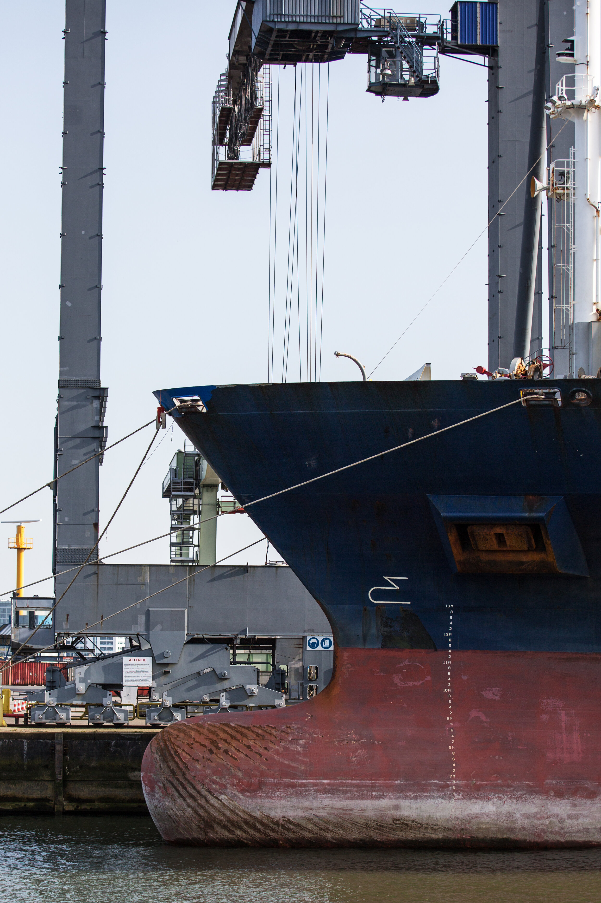
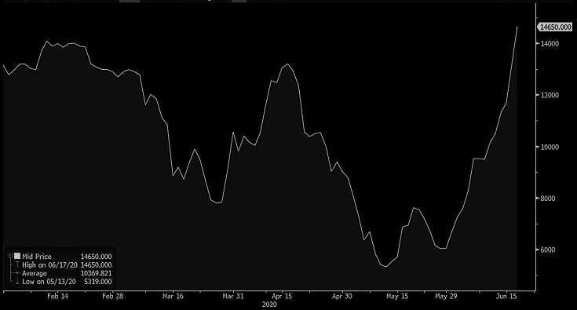

# Spot indices explode Higher as futures turn lower

**Date:** June 18, 2020  
**Publisher:** Breakwave Advisors | **Category:** Market Insights  
**Original URL:** [https://www.breakwaveadvisors.com/insights/2020/6/18/spot-indices-explode-as-futures-take-a-pause](https://www.breakwaveadvisors.com/insights/2020/6/18/spot-indices-explode-as-futures-take-a-pause)  

---

> **Figure 1: Capesize Spot: +12**  
> *Capesize spot: +12,870 or 103%*  
> [Local Asset](file:///C:/Users/Dell/Github/Shipping/corpus/03-breakwave/insights/2020/assets/2020-06-18_spot-indices-explode-as-futures-take-a-pause_img_image-asset_e53aafa25b7b.jpeg)

Capesize spot rates continued their impressive rally, reaching their highest point since December of last year, with the average spot rate now standing at more than 25,000/day. Panamax rates also moved sharply higher, and now stand just shy of 9,000/day (~10,000/day for larger type Panamax vessels). The overall dry bulk market appears extremely hot, with talks of actual lack of ships for specific index dates in the Atlantic, splitting cargoes from Capesize to Panamaxes and rumored concluded deals that are approaching 30,000/day.

In a typical fashion, however, an overheated spot market brought sellers into the futures market, as the intensity and speed of the rally has led most players questioning the sustainability of the move and laying out hedges or simply taking profits.

As such, futures pulled back to below yesterday’s closing levels, and with the week almost over, all eyes are into early next week, especially for the super hot Capesize segment.

The physical market remains strong, with last done reported fixtures at or above index levels for now and, based on that, spot indices should continue their ascent tomorrow.

So far, since Friday:

- *Panamax spot: +2,390 or 38%*
- *Capesize Q3 futures: +3,500, or 22%*
- *Panamax Q3 futures: +3,000 or 20%*

Finally, here is a chart of the June Capesize futures contract that has a low of ~5,300 and a current high of ~16,000:

> **Figure 2: Cape June**  
> [Local Asset](file:///C:/Users/Dell/Github/Shipping/corpus/03-breakwave/insights/2020/assets/2020-06-18_spot-indices-explode-as-futures-take-a-pause_img_capejune_a51be9b6e3e0.jpg)

---

**Tags:** Shipping, Dry Bulk, Capesize, Panamax  
