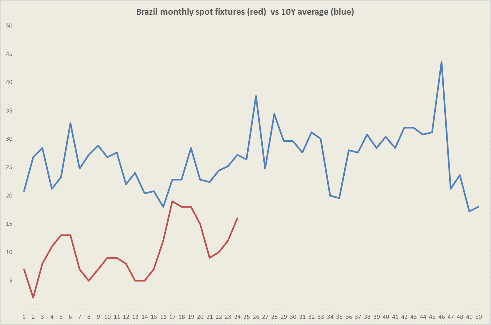
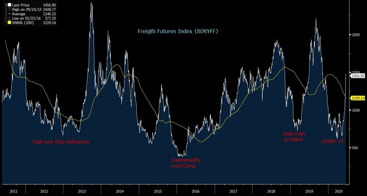

# A week for the records for dry bulk shipping

**Date:** June 19, 2020  
**Publisher:** Breakwave Advisors | **Category:** Market Insights  
**Original URL:** [https://www.breakwaveadvisors.com/insights/2020/6/19/a-week-for-the-records-for-dry-bulk-shipping](https://www.breakwaveadvisors.com/insights/2020/6/19/a-week-for-the-records-for-dry-bulk-shipping)  

---

> **Figure 1: “Operations Have Been Running Smoothly in Comparison to the Wet**  
> *“Operations have been running smoothly in comparison to the wet and windy conditions we saw in the Q1, and demand from China remains buoyant. You can also look to the once 40 strong list of ballasting tonnage that had slowed down or idled at South Africa which is now reduced to less than a handful of ships that can comfortably make end June/early July loading. The thinned supply model has exposed greatly the actual demand for ballasting tonnage during these months”*  
> **Interactive Data & Source:** [Scmp](https://www.scmp.com/economy/china-economy/article/3086569/china-pledges-largest-ever-economic-rescue-package-save-jobs) | [Local Asset](file:///C:/Users/Dell/Github/Shipping/corpus/03-breakwave/insights/2020/assets/2020-06-19_a-week-for-the-records-for-dry-bulk-shipping_img_image-asset_9c08a7943942.jpeg)

One of the most exciting weeks in recent memory for dry bulk shipping comes to an end, with many people starting to use more and more the phrase “the good ol’ days are back” as volatility once again appears out of nowhere and brings excitement back to a market that has struggled for most of the year.

Capesize spot and futures naturally led the way, but one should not disregard the smaller size segments, with Panamax futures actually performing equally well (although trading at significant premiums to spot throughout the week). As the week comes to an end and volatility has calm down a bit, the usual question of what comes next is the obvious topic of discussion in the market.

It is a fact that spot freight has increased too fast and that has distorted the market balance, especially for the numerous hedge books across the industry. With Capesize rates increasing dramatically in such a short period of time, freight traders had to rapidly adjust their hedges to the new price levels (especially in option land where gamma hedging should have been abundant last week). In addition, expectations about future volatility has now changed dramatically, as the ranges expanded massively, which will naturally lead to more volatile trading in the days and weeks to come.

However, with Brazil exports improving and China’s appetite for iron ore at almost record highs, the fundamental picture remains solid.

Braemar writes:

> **Figure 2: “Naturally**  
> *“Naturally, after such a strong move the market, at the time of writing at least, is pausing for breath inevitably raising questions about near term sustainability of these new highs (particularly in the face of falling FFA levels). Fundamentally, the clear out of early tonnage across both basins and a general belief in Iron Ore demand would suggest any significant reversal is unlikely at this stage”*  
> **Interactive Data & Source:** [Scmp](https://www.scmp.com/economy/china-economy/article/3086569/china-pledges-largest-ever-economic-rescue-package-save-jobs) | [Local Asset](file:///C:/Users/Dell/Github/Shipping/corpus/03-breakwave/insights/2020/assets/2020-06-19_a-week-for-the-records-for-dry-bulk-shipping_img_brfix_757e0c086582.png)

As of the near term direction of rates, the month of July continues to still hold decent amount of cargo in both the Atlantic and the Pacific and positional tightness is there to support more or less current freight levels. Brazilian spot fixtures is running still below the long term average (see chart above) and still below the run rate from last year (however it is much closer now). Although dramatic moves either way should not be discounted, a gentle drift lower for Capesize rates over the next week is our base case scenario as the market digests the current price levels.

Braemar continues:

However, with futures at sharp discounts to spot, a pause in the downward direction and volatility will be back with a vengeance, thus futures should remain range bound, at least during most of next week.

Finally, the market has now move to a new level, and the next leg upward will start from a much higher base (though the market needs to first establish such base), thus the upside potential has generally increased. The second half of 2020 should be one of the best periods for dry bulk owners in quite sometime, as the macroeconomic picture (see[stimulus spending](https://www.scmp.com/economy/china-economy/article/3086569/china-pledges-largest-ever-economic-rescue-package-save-jobs)in the trillions around the globe) is supportive, inventories for raw materials are low ([iron ore inventories at 4-year lows](assets/2020-06-19_a-week-for-the-records-for-dry-bulk-shipping_china-iron-ore-set-7th-053009865_8f19a9f2ded6.html)), and pend up demand for shipping due to delays in the first half is increasing quite rapidly.

> **Figure 3: Weighted Average Index of Near-Dated Dry Bulk Futures**  
> *Weighted average index of near-dated dry bulk futures*  
> [Local Asset](file:///C:/Users/Dell/Github/Shipping/corpus/03-breakwave/insights/2020/assets/2020-06-19_a-week-for-the-records-for-dry-bulk-shipping_img_bdryff_2709f16e0a74.jpg)

Are decade highs at play this year?
