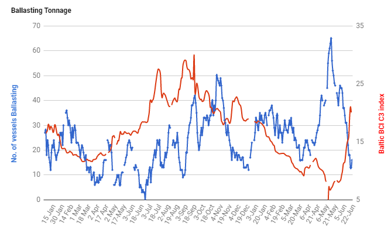

# Atlantic freight market strengthens as open ships remain scarce

**Date:** June 22, 2020  
**Publisher:** Breakwave Advisors | **Category:** Market Insights  
**Original URL:** [https://www.breakwaveadvisors.com/insights/2020/6/22/atlantic-strengthens-as-open-ships-remain-scarce](https://www.breakwaveadvisors.com/insights/2020/6/22/atlantic-strengthens-as-open-ships-remain-scarce)  

---

Another day of tight availability for the Capesize segment, with ships open to conclude voyages in the Atlantic basin difficult to find. Capesize futures reacted early in the morning, as it was evident that rates are not softening materially for now. As a result, the near dated contracts rallied back to last week’s highs, before the spot index, which came out almost flat, but seemed undermarked given the concluded and rumored fixtures. The futures maintained their gains throughout the day, and now expectations are for a higher Capesize index tomorrow.

The Atlantic basin has gone from oversupplied to undersupplied in a matter of a few weeks. As SSY notes in the chart below, the Capesize ballaster list (ships that are sailing empty from Asia towards the Atlantic seeking to conclude business in the Atlantic) has dropped quite dramatically in recent weeks, which has tightened the supply/demand balance of ships and is the main reason for the rapid strengthening in rates.

From SSY:

> **Figure 1: Ssy Balaster List**  
> [Local Asset](file:///C:/Users/Dell/Github/Shipping/corpus/03-breakwave/insights/2020/assets/2020-06-22_atlantic-strengthens-as-open-ships-remain-scarce_img_ssybalasterlist_6c45a4dbde64.png)

With the Baltic Dry Index flattish today and with Capesize spot rates showing some signs of erosion, all eyes are now on tomorrow’s Capesize index, as another busy and volatile week for dry bulk seems in the cards. After all, the breather late last week might end up being short lived.
