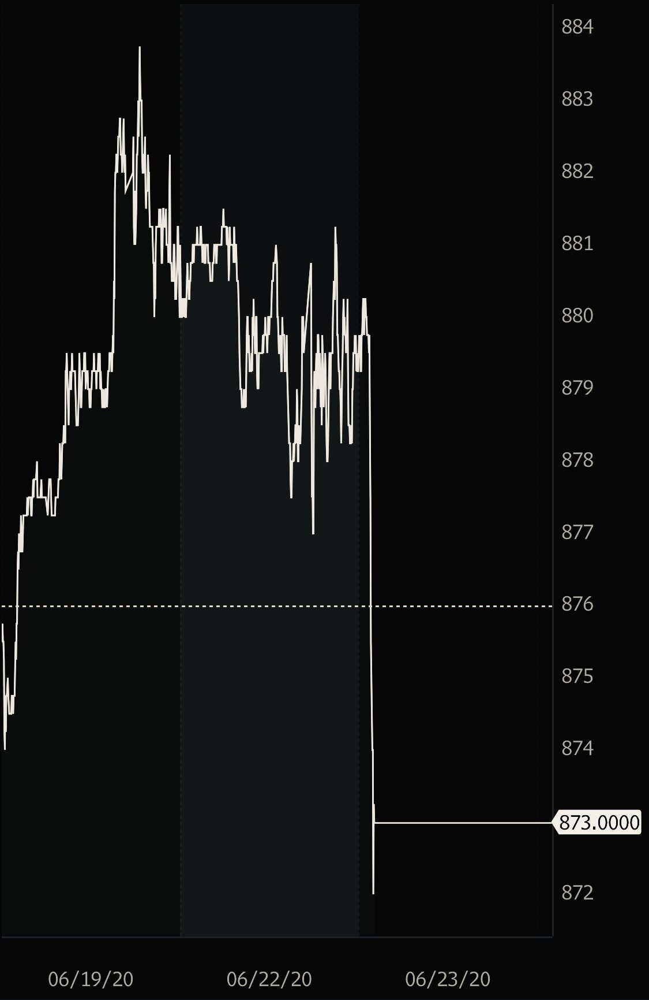

# Soybeans follow stocks lower as Navarro says trade deal “is over”

**Date:** June 22, 2020  
**Publisher:** Breakwave Advisors | **Category:** Market Insights  
**Original URL:** [https://www.breakwaveadvisors.com/insights/2020/6/22/krskswagmtg8pc1kw0kk6b2aekjqg5](https://www.breakwaveadvisors.com/insights/2020/6/22/krskswagmtg8pc1kw0kk6b2aekjqg5)  

---

Soybeans dipped in overnight trading following a[Reuters report](https://mobile.reuters.com/article/amp/idUSKBN23U02Q?__twitter_impression=true)quoting White House trade advisor Peter Navarro saying that the China trade deal “is over”.

From Reuters:

"*It's over," Navarro told Fox News in an interview when asked about the trade agreement. He said the "turning point" came when the United States learned about the spreading coronavirus only after a Chinese delegation had left Washington following the signing of the Phase 1 deal on Jan. 15.”*

### Soybeans Active Contract:

> **Figure 1: Adjustments**  
> [Local Asset](file:///C:/Users/Dell/Github/Shipping/corpus/03-breakwave/insights/2020/assets/2020-06-22_krskswagmtg8pc1kw0kk6b2aekjqg5_img_adjustments_31ca4cf14510.jpeg)

Equity futures also weakened on the news. In the past, such news headlines also had a negative impact on dry bulk shipping, especially the Panamax and Supramax segments as China’s purchases of US soybeans increase demand for those vessel sizes, especially during the second half of each year.

However, with Capesize rates driving dry bulk sentiment at the moment, it is yet to be seen what the net effect on freight futures might be later tonight.

---

**Tags:** Dry Bulk, Shipping, China  
