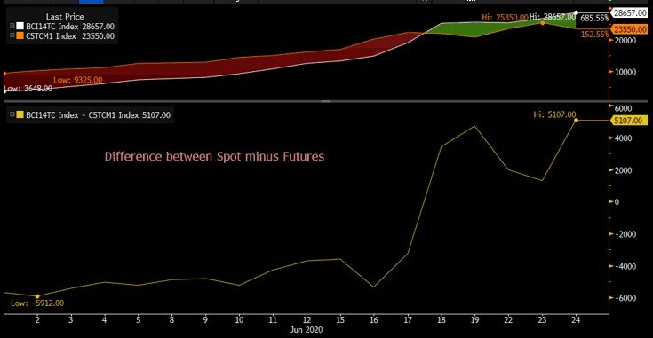
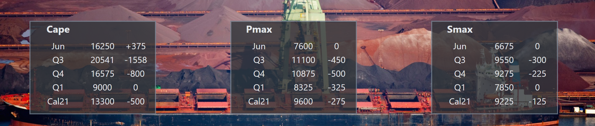

# Bearish sentiment takes hold of futures as spot continues its advance

**Date:** June 24, 2020  
**Publisher:** Breakwave Advisors | **Category:** Market Insights  
**Original URL:** [https://www.breakwaveadvisors.com/insights/2020/6/24/bearish-sentiment-takes-hold-of-traders-as-spot-continues-to-advance](https://www.breakwaveadvisors.com/insights/2020/6/24/bearish-sentiment-takes-hold-of-traders-as-spot-continues-to-advance)  

---

> **Figure 1: Ship18**  
> **Interactive Data & Source:** [Braemarscreen](https://braemarscreen.com/home) | [Local Asset](file:///C:/Users/Dell/Github/Shipping/corpus/03-breakwave/insights/2020/assets/2020-06-24_bearish-sentiment-takes-hold-of-traders-as-spot-continues-to-advance_img_ship18_12cd82abb0df.jpg)

Freight futures dipped, as nervousness about the near term direction of spot led to some profit taking following the significant advances over the last few days. At the end of the trading day,**Capesize futures were down ~7% while Panamax futures closed down 5%**with the Capesize spot now at almost 29,000,but it seems there is more caution on further advances as the month comes to a close with the July futures marked at around 23,500. The potential pause in the rate of increase was enough to bring sellers, even if there is no real indication of weaker spot anytime soon.

Still, the difference between spot prices and futures is massive, with the**July contract now more than 5,000 below spot**. Although this inside the historical range, it shows the increased caution in the market for the direction of spot prices near term.

> **Figure 2: Vloc/valemax Arrivals in Brazil Are Expected to Remain Around Or**  
> *VLOC/Valemax arrivals in Brazil are expected to remain around or below average weekly levels of 4m-dwt until the week starting 13 July. The thin list of ballasters in the coming weeks has partly fueled the ongoing rally of cape rates. Moving towards the second half of July, arrivals are estimated to rise slightly above average levels. However, we do not expect the impact on rates to be material. It will ultimately come down to how resilient Brazilian volumes will prove to be. Iron ore shipments out of Brazil averaged 6.6 million tonnes per week during the past 5 weeks. That is marginally below the 7 million tonnes shipped per week during the same period last year.*  
> **Interactive Data & Source:** [Braemarscreen](https://braemarscreen.com/home) | [Local Asset](file:///C:/Users/Dell/Github/Shipping/corpus/03-breakwave/insights/2020/assets/2020-06-24_bearish-sentiment-takes-hold-of-traders-as-spot-continues-to-advance_img_indexvsfutures_b9425a136de0.jpg)

The tightness in the Atlantic remains, with still not a lot of Capesize ships able to make it for July loadings.

As Arrow mentions, the VLOC (Very Large Ore Carrier) and Valemax (400k dwt vessels) vessel arrivals in Brazil remain at average levels and as a result it won’t have a lot of impact on the supply/demand balance in the Atlantic:

China is off for the rest of the week (Dragon Boat Festival), thus pointing to slower activity in the far east. That should limit activity especially for Panamax/Supamax vessels in the region.

Thurlestone explains on Panamax:

*That resistance may well be tested though with China off for the remainder of the week and therefore even further reduced activity / fresh cargoes hitting the market. As the tonnage list starts to grow some Owners may bite the bullet and accept reduced levels to find some cover before the weekend. However, that being said with the North Atlantic still looking tight…perhaps we will see more charterers picking off far eastern tonnage to cover their requirements out of the US Gulf…*

End of day futures from[Braemar Screen](https://braemarscreen.com/home):

> **Figure 3: Despite the Fact That There Was Limited Activity Across The**  
> *Despite the fact that there was limited activity across the capesize market today the sentiment is still undeniably positive and rates remain strong… It is worth nothing that the numbers from Brazil are approaching levels where charterers will begin to look at splitting stems on to panamax which should put something of a handbrake on further runaway gains.*  
> [Local Asset](file:///C:/Users/Dell/Github/Shipping/corpus/03-breakwave/insights/2020/assets/2020-06-24_bearish-sentiment-takes-hold-of-traders-as-spot-continues-to-advance_img_futures2c6-24_57aea803b7f7.png)

Finally, today’s futures activity combined with a plunge in oil prices and a generally bearish mood in markets across the board points to flattish/down indices for tomorrow for all vessel sizes. However, this seems to be a balanced act for now. Thurlestone remains optimistic, as sees the slower activity today more as a pause rather as a reversal:

One should always remember that Capesize rates were at 3,200 just a month ago….
