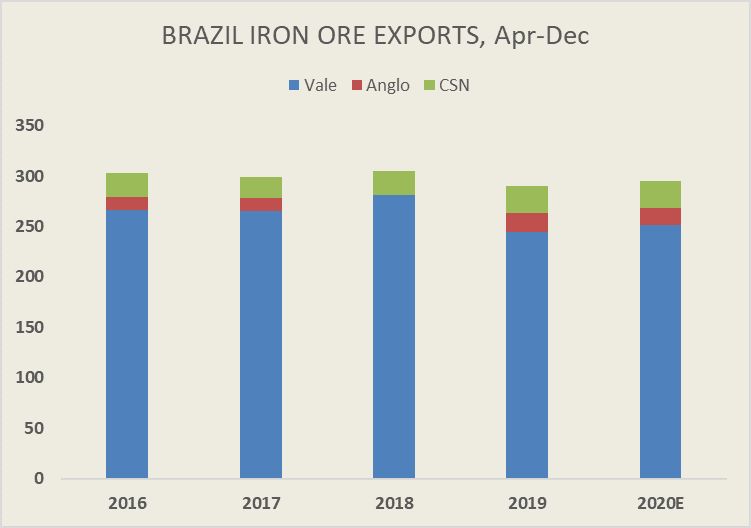

# Is Brazil about to unleash a tsunami of iron ore and push Capes to new highs?

**Date:** June 26, 2020  
**Publisher:** Breakwave Advisors | **Category:** Market Insights  
**Original URL:** [https://www.breakwaveadvisors.com/insights/2020/6/25/is-brazil-about-to-unleash-a-tsunami-of-iron-ore-and-push-capes-to-new-highs](https://www.breakwaveadvisors.com/insights/2020/6/25/is-brazil-about-to-unleash-a-tsunami-of-iron-ore-and-push-capes-to-new-highs)  

---

> **Figure 1: Vale Sa Expects to Navigate Surging COVID-19 Infections In**  
> *Vale SA expects to navigate surging Covid-19 infections in Brazil to achieve its production guidance this year and sees output bouncing back significantly in 2021 as the company recovers from tailings dam disasters, Credit Suisse Group AG analysts wrote in a report, citing talks with Vale’s top brass.*  
> [Local Asset](file:///C:/Users/Dell/Github/Shipping/corpus/03-breakwave/insights/2020/assets/2020-06-26_is-brazil-about-to-unleash-a-tsunami-of-iron-ore-and-push-capes-to-new-highs_img_vale-squarelogo-1416638537406_5c990e34d64f.png)

Much ink has been spent on the importance of Brazil in the dry bulk market. The significant sailing distance to China and the high commodity export nature of its economy makes Brazil a key region for the dry bulk market. Thus, any change, positive or negative, in the rate of bulk exports, and dry bulk owners and investors alike should pay close attention.

COVID-19 has thrown some cold water on market’s expectations for significant increases in bulk exports, and more specifically for iron ore. Although soybean export volumes to China already set new highs this year, the futures curve in Capesize rates points to weaker iron ore export volumes over the next few months, which in combination with relatively strong expected iron ore prices till the end of the year (albeit in a backwarded curve to be fair), lead us to believe that the market does not trust Brazil, and more precisely Vale the largest iron ore miner in the world, on its promises to deliver enough iron ore to the seaborne market as provided in their most recent annual guidance.

To that subject, Bloomberg comes with some comments that seem contradictory to such market expectations. Quoting Credit Suisse analysts, Bloomberg says that Vale expects to meet its annual guidance of 310-330 million tons of iron ore and thus Vale expects**weaker**iron ore prices down the road because of the additional supply of their product into the seaborne market.

Although such comments should be taken with a grain of salt given Vale’s disappointing performance for several years in a row, if such amount of iron ore manages to hit the water during the second half of the year, it will certainly have a material positive impact on Capesize rates and a material negative impact on iron ore prices.

As Bloomberg reports:

*“Management expects iron-ore demand to remain robust this year but said the ramp-up in production at Vale’s operations in the second half of the year could pressure prices”*

Such a scenario is not as far fetched as the market currently prices-in: Vale has to only meet last year’s production level, which combined with higher exports from other Brazilian miners could lead to a tsunami or iron ore exports out of Brazil in a short period of time. Combine that with ongoing very strong iron ore export volumes out of Australia, Canada and South Africa and high global port congestion for Capesize vessels, and the stars seem to align extremely well for dry bulk.

> **Figure 2: Br Io**  
> [Local Asset](file:///C:/Users/Dell/Github/Shipping/corpus/03-breakwave/insights/2020/assets/2020-06-26_is-brazil-about-to-unleash-a-tsunami-of-iron-ore-and-push-capes-to-new-highs_img_brio_a6cf880d39d5.png)

Relative changes in rates are measurable only during periods that supply and demand is close to balance. Currently the dry bulk market, and more specifically the Capesize market, is out of balance in favor of shipowners. Any additional push on the demand side, i.e. increasing Brazilian iron ore exports, and the freight market can once again touch levels that have not been seen since the beginning of the decade.

Finally, such an outcome is difficult to envision in the current state. After all, rates have surged from about 3,000/day to almost 30,000/day in about a month, and that has led to a lot of skepticism about the sustainability of the strength in Capesize rates. But with effectively five months left for Vale to meet their guidance (fixing ships will soon roll to August dates) a potential squeeze in Capesizes in the face of $100/ton iron ore should not be easily disregarded. One should always remember, “98 ships and 101 cargos equals boom; 101 ships and 98 cargos equals bust.”

---

**Tags:** Shipping, Australia, Vale, Dry Bulk, Brazil  
