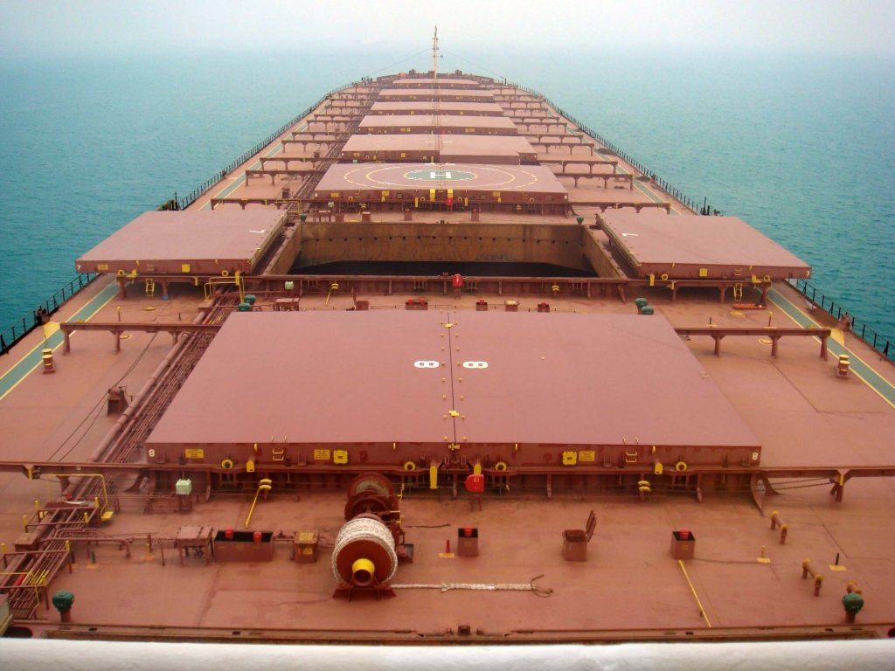
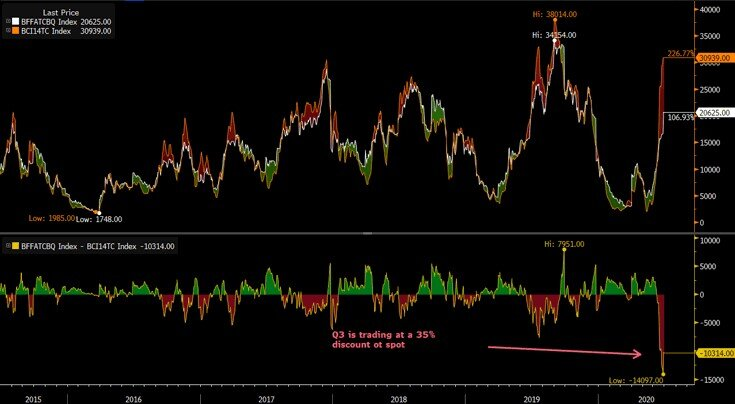

# First day of quarter prints almost 31,000 on Capes with futures at 35% discount

**Date:** July 01, 2020  
**Publisher:** Breakwave Advisors | **Category:** Market Insights  
**Original URL:** [https://www.breakwaveadvisors.com/insights/2020/7/1/first-day-of-quarter-prints-almost-31000-on-capes-with-futures-at-35-discount](https://www.breakwaveadvisors.com/insights/2020/7/1/first-day-of-quarter-prints-almost-31000-on-capes-with-futures-at-35-discount)  

---

> **Figure 1: Ship7**  
> [Local Asset](file:///C:/Users/Dell/Github/Shipping/corpus/03-breakwave/insights/2020/assets/2020-07-01_first-day-of-quarter-prints-almost-31000-on-capes-with-futures-at-35-discount_img_ship7_091cd72fc1e5.jpg)

First day of the new quarter and the story in the dry bulk freight market remains the same: A well-supported Capesize spot index and a bearish futures curve (in all fairness, some cracks on spot rates appeared earlier today in Asia, as the Australia-China route ticked lower, but it seems highly date-dependent).

The sharp increase in spot rates over the last month has failed to convince market participants on the sustainability of the strength, while at the same time, speculative capital betting on the possible upcoming correction of the spot index keeps pushing futures lower. The end result is one of the most backwardated markets in recent history (if not the most) when it comes to Capesize futures.

> **Figure 2: Q3 vs Spot**  
> [Local Asset](file:///C:/Users/Dell/Github/Shipping/corpus/03-breakwave/insights/2020/assets/2020-07-01_first-day-of-quarter-prints-almost-31000-on-capes-with-futures-at-35-discount_img_q3vsspot_68ecff732427.jpg)

The question in everyone’s mind is how quickly the spot will decline and at what level the correction will end. Both of those elements are difficult to judge at the moment, as the speed of the rally in rates combined with the intensity in fixing makes and near term prediction very difficult.

The sharp discount of Capesize futures to spot provide a lot of comfort for bulls, although history shows that corrections can take a life of their own and lead to steeper drops than people can imagine. For now, however, everyday with a spot index above the July futures contract (freight futures settle against the average spot index over the month), and bulls continue to realize to higher settlement levels.

---

**Tags:** Dry Bulk, Shipping, Australia, Capesize  
