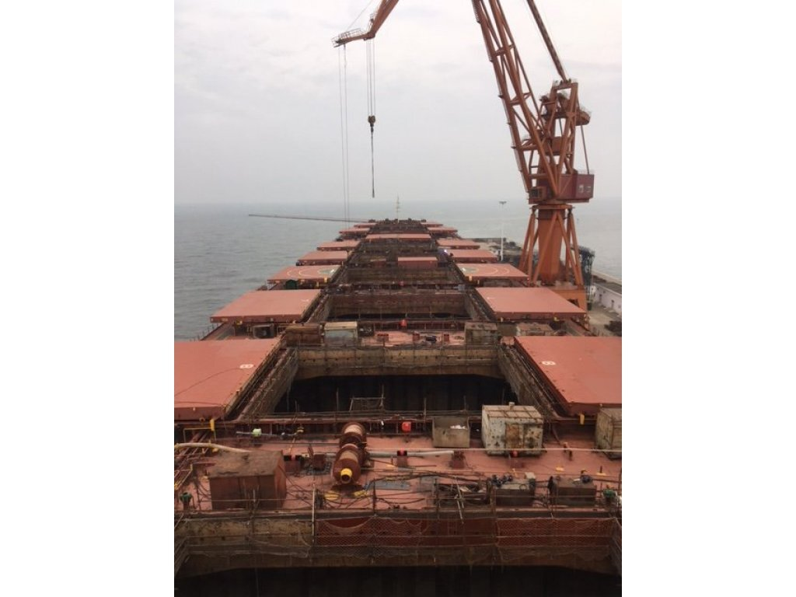
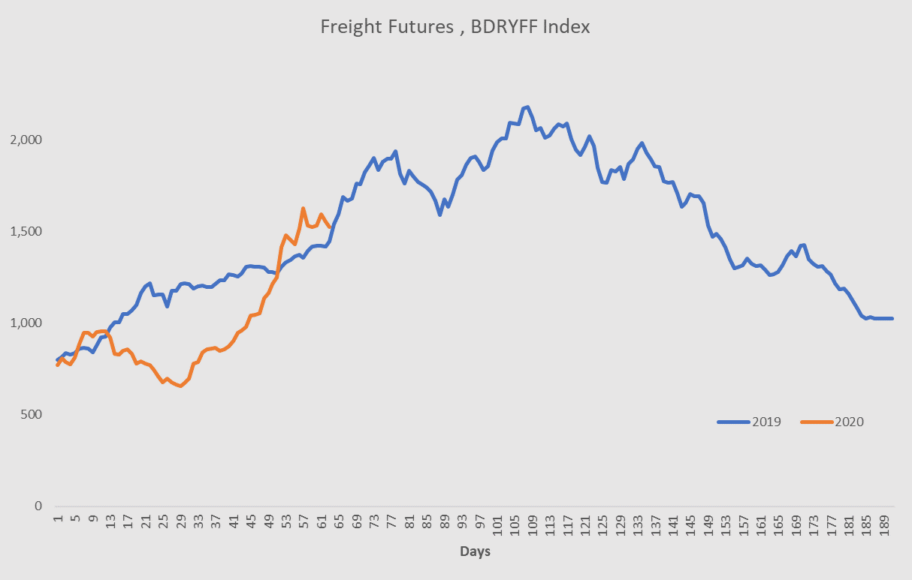
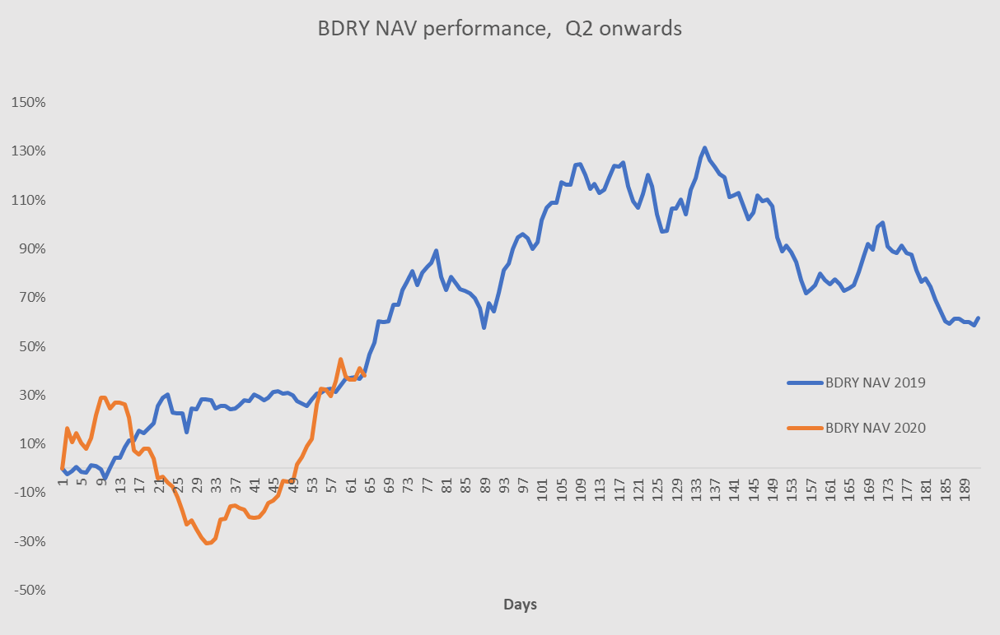

# A repeat of 2019 could mean high profits for freight traders

**Date:** July 02, 2020  
**Publisher:** Breakwave Advisors | **Category:** Market Insights  
**Original URL:** [https://www.breakwaveadvisors.com/insights/2020/7/1/a-repeat-of-2019-could-mean-high-profits-for-freight-investors](https://www.breakwaveadvisors.com/insights/2020/7/1/a-repeat-of-2019-could-mean-high-profits-for-freight-investors)  

---

> **Figure 1: Ship10**  
> [Local Asset](file:///C:/Users/Dell/Github/Shipping/corpus/03-breakwave/insights/2020/assets/2020-07-02_a-repeat-of-2019-could-mean-high-profits-for-freight-investors_img_ship10_f024c22dad29.jpg)

With the recent second quarter rally in freight rates behind us, market participants are currently taking a more cautious stance when it comes to the future, as the rapid and significant increase in spot rates, especially for Capesizes, has led a lot of people to start thinking that the best might be behind us.

Yet, as we enter July, the futures market is not that different versus last year. In fact, as of today,**the futures market is almost identical to last year**, despite the fact that spot rates for Capesizes stand some 50% higher versus this time last year.

Similar to the BDI that measures spot rates, BDRYFF is an index that measures near-dated freight futures across the dry bulk market (weightings are 50% Capesize, 40% Panamax and 10% Supramax; you can find out more about the BDRYFF Index[here](../pdfs/2020-07-02_a-repeat-of-2019-could-mean-high-profits-for-freight-investors_indexmethodology_ed40135b21eb.pdf)). The last close of the BDRYFF Index is now about the same to the same period last year, with Capesize Q3 futures slightly higher and Panamax Q3 futures slightly lower.

What BDRYFF is telling us is that basically freight traders’**near term****expectations today are almost identical**to the ones this time last year.

> **Figure 2: Bdryff**  
> **Interactive Data & Source:** [Etfmg](https://etfmg.com/funds/bdry/) | [Local Asset](file:///C:/Users/Dell/Github/Shipping/corpus/03-breakwave/insights/2020/assets/2020-07-02_a-repeat-of-2019-could-mean-high-profits-for-freight-investors_img_bdryff_1be5fedd899e.png)

However, further out the futures curve, the market is more pessimistic. Q4 Capesize futures are now 20% lower versus this time last year (Panamax Q4 futures is only slightly lower).

While always keeping in mind that history does not repeat itself, what can last year actually tell us about this year’s development in freight rates?

Last year, the rally in freight rates was only half way done once we entered into July. The freight futures market was less pessimistic then as near-dated futures were priced at parity to spot (compare than to today when the futures are at 35% discount to spot). Although the rally from the late March lows was equally impressive to the most recent one, the freight market had another leg higher with Q3 settling almost 50% higher versus what the futures were pricing in early July. (the Q3 settlement was 29,365 versus Capesize futures of roughly 20,000 in early July). Panamax rates saw an equally impressive rally, with Q3 futures settling at 16,014 versus Panamax futures of about 10,500 in early July. Those were**significant gains of 47% and 53%**, respectively, in less than three months.

Such a development in futures prices is easier to picture through the performance of BDRY, the[dry bulk ETF](https://etfmg.com/funds/bdry/). BDRY holds near-dated freight futures on dry bulk.

As the chart below shows, in 2019, despite BDRY being up roughly 40% since the end of Q1 (using the end of Q1 as the beginning of the seasonal improve in freight for comparison purposes), BDRY went to increase another 50%+ before reaching its peak in mid September fro a total increase of about 130% for the period (end of March to mid September).

> **Figure 3: Bdry**  
> [Local Asset](file:///C:/Users/Dell/Github/Shipping/corpus/03-breakwave/insights/2020/assets/2020-07-02_a-repeat-of-2019-could-mean-high-profits-for-freight-investors_img_bdry_d332f9714994.png)

Although the path of getting to the current level this year has been different mainly due to the weakness Capesize rates experienced during May, the overall performance of BDRY since late March is now quite similar to last year. That**does not mean that the future performance will match last year’s**, but it is interesting to put the recent increase in freight rates into perspective and compare it to last year.

On top of the year over year similarities in pricing of the next three months futures, the differences in Q4 futures is also interesting. Q4 is now at a 20% discount to Q3, which is quite a unique given that historically Q4 is the strongest quarter of the year for Capesizes (maybe market has a short term memory and only remembers last year?). Such a backwarded Q4 curve adds an additional benefit to the one who believes 2020 might look like 2019. Last year, the fourth quarter average spot rates ended up being almost 20,000 (interestingly, that was the level of Q4 futures in early July that accurately predicted the outcome). Compare than with the current level of futures at about 16,000, and there is an additional 25% to be made**if**2020 ends up like 2019.

Finally, how likely is a repeat of 2019? The common saying is that “history does not repeat itself but it often rhymes”. The similarities today, both in terms of pricing as well as in terms of dry bulk fundamentals, are at least worth exploring. Of course the COVID-19 pandemic is something that overshadows all other fundamental drivers, but as we stand in early July with Capesize spot rates at 30k+ and an almost identical near-dated futures curve, one should always at least wonder why this time might be different.
