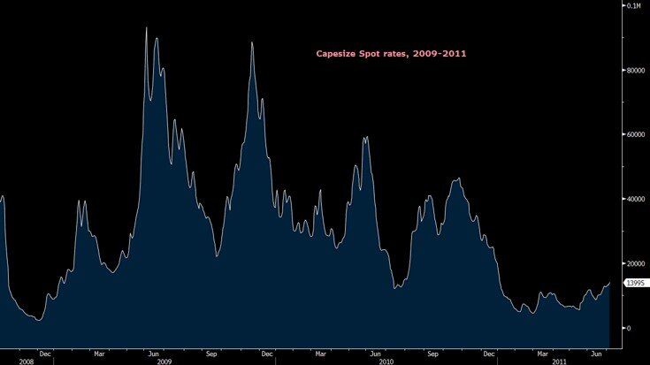

# Backwardated curve a boon for freight investors

**Date:** July 06, 2020  
**Publisher:** Breakwave Advisors | **Category:** Market Insights  
**Original URL:** [https://www.breakwaveadvisors.com/insights/2020/7/6/backwarded-curve-a-gift-to-freight-traders](https://www.breakwaveadvisors.com/insights/2020/7/6/backwarded-curve-a-gift-to-freight-traders)  

---

> **Figure 1: Market Chart 1**  
> **Interactive Data & Source:** [En Wikipedia](https://en.wikipedia.org/wiki/Chinese_economic_stimulus_program) | [Local Asset](file:///C:/Users/Dell/Github/Shipping/corpus/03-breakwave/insights/2020/assets/2020-07-06_backwarded-curve-a-gift-to-freight-traders_img_image-asset_3611bd6bb197.jpeg)

It is rare to see sentiment diverting considerably across financial markets. And yet, with China’s stock markets up almost 6% today, the best daily advance in more than 5 years, sentiment in that part of the world seems at least positive (one would even say ecstatic). On the other hand, freight futures, a market significantly exposed to China, is all but ecstatic when one looks a bit further out in the future.

With the fourth quarter contract still trading below 20,000/day and the 2021 contract at a mere 14,000/day, dry bulk futures are pricing a return to the relatively low rates experienced over the last several years. And such pessimism should not be surprising: The freight futures market has regularly looked in the past to predict the future, and it is no different this time around. After all, Q4 average spot rates were only 22,000 last year while Q3 spot rates averaged 29,000, almost in line with he current futures curve. Yet, in a volatile and idiosyncratic market like dry bulk freight one has to wonder whether such an approach is too simplistic.

Globally, a flood of stimulus money is slowly finding its way to different markets, and shipping will also see its fair share affecting commodity trade flows and thus freight rates. The only other relevant example is the 2009-2011 Chinese stimulus plan, that caused a rush to buy commodities due to either outright increased consumption or storage economics, in the process pushing dry bulk rates significantly over a short period of time: Capesize spot rates went from below 3,000/day to more than 80,000/day in the process, and remained elevated (and very volatile) for the next two years before the enormous dry bulk newbuilding program started pressuring the demand/supply balance.

> **Figure 2: Capesize Spot, 2009 2011**  
> **Interactive Data & Source:** [En Wikipedia](https://en.wikipedia.org/wiki/Chinese_economic_stimulus_program) | [Local Asset](file:///C:/Users/Dell/Github/Shipping/corpus/03-breakwave/insights/2020/assets/2020-07-06_backwarded-curve-a-gift-to-freight-traders_img_capesizespot2c2009-2011_3dad129018c4.jpg)

This time the path will be different, but the effect might end up similar. The global dry bulk market is better balanced when it comes to supply and demand. Yet, the volatility in rates over the last three years might just communicate a tighter market than people think: After all, we have seen 30,000+ Capesize spot rates every year over the last three years. Iron ore is lower than earlier in the previous decade, but still it is at the highest point in at least five years on top of low inventories.

The most important difference, however, is the magnitude of the stimulus currently in the works: In 2009-2011, the[Chinese stimulus](https://en.wikipedia.org/wiki/Chinese_economic_stimulus_program)was almost 600 billion USD. Compare that to[USD 18 trillion of total stimulus](https://peakoil.com/publicpolicy/18-trillion-in-global-stimulus-in-2020-21-of-world-gdp)currently across the globe (maybe even more soon) and one can easily see the potential.

To be fair, we don’t anticipate dry bulk freight rates anywhere close to the 2009-2011 levels, at least not in a sustainable manner. But to say that spot rates should revert to the low levels of the last several years highly disregards a global economic environment that is significantly very favorable for dry bulk shipping. In a market that speculative capital is almost non-existent, an oddity exists today: Freight futures just reflect the recent past and not expectations about the future.

---

**Tags:** Shipping, Dry Bulk, China, Capesize  
