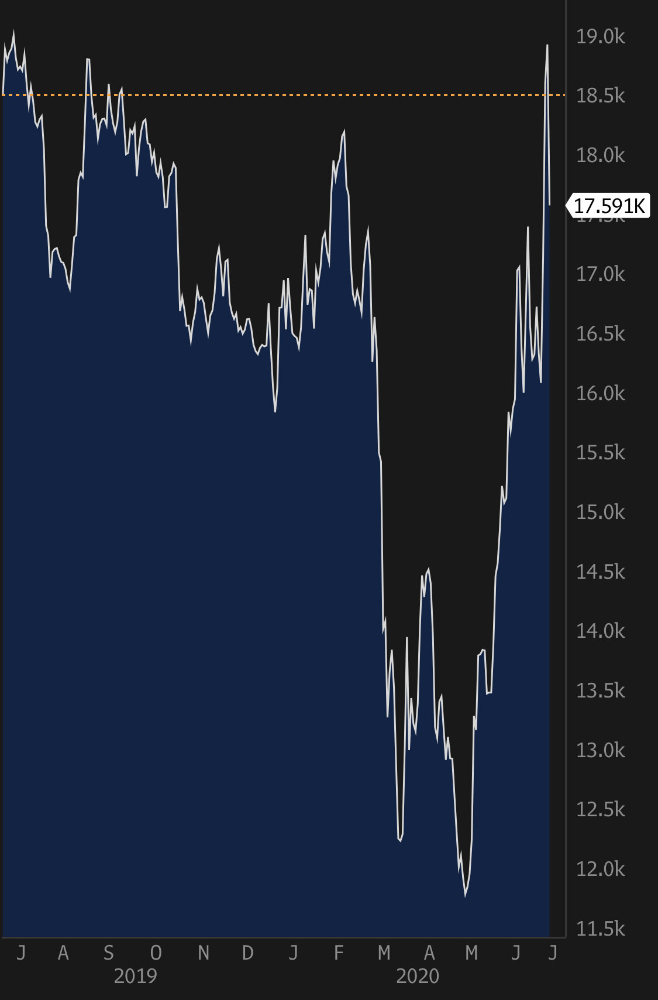
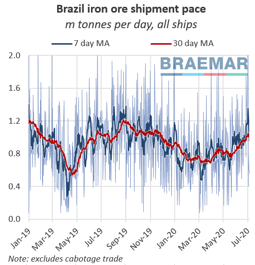

# The correction is here, now what?

**Date:** July 08, 2020  
**Publisher:** Breakwave Advisors | **Category:** Market Insights  
**Original URL:** [https://www.breakwaveadvisors.com/insights/2020/7/8/idzl440nvnvl49vteuchwrej2ynakr](https://www.breakwaveadvisors.com/insights/2020/7/8/idzl440nvnvl49vteuchwrej2ynakr)  

---

Following the relentless rally in Capesize spot rates over the last month, the much anticipated correction is finally here, as spot average rates dropped 3,300 today and now the Capesize Index stands at 29,610. Although not surprising to most market participants, the attention now turns to what’s next for the dry bulk market. Is that the beginning of a trend, or just a small adjustment?

Currently, the futures curve is pricing continuing declines in Capesize spot rates for the rest of the year, all the way down to the mid-to-high teens range. Judging from the fourth quarter contract, such an outcome is basically what the market has been pricing for the last 12 months with a brief dip in March to May (range has been basically 16,000-19,000 as chart shows).

### Chart: Q4 2020 Capesize Futures Contract

> **Figure 1: Volume of Capesize Tonnage Waiting at Chinese Ports Jumped To**  
> *The volume of Capesize tonnage waiting at Chinese ports jumped to over 16m dwt last week, the highest level in over two years according to AIS data from Refinitiv.*  
> [Local Asset](file:///C:/Users/Dell/Github/Shipping/corpus/03-breakwave/insights/2020/assets/2020-07-08_idzl440nvnvl49vteuchwrej2ynakr_img_q420_294066fe6213.jpg)

However, over the last 12 months the global economy has experienced unprecedented challenges and major changes. And yet, that doesn’t seem to have had an impact on traders expectations about the second half of the year. One has to wonder if there is any fundamental consideration at all, positive or negative, for futures prices other than what “last year’s rates” were (it was higher, by the way, at ~22,000).

Short term, the drivers that have pushed Capesize rates higher remain intact. As Braemar notes, port congestion and strong iron ore imports are currently driving higher demand for spot Capesize ships globally.

Braemar writes:

- *Over July so far we have recorded an average of 15.2m dwt of capacity waiting, 41% higher than average congestion during this period over 2015-19 and 33% higher than last month’s average.*
- *This is adding to the ongoing squeeze to supply of ships in the Pacific.*
- *Heavy seasonal rains are reportedly slowing the rate that incoming vessels can be discharged, but the queues are also in part down to China’s enormous purchases of iron ore over the past few weeks, some of which would otherwise be heading to countries which have cut back their imports, such as Japan and South Korea.*
- *Chinese iron ore receipts were just under 99m tonnes in June, up 4% MoM and up 23% YoY.*

> **Figure 2: Braemar Brazil Shipoments**  
> [Local Asset](file:///C:/Users/Dell/Github/Shipping/corpus/03-breakwave/insights/2020/assets/2020-07-08_idzl440nvnvl49vteuchwrej2ynakr_img_braemarbrazilshipoments_32d09f2ac84a.png)

Additionally, iron ore prices pushed higher overnight, now standing at almost $107/mt, continuing to incentivize miners to sell as much iron ore as they can given such attractive profit margins.

Finally, on the macro level, things are becoming more interesting by the day. The global economy is in the mist of unprecedented stimulus activity following the collapse in activity earlier in the year. Iron ore exports is rapidly increasing as China absorbs every ton of seaborne ore available while Europe’s industrial activity is also slowly reopening. Coal imports to China remain healthy and grain trading has set new records earlier this year. All of such excitement regarding the stimulative action by governments worldwide is easily demonstrated by the Chinese stock market that rallied hard earlier in the week.

The second half dry bulk fundamentals remain healthy and the current drop in both spot and futures for Capesizes will prove to be just another short term mild correction in what will end up being a very strong period for dry bulk shipping.

---

**Tags:** Shipping, Dry Bulk, China, Capesize  
