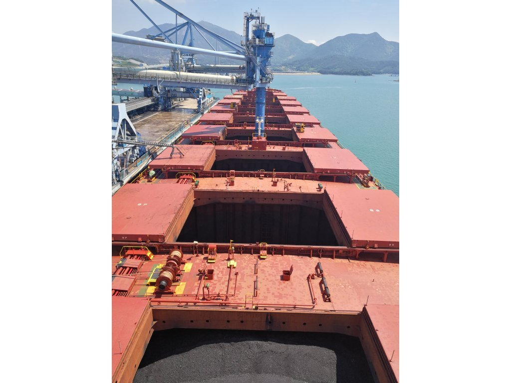
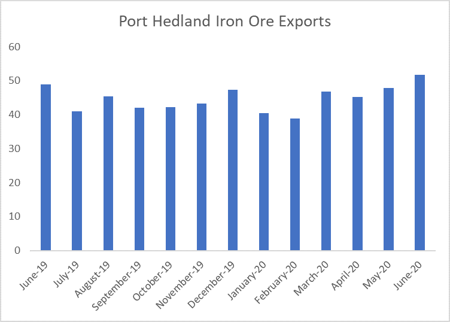
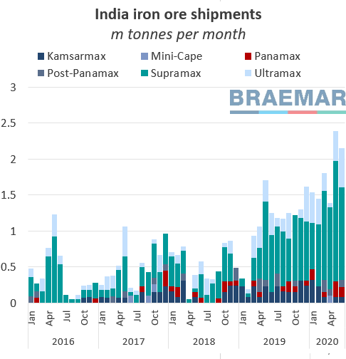

# Iron ore booming In perfect storm

**Date:** July 09, 2020  
**Publisher:** Breakwave Advisors | **Category:** Market Insights  
**Original URL:** [https://www.breakwaveadvisors.com/insights/2020/7/9/rfbpfp8yurop7rgd61xefggyuvtl11](https://www.breakwaveadvisors.com/insights/2020/7/9/rfbpfp8yurop7rgd61xefggyuvtl11)  

---

> **Figure 1: As Bloomberg Reports**  
> *As Bloomberg reports, “For Australia, the iron age just goes on and on and the era is proving to be especially lucrative”;And lucrative it is. Iron ore prices continue to advance, now firmly above $100/mt, as Brazil remains a problematic area despite the recent strides on terms of increases in exports.Bloomberg continues:*  
> [Local Asset](file:///C:/Users/Dell/Github/Shipping/corpus/03-breakwave/insights/2020/assets/2020-07-09_rfbpfp8yurop7rgd61xefggyuvtl11_img_ship36_8121ed1970a3.jpg)

2020 is shaping out to be one of the strongest years on record for the iron ore market. A combination of events and circumstances have not only pushed iron ore prices to multi-year highs but supply from certain regions are reaching new highs while at the same time constraints in other parts of the world are helping the market to remain in the sweet spot of perceived tightness. The result of such circumstances is a thinly balanced market for the commodity and ongoing significant market share gains for the largest iron ore producing country in the world, namely Australia.

*“Exports from Port Hedland have ballooned over the past decade -- in June 2010, the total was about 15 million tons -- and more growth is on the way. Both Fortescue and BHP are looking to expand capacity, although that may not result in consistently higher exports, but greater flexibility to adjust volumes.”*

> **Figure 2: India Has Also Benefited From the Iron Ore Price Boom As Exports**  
> *India has also benefited from the iron ore price boom as exports have increased gradually this year. As Braemar notes “Despite iron ore predominantly being a Cape trade, heavy Chinese restocking demand in recent weeks continued to drive purchases from less traditional sources, such as India”.Such increase is evident from the number of fixtures that have steadily increased as the chart below from Braemar shows.*  
> [Local Asset](file:///C:/Users/Dell/Github/Shipping/corpus/03-breakwave/insights/2020/assets/2020-07-09_rfbpfp8yurop7rgd61xefggyuvtl11_img_porthedland_570bbbfa1c18.png)

> **Figure 3: Market Chart 3**  
> [Local Asset](file:///C:/Users/Dell/Github/Shipping/corpus/03-breakwave/insights/2020/assets/2020-07-09_rfbpfp8yurop7rgd61xefggyuvtl11_img_image3_9181ebe8bf14.png)

Other regions are also benefiting from Brazil’s troubles, as Canada and S.Africa have also ramped up exports to China in order to take advantage of the high iron ore prices.

However, as it has been the case for years now, analysts continue to predict the end of such booming era for iron ore, with price forecasts that point to significant declines for the rest of the year and into 2021. Increasing supply out of Brazil and lower demand from China are the two reasons most frequently cited in such predictions.

Finally, with iron ore prices remaining at multi-year highs, attention should also be turned to steel margins, which although still at healthy levels, any softening in steel demand could have a negative impact on steel profitability and thus on underlying demand for iron ore.

---

**Tags:** Shipping, China, Australia, Vale, Dry Bulk  
