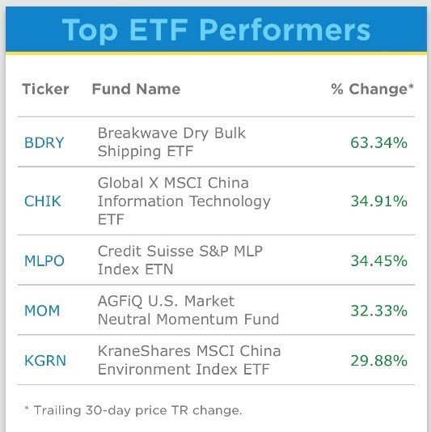
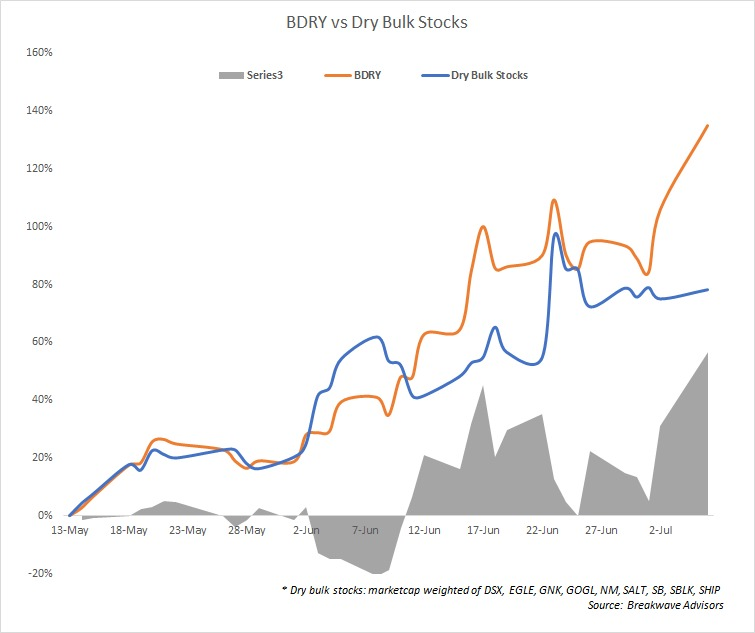
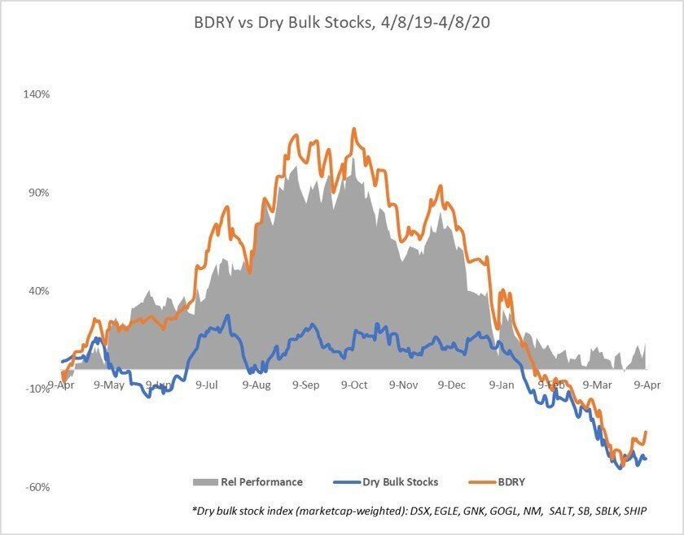

# Is Dry Bulk Shipping the trade of the year?

**Date:** July 12, 2020  
**Publisher:** Breakwave Advisors | **Category:** Market Insights  
**Original URL:** [https://www.breakwaveadvisors.com/insights/2020/7/11/0f2hjrd6mo3y2s6m526j2z1rfddjpc](https://www.breakwaveadvisors.com/insights/2020/7/11/0f2hjrd6mo3y2s6m526j2z1rfddjpc)  

---

> **Figure 1: Soya Panamax**  
> **Interactive Data & Source:** [Drybulketf](https://drybulketf.com) | [Local Asset](file:///C:/Users/Dell/Github/Shipping/corpus/03-breakwave/insights/2020/assets/2020-07-12_0f2hjrd6mo3y2s6m526j2z1rfddjpc_img_soyapanamax_9058e861a1ed.jpg)

June was an epic month for dry bulk freight rates, especially for the Capesize segment. Smaller size vessels, like Panamax and Supramax, also caught up with increased spot rates. Capes currently are experiencing an anticipated correction and this cannot be considered as anything but healthy. The drivers though that brought the Capesize spot market to current levels remain intact.

The[Dry Bulk ETF](https://drybulketf.com)(NYSE: BDRY), designed to profit from increases in freight futures, is having its best month on record, up >60%, on high volume and is up more than 100% from the recent lows just only a month and a half ago. It scores at the top of the Top ETF Performers list of[etf.com](https://etf.com)(see table below) and reached its $50M Assets Under Management milestone earlier last week.

[

> **Figure 2: Greg Miller**  
> *Greg Miller, FreightWaves, writes about the big move up off lows for dry bulk rates, indicates the reasons why they can go way higher and he notices:“Instead of buying iffy shipowner stocks that gyrate all over the place for non-rate reasons, check out BDRY ETF, which actually follows rates.”*  
> **Interactive Data & Source:** [Freightwaves](https://www.freightwaves.com/news/american-shipper/shipping) | [Local Asset](file:///C:/Users/Dell/Github/Shipping/corpus/03-breakwave/insights/2020/assets/2020-07-12_0f2hjrd6mo3y2s6m526j2z1rfddjpc_img_topetfperfomers_ea144618dc58.jpg)](https://etf.com)

Truth is that there are some advantages of BDRY over shipping stocks. BDRY offers investors correlated returns to dry bulk rates without the operational, financial, or capital markets risks of equities. As an ETF, it offers liquidity when dry bulk stocks are generally considered illiquid, especially for institutional investors.

Other drawbacks of individual shipping stocks include company-specific risks, dilution risks as well as corporate governance and management issues. Finally, especially nowadays, it’s the broader equity market risk; freight rates generally have exhibited low correlation to the overall equity markets.

BDRY offers direct exposure to dry bulk without any such issues that shipping equities are facing plus it offers full transparency with all futures contract positions posted daily. Finally, one can always short it if he or she believes freight futures are too high!

In the charts below you can compare the behavior of BDRY vs Dry Bulk Stocks since BDI’s (Baltic Dry Index) recent low in mid May.

> **Figure 3: Bdry vs Dry Bulk Stocks**  
> **Interactive Data & Source:** [Cleaves](https://www.cleaves.no/) | [Local Asset](file:///C:/Users/Dell/Github/Shipping/corpus/03-breakwave/insights/2020/assets/2020-07-12_0f2hjrd6mo3y2s6m526j2z1rfddjpc_img_bdryvsdrybulkstocks_b9e0b0a16200.png)

...and also have a look from last year’s on a full cycle basis:

> **Figure 4: Bdry vs Dry Bulk Stocks #2**  
> **Interactive Data & Source:** [Cleaves](https://www.cleaves.no/) | [Local Asset](file:///C:/Users/Dell/Github/Shipping/corpus/03-breakwave/insights/2020/assets/2020-07-12_0f2hjrd6mo3y2s6m526j2z1rfddjpc_img_bdryvsdrybulkstocks232_986d13e53693.jpg)

We believe that the second half of 2020 should be one of the best periods for dry bulk shipping rates in quite sometime.

[Cleaves Securities](https://www.cleaves.no/)has dry bulk as its top sector pick and believes the remaining months till year end could be very strong. They actually see consecutive annual gains at least until 2023.

[Intermodal Brokers](https://www.intermodal.gr/)reported that the dark days of the first five months of the year have been replaced with renewed confidence among cape owners, describing how the “enhanced psychology” is providing the market with the “steam” needed to move further ahead.

Finally,[Breakwave Advisors](https://breakwaveadvisors.com)is bullish stating that second half dry bulk fundamentals remain healthy and the current drop in both spot and futures for Capesizes will prove to be just another short term mild correction in what will end up being a very strong period for dry bulk shipping.
