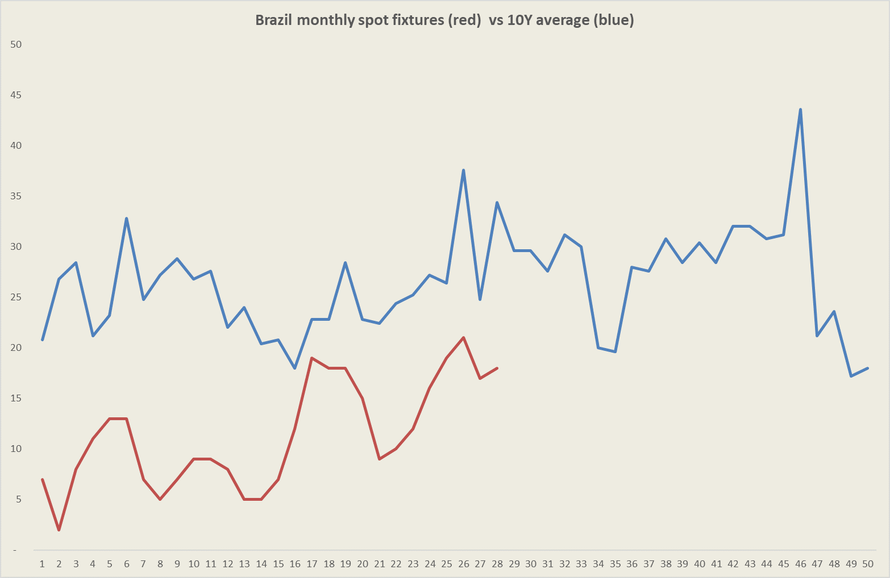
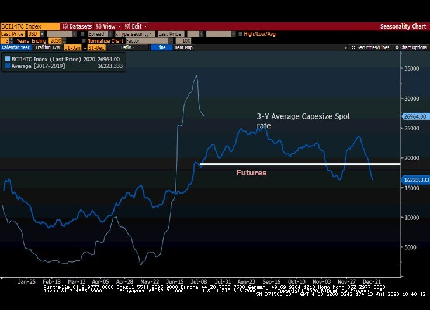

# Steel markets start the week solid but capesize sentiment remains sour

**Date:** July 13, 2020  
**Publisher:** Breakwave Advisors | **Category:** Market Insights  
**Original URL:** [https://www.breakwaveadvisors.com/insights/2020/7/13/e0s2hxlpf3orcqw1x94wjq6ijf6503](https://www.breakwaveadvisors.com/insights/2020/7/13/e0s2hxlpf3orcqw1x94wjq6ijf6503)  

---

> **Figure 1: Ship26**  
> [Local Asset](file:///C:/Users/Dell/Github/Shipping/corpus/03-breakwave/insights/2020/assets/2020-07-13_e0s2hxlpf3orcqw1x94wjq6ijf6503_img_ship26_5f0b2d91676d.jpg)

Despite well supported overnight steel markets in China, with iron ore further building on last week’s impressive gains and now pushing toward $108/mt, Capesize rates remain under pressure, reflecting among other factors, efforts by major miners to cool down an overheated freight market. Yet, the reality is that the spot market lacks activity at the moment, and any resurgence in such activity should see a rapid turnaround in spot rates as the near term supply demand balance remains in favor of stronger rates.

Looking at Brazil’s iron ore exports, spot activity has recovered, but remains below levels achieved in the last several years.

> **Figure 2: Brazil Fictures**  
> [Local Asset](file:///C:/Users/Dell/Github/Shipping/corpus/03-breakwave/insights/2020/assets/2020-07-13_e0s2hxlpf3orcqw1x94wjq6ijf6503_img_brazilfictures_b6f6a3a4bbb9.png)

Seasonality is a tailwind at this time of the year and although it is tough to pinpoint the turning points in spot freight, the fact that futures are trading at discounts to spot rates provides a lot of comfort for traders that have the patience and are aware of the difficulties in picking turnaround points in spot freight rates. In fact, currently Capesize futures for the second half are below the 3-year trailing average, despite the fact that spot rates are the strongest it has been for this time of the year in the last decade.

> **Figure 3: Cape Seas**  
> [Local Asset](file:///C:/Users/Dell/Github/Shipping/corpus/03-breakwave/insights/2020/assets/2020-07-13_e0s2hxlpf3orcqw1x94wjq6ijf6503_img_capeseas_e42076fce22f.jpg)

In the Capesize market, we expect a muted action in the first part of this week, with the potential of some stabilization towards the end of the week. Smaller sizes should see further gains, but at a slower pace compared to last week. Overall, the trend in dry bulk remains positive, but volatility and trading ranges have now expanded reflecting tighter supply/demand balances across most trading regions.

---

**Tags:** Dry Bulk, Shipping, Capesize  
