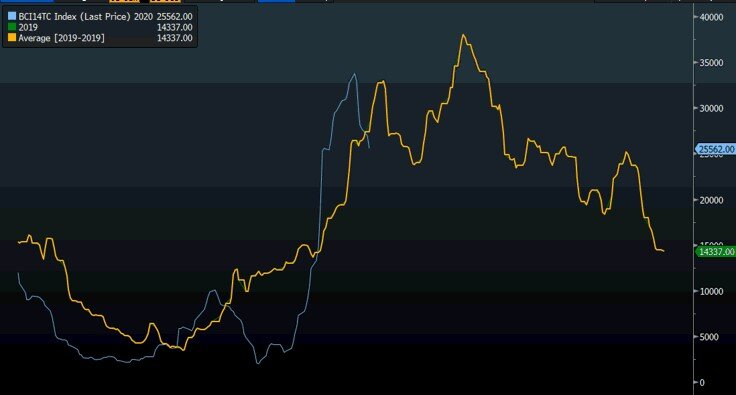

# Cyclicality vs Volatility

**Date:** July 14, 2020  
**Publisher:** Breakwave Advisors | **Category:** Market Insights  
**Original URL:** [https://www.breakwaveadvisors.com/insights/2020/7/14/cyclicality-vs-volatility](https://www.breakwaveadvisors.com/insights/2020/7/14/cyclicality-vs-volatility)  

---

> **Figure 1: Market Chart 1**  
> [Local Asset](file:///C:/Users/Dell/Github/Shipping/corpus/03-breakwave/insights/2020/assets/2020-07-14_cyclicality-vs-volatility_img_image-asset_3c0c6b991fac.jpeg)

As is the case when rates are rising with demand exceeding available supply, when rates are falling, the opposite can be said. However, it is not always as straightforward as it sounds. Capesize rates recently experienced one of the best four weeks on record and arguing about the absolute level of rates that the market should clear is not really a useful exercise. Instead, one should focus on “the flow of demand” (i.e. cargo flow) and relative changes on that front. Such flow has recently declined, and with charterers being less eager to fix, spot rates have been easing for the last week or so.

Yet, such a downward move has been widely anticipated, and despite the additional pressure that a spot move brings to freight futures, the great majority of the correction in spot Capesize rates had been priced in for weeks now in the futures market. After all, the front month was recently trading at the sharpest discount to spot in at least five years.

When does the current correction end?

History, might provide some clues to the future development of rates, though we anticipate the path to be different this time. So far, the trajectory in Capesize spot rates looks quite similar to last year, albeit with the two-week lag between. In addition, the weakness in May of this year was also quite unanticipated and different versus lat year. However, the move in spot rates in the last few months have been quite similar to last year. The correction from the July highs last year lasted three weeks and Capesize rates bottomed around 23,000, before turning around in early August and hitting almost 40,000 by early September.

> **Figure 2: 19 vs 20**  
> [Local Asset](file:///C:/Users/Dell/Github/Shipping/corpus/03-breakwave/insights/2020/assets/2020-07-14_cyclicality-vs-volatility_img_19vs20_05cd71010189.jpg)

We believe Capesize rates might follow a similar bottoming process to last year, with a two-week lag. That puts a potential bottom sometime during the last 10 days in July at the low 20,000s.

With freight futures already pricing further declines, the impact on the futures market should be smaller, all else being equal. Finally, any potential pause in the decline in spot rates earlier than expected should lead to a positive reaction on freight futures, given the considerable backwardation in the futures curve.

---

**Tags:** Shipping, Dry Bulk, Capesize  
