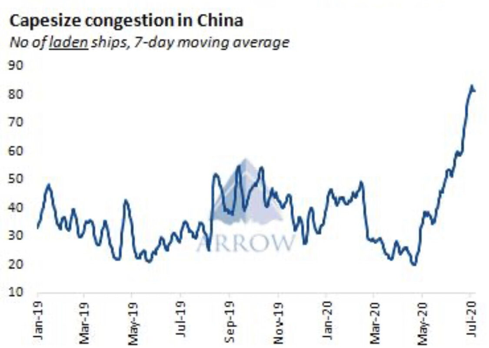
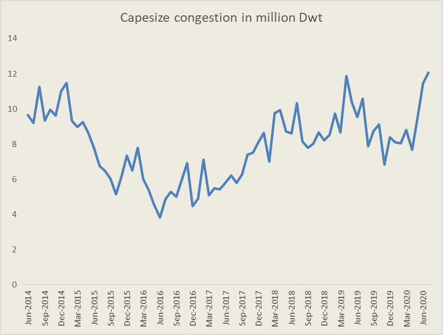

# Congestion is real

**Date:** July 15, 2020  
**Publisher:** Breakwave Advisors | **Category:** Market Insights  
**Original URL:** [https://www.breakwaveadvisors.com/insights/2020/7/15/congestion-is-real](https://www.breakwaveadvisors.com/insights/2020/7/15/congestion-is-real)  

---

> **Figure 1: Market Chart 1**  
> [Local Asset](file:///C:/Users/Dell/Github/Shipping/corpus/03-breakwave/insights/2020/assets/2020-07-15_congestion-is-real_img_image-asset_0372cfbef0fa.jpeg)

Although most of the market narrative related to the recent rally has been focusing on the demand side, especially increasing iron ore export volume out of Brazil and Australia, little has been said about the supply side. That is natural, as supply changes are slow to evolve mainly reflecting new vessel deliveries and scrapping of older, less efficient vessels, both of which are slow moving parameters. Yet, a major factor when it comes to short term supply changes is port congestion. Port congestion reduces the active fleet and can cause significant imbalances in the global supply and demand equlibriums.

The current COVID-19 pandemic has caused a lot of disruptions across logistical chains, and shipping is not immune to such effects. Port congestion has recently hit multi-year highs as ships wait longer to unload cargoes in ports around the world. Crew inspections, slower operations and delays in crew changes are some of the reasons for port congestion. On top of that, a surge in commodity imports into China ( not only for dry bulk goods) is also adding to the equation. The result for dry bulk, and more specifically for Capesize, is that congestion has recently increased substantially, with almost 5% of the global Capesize fleet now stuck in Chinese ports.

Arrow calculates that almost 85 Capesize vessels are now stuck in Chinese ports accounting for approximately 4.6% of the global supply.

> **Figure 2: Arrowcongestion**  
> [Local Asset](file:///C:/Users/Dell/Github/Shipping/corpus/03-breakwave/insights/2020/assets/2020-07-15_congestion-is-real_img_arrowcongestion_7478e052866e.jpg)

Looking at the global picture, once again, and based on Clarksons Research, Capesize port congestion is hitting multi-year highs, and now more than 12m dwt, or almost 7% of the global Capesize fleet, is stuck in ports around the world.

> **Figure 3: Congestion Clarksons**  
> [Local Asset](file:///C:/Users/Dell/Github/Shipping/corpus/03-breakwave/insights/2020/assets/2020-07-15_congestion-is-real_img_congestionclarksons_c669026656bd.png)

With so many vessels effectively out of the active pool, it is no wonder rates are holding up at relatively high levels. Although off their recent highs, congestion should support freight rates better, all else being equal.
The downside is that eventually congestion will ease, yet such a development might be months away as the factors causing such an effect are still with us: mainly COVID-19 related delays. Till then, port congestion is another bullish factor for the dry bulk market.
