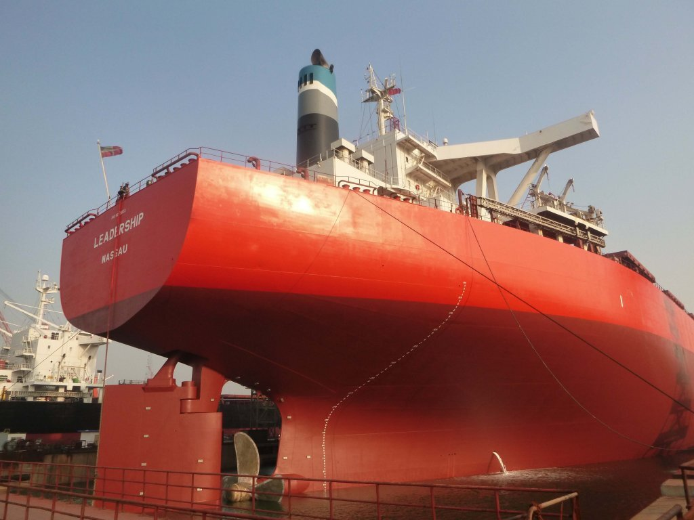

# Panamax and Handymax Fleet Growth

**Date:** July 20, 2020  
**Publisher:** Breakwave Advisors | **Category:** Market Insights  
**Original URL:** [https://www.breakwaveadvisors.com/insights/2020/7/20/panamax-and-handymax-fleet-growth](https://www.breakwaveadvisors.com/insights/2020/7/20/panamax-and-handymax-fleet-growth)  

---

> **Figure 1: Ship8**  
> [Local Asset](file:///C:/Users/Dell/Github/Shipping/corpus/03-breakwave/insights/2020/assets/2020-07-20_panamax-and-handymax-fleet-growth_img_ship8_5e3015038cc6.jpg)

66 dry bulk vessels were delivered last month. This is 26 more than were delivered in May and marks the largest amount of newbuildings delivered since January 2017. Last month saw the delivery of 8 handysize vessels, 22 handymax vessels, 21 panamax vessels, and 15 capesize vessels. In comparison, May saw the delivery of 3 handysize vessels, 11 handymax vessels, 20 panamax vessels, and 6 capesize vessels. 9 dry bulk vessels were scrapped last month This is 3 more than were scrapped in May. Last month saw the removal of 2 handysize vessels, 1 handymax vessel, and 6 capesize vessels. In comparison, May saw the removal of 2 handysize vessels, 1 handymax vessel, 1 panamax vessel, and 2 capesize vessels.

As we have continued to stress in our work, fleet growth remains an issue that continues to most negatively affect the panamax and handymax markets. During the first six months of this year, the panamax fleet grew by a net addition of 95 vessels (98 newbuildings were delivered while only 3 panamax vessels were scrapped). During the same period, the handymax fleet grew by a net addition of 79 vessels (88 newbuildings were delivered while only 9 handymax vessels were scrapped). Overall, fleet growth in these segments remains a significant headwind.

As we have also continued to stress in our work, however, fleet growth in the capesize and handysize fleets has stayed much lower. During the first six months of this year, the capesize fleet grew by a net addition of only 29 vessels (63 newbuildings were delivered and 34 Capes were scrapped). During the same period, the handysize fleet grew by a net addition of only 15 vessels (34 newbuildings were delivered and 19 handysize vessels were scrapped).

---

**Tags:** Shipping, China, Capesize, Panamax, Supramax  
