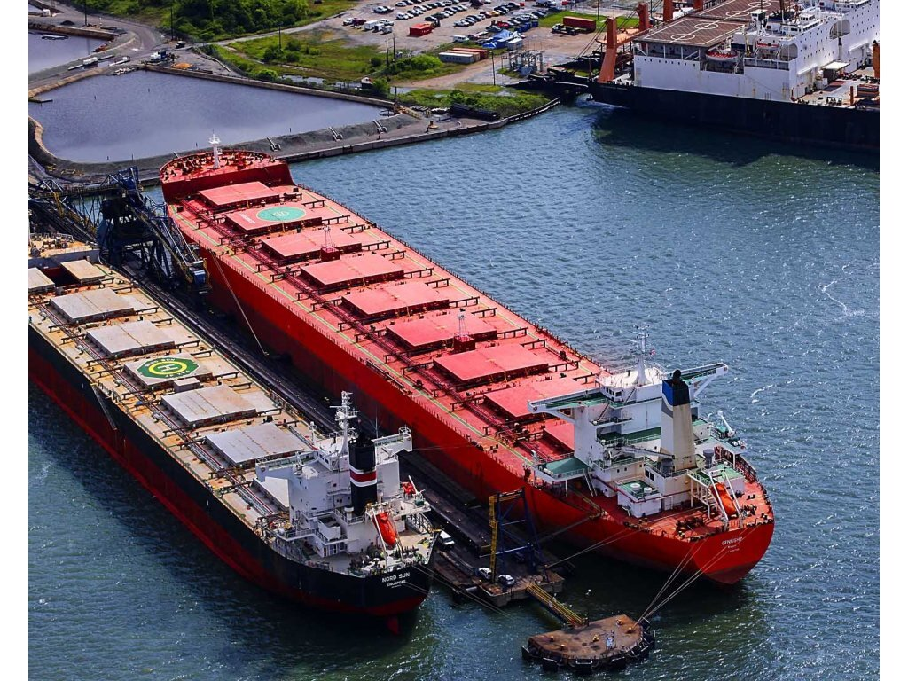
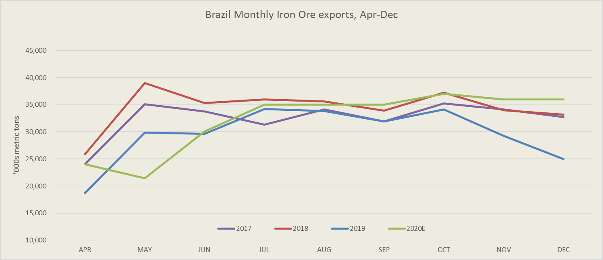

# Summer blues for dry bulk freight

**Date:** July 20, 2020  
**Publisher:** Breakwave Advisors | **Category:** Market Insights  
**Original URL:** [https://www.breakwaveadvisors.com/insights/2020/7/20/summer-blues-for-dry-bulk-freight](https://www.breakwaveadvisors.com/insights/2020/7/20/summer-blues-for-dry-bulk-freight)  

---

> **Figure 1: Vale Is Scheduled to Release Quarterly Production Figures Later**  
> *Vale is scheduled to release quarterly production figures later on Monday and investors will be keen to hear its take on the pandemic’s impact on operations. The miner has recently reiterated full-year guidance, acknowledging that it will have to accelerate output to meet targets.*  
> [Local Asset](file:///C:/Users/Dell/Github/Shipping/corpus/03-breakwave/insights/2020/assets/2020-07-20_summer-blues-for-dry-bulk-freight_img_ship18_12cd82abb0df.jpg)

Following its peak just two weeks ago at ~34,000, the Capesize index has been in a correction mode loosing almost 10,000 in value, in the process dragging Panamax rates down and possibly even Supramax rates soon. The recent supply tightness in the Atlantic remains but the demand has now declined versus early July and thus the slowdown in fixing activity is pushing rates lower. Freight futures have been range-bound over the last week or so, still pricing further declines in spot rates for the rest of the year, an outcome that seems contradictory to broader shipping fundamentals.

Today, after the market closes, Vale will provide their second quarter production report and hopefully their guidance for the rest of the year while BHP is due to report their production numbers tomorrow.

As Bloomberg notes, for Vale, expectations are for an acceleration of production for the rest of the year in order to meet its recently reiterated targets:

*Citi cautioned supply risks remain elevated in Brazil amid a lack of consistent virus policies and if there is a major mine closure, prices may spike to $120 a ton. Brazil recently surpassed 2 million coronavirus cases, although the World Health Organization said last week the outbreak has reached a plateau.*

Indeed, most analysts remain bearish on iron ore due to increased supply in the second half of the year. Such a forecast contradicts freight expectations that call for lower rates for the rest of the year. With China’s steel production hitting record highs, up now 1.5% from 2019 and 5% in May alone, there is no reason why analysts predictions won’t be right, although the global pandemic remains a real risk.

> **Figure 2: China’ Crude Steel Output Over June Totalled 91**  
> *China’ crude steel output over June totalled 91.6m tonnes, according to the latest official data.*  
> [Local Asset](file:///C:/Users/Dell/Github/Shipping/corpus/03-breakwave/insights/2020/assets/2020-07-20_summer-blues-for-dry-bulk-freight_img_brazilironoreexports_9819ab9a28c3.png)

Braemar sees some softening in demand due to flooding in China, bur acknowledges the current strength in steel activity. Braemar notes:

- *Though this is down almost 1% on May’s record volume, production is still up 5% YoY, backed by strong domestic demand.*
- *There are indications that steel demand is softening this month amid heavy flooding in Southern China.*

The above facts should provide a floor for Capesize rates that most likely will be above the previous lows and closer to last year’s lows, which was around 20,000 for Capesize spot rates (always looking at the second half of the year for comparisons).

Finally, summer blues will also play a factor as activity slows, but seasonality kicks in again by mid August as miners ramp up production and exports as they look to the fourth quarter in order to achieve their previously communicated guidance.

---

**Tags:** Shipping, Dry Bulk, Capesize, Vale  
