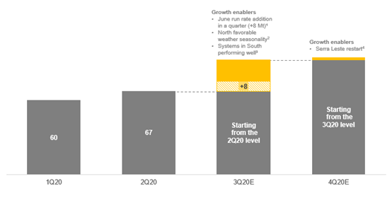

# Vale's results positive for dry bulk (with a caveat)

**Date:** July 21, 2020  
**Publisher:** Breakwave Advisors | **Category:** Market Insights  
**Original URL:** [https://www.breakwaveadvisors.com/insights/2020/7/21/vales-results-positive-for-dry-bulk-with-a-caveat](https://www.breakwaveadvisors.com/insights/2020/7/21/vales-results-positive-for-dry-bulk-with-a-caveat)  

---

> **Figure 1: Vale 1**  
> [Local Asset](file:///C:/Users/Dell/Github/Shipping/corpus/03-breakwave/insights/2020/assets/2020-07-21_vales-results-positive-for-dry-bulk-with-a-caveat_img_vale1_144f0c3e42a5.jpg)

Last night, Vale provided their second quarter production results as well as their guidance for the rest of the year. Although their production numbers for Q2 fell short of expectations, especially when it comes to sales, the company reaffirmed their annual production guidance, which points to a strong output for the second part of the year, something that should help dry bulk rates in general and Capesize spot rates more specifically.

For the second quarter, Vale’s iron ore production was 67.6 million tons, lower than our 70mt expectation and also below the consensus of about 69mt. Surprisingly, sales of iron ore and pellets were only 61.6mt, below our estimate for about 70mt, pointing to a ~7mt inventory buildup during the quarter. This is not surprising as last year Vale was drawing down inventories following their dam incident and probably now they are in the process of rebuilding such inventories.

When it comes to guidance, Vale reaffirmed their 310-330 mt annual guidance for 2020. Given they have already produced 127mt so far this year, the low end of the guidance points to more than 180mt for the second half, or a swing of ~53mt. If the low end of the guidance is met, that will also mean actual 2H production will surpass last year’s level by about 20mt (185mt vs. 165mt).

### Vale Updated Quarterly Guidance:

> **Figure 2: Vale Q2**  
> [Local Asset](file:///C:/Users/Dell/Github/Shipping/corpus/03-breakwave/insights/2020/assets/2020-07-21_vales-results-positive-for-dry-bulk-with-a-caveat_img_valeq2_752ddf716193.png)

For dry bulk, the results are promising:

- With second half production guidance now at approximately 185mt (always based on the low end of their 310-330mt guidance) the swing in production versus the first half will be almost 55 mt, which means**an additional 140 Capesize fixtures****versus first half**, all else being equal.
- More importantly, the guidance now puts Vale’s second half production some 20mt above the comparable period of last year. That would translate to**a need of roughly 55 more Capesizes**.

However,**Vale’s iron ore sales figures continue to lag production**. That is worrisome, as what matters for shipping is actual sales and not production. We estimate an equal ratio of sales to production for the second half, but given the Q2 results, additional inventory buildup will not be favorable for shipping (however, we believe Vale holds most of its inventory in Asia, thus they still would need to ship it by sea).

The above factors combined with the fact that the average mile traveled has been increasing due to higher long haul exports from East Coast Canada and West Africa, points to a stronger Capesize demand during the second half of the year.

Finally, with**port congestion now at double last year’s level**, the active Capesize fleet is lower, tilting the demand/supply balance to the benefit of the owners. Overall, Vale’s guidance is quite supportive for Capesizes for the rest of the year, and we anticipate another upswing in spot rates as we enter the month of August.

---

**Tags:** Dry Bulk, China, Brazil, Capesize, Australia, Shipping, Vale  
