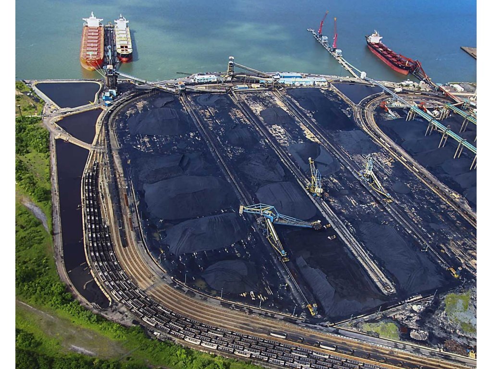
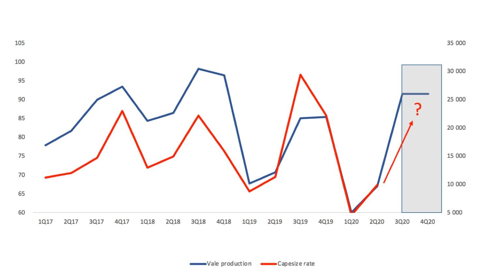

# Capesize decline to slow down, but turnaround still weeks away

**Date:** July 23, 2020  
**Publisher:** Breakwave Advisors | **Category:** Market Insights  
**Original URL:** [https://www.breakwaveadvisors.com/insights/2020/7/23/capesize-decline-to-slow-down-but-turnaround-still-weeks-away](https://www.breakwaveadvisors.com/insights/2020/7/23/capesize-decline-to-slow-down-but-turnaround-still-weeks-away)  

---

The significant decline in Capesize spot rates over the last few weeks has not been that surprising, as futures have already been trading at considerable discounts to spot. The magnitude and speed of the decline though might have been unexpected as spot rates in the Pacific collapsed 60%+ in less than 2 weeks and now hover in the low teens. The Atlantic is holding slightly better, at least for now, but once again much lower than a few weeks ago.

> **Figure 1: Ship19**  
> **Interactive Data & Source:** [Linkedin](https://www.linkedin.com/posts/magnus-halvorsen-0518381_newcastlemax-2020bulkers-ironore-activity-6691603131089870848-9CaE/) | [Local Asset](file:///C:/Users/Dell/Github/Shipping/corpus/03-breakwave/insights/2020/assets/2020-07-23_capesize-decline-to-slow-down-but-turnaround-still-weeks-away_img_ship19_27f3d0a7611d.jpg)

Looking at the reasons behind such a move, with a major miner in Australia going to a two-week maintenance period, the market lost a significant amount of cargo flow, and that allowed charterers to take advantage of owners that were expecting a similar to June type of activity. At the same time, Vale also underwent some maintenance in a number of its facilities, as evident by lower weekly exports over the last couple of weeks. The result, was a loss of confidence that was enough to push spot rates lower. The Futures-to-Physical arbitrage turned around, and operators aggressively chartered out their committed vessels to bring the spot closer to the futures market, that for weeks now has been discounting such a move.

Shipping is highly cyclical, and once again, such cyclicality is evident with the near-term demand/supply balance turning around rapidly. For investors, the opportunity to position long ahead of the next upturn is here, although a period of consolidation is needed prior to any such turnaround in the direction of spot rates.

With September loading dates only a few weeks away, we believe a potential upturn will materialize soon. The shape of the freight futures market turned from a backwardation to contango in less than a week, as now the market is anticipating such a bottoming process to take place. The question is how high can rates go from here once (and always of course if) spot rates turn.

An interesting chart that was posted recently by[2020 Bulkers](https://www.linkedin.com/posts/magnus-halvorsen-0518381_newcastlemax-2020bulkers-ironore-activity-6691603131089870848-9CaE/)might provide some clues on that front. Currently second half average Capesize rates are priced at approximately 18,000/day based in the futures curve. If true that would be the lowest 2H in four years for Capesize rates. With Vale 2H production expected to reach 180mt+, the upside based on historical relationships seems to outweigh the potential risk:

> **Figure 2: Vale Production vs Capesize Rates**  
> [Local Asset](file:///C:/Users/Dell/Github/Shipping/corpus/03-breakwave/insights/2020/assets/2020-07-23_capesize-decline-to-slow-down-but-turnaround-still-weeks-away_img_valeproductionvscapesizerates_06932f480f2e.jpg)

Summer blues are here for dry bulk, but as one can easily see, the range of potential outcomes has expanded quite a bit in the last several months, and that can mean only one thing for investors and traders alike:**opportunity**.

---

**Tags:** Shipping, Capesize, Dry Bulk  
