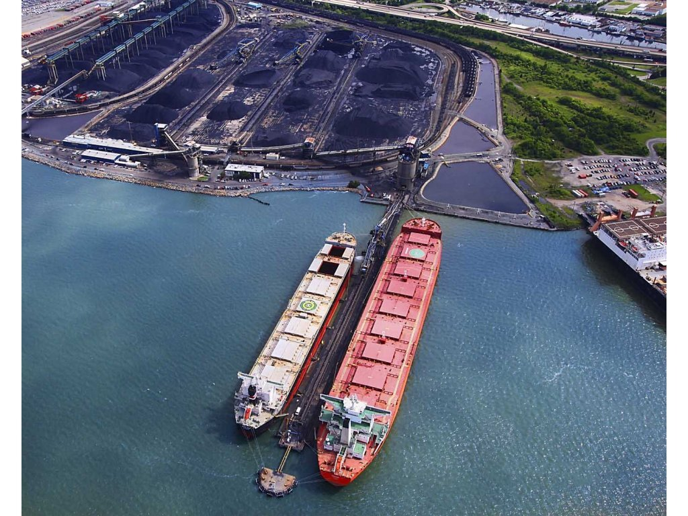

# Recent Increase in Dry Bulk Spot Cargo Volume

**Date:** July 27, 2020  
**Publisher:** Breakwave Advisors | **Category:** Market Insights  
**Original URL:** [https://www.breakwaveadvisors.com/insights/2020/7/27/recent-increase-in-dry-bulk-spot-cargo-volume-last](https://www.breakwaveadvisors.com/insights/2020/7/27/recent-increase-in-dry-bulk-spot-cargo-volume-last)  

---

> **Figure 1: Ship17**  
> [Local Asset](file:///C:/Users/Dell/Github/Shipping/corpus/03-breakwave/insights/2020/assets/2020-07-27_recent-increase-in-dry-bulk-spot-cargo-volume-last_img_ship17_f208084f1cf6.jpg)

Last week’s large declines in capesize and panamax rates exceeded most expectations, but more positive at least is that overall spot cargo volume increased by a large amount. 102 cargoes were reported in the spot market last week, which is 37 more than the previous week. Last week’s spot cargo volume marked the largest amount seen since the Week Ending June 12th. If a similar volume of spot cargoes continue to surface then rates throughout the market are likely to return to finding sustained support again soon.

We remain most bullish for the capesize market for the remainder of the year and remain particularly encouraged by both the Chinese steel market and Vale’s expectations. Chinese steel prices have continued to set new highs for this year, steel output in China has returned to an all-time record high, and Vale continues to guide that it will produce 310 to 330 million tons of iron ore this year. Vale producing even 20 million tons less iron ore than the low-end of its guidance would still work out production in the second half of the year production exceeding first half production by 35.6 million tons (28%).

By all accounts, Vale is likely to significantly increase its production during the final five months of this year and China is likely to maintain strong demand for imported iron ore. We expect capesize rates will experience strong support as a result. As we have been stressing in our work, capesize rates have not been set to simply rise on a daily basis. Volatility is normal in this market, and we continue to believe that capesize rates will enjoy many weeks of significant support during the remainder of this year.

---

**Tags:** Shipping, Dry Bulk, Capesize, Panamax  
